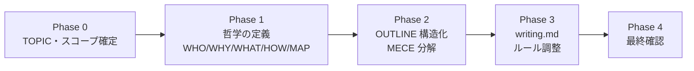
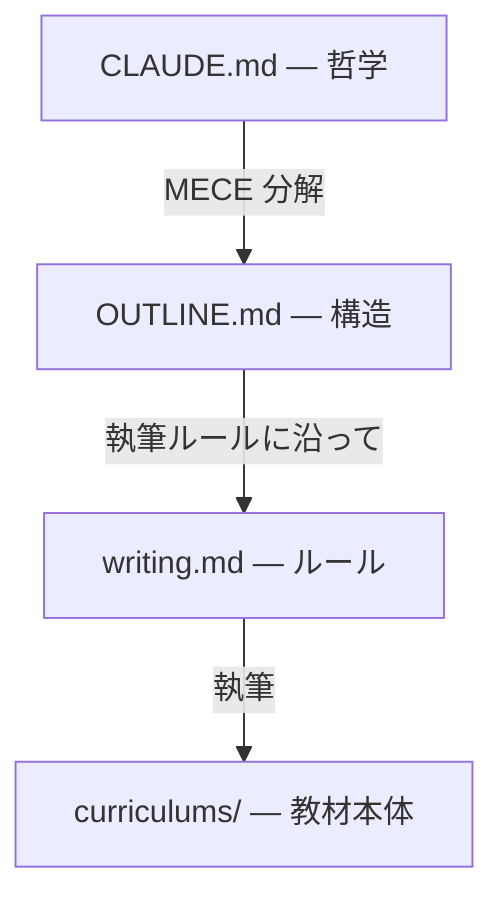
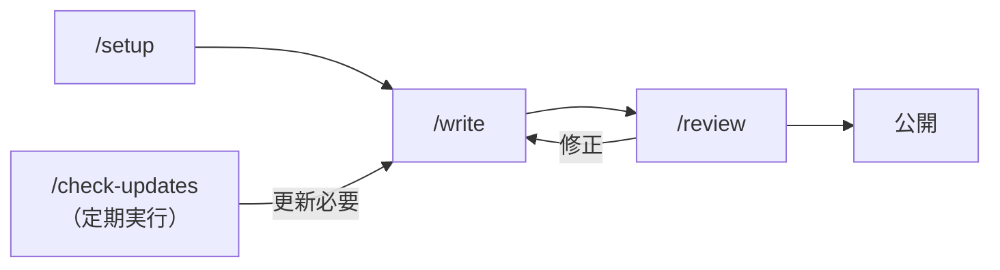

# 教材執筆フレームワーク

Claude Code のスキルを使って、技術教材の設計から執筆・レビュー・メンテナンスまでを行うフレームワークです。

「誰に、なぜ、何を教えるか」を対話で定義し、その哲学に基づいて構造を MECE に分解し、一貫した品質で教材を書き上げます。

## クイックスタート

```bash
# 1. クローン
git clone https://github.com/yotaro0616/curriculum-writer.git my-curriculum
cd my-curriculum

# 2. Claude Code で対話的にセットアップ
/setup

# 3. 執筆
/write Chapter 1
```

`/setup` を実行すると、対話を通じて CLAUDE.md（哲学）・OUTLINE.md（構造）・writing.md（執筆ルール）が生成されます。あとは `/write` で書き、`/review` でチェックするだけです。

---

## 4つのスキル

| スキル | やること | 入力例 |
|---|---|---|
| `/setup` | 教材の哲学定義 → 構造設計 → 執筆ルール調整 | `/setup` |
| `/write` | OUTLINE に基づいて執筆 | `/write Chapter 2-1`, `/write 全て` |
| `/review` | 4観点でレビュー（自動修正しない） | `/review Part 1` |
| `/check-updates` | 参考資料との鮮度チェック | `/check-updates` |

### /setup の流れ

対話形式で5つの Phase を進めます。



Phase 0 で TOPIC とスコープの外縁を固めてから、ペルソナ・コンセプト・ゴールを深掘りします。途中でスコープが変わった場合は Phase 0 に戻って再確認します。

### /write の流れ

```
準備（参考資料取得・整理） → 方針合わせ → 執筆 → セルフチェック
```

- 参考資料から数値・仕様を箇条書きで整理し、記憶ではなくその整理結果を参照して書く
- 大規模スコープでは Chapter 単位で方針合わせと中間チェックを行う
- 完了後に `/review` の実行を提案する

### /review の観点

| 観点 | 内容 |
|---|---|
| ルール準拠 | writing.md のテンプレート・文体に従っているか |
| 設計との整合 | OUTLINE.md のゴール・種類と一致しているか |
| 正確性 | 参考資料の表記に従っているか |
| 実践フォロー可能性 | ハンズオンを読者だけで完遂できるか |

レビュー前に Grep ベースの機械的チェック（太字スペース・ダッシュ記号・言語指定なしコードブロック等）を自動実行し、誤検知を減らします。

---

## 設計思想

### 抽象から具体へ



| 層 | ファイル | 役割 |
|---|---|---|
| 哲学 | `CLAUDE.md` | 誰に、なぜ、何を、どう教えるか |
| 設計 | `OUTLINE.md` | 各 Section のゴール・種類・順序・依存関係 |
| ルール | `writing.md` | 文体・テンプレート・用語・図表形式 |
| コンテンツ | `curriculums/` | 読者に届く教材そのもの |

### 階層構造

教材の規模に応じて `/setup` で選択します。

| 層数 | 構造 | 用途 |
|---|---|---|
| 3層 | Part > Chapter > Section | 大規模教材（複数の大テーマ） |
| 2層 | Chapter > Section | 中規模教材（1テーマを深掘り） |
| 1層 | Section のみ | 小規模教材・ガイド集 |

### 3種の Section

各 Section には種類を付与し、テンプレートの構造を決定します。

| 種類 | 内容 | 選択基準 |
|---|---|---|
| **概念** | 意義・仕組み・使い方を解説 | 手を動かす要素がない |
| **ハンズオン** | 概念で学んだ機能を実践 | 事前に概念 Section で学んだ内容を実践する |
| **混合** | 概念を学びながらすぐに手を動かす | 概念と実践を分けると不自然 |

すべての種類で共通の骨格（🎯学習目標 → 導入/🧠 → 本文 → ✨まとめ）を持ち、種類ごとに本文の構成が異なります。ハンズオン・混合では `## 🏃 実践` > `### 🏃 Step N` の統一された Step 構造を使います。

---

## ファイル構成

```
project-root/
├── CLAUDE.md                 # 哲学（WHO/WHY/WHAT/HOW/MAP）
├── OUTLINE.md                # 構造設計
├── README.md
├── .claude/
│   ├── rules/writing.md      # 執筆ルール（文体・テンプレート・用語）
│   ├── skills/
│   │   ├── setup/            # /setup スキル
│   │   ├── write/            # /write スキル
│   │   ├── review/           # /review スキル
│   │   └── check-updates/    # /check-updates スキル
│   └── settings.json
├── curriculums/              # 教材本体（階層構造に応じたディレクトリ）
└── assets/                   # 画像
```

---

## ワークフロー



### 初回

1. `/setup` で対話的に CLAUDE.md・OUTLINE.md・writing.md を生成
2. `/write` で Section を執筆（Part / Chapter / Section 単位、または全体一括）
3. `/review` でレビュー、指摘を修正

### メンテナンス

- 参考資料がオンラインの場合: `/check-updates` を月1回実行
- 破壊的変更が見つかったら `/write` で即修正
- 構成変更が必要な場合は `/setup` を再実行
