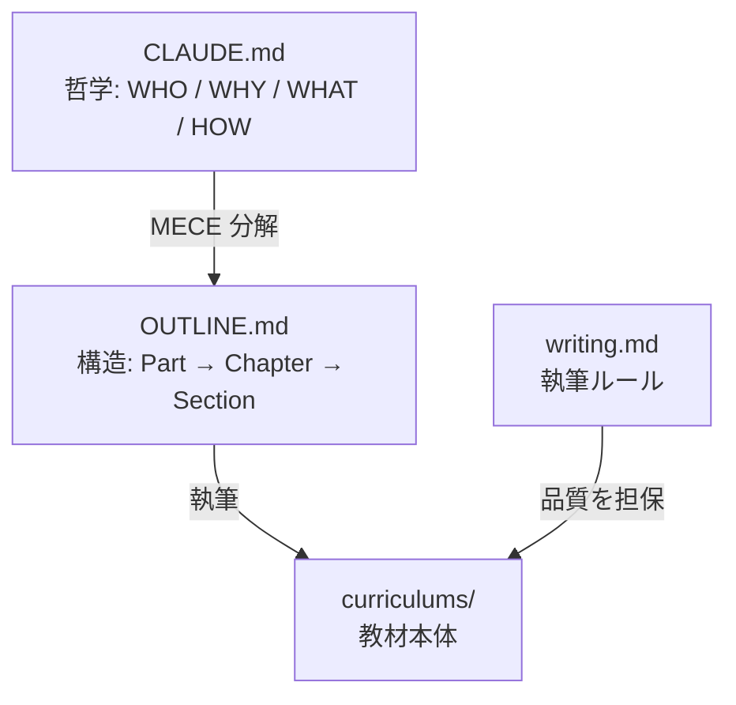
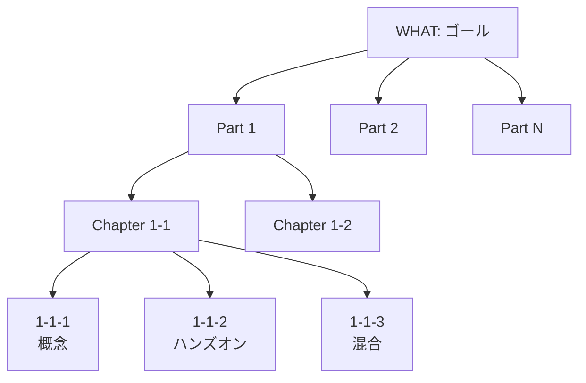
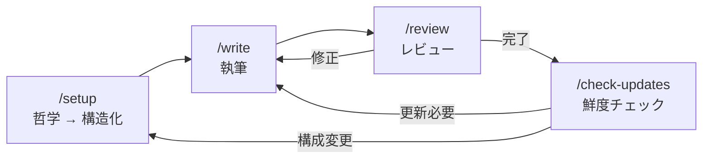

# 教材執筆フレームワーク

Claude Code の Skills と Rules を活用した、教材執筆のためのワークフローフレームワーク。教材の哲学を定義し、構造を MECE に分解し、品質を担保しながら執筆する一連のプロセスを再現可能な形で提供します。

---

## クイックスタート

### 前提条件

- [Claude Code](https://claude.ai/code) がインストール済みであること
- 教材のテーマが決まっていること

### 使い方

1. `template/` をプロジェクトディレクトリにコピーする
2. Claude Code を起動し、`/setup` を実行する（対話的に CLAUDE.md・OUTLINE.md・writing.md を作成）
3. `/write [スコープ]` で執筆を開始する
4. `/review [スコープ]` でレビューする
5. 定期的に `/check-updates` で公式ドキュメントとの鮮度を確認する

```bash
# 例: template/ をプロジェクトにコピー
cp -r framework/template/ my-curriculum/
cd my-curriculum/
claude  # Claude Code を起動
# > /setup と入力して対話的にセットアップ
```

---

## 前提知識: Claude Code の仕組み

このフレームワークは Claude Code の以下の機能を活用しています。

### CLAUDE.md

プロジェクトのルートに配置するファイル。Claude Code が会話開始時に自動で読み込み、プロジェクトの文脈（目的・制約・規約）を把握します。このフレームワークでは教材の**哲学**（誰に・なぜ・何を・どう教えるか）を定義する場所として使います。

### Rules（`.claude/rules/`）

Claude Code の振る舞いを制御するルールファイル。`CLAUDE.md` がプロジェクト全体の方針を定義するのに対し、Rules は特定の作業領域（執筆、コードレビューなど）に適用される詳細なルールを定義します。このフレームワークでは `writing.md` に執筆ルール（文体・テンプレート・コンテンツ規則）を定義します。

### Skills（`.claude/skills/`）

Claude Code に特定のワークフローを実行させるためのコマンド定義。`/setup`、`/write` のように `/` で呼び出します。各 Skill は `SKILL.md` ファイルに手順を記述し、Claude Code はその手順に従って作業を進めます。

---

## 設計思想

### 抽象から具体へ: 哲学 → 構造 → 教材

このフレームワークの核心は、**抽象的な哲学を具体的な教材に段階的に落とし込む**プロセスです。



| 層 | ファイル | 役割 | 問い |
|---|---|---|---|
| 哲学層 | `CLAUDE.md` | 教材の存在意義を定義する | 誰に、なぜ、何を、どう教えるか |
| 設計層 | `OUTLINE.md` | 哲学を構造に変換する | 何を、どの順で、どの粒度で教えるか |
| 執筆層 | `writing.md` | 品質基準を定義する | どんな文体・形式・深さで書くか |
| コンテンツ層 | `curriculums/` | 読者に届く教材そのもの | — |

### WHO / WHY / WHAT / HOW / MAP

CLAUDE.md は以下の5セクションで教材の哲学を定義します。

| セクション | 問い | 内容 |
|---|---|---|
| **WHO**（ペルソナ） | 誰に教えるか | 読者像・前提知識・技術スタック |
| **WHY**（コンセプト） | なぜ必要か | 業界背景・読者への価値・教材の哲学 |
| **WHAT**（ゴール） | 何ができるようになるか | 行動レベルの具体的な到達目標 |
| **HOW**（カリキュラム） | どう教えるか | Part 構成の大枠 |
| **MAP**（プロジェクトマップ） | リソースはどこか | フォルダ構造・Skill 一覧・公式ドキュメント URL |

### MECE 分解

WHAT（ゴール）を Part → Chapter → Section に分解する際、以下の原則を適用します。



| # | 原則 | 内容 |
|---|---|---|
| 1 | **階層的 MECE 分解** | 各レベルは上位を漏れなく・重複なく分解する |
| 2 | **抽象度の一貫性** | 兄弟要素は同じ抽象度 |
| 3 | **各レベル 2〜4 個** | 5個以上ならグルーピング不足を疑う |
| 4 | **分解軸の単一性** | 兄弟が同じ軸上にあること |

### 3種セクション

Section は学習体験の性質に応じて3種類に分類します。

| 種類 | 内容 | 使いどころ |
|---|---|---|
| **概念** | 意義・仕組み・使い方を解説。コード生成なし | 理論・背景・方法論 |
| **ハンズオン** | 概念で学んだことを実践。冒頭に概念への逆リンク | 既知の概念を手で確認 |
| **混合** | 概念を学びながらすぐ手を動かす | セットアップ・機能の初回体験 |

### Why → What → How

Section 内の見出しは**抽象から具体**の流れで設計します。

- **Why**: なぜ必要か（課題・動機）
- **What**: 何か、何ができるか（定義・機能・概念）
- **How**: どう使う / どう判断するか（使い方・判断基準）

### 3観点検証

ハンズオン・混合 Section でコードを生成した場合、以下の3観点で検証します。

- **正しさ**: 要件を満たしているか、期待通りに動作するか
- **品質**: 読みやすいか、保守しやすいか、パフォーマンスは適切か
- **安全性**: セキュリティ上の問題はないか、データの取り扱いは適切か

---

## ワークフロー



### /setup — 初期設定と構造化

教材の哲学（CLAUDE.md）を対話的に定義し、OUTLINE.md に MECE 分解で落とし込む。

1. **Phase 1**: CLAUDE.md の WHO/WHY/WHAT/HOW/MAP を質問で埋める
2. **Phase 2**: WHAT を Part → Chapter → Section に構造化し OUTLINE.md を作成
3. **Phase 3**: writing.md の語りかけ人格・用語テーブルを調整
4. **Phase 4**: 生成物をユーザーに確認

### /write — 執筆

OUTLINE.md の設計に基づき、公式ドキュメントを参照しながら教材を書く。

1. **準備**: 哲学確認 → 設計読み込み → 情報取得 → 既存コンテンツ確認
2. **方針合わせ**: 体験設計・構成判断をユーザーに提示
3. **執筆**: テンプレートに沿って書く
4. **検証・完了**: コード整合性 → 公式ドキュメント照合 → `/review` → ユーザー確認

### /review — レビュー

6観点で品質を検証し、問題点を報告する（自動修正しない）。

1. テンプレート準拠
2. 設計との整合（OUTLINE.md）
3. 正確性（用語・コードブロック）
4. スタイル準拠（文体・表記）
5. 実践フォロー可能性（手順の再現性・依存関係）
6. リンク・参照の検証

### /check-updates — 鮮度チェック

公式ドキュメント・Changelog と教材を照合し、更新が必要な箇所を報告する。

- 月1回の定期チェックを推奨
- 破壊的変更は即座に `/write` で修正
- 構成変更が必要な場合は `/setup` を使用

---

## カスタマイズガイド

### 検証観点の調整

デフォルトの3観点（正しさ・品質・安全性）はソフトウェア開発教材向けです。テーマに応じて調整してください。

例（デザイン教材の場合）:
- **正しさ** → **機能性**: 要件を満たしているか
- **品質** → **美しさ**: デザイン原則に沿っているか
- **安全性** → **アクセシビリティ**: 誰でも利用できるか

調整する場合は `writing.md` のテンプレート内の3観点を書き換えてください。

### 絵文字の変更・追加

`writing.md` の絵文字テーブルに追加・変更できます。ただし、テンプレートで使われている絵文字（🎯, ✨, 🏃, 🔍 等）を変更する場合は、テンプレート側も合わせて更新してください。

### 実践プロジェクトの有無

実践プロジェクトがない教材（座学中心）でも、このフレームワークはそのまま使えます。

- `/setup` Phase 2 で実践プロジェクトを「なし」に設定
- Section の種類を「概念」中心に設計
- `/write` と `/review` の実践プロジェクト関連のステップは自動でスキップされます

実践プロジェクトがある場合は、CLAUDE.md の MAP セクションにプロジェクトの情報（名前・技術スタック・仕様書の場所）を記載してください。

---

## ファイル構成

```
project-root/
├── CLAUDE.md           # 教材の哲学（WHO/WHY/WHAT/HOW/MAP）
├── OUTLINE.md          # カリキュラム設計（全 Part/Chapter/Section）
├── .claude/
│   ├── rules/
│   │   └── writing.md  # 執筆ルール
│   ├── skills/
│   │   ├── setup/      # /setup — 初期設定
│   │   ├── write/      # /write — 執筆
│   │   ├── review/     # /review — レビュー
│   │   └── check-updates/ # /check-updates — 鮮度チェック
│   └── settings.json
├── curriculums/        # 教材本体
│   └── part-XX_タイトル/chapter-XX_タイトル/X-X-X_タイトル.md
└── assets/             # 画像
```

---

## 記入例

`examples/filled-claude-code.md` に、このフレームワークを使って実際に作成された教材プロジェクト（Claude Code 教材）の完成形を掲載しています。`/setup` で何を答え、どんな CLAUDE.md・OUTLINE.md・writing.md が生成されたかの参考にしてください。
