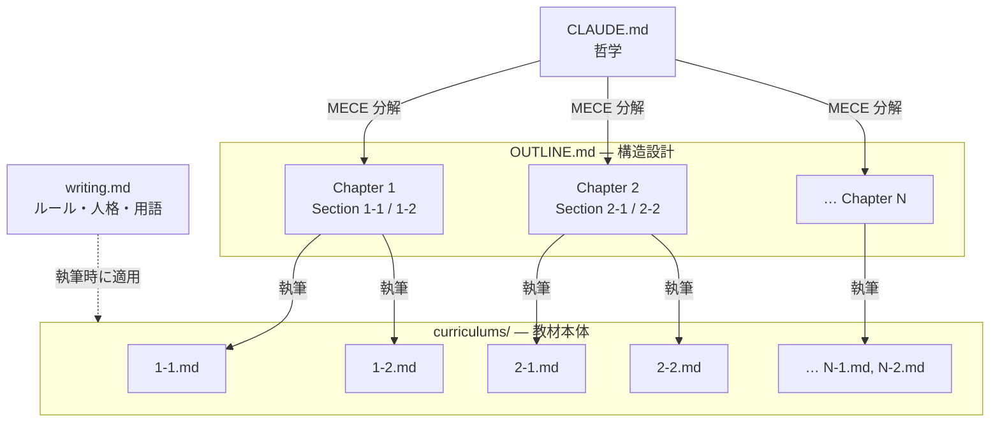
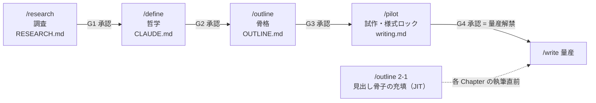
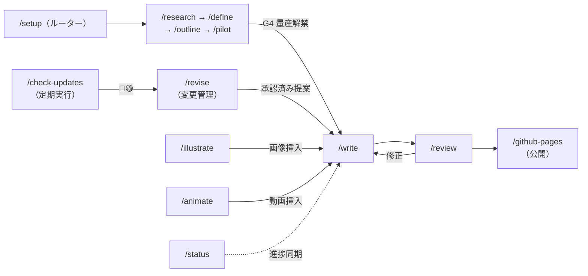

# 教材執筆フレームワーク

Claude Code のスキルを使って、技術教材の設計から執筆・レビュー・メンテナンスまでを行うフレームワークです。

「誰に、なぜ、何を教えるか」を対話で定義し、その哲学に基づいて構造を MECE に分解し、一貫した品質で教材を書き上げます。

## クイックスタート

```bash
# 1. テンプレートから教材リポジトリを作成（推奨。クローンでも可）
gh repo create my-curriculum --template yotaro0616/curriculum-writer --private --clone
cd my-curriculum
npm ci   # 機械チェック（textlint）を有効化。省略すると hook / CI の文章チェックが黙ってスキップされる

# 2. Claude Code で対話的にセットアップ（上流フェーズを案内）
/setup

# 3. 執筆（G4 様式ロック後に量産。2層の例。3層では /write Chapter 1-1）
/write Chapter 1
```

`/setup`（ルーター）が上流フェーズを順に案内します: `/research`（調査 → RESEARCH.md）→ `/define`（哲学 → CLAUDE.md）→ `/outline`（構造 → OUTLINE.md）→ `/pilot`（試作 → writing.md 様式ロック）。各ゲートを承認したら `/write` で量産し、`/review` でチェックします。小規模教材ではフェーズの省略（適応的深度）も提案されます。

**前提環境**:

| ツール | 用途 |
|---|---|
| Claude Code | すべてのスキルの実行環境 |
| gh CLI | テンプレートからのリポジトリ作成・GitHub 操作 |
| Python 3.9+ | 機械チェック `scripts/lint_curriculum.py`（標準ライブラリのみで動作） |
| Node.js 22 + npm | textlint（`npm ci` で有効化）と `/animate` の Remotion |
| API キー | メディア系スキルのみ必要。`/animate` は `GOOGLE_TTS_API_KEY`（既定 TTS）、`/illustrate` の生成AI経路は `GEMINI_API_KEY` / `OPENAI_API_KEY`。詳細は各 SKILL.md |

---

## 設計思想

### 抽象から具体へ


```mermaid
flowchart TD
    A["CLAUDE.md\n哲学"]

    subgraph outline["OUTLINE.md — 構造設計"]
        direction LR
        B1["Chapter 1\nSection 1-1 / 1-2"]
        B2["Chapter 2\nSection 2-1 / 2-2"]
        B3["… Chapter N"]
    end

    subgraph curr["curriculums/ — 教材本体"]
        direction LR
        C1["1-1.md"]
        C2["1-2.md"]
        C3["2-1.md"]
        C4["2-2.md"]
        C5["… N-1.md, N-2.md"]
    end

    A -->|MECE 分解| B1 & B2 & B3
    B1 -->|執筆| C1 & C2
    B2 -->|執筆| C3 & C4
    B3 -->|執筆| C5

    W["writing.md\nルール・人格・用語"] -.->|執筆時に適用| curr
```

| 層 | ファイル | 役割 |
|---|---|---|
| 哲学 | `CLAUDE.md` | 誰に、なぜ、何を、どう教えるか |
| 設計 | `OUTLINE.md` | 各 Section のゴール・種類・順序・依存関係 |
| ルール | `writing.md` | 文体・テンプレート・用語・図表形式 |
| コンテンツ | `curriculums/` | 読者に届く教材そのもの |

### 階層構造

教材の規模に応じて `/define`（哲学の HOW）で選択します。

| 層数 | 構造 | 用途 |
|---|---|---|
| 3層 | Part > Chapter > Section | 大規模教材（複数の大テーマ） |
| 2層 | Chapter > Section | 中規模教材（1テーマを深掘り） |
| 1層 | Section のみ | 小規模教材・ガイド集 |

### 3種の Section

各 Section には種類を付与し、テンプレートの構造を決定します。

| 種類 | 内容 | 選択基準 |
|---|---|---|
| **概念** | 意義・仕組み・使い方を解説（コードは読む例）。末尾に任意の小実践「やってみよう」を置ける | 分かるが目的（5〜15分の試行で定着するなら＋やってみよう） |
| **ハンズオン** | 既習の複数機能を束ねて成果物を作る統合実践 | 既習機能の組み合わせで成果物を作る |
| **混合** | 概念解説と実践を同一 Section 内で前半・後半に分けて構成 | 説明と操作が不可分（環境構築・初回体験） |

すべての種類で共通の骨格（🎯学習目標 → Why ブロック（🧠）→ 本文 → ✨まとめ）を持ち、種類ごとに本文の構成が異なります。学習者が実行するコード・コマンドは 🏃 見出し（実践 / Step / やってみよう）の配下にのみ置きます（位置ルール）。

---

## スキル一覧

| スキル | やること | 入力例 |
|---|---|---|
| `/setup` | 上流フェーズのルーター（次フェーズの案内・PROGRESS 管理） | `/setup` |
| `/research` | 設計前調査（トピックマップ・題材候補・出典付き） | `/research`, `/research light` |
| `/define` | 哲学の定義（WHO/WHY/WHAT/HOW/MAP → CLAUDE.md） | `/define` |
| `/outline` | 構造設計（骨格）と見出し骨子の JIT 充填 | `/outline`, `/outline 2-1` |
| `/pilot` | writing.md 調整 → 代表 Chapter 試作 → 様式ロック | `/pilot` |
| `/write` | OUTLINE に基づいて執筆 | `/write Chapter 2-1`, `/write 全て` |
| `/review` | 5観点でレビュー（自動修正しない）・改訂の検収 | `/review Part 1` |
| `/revise` | 改訂の変更管理（提案 → 適用 → アーカイブ） | `/revise 章を3節に分割したい` |
| `/status` | 進捗の同期・報告 | `/status` |
| `/check-updates` | 参考資料との鮮度チェック（🔴🟡 は /revise へ） | `/check-updates` |
| `/illustrate` | 概念図の計画・作成・挿入（既定: Claude Design 手動 / 選択式: 生成AI） | `/illustrate plan 2-1`, `/illustrate Part 2` |
| `/design-ingest` | claude.ai/Design で作った図の zip を自動取り込み・挿入 | `/design-ingest`, `/design-ingest --dry-run` |
| `/animate` | Remotion で Section 解説動画を生成・挿入 | `/animate Chapter 1`, `/animate plan 2-1` |
| `/github-pages` | MkDocs Material で GitHub Pages に公開 | `/github-pages new`, `/github-pages deploy` |
| `/fw-sync` | 展開済み教材プロジェクトへ FW 更新を選択的に取り込む | `/fw-sync` |

### 上流パイプライン（/setup がルーティング）


```mermaid
flowchart LR
    R["/research\n調査\nRESEARCH.md"] -->|G1 承認| D["/define\n哲学\nCLAUDE.md"]
    D -->|G2 承認| O["/outline\n骨格\nOUTLINE.md"]
    O -->|G3 承認| P["/pilot\n試作・様式ロック\nwriting.md"]
    P -->|G4 承認 = 量産解禁| W["/write 量産"]
    O2["/outline 2-1\n見出し骨子の充填（JIT）"] -.->|各 Chapter の執筆直前| W
```

- 人間が承認するのは各ゲートの成果物だけ。承認状態は `PROGRESS.md` に記録され、`/write` が量産前に検査します
- 裏取り（公式ドキュメントの実取得・トピックマップ化）は上流の責務です。見出し骨子は調査に基づいて執筆直前に設計し、執筆時の「方針合わせ」はその確認に短縮されます
- 小規模教材では `/research light` や `/pilot` 省略を `/setup` が提案します（省略も PROGRESS に記録）

### /write の流れ


```mermaid
flowchart LR
    W1["1. 準備\n参考資料取得・整理"] --> W2["2. 方針合わせ\n体験設計・見出し構成"]
    W2 --> W3["3. 執筆"]
    W3 --> W4["4. セルフチェック"]
    W4 -.->|提案| R["/review"]
```

- 準備の最初に PROGRESS のゲート（G4 量産解禁）と OUTLINE の見出し骨子を検査する（未承認なら該当フェーズを案内）
- 参考資料は RESEARCH.md を正として参照し、Web 取得は差分確認に留める。記憶ではなく整理結果を参照して書く
- セルフチェック後に AI 臭チェックと独立レビュアー（サブエージェント）のゲートを通す
- 完了後に `/review` の実行を提案する

### /review の観点

| 観点 | 内容 |
|---|---|
| ルール準拠 | writing.md のテンプレート・文体に従っているか |
| 設計との整合 | OUTLINE.md のゴール・種類・見出し骨子と一致しているか |
| 正確性 | 参考資料の表記に従っているか |
| 実践フォロー可能性 | ハンズオンを読者だけで完遂できるか（実機検証は handson-verifier エージェント） |
| 文体・AI 臭 | 談話レベルの AI 臭（命題型見出し・両論併記・リズム均一等）がないか |

レビュー前に共通 lint（`scripts/lint_curriculum.py`）を実行します。同じ検査は執筆時の PostToolUse hook・PR 時の CI でも自動実行されます。/revise の適用後は「変更スコープモード」（網羅性・正確性・整合性の3軸）で検収します。

### /illustrate の流れ（2経路）

Mermaid では表現しにくい「直感的なメンタルモデル」を概念図として計画・作成・挿入します。作成経路は2つあり、`/pilot` で既定を選びます。

| 経路 | やること |
|---|---|
| **Claude Design（既定）** | `/illustrate plan` が概念アンカーごとの作図依頼リストを出す → claude.ai/design で作図（部分修正・複数案比較・デザインシステムで統一）→ zip 書き出し → `/design-ingest` が自動検出・配置・タグ挿入まで実施 |
| **生成AI（選択式）** | Gemini / OpenAI の API で生成（`generate-image.js`。プロバイダは Part 内で統一）。`GEMINI_API_KEY` または `OPENAI_API_KEY` が必要 |

画像は Why ブロックの 🧠 直後に配置し（追加図は該当 `##` 見出し末尾）、取り込み済みは SHA-256 で判定してスキップします（冪等）。密度方針（[A] 各概念 Section 1枚 / [B] 判断ベース / [C] 概念アンカーごと=1 Section 複数図）は `/pilot` で選びます。

### /animate の流れ

Remotion で、静止画では表しにくい「時間軸を持つ説明」（対比の展開・処理の流れ・状態変化）を Section 解説動画（3〜6分・1080p）として生成・挿入します。`/illustrate` の概念図を動画の素材としても再利用します。

| モード | やること |
|---|---|
| `plan` | 対象 Section とシーン構成案を提示（生成しない・コスト確認ゲート） |
| `generate` | スコープ内の未生成 Section を一括生成（`--yes` で確認スキップ、`--force` で再生成） |
| フル | plan → ユーザー確認 → generate を一気通貫で実行 |

動画は Section タイトル直後に配置し、生成済み Section は再実行時にスキップします（冪等）。Remotion ワークスペースは `video/` にあります。

> **前提**: `GOOGLE_TTS_API_KEY`（既定のナレーション TTS: Chirp 3 HD。他エンジンへの切替は SKILL 参照）が必要です。Remotion のライセンス要否は運用者の判断に委ねます（ゲートなし）。詳細は `.claude/skills/animate/SKILL.md`。

### /github-pages の流れ

教材を MkDocs Material + GitHub Actions で GitHub Pages に公開します。`curriculums/`（日本語パス）を `build_docs.py` が英語スラッグの `docs/` に変換し、`mkdocs build --strict` でビルド、`main` への push で GitHub Actions が自動デプロイします。

| 依頼 | やること |
|---|---|
| 新規構築 | mkdocs.yml・ナビ・テーマ色を生成 → ローカル検証 → 公開 |
| 更新 | `curriculums/` を編集して push（CI が自動再ビルド） |
| デプロイ確認 | `gh run watch` と公開 URL の疎通確認 |

> **注**: 同梱スクリプトは 3層構成（Part > Chapter > Section）前提です。公開は外向き操作のため、push・公開化の各ゲートでユーザー確認を取ります。

---

## ワークフロー


```mermaid
flowchart LR
    setup["/setup（ルーター）"] --> up["/research → /define\n→ /outline → /pilot"]
    up -->|G4 量産解禁| write["/write"]
    write --> review["/review"]
    review -->|修正| write
    review --> publish["/github-pages\n（公開）"]
    check["/check-updates\n（定期実行）"] -->|🔴🟡| revise["/revise\n（変更管理）"]
    revise -->|承認済み提案| write
    illustrate["/illustrate"] -->|画像挿入| write
    animate["/animate"] -->|動画挿入| write
    status["/status"] -.->|進捗同期| write
```

### 初回

1. `/setup` が上流4フェーズ（調査 → 哲学 → 構造 → 試作）をゲート承認付きで案内
2. 各 Chapter の執筆直前に `/outline <Chapter>` で見出し骨子を充填
3. `/write` で執筆（Part / Chapter / Section 単位）、`/review` でレビュー

### メンテナンス

- 参考資料がオンラインの場合: `/check-updates` を月1回実行
- 🔴（破壊的変更）・🟡（主要な変更）は `/revise` で提案を作成 → 承認 → 適用 → アーカイブ（読者向け CHANGELOG に記録）
- 単一 Section 内に閉じる軽微な修正のみ `/write` で直接対応

---

## 配布・更新（テンプレート + /fw-sync）

| 場面 | 手段 |
|---|---|
| **新規プロジェクトの開始** | GitHub テンプレートリポジトリ（`gh repo create --template`）。skills・agents・雛形・機械チェック基盤が一式で入る |
| **既存プロジェクトへの更新配布** | プロジェクト側で `/fw-sync`。skills / agents / scripts / video 等を diff 確認つきで選択的に取り込む（pull 型: 各プロジェクトが自分のタイミングで更新する） |
| **下流の改善の還流** | FW リポジトリへの **PR** |

- スキル・エージェントは**プロジェクト固有の決定を持たない純ロジック**として保つ。プロジェクト固有の値（様式・画像方針・ブランド等）は `PROGRESS.md` frontmatter の `config` と `writing.md` に置く（/fw-sync で skills を上書きしても決定が消えない）
- Claude Code plugin（push 型の自動配布）は検討のうえ撤収した（量産中の教材に未検収のスキル変更が届くこと、読み取り専用キャッシュとプロジェクト別カスタムの相性を理由とする。経緯は Issue #65 #71）

## オーダーメイド教材（企業別展開）

企業・組織向けに教材を作る場合は、**1教材 = 1リポジトリ**を維持したまま `CONTEXT.md`（企業コンテキスト）を追加します。

1. テンプレートから企業別リポジトリを作成
2. `CONTEXT.md` に事業・受講者の実像・現場スタック・用語 / NG 用語・研修の制約を記入（`/research`・`/define` が必読入力にする）
3. 以降は共通フロー（/setup → 上流4フェーズ → /write）。既存の社内資料がある場合は `/research` のギャップ分析（Extend / Create New / Restructure）を使う

> ⚠️ 内部検討資料（価格・競合比較等）は教材リポジトリに含めず別管理にしてください（public リポジトリに内部資料が残った実例があります）。

## 非技術教材への転用

機械チェック・上流フロー・テンプレートは題材非依存で、そのまま使えます。技術教材の前提が集中しているのは `.claude/rules/writing.md` の「3. コンテンツ」（コード・ハンズオン・REPL の規範）と handson-verifier エージェントだけです。学習ノート・業務マニュアル等に転用する場合は、`/pilot` の初期調整でこの2箇所を題材に合わせて読み替え・削除してください。

---

## ファイル構成

```
project-root/
├── CLAUDE.md                 # 哲学（WHO/WHY/WHAT/HOW/MAP）
├── RESEARCH.md               # 設計前調査（/research が生成。裏取りの正）
├── OUTLINE.md                # 構造設計（骨格 + 見出し骨子 + 付録）
├── PROGRESS.md               # ゲート承認と進捗（/status が同期）
├── CONTEXT.md                # 企業コンテキスト（オーダーメイド時のみ。汎用教材では削除）
├── changes/                  # /revise の変更提案（archive/ に適用履歴）
├── README.md
├── .claude/
│   ├── rules/writing.md      # 執筆ルール（文体・テンプレート・用語）
│   ├── rules/prh.yml         # 用語辞書（writing.md の用語テーブルと同期。textlint が参照）
│   ├── hooks/                # PostToolUse hook スクリプト（編集時 lint）
│   ├── skills/               # 15スキル（setup/research/define/outline/pilot/
│   │                         #   write/review/revise/status/check-updates/
│   │                         #   illustrate/design-ingest/animate/github-pages/fw-sync）
│   ├── agents/               # カスタムエージェント（independent-reviewer /
│   │                         #   learner-persona / handson-verifier）
│   └── settings.json         # 権限 + PostToolUse hook の設定
├── scripts/                  # lint_curriculum.py（機械チェックの単一の正）
├── package.json              # textlint の依存定義（npm ci で有効化。lock ファイル同梱）
├── .textlintrc.json          # textlint の設定（文章・AI 臭。用語辞書は .claude/rules/prh.yml）
├── curriculums/              # 教材本体（階層構造に応じたディレクトリ）
├── assets/
│   └── diagrams/             # 概念図（output/ 画像・prompts/ 依頼文の記録）
└── video/                    # /animate の Remotion ワークスペース（Section 解説動画）
```
