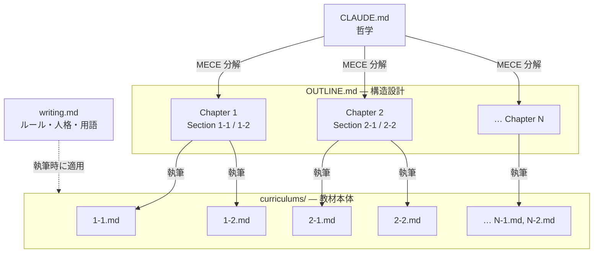
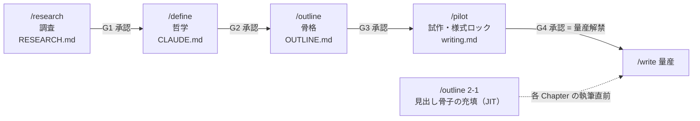
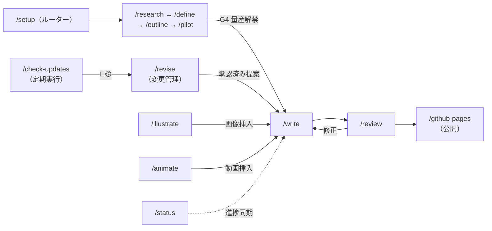

# 教材執筆フレームワーク

Claude Code のスキルを使って、技術教材の設計から執筆・レビュー・メンテナンスまでを行うフレームワークです。

「誰に、なぜ、何を教えるか」を対話で定義し、その哲学に基づいて構造を MECE に分解し、一貫した品質で教材を書き上げます。

## クイックスタート

```bash
# 1. クローン
git clone https://github.com/yotaro0616/curriculum-writer.git my-curriculum
cd my-curriculum

# 2. Claude Code で対話的にセットアップ
/setup

# 3. 執筆
/write Chapter 1
```

`/setup`（ルーター）が上流フェーズを順に案内します: `/research`（調査 → RESEARCH.md）→ `/define`（哲学 → CLAUDE.md）→ `/outline`（構造 → OUTLINE.md）→ `/pilot`（試作 → writing.md 様式ロック）。各ゲートを承認したら `/write` で量産し、`/review` でチェックします。小規模教材ではフェーズの省略（適応的深度）も提案されます。

---

## 設計思想

### 抽象から具体へ


```mermaid
flowchart TD
    A["CLAUDE.md\n哲学"]

    subgraph outline["OUTLINE.md — 構造設計"]
        direction LR
        B1["Chapter 1\nSection 1-1 / 1-2"]
        B2["Chapter 2\nSection 2-1 / 2-2"]
        B3["… Chapter N"]
    end

    subgraph curr["curriculums/ — 教材本体"]
        direction LR
        C1["1-1.md"]
        C2["1-2.md"]
        C3["2-1.md"]
        C4["2-2.md"]
        C5["… N-1.md, N-2.md"]
    end

    A -->|MECE 分解| B1 & B2 & B3
    B1 -->|執筆| C1 & C2
    B2 -->|執筆| C3 & C4
    B3 -->|執筆| C5

    W["writing.md\nルール・人格・用語"] -.->|執筆時に適用| curr
```

| 層 | ファイル | 役割 |
|---|---|---|
| 哲学 | `CLAUDE.md` | 誰に、なぜ、何を、どう教えるか |
| 設計 | `OUTLINE.md` | 各 Section のゴール・種類・順序・依存関係 |
| ルール | `writing.md` | 文体・テンプレート・用語・図表形式 |
| コンテンツ | `curriculums/` | 読者に届く教材そのもの |

### 階層構造

教材の規模に応じて `/setup` で選択します。

| 層数 | 構造 | 用途 |
|---|---|---|
| 3層 | Part > Chapter > Section | 大規模教材（複数の大テーマ） |
| 2層 | Chapter > Section | 中規模教材（1テーマを深掘り） |
| 1層 | Section のみ | 小規模教材・ガイド集 |

### 3種の Section

各 Section には種類を付与し、テンプレートの構造を決定します。

| 種類 | 内容 | 選択基準 |
|---|---|---|
| **概念** | 意義・仕組み・使い方を解説（コードは読む例）。末尾に任意の小実践「やってみよう」を置ける | 分かるが目的（5〜15分の試行で定着するなら＋やってみよう） |
| **ハンズオン** | 既習の複数機能を束ねて成果物を作る統合実践 | 既習機能の組み合わせで成果物を作る |
| **混合** | 概念解説と実践を同一 Section 内で前半・後半に分けて構成 | 説明と操作が不可分（環境構築・初回体験） |

すべての種類で共通の骨格（🎯学習目標 → Why ブロック（🧠）→ 本文 → ✨まとめ）を持ち、種類ごとに本文の構成が異なります。学習者が実行するコード・コマンドは 🏃 見出し（実践 / Step / やってみよう）の配下にのみ置きます（位置ルール）。

---

## スキル一覧

| スキル | やること | 入力例 |
|---|---|---|
| `/setup` | 上流フェーズのルーター（次フェーズの案内・PROGRESS 管理） | `/setup` |
| `/research` | 設計前調査（トピックマップ・題材候補・出典付き） | `/research`, `/research light` |
| `/define` | 哲学の定義（WHO/WHY/WHAT/HOW/MAP → CLAUDE.md） | `/define` |
| `/outline` | 構造設計（骨格）と見出し骨子の JIT 充填 | `/outline`, `/outline 2-1` |
| `/pilot` | writing.md 調整 → 代表 Chapter 試作 → 様式ロック | `/pilot` |
| `/write` | OUTLINE に基づいて執筆 | `/write Chapter 2-1`, `/write 全て` |
| `/review` | 5観点でレビュー（自動修正しない）・改訂の検収 | `/review Part 1` |
| `/revise` | 改訂の変更管理（提案 → 適用 → アーカイブ） | `/revise 章を3節に分割したい` |
| `/status` | 進捗の同期・報告 | `/status` |
| `/check-updates` | 参考資料との鮮度チェック（🔴🟡 は /revise へ） | `/check-updates` |
| `/illustrate` | Gemini で概念図を生成・挿入 | `/illustrate Part 2`, `/illustrate plan 2-1` |
| `/animate` | Remotion で Section 解説動画を生成・挿入 | `/animate Chapter 1`, `/animate plan 2-1` |
| `/github-pages` | MkDocs Material で GitHub Pages に公開 | `/github-pages new`, `/github-pages deploy` |

### 上流パイプライン（/setup がルーティング）


```mermaid
flowchart LR
    R["/research\n調査\nRESEARCH.md"] -->|G1 承認| D["/define\n哲学\nCLAUDE.md"]
    D -->|G2 承認| O["/outline\n骨格\nOUTLINE.md"]
    O -->|G3 承認| P["/pilot\n試作・様式ロック\nwriting.md"]
    P -->|G4 承認 = 量産解禁| W["/write 量産"]
    O2["/outline 2-1\n見出し骨子の充填（JIT）"] -.->|各 Chapter の執筆直前| W
```

- 人間が承認するのは各ゲートの成果物だけ。承認状態は `PROGRESS.md` に記録され、`/write` が量産前に検査します
- 裏取り（公式ドキュメントの実取得・トピックマップ化）は上流の責務です。見出し骨子は調査に基づいて執筆直前に設計し、執筆時の「方針合わせ」はその確認に短縮されます
- 小規模教材では `/research light` や `/pilot` 省略を `/setup` が提案します（省略も PROGRESS に記録）

### /write の流れ


```mermaid
flowchart LR
    W1["1. 準備\n参考資料取得・整理"] --> W2["2. 方針合わせ\n体験設計・見出し構成"]
    W2 --> W3["3. 執筆"]
    W3 --> W4["4. セルフチェック"]
    W4 -.->|提案| R["/review"]
```

- 準備の最初に PROGRESS のゲート（G4 量産解禁）と OUTLINE の見出し骨子を検査する（未承認なら該当フェーズを案内）
- 参考資料は RESEARCH.md を正として参照し、Web 取得は差分確認に留める。記憶ではなく整理結果を参照して書く
- セルフチェック後に AI 臭チェックと独立レビュアー（サブエージェント）のゲートを通す
- 完了後に `/review` の実行を提案する

### /review の観点

| 観点 | 内容 |
|---|---|
| ルール準拠 | writing.md のテンプレート・文体に従っているか |
| 設計との整合 | OUTLINE.md のゴール・種類・見出し骨子と一致しているか |
| 正確性 | 参考資料の表記に従っているか |
| 実践フォロー可能性 | ハンズオンを読者だけで完遂できるか（実機検証は handson-verifier エージェント） |
| 文体・AI 臭 | 談話レベルの AI 臭（命題型見出し・両論併記・リズム均一等）がないか |

レビュー前に共通 lint（`scripts/lint_curriculum.py`）を実行します。同じ検査は執筆時の PostToolUse hook・PR 時の CI でも自動実行されます。/revise の適用後は「変更スコープモード」（網羅性・正確性・整合性の3軸）で検収します。

### /illustrate の流れ

Gemini（3 Pro Image）で、Mermaid では表現しにくい「直感的なメンタルモデル」を概念図として生成・挿入します。

| モード | やること |
|---|---|
| `plan` | 指定範囲の対象 Section を列挙し、中心概念・タイプ・画像名を計画として報告（生成しない・コスト確認ゲート） |
| `generate` | スコープ内の未生成 Section を一括生成・挿入（`--yes` で確認スキップ、`--force` で再生成） |
| フル | plan → ユーザー確認 → generate を一気通貫で実行 |

画像は導入セクションの 🧠 直後に配置し、生成済み Section は再実行時にスキップします（冪等）。Mermaid（正確な処理フロー）と illustrate（メンタルモデル・俯瞰図）を使い分けます。画像の密度方針（各概念 Section に 1 枚 / 判断ベース）は `/setup` で選べます。

> **前提**: `GEMINI_API_KEY` 環境変数の設定が必要です。[Google AI Studio](https://aistudio.google.com/apikey) で取得できます。

### /animate の流れ

Remotion で、静止画では表しにくい「時間軸を持つ説明」（対比の展開・処理の流れ・状態変化）を Section 解説動画（1.5〜3分・1080p）として生成・挿入します。`/illustrate` の概念図を動画の素材としても再利用します。

| モード | やること |
|---|---|
| `plan` | 対象 Section とシーン構成案を提示（生成しない・コスト確認ゲート） |
| `generate` | スコープ内の未生成 Section を一括生成（`--yes` で確認スキップ、`--force` で再生成） |
| フル | plan → ユーザー確認 → generate を一気通貫で実行 |

動画は Section タイトル直後に配置し、生成済み Section は再実行時にスキップします（冪等）。Remotion ワークスペースは `video/` にあります。

> **前提**: `GEMINI_API_KEY`（ナレーション TTS）と Remotion ライセンス（量産・公開時は Company License）が必要です。詳細は `.claude/skills/animate/SKILL.md`。

### /github-pages の流れ

教材を MkDocs Material + GitHub Actions で GitHub Pages に公開します。`curriculums/`（日本語パス）を `build_docs.py` が英語スラッグの `docs/` に変換し、`mkdocs build --strict` でビルド、`main` への push で GitHub Actions が自動デプロイします。

| 依頼 | やること |
|---|---|
| 新規構築 | mkdocs.yml・ナビ・テーマ色を生成 → ローカル検証 → 公開 |
| 更新 | `curriculums/` を編集して push（CI が自動再ビルド） |
| デプロイ確認 | `gh run watch` と公開 URL の疎通確認 |

> **注**: 同梱スクリプトは 3層構成（Part > Chapter > Section）前提です。公開は外向き操作のため、push・公開化の各ゲートでユーザー確認を取ります。

---

## ワークフロー


```mermaid
flowchart LR
    setup["/setup（ルーター）"] --> up["/research → /define\n→ /outline → /pilot"]
    up -->|G4 量産解禁| write["/write"]
    write --> review["/review"]
    review -->|修正| write
    review --> publish["/github-pages\n（公開）"]
    check["/check-updates\n（定期実行）"] -->|🔴🟡| revise["/revise\n（変更管理）"]
    revise -->|承認済み提案| write
    illustrate["/illustrate"] -->|画像挿入| write
    animate["/animate"] -->|動画挿入| write
    status["/status"] -.->|進捗同期| write
```

### 初回

1. `/setup` が上流4フェーズ（調査 → 哲学 → 構造 → 試作）をゲート承認付きで案内
2. 各 Chapter の執筆直前に `/outline <Chapter>` で見出し骨子を充填
3. `/write` で執筆（Part / Chapter / Section 単位）、`/review` でレビュー

### メンテナンス

- 参考資料がオンラインの場合: `/check-updates` を月1回実行
- 🔴（破壊的変更）・🟡（主要な変更）は `/revise` で提案を作成 → 承認 → 適用 → アーカイブ（読者向け CHANGELOG に記録）
- 単一 Section 内に閉じる軽微な修正のみ `/write` で直接対応

---

## ファイル構成

```
project-root/
├── CLAUDE.md                 # 哲学（WHO/WHY/WHAT/HOW/MAP）
├── RESEARCH.md               # 設計前調査（/research が生成。裏取りの正）
├── OUTLINE.md                # 構造設計（骨格 + 見出し骨子 + 付録）
├── PROGRESS.md               # ゲート承認と進捗（/status が同期）
├── changes/                  # /revise の変更提案（archive/ に適用履歴）
├── README.md
├── .claude/
│   ├── rules/writing.md      # 執筆ルール（文体・テンプレート・用語）
│   ├── skills/               # 13スキル（setup/research/define/outline/pilot/
│   │                         #   write/review/revise/status/check-updates/
│   │                         #   illustrate/animate/github-pages）
│   ├── agents/               # カスタムエージェント（independent-reviewer /
│   │                         #   learner-persona / handson-verifier）
│   └── settings.json         # 権限 + PostToolUse hook（編集時 lint）
├── scripts/                  # lint_curriculum.py（機械チェックの単一の正）等
├── curriculums/              # 教材本体（階層構造に応じたディレクトリ）
├── assets/
│   └── diagrams/             # /illustrate の生成画像・プロンプト
└── video/                    # /animate の Remotion ワークスペース（Section 解説動画）
```
