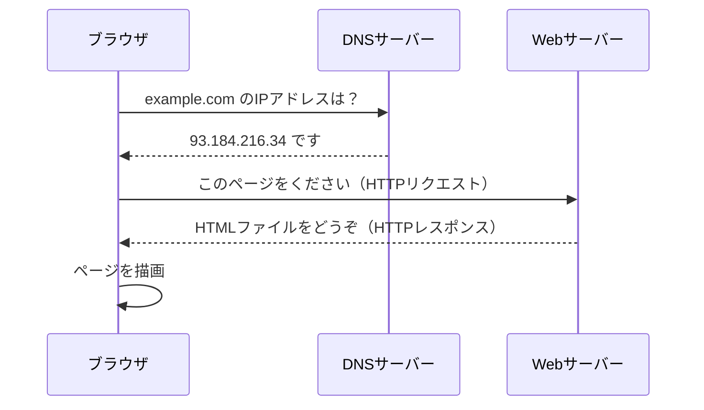
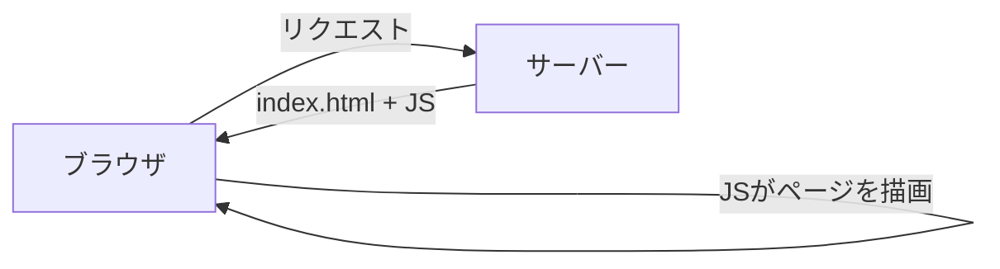
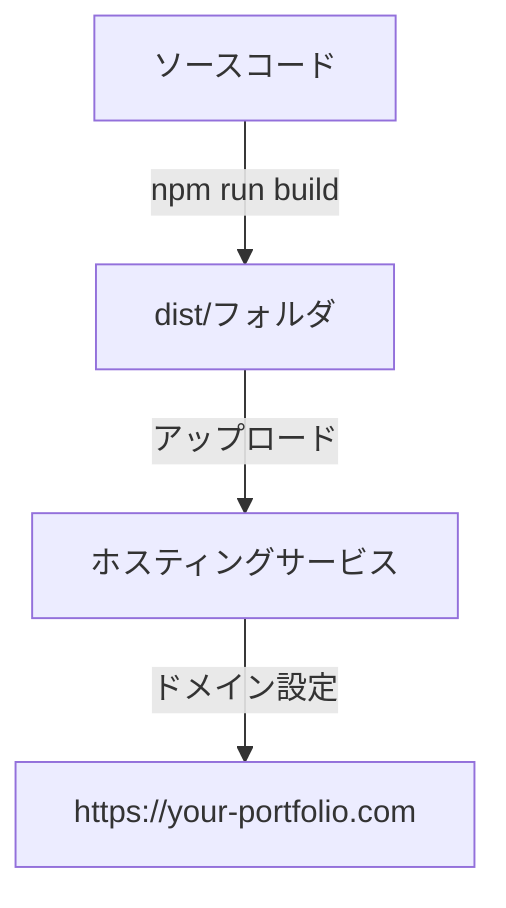

# 1-1 Webアプリが公開されるまでの全体像

> この Chapter では、デプロイの仕組みを基礎から学び、自分のポートフォリオに適したデプロイ手段を選べるようになります。全3セクションで構成されています。
>
> | セクション | 内容 |
> |---|---|
> | **1-1 Webアプリが公開されるまでの全体像**（現在） | URL入力からページ表示までの流れ |
> | 1-2 ホスティングサービスの種類と選び方 | 静的ホスティング・PaaS・IaaSの違い |
> | 1-3 Vercelを選ぶ理由 | VercelとReact SPAの相性 |
>
> 📖 **この Chapter の進め方**: まず全体像を掴み、次にサービスの選び方を学び、最後にVercelを選ぶ根拠を固めます。概念をしっかり理解してから Chapter 2 で実際にデプロイします。

## 🎯 このセクションで学ぶこと

- ブラウザにURLを入力してからページが表示されるまでの流れを説明できる
- サーバー・DNS・HTTPSの役割を理解できる
- 静的サイトと動的サイトの違いを区別できる

このセクションでは、「デプロイ」とは何かを理解するために、Webアプリが公開される仕組みの全体像を学びます。

---

## 導入: 「ローカルでは動くのに」の壁

あなたは React (Vite) で SPA（Single Page Application）を開発し、`npm run dev` でローカル環境では問題なく動作しています。しかし、このアプリを他の人に見せるにはどうすればよいでしょうか？

ローカル環境で動いているアプリは、あなたのパソコンの中だけに存在しています。インターネットを通じて誰でもアクセスできる状態にすること、これが **デプロイ** です。

### 🧠 先輩エンジニアはこう考える

> 最初に作ったアプリをデプロイしようとしたとき、「サーバーって何？」「ドメインって何？」と次々にわからない言葉が出てきて混乱した記憶があります。でも安心してください。仕組みを一つずつ分解すれば、実はシンプルです。このセクションで全体の地図を手に入れましょう。

---

## URLを入力してからページが表示されるまで

ブラウザで `https://example.com` にアクセスしたとき、裏側では以下の流れが発生しています。

この流れを3つのステップに分けて見ていきましょう。

### ステップ1: DNS解決 — 名前からアドレスを見つける

DNS（Domain Name System）は、インターネットの電話帳のような仕組みです。

人間は `example.com` のような名前（ドメイン名）でWebサイトにアクセスしますが、コンピュータ同士の通信には **IPアドレス**（`93.184.216.34` のような数字の組み合わせ）が必要です。DNSは、ドメイン名をIPアドレスに変換する役割を担っています。

🔑 **ポイント**: ドメイン名はあくまで人間が覚えやすいように付けた「名札」です。実際の通信はすべてIPアドレスで行われます。

### ステップ2: サーバーへのリクエスト — ファイルを取りに行く

IPアドレスがわかったら、ブラウザはそのアドレスにある **Webサーバー** にリクエストを送ります。

**サーバー** とは、リクエストを受け取り、レスポンスを返すコンピュータ（またはプログラム）のことです。あなたが `npm run dev` で起動している開発サーバーも、実はサーバーの一種です。違いは、開発サーバーはあなたのパソコン内（`localhost`）でしか動いていないのに対し、本番のサーバーはインターネット上に公開されている点です。

💡 **ローカル開発との対比**: `localhost:5173` でアクセスしているとき、ブラウザは自分自身のパソコンにリクエストを送っています。デプロイとは、このサーバーの役割をインターネット上のコンピュータに移すことです。

### ステップ3: レスポンスと描画 — 受け取ったファイルを表示する

サーバーはリクエストに応じて HTML、CSS、JavaScript などのファイルを返します。ブラウザはこれらを受け取り、画面に描画します。

React SPA の場合、サーバーが返すのは1つの `index.html` と、そこから読み込まれる JavaScript バンドルファイルです。ページの中身は JavaScript がブラウザ上で描画します。

---

## HTTP と HTTPS の違い

上記の通信で使われるのが **HTTP**（HyperText Transfer Protocol）というプロトコル（通信のルール）です。

HTTP は通信の内容が暗号化されず、そのままインターネット上を流れます。これに対し **HTTPS** は、通信内容を暗号化して安全にやり取りする仕組みです。

| 項目 | HTTP | HTTPS |
|---|---|---|
| 通信の暗号化 | なし | あり（SSL/TLS） |
| URLの表示 | `http://` | `https://` |
| ブラウザの表示 | 「保護されていない通信」と警告 | 鍵マークが表示される |
| 現在の標準 | 非推奨 | 標準 |

⚠️ **注意**: 現在のWebでは HTTPS が標準です。HTTP のままだとブラウザが警告を表示し、ユーザーに不安を与えます。ポートフォリオとして公開するなら HTTPS は必須と考えてください。

---

## 静的サイトと動的サイト

Webサイトには大きく分けて **静的サイト** と **動的サイト** があります。この違いは、デプロイ先の選び方に直接影響します。

### 静的サイト

サーバーに置かれたファイル（HTML、CSS、JavaScript）をそのまま配信するサイトです。リクエストのたびに内容が変わることはありません。

React SPA は **静的サイト** です。一見するとページ遷移やデータの表示があるので動的に見えますが、サーバーが配信するのはビルド済みのファイルだけです。ページの切り替えや表示の変化は、すべてブラウザ上の JavaScript が処理しています。

### 動的サイト

リクエストのたびにサーバー側でプログラムが動き、内容を生成するサイトです。Laravel で作るアプリケーションが典型例です。サーバーがリクエストを受け取り、データベースからデータを取得し、HTMLを生成して返します。

🔑 **ポイント**: React SPA は静的サイトとして扱えるため、静的ファイルを配信できるサービスだけでデプロイが完結します。サーバーサイドのプログラム実行環境やデータベースは不要です。これがデプロイのハードルを大幅に下げてくれます。

---

## デプロイの全体像を整理する

ここまでの知識をまとめると、React SPA をデプロイするために必要なことは次の3つです。

1. **ビルド済みファイルを用意する**: `npm run build` で生成される `dist/` フォルダの中身
2. **ファイルを配信するサーバーを確保する**: 静的ファイルを配信できるホスティングサービス
3. **URLでアクセスできるようにする**: ドメインとDNSの設定

📝 **ノート**: `npm run build` を実行すると、Vite は React のソースコードを最適化し、ブラウザが直接実行できる HTML・CSS・JavaScript ファイルに変換します。これが「ビルド」です。開発時に使う `npm run dev` とは異なり、ビルド成果物は開発サーバーなしで動作します。

---

## ✨ まとめ

- ブラウザがページを表示するまでに **DNS解決 → サーバーへのリクエスト → レスポンスの描画** という流れがある
- **DNS** はドメイン名をIPアドレスに変換する仕組み
- **HTTPS** は通信を暗号化するプロトコルで、現在のWebでは標準
- React SPA は **静的サイト** として扱えるため、静的ファイルを配信するだけでデプロイできる
- デプロイに必要なのは「ビルド済みファイル」「ホスティングサービス」「ドメイン設定」の3つ

---

次のセクションでは、ホスティングサービスの種類と選び方を学び、数ある選択肢の中からどう判断すればよいかを理解します。
