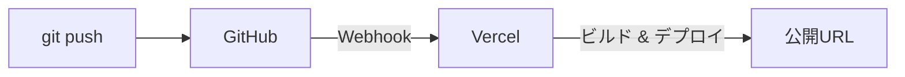
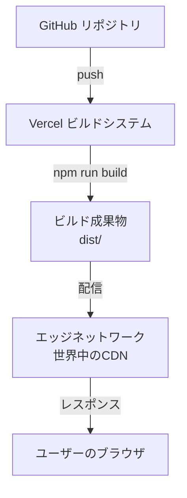

# 1-3 Vercelを選ぶ理由

## 🎯 このセクションで学ぶこと

- Vercel の特徴（GitHub連携・自動デプロイ・CDN・無料枠）を説明できる
- Vite プロジェクトとの相性を理解できる
- Hobby（無料）プランの範囲と制限を把握できる

前のセクションで、React SPA には静的ホスティングが最適だと学びました。このセクションでは、静的ホスティングの中から Vercel を選ぶ具体的な理由を掘り下げます。

---

## 導入: 「どれも似ている」からこそ、決め手を知る

セクション 1-2 の比較表を見ると、Vercel・Netlify・Cloudflare Pages はどれも似た機能を持っています。「どれでもいいなら、なぜ Vercel なのか？」という疑問は当然です。

ここでは、特に React (Vite) の SPA をデプロイする観点から、Vercel を選ぶ決め手を整理します。

### 🧠 先輩エンジニアはこう考える

> 正直、個人のポートフォリオを公開するだけなら Vercel でも Netlify でもほぼ変わりません。ただ、Vercel は React エコシステムとの統合が深く、Vite プロジェクトの自動検出やビルド設定のゼロコンフィグが特に優秀です。「迷ったら Vercel」と言えるだけの理由があります。

---

## Vercel の4つの強み

### 1. GitHub 連携による自動デプロイ

Vercel の最大の特徴は、GitHub リポジトリと連携するだけで **自動デプロイ** が実現することです。

- `main` ブランチへの push → **本番環境** に自動デプロイ
- それ以外のブランチへの push → **プレビュー環境** に自動デプロイ
- プルリクエストを作成 → プレビューURLがコメントに自動投稿

一度設定すれば、あとは `git push` するだけで最新の状態が公開されます。デプロイのためにサーバーにログインしたり、ファイルを手動でアップロードしたりする必要はありません。

🔑 **プレビューデプロイとは**: 本番環境とは別に、ブランチごとに一時的な公開URLが生成される仕組みです。コードレビューの際に「このURLで動作確認してください」と共有できます。ポートフォリオ開発でも、変更を本番に反映する前に確認できるため重宝します。

### 2. Vite プロジェクトのゼロコンフィグ

Vercel は Vite プロジェクトを自動検出し、適切なビルド設定を適用します。

| 設定項目 | 自動検出される値 |
|---|---|
| フレームワーク | Vite |
| ビルドコマンド | `vite build` |
| 出力ディレクトリ | `dist` |

つまり、Vite で作った React プロジェクトであれば、設定を一切変更せずにデプロイできます。

### 3. グローバル CDN による高速配信

Vercel は世界中にエッジサーバー（CDN）を持っています。デプロイしたファイルは自動的にこれらのサーバーに配信され、ユーザーに地理的に近いサーバーからレスポンスを返します。

これは、海外の採用担当者があなたのポートフォリオを見るときにも高速に表示されることを意味します。特別な設定は不要で、デプロイするだけで CDN が有効になります。

### 4. HTTPS の完全自動化

セクション 1-1 で学んだ通り、現在のWebでは HTTPS が必須です。Vercel では:

- デフォルトの `*.vercel.app` ドメイン → HTTPS が最初から有効
- カスタムドメインを追加 → SSL証明書が **自動で発行・更新** される（Let's Encrypt を使用）

証明書の期限切れを心配したり、手動で更新したりする必要はありません。

---

## Hobby（無料）プランの範囲

Vercel の Hobby プランは個人利用向けの無料プランです。ポートフォリオの公開には十分すぎる内容です。

| リソース | 無料枠 |
|---|---|
| プロジェクト数 | 200 |
| デプロイ回数 | 1日100回 |
| カスタムドメイン | プロジェクトあたり50個 |
| 帯域（Fast Data Transfer） | 100 GB/月 |
| HTTPS | 自動（追加料金なし） |

💡 **100 GB/月はどのくらい？**: 一般的なReact SPAのビルドサイズは数MB程度です。仮に1回のアクセスで5MBのデータを転送するとしても、月に約2万回のアクセスに耐えられます。ポートフォリオサイトとしては十分すぎる容量です。

### Hobby プランの制限

知っておくべき制限もあります。

| 制限事項 | 内容 |
|---|---|
| チームサイズ | 1人（個人利用のみ） |
| GitHub Organization のリポジトリ | Hobby プランではプロジェクト接続不可 |
| カスタム環境 | 利用不可（Pro プラン以上） |
| サーバーレス関数 | Active CPU 4 CPU-hrs/月 |

> ⚠️ **よくあるエラー**: GitHub Organization のリポジトリからデプロイしようとするとエラーになる
>
> **原因**: Hobby プランでは GitHub Organization が所有するリポジトリへのプロジェクト接続がサポートされていない（公開・非公開を問わず）
>
> **対処法**: 個人アカウントのリポジトリを使う。ポートフォリオであれば個人アカウントで管理するのが一般的

---

## Vercel のアーキテクチャ概要

Vercel がどのように動いているかを簡単に理解しておくと、トラブル時に役立ちます。

1. GitHub にコードを push すると、Vercel が Webhook 経由で検知
2. Vercel のビルドシステムが `npm run build`（Vite の場合は `vite build`）を実行
3. 生成された `dist/` フォルダの中身をエッジネットワークに配信
4. ユーザーのリクエストに対して、最寄りのエッジサーバーがレスポンスを返す

📝 **ノート**: 「ビルド」はあなたのパソコンではなく Vercel のサーバー上で実行されます。そのため、あなたのローカル環境にないツールやバージョンの違いでビルドが失敗することがあります。この点は Chapter 2 のハンズオンで詳しく扱います。

---

## ✨ まとめ

- Vercel は **GitHub連携の自動デプロイ**、**Viteのゼロコンフィグ**、**グローバルCDN**、**HTTPS自動化** の4つが強み
- Hobby（無料）プランでポートフォリオ公開に十分なリソースが使える
- プロジェクト数は200、デプロイは1日100回まで。帯域は100 GB/月
- GitHub Organization のリポジトリからはデプロイできない点に注意

---

次のセクションでは、実際に Vercel のアカウントを作成し、GitHub と連携するところまで進めます。
