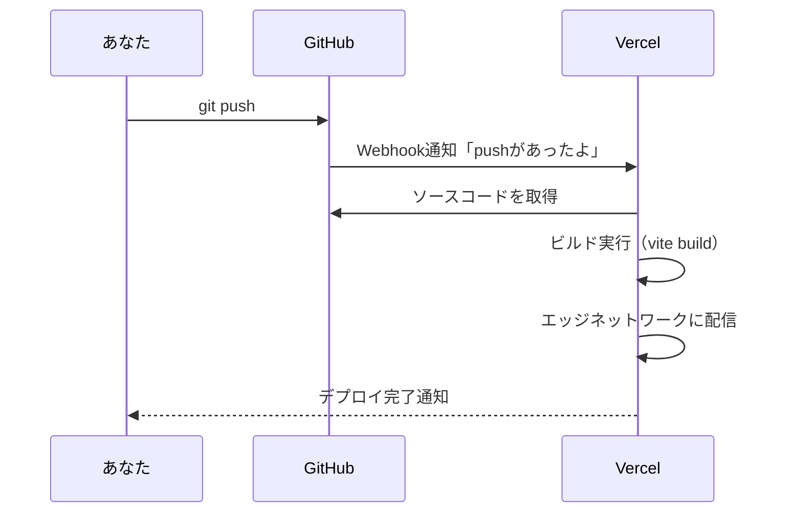
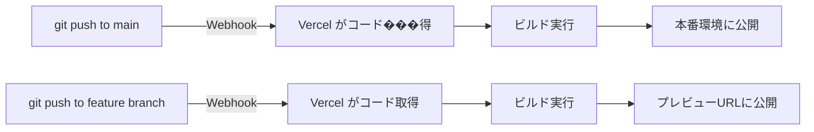

# 2-1 アカウント作成とGitHub連携

> この Chapter では、Vercel を使って実際にポートフォリオを公開します。全3セクションで構成されています。
>
> | セクション | 内容 |
> |---|---|
> | **2-1 アカウ���ト作成とGitHub連携**（現在） | Vercel の始め方と GitHub 連携の仕組み |
> | 2-2 React SPAをデプロイする | ハンズオンでデプロイを実行 |
> | 2-3 独自ドメインとHTTPS | カスタムドメインの設定 |
>
> 📖 **この Chapter の進め方**: まず Vercel アカウントを用意し、次にデプロイを実行、最後にドメインを設定します。順番に進めてください。

## 🎯 このセクションで学ぶこと

- Vercel アカウントを作成し、GitHub アカウントと連携できる
- GitHub 連携による自動デプロイの仕組み（Webhook）を理解できる
- Vercel ダッシュボードの基本的な見方がわかる

このセクションでは、Vercel の概要を学びながら、アカウント作成と GitHub 連携を進めます。

---

## 導入: デプロイの第一歩はアカウント作成

Chapter 1 でデプロイの全体像を学びました。いよいよ実践です。最初のステップは Vercel のアカウント作成ですが、その前に「GitHub 連携の仕組み」を理解しておくと、なぜこの手順が必要なのかがわかります。

### 🧠 先輩エンジニアはこう考える

> ツールを使い始めるとき、僕はまず「このツールは裏で何をしているのか」を把握するようにしています。Vercel の場合、鍵になるのは GitHub との連携の仕組みです。これを理解しておくと、デプロイが失敗したときにどこを調べればいいかわかります。

---

## GitHub 連携の仕組み: Webhook

セクション 1-3 で「`git push` するだけで自動デプロイ」と説明しました。これを実現しているのが **Webhook** という仕組みです。



**Webhook** とは、あるイベント（ここでは `git push`）が発生したときに、別のサービスに自動で通知を送る仕組みです。Vercel アカウントと GitHub アカウントを連携すると、GitHub リポジトリに Webhook が自動で設定されます。

🔑 **ポイント**: Vercel が GitHub にアクセスするためには、あなたの許可（認可）が必要です。アカウント作成時に GitHub でログインすることで、この許可を与えます。

---

## 🏃 実践: Vercel アカウントを作成する

📌 **事前確認**: GitHub アカウントを持っていることを確認してください。

### 🏃 Step 1: Vercel にアクセスしてサインアップ

ブラウザで [vercel.com](https://vercel.com) にアクセスし、「Sign Up」をクリックします。

<!-- TODO: 画像追加 - Vercel トップページの Sign Up ボタン -->

### 🏃 Step 2: GitHub でログイン

サインアップ方法の選択画面が表示されます。**「Continue with GitHub」** を選択してください。

<!-- TODO: 画像追加 - サインアップ方法の選択画面 -->

GitHub の認証画面にリダイレクトされるので、Vercel に対してリポジトリへのアクセス権限を許可します。

💡 **どの権限を許可するか**: Vercel は GitHub リポジトリの読み取り権限と、Webhook の設定権限を要求します。これにより、コードの取得と自動デプロイ通知が可能になります。

### 🏃 Step 3: プランの選択

Hobby（無料）プランを選択します。セクション 1-3 で確認した通り、ポートフォリオの公開には Hobby プランで十分です。

<!-- TODO: 画像追加 - プラン選択画面 -->

### 🏃 Step 4: ダッシュボードの確認

アカウント作成が完了すると、Vercel のダッシュボードが表示されます。

<!-- TODO: 画像追加 - Vercel ダッシュボード（初期状態） -->

---

## ダッシュボードの見方

ダッシュボードには主に以下の要素があります。

| 要素 | 説明 |
|---|---|
| **Overview** | プロジェクト一覧。デプロイしたプロジェクトがカード形式で表示される |
| **Add New...** | 新しいプロジェクトの作成ボタン |
| **Settings** | アカウント設定。GitHub連携の管理もここから |
| **Usage** | 帯域やビルド時間の使用状況 |

今はプロジェクトがないため空の状態です。次のセクションで、ここに最初のプロジェクトを追加します。

---

## GitHub 連携の確認

アカウント作成時に GitHub でログインした場合、GitHub 連携は自動的に設定されています。確認するには:

1. ダッシュボード右上のアイコン → **Settings** をクリック
2. 左メニューの **Git Integration** を確認
3. GitHub アカウントが連携されていることを確認

<!-- TODO: 画像追加 - Git Integration 設定画面 -->

⚠️ **よくあるエラー**: GitHub 連携時にリポジトリが表示されない

```
No repositories found
```

**原因**: Vercel に対するリポジトリのアクセス権限が不足している

**対処法**: GitHub の Settings > Applications > Vercel で、アクセスを許可するリポジトリを追加する。「All repositories」を選択するか、特定のリポジトリを個別に追加する

---

## 自動デプロイの流れを整理する

ここまでの設定で、以下の自動デプロイパイプラインが構築されました。



- **`main` ブランチへの push**: 本番環境（Production）にデプロイ
- **それ以外のブランチへの push**: プレビュー環境（Preview）にデプロイ

📝 **ノート**: デフォルトの本番ブランチは `main` です。`master` や他のブランチを本番ブランチにしたい場合は、プロジェクト設定で変更できます。

---

## ✨ まとめ

- Vercel は **GitHub でログイン** するだけでアカウント作成と Git 連携が完了する
- GitHub 連携は **Webhook** の仕組みで自動デプロイを実現している
- `main` ブランチへの push は本番デプロイ、その他のブランチはプレビューデプロイになる
- ダッシュボードでプロジェクトの管理や使用状況の確認ができる

---

次のセクションでは、いよいよ React SPA を Vercel にデプロイします。
