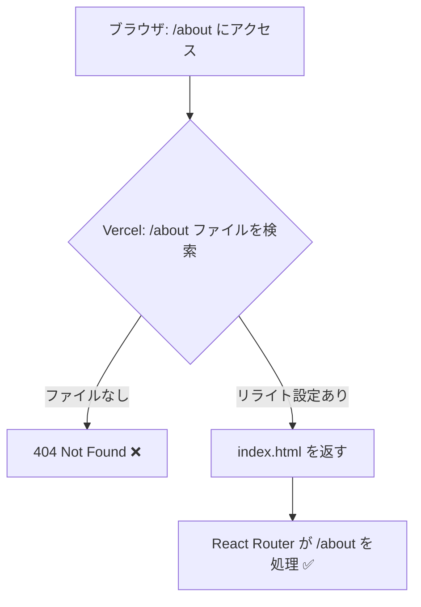

# 2-2 React SPAをデプロイする

📝 **このハンズオンで使う機能**: GitHub連携による自動デプロイ（セクション 2-1 で学習）

## 🎯 このセクションで学ぶこと

- GitHub リポジトリから React (Vite) プロジェクトを Vercel にデプロイできる
- SPA のルーティングに必要な `vercel.json` の設定を理解できる
- ビルドログの読み方とトラブルシューティングができる
- プレビューデプロイの動作を確認できる

このセクションでは、実際にあなたのポートフォリオを Vercel にデプロイします。

---

## 導入: push したら世界に公開される

ここまで準備してきた知識を使い、いよいよデプロイを実行します。セクション 1-1 で学んだ「ビルド済みファイルを用意」「ホスティングサービスに配信」「URLでアクセス」の3ステップを、Vercel が自動で処理してくれます。

### 🧠 先輩エンジニアはこう考える

> 初めてのデプロイで「本当にこれだけ？」と拍子抜けする人が多いです。でもそれでいい。本来デプロイはもっと複雑な作業ですが、Vercel がその複雑さを隠してくれています。大事なのは、うまくいかなかったときに何を確認すべきかを知っておくことです。

---

## 📌 デプロイ前の確認

デプロイする前に、以下を確認してください。

- [ ] React (Vite) プロジェクトが GitHub リポジトリに push されている
- [ ] `npm run build` がローカルでエラーなく完了する
- [ ] リポジトリが個人アカウントのリポジトリ、または公開リポジトリである（セクション 1-3 参照）

💡 **`npm run build` を事前に確認する理由**: Vercel のビルドはリモートで実行されるため、ローカルでビルドが通らないコードは Vercel でも失敗します。まずローカルで成功することを確認しましょう。

---

## 🏃 Step 1: プロジェクトをインポートする

1. Vercel ダッシュボードで **「Add New...」** → **「Project」** をクリック
2. **「Import Git Repository」** セクションに、GitHub リポジトリの一覧が表示される
3. デプロイしたいリポジトリの **「Import」** をクリック

<!-- TODO: 画像追加 - Import Git Repository 画面 -->

⚠️ **よくあるエラー**: リポジトリが一覧に表示されない

```
No repositories found. Adjust GitHub App Permissions →
```

**原因**: Vercel GitHub App にリポジトリへのアクセス権限が付与されていない

**対処法**: 「Adjust GitHub App Permissions」リンクをクリックし、対象リポジトリを追加する

---

## 🏃 Step 2: ビルド設定を確認する

インポート後、プロジェクト設定画面が表示されます。Vercel が Vite を自動検出するため、通常は **設定を変更する必要はありません**。

| 設定項目 | 自動検出される値 | 変更が必要な場合 |
|---|---|---|
| Framework Preset | Vite | 別のフレームワークが検出された場合のみ手動選択 |
| Build Command | `vite build` | カスタムビルドスクリプトがある場合 |
| Output Directory | `dist` | Vite の設定で変更している場合 |
| Install Command | `npm install` | yarn や pnpm を使っている場合 |

<!-- TODO: 画像追加 - プロジェクト設定画面（ビルド設定） -->

📝 **ノート**: 環境変数が必要な場合は、この画面の「Environment Variables」セクションで設定できます。Vite で環境変数を使う場合は `VITE_` プレフィックスが必要です（例: `VITE_API_URL`）。

---

## 🏃 Step 3: デプロイを実行する

**「Deploy」** ボタンをクリックすると、デプロイが始まります。

ビルドの進行状況がリアルタイムで表示されます。正常にデプロイされると以下のような画面が表示されます。

<!-- TODO: 画像追加 - デプロイ成功画面 -->

デプロイが完了すると、`https://プロジェクト名.vercel.app` のURLでアクセスできるようになります。

---

## 🏃 Step 4: ビルドログを確認する

デプロイの詳細画面で **「Building」** タブをクリックすると、ビルドログを確認できます。

ビルドログの主な流れ:

```bash
Cloning github.com/your-name/your-repo...
Cloning completed
Installing dependencies...
npm install
Running build command "vite build"
vite v5.x.x building for production...
✓ xx modules transformed.
dist/index.html   0.xx kB
dist/assets/index-xxxxx.js   xx.xx kB
Output directory: dist
Deploying outputs...
Build completed.
```

💡 **ログの読み方のポイント**:
- `Installing dependencies` → `npm install` が実行されている
- `Running build command` → `vite build` が実行されている
- `dist/` 以下のファイル一覧 → ビルド成果物のサイズが確認できる
- `Build completed` → ビルド成功

---

## SPA ルーティングの設定

ここで重要な設定があります。React Router などでクライアントサイドルーティングを使っている場合、**`vercel.json` を追加しないとページが 404 になる問題** が発生します。

### なぜ 404 になるのか

React SPA では、`/about` や `/projects/1` といったURLはブラウザ上の JavaScript がハンドリングしています。しかし、ユーザーが直接 `https://your-app.vercel.app/about` にアクセスした場合、Vercel は `/about` に対応するファイルを探しにいきます。そのようなファイルは存在しないため、404 が返ります。



### 解決策: vercel.json のリライト設定

プロジェクトのルートに `vercel.json` を作成し、すべてのリクエストを `index.html` に転送する設定を追加します。

`vercel.json`

```json
{
  "rewrites": [
    {
      "source": "/(.*)",
      "destination": "/index.html"
    }
  ]
}
```

この設定により、どのURLにアクセスしても `index.html` が返され、React Router がURLに応じたページを描画します。

📌 **確認**: `vercel.json` をリポジトリのルートディレクトリ（`package.json` と同じ階層）に配置し、GitHub に push してください。Vercel が自動で再デプロイします。

⚠️ **よくあるエラー**: トップページは表示されるが、他のページに直接アクセスすると 404 になる

```
404: NOT_FOUND
```

**原因**: `vercel.json` のリライト設定がない、または配置場所が間違っている

**対処法**: 上記の `vercel.json` をプロジェクトルートに配置して push する。React Router を使っていない場合（ページ遷移がない場合）は、この設定は不要

---

## 🏃 Step 5: プレビューデプロイを試す

自動デプロイの動作を確認してみましょう。

1. 新しいブランチを作成する

```bash
git checkout -b test-preview
```

2. 何か小さな変更を加える（例: タイトルの変更）
3. コミットして push する

```bash
git add .
git commit -m "test: preview deploy"
git push origin test-preview
```

4. Vercel ダッシュボードで **「Deployments」** タブを確認すると、プレビューデプロイが実行されている

<!-- TODO: 画像追加 - プレビューデプロイの一覧 -->

プレビューデプロイには2種類のURLが発行されます:

| URL の種類 | 形式 | 用途 |
|---|---|---|
| コミットURL | `プロジェクト名-ハッシュ-ユーザー名.vercel.app` | 特定のコミット時点の状態を固定で確認 |
| ブランチURL | `プロジェクト名-git-ブランチ名-ユーザー名.vercel.app` | ブランチの最新状態を常に確認 |

5. 確認が終わったら `main` にマージする

```bash
git checkout main
git merge test-preview
git push origin main
```

`main` への push で本番環境が自動更新されます。

---

## ビルド失敗時のトラブルシューティング

デプロイ（ビルド）が失敗した場合、まずビルドログを確認しましょう。よくある原因と対処法をまとめます。

⚠️ **よくあるエラー**: 依存パッケージのインストール失敗

```
npm ERR! code ERESOLVE
npm ERR! ERESOLVE unable to resolve dependency tree
```

**原因**: パッケージ間のバージョン競合

**対処法**: ローカルで `npm install` が成功するか確認する。`package-lock.json` がリポジトリに含まれているか確認する

⚠️ **よくあるエラー**: TypeScript の型エラー

```
error TS2345: Argument of type 'string' is not assignable to parameter of type 'number'.
```

**原因**: ローカルでは警告だったものが、Vercel のビルドではエラーとして扱われる場合がある

**対処法**: ローカルで `npm run build` を実行し、同じエラーが出るか確認する。出る場合はコードを修正する

⚠️ **よくあるエラー**: 環境変数が未設定

```
Uncaught ReferenceError: process is not defined
```

**原因**: ローカルの `.env` ファイルに定義した環境変数が Vercel に設定されていない

**対処法**: Vercel ダッシュボードの Settings > Environment Variables で必要な環境変数を追加する。Vite の場合、クライアント側で使う変数は `VITE_` プレフィックスが必要

---

## ✅ 完成チェックリスト

- [ ] Vercel にプロジェクトがインポートされている
- [ ] ビルドが成功し、`*.vercel.app` のURLでアクセスできる
- [ ] SPA ルーティングを使っている場合、`vercel.json` のリライト設定が反映されている
- [ ] プレビューデプロイが動作することを確認した

---

## ✨ まとめ

- Vercel へのデプロイは「リポジトリをインポート → Deploy をクリック」で完了する
- Vite プロジェクトはビルド設定が自動検出されるため、設定変更は通常不要
- React Router を使う場合は `vercel.json` のリライト設定が必要
- ビルド失敗時はログを確認し、ローカルで `npm run build` を再現するのが基本
- `main` への push で本番デプロイ、他のブランチでプレビューデプロイが自動実行される

---

次のセクションでは、独自ドメインを設定してポートフォリオの見栄えを仕上げます。
