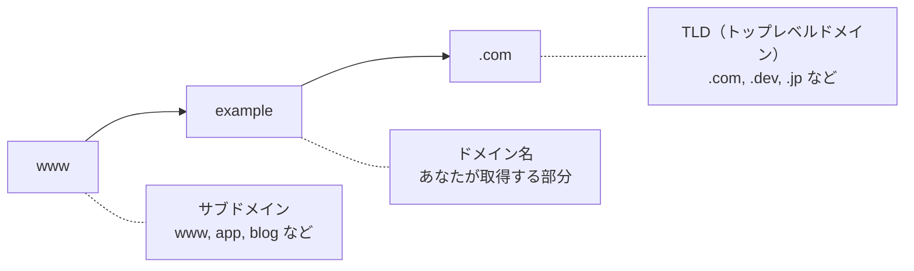
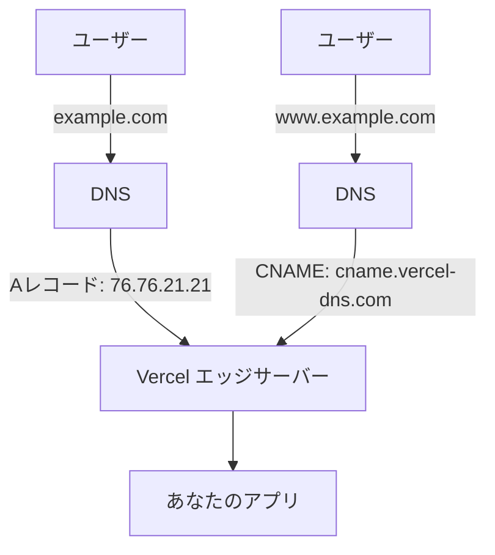

# 2-3 独自ドメインとHTTPS

## 🎯 このセクションで学ぶこと

- 独自ドメインを取得し、Vercel プロジェクトに設定できる
- DNS レコード（Aレコード・CNAMEレコード）の役割を理解できる
- HTTPS が自動で有効になる仕組みを理解できる

前のセクションで React SPA を Vercel にデプロイし、`*.vercel.app` のURLで公開できました。このセクションでは、独自ドメインを設定してポートフォリオの仕上げを行います。

---

## 導入: なぜ独自ドメインが必要なのか

`your-project.vercel.app` でもアプリは公開されていますが、ポートフォリオとして就職活動に使うなら独自ドメインを検討する価値があります。

| 観点 | `*.vercel.app` | 独自ドメイン |
|---|---|---|
| 信頼感 | サービスの無料URLに見える | 自分のブランドとして認識される |
| 覚えやすさ | ランダムな文字列が混じることがある | `your-name.dev` のように簡潔 |
| 可搬性 | Vercel を離れるとURLが使えなくなる | サービスを変えてもURLを維持できる |

### 🧠 先輩エンジニアはこう考える

> 独自ドメインは「あると良い」くらいの位置づけです。`*.vercel.app` でも十分にポートフォリオとして機能します。ただ、年間1,000〜2,000円程度の投資で `.dev` や `.com` のドメインが取れるので、余裕があれば取得しておくと良いでしょう。ドメインの仕組みを理解すること自体が学びになります。

---

## ドメインの仕組みを理解する

セクション 1-1 で DNS の概要を学びました。ここでは、独自ドメインを設定するために必要な **DNS レコード** をもう少し詳しく見ていきます。

### ドメインの構造

`www.example.com` を例に、ドメイン名の構造を分解します。



- **`example.com`**（サブドメインなし）を **Apexドメイン** または **ルートドメイン** と呼びます
- **`www.example.com`** や **`app.example.com`** は **サブドメイン** です

### DNS レコードの種類

DNS レコードは「このドメインにアクセスしたら、どのサーバーに転送するか」を定義するルールです。Vercel で使うのは主に2種類です。

| レコード | 用途 | 設定例 |
|---|---|---|
| **A レコード** | Apexドメイン（`example.com`）をIPアドレスに紐付ける | `example.com` → `76.76.21.21` |
| **CNAME レコード** | サブドメイン（`www.example.com`）を別のドメインに紐付ける | `www.example.com` → `cname.vercel-dns.com` |



📝 **ノート**: `76.76.21.21` は Vercel のエッジサーバーのIPアドレスです。A レコードにこのIPを設定することで、ドメインへのアクセスが Vercel に転送されます。

---

## ドメインの取得

ドメインは **ドメインレジストラ** と呼ばれるサービスから購入します。代表的なレジストラ:

| レジストラ | 特徴 |
|---|---|
| [お名前.com](https://www.onamae.com/) | 国内最大手。日本語で管理しやすい |
| [Squarespace Domains](https://domains.squarespace.com/) | シンプルな管理画面。旧 Google Domains |
| [Namecheap](https://www.namecheap.com/) | 海外大手。安価なドメインが多い |
| [Vercel Domains](https://vercel.com/domains) | Vercel から直接購入可能。DNS設定が自動 |

💡 **おすすめのTLD（ドメインの末尾）**:
- `.dev` : エンジニアのポートフォリオに人気。年間約1,500円〜
- `.com` : 最も一般的。年間約1,000円〜
- `.jp` : 日本語サイト向け。年間約3,000円〜

📝 **ノート**: Vercel から直接ドメインを購入すると、DNS設定が自動化されるため最も手間が少なくなります。ただし、他のレジストラと比べて価格が高い場合があります。

---

## 🏃 実践: Vercel にカスタムドメインを設定する

ドメインを取得したら、Vercel に設定します。ここでは外部レジストラで取得したドメインを使う手順を説明します。

### 🏃 Step 1: Vercel にドメインを追加

1. Vercel ダッシュボードで対象プロジェクトを開く
2. **Settings** → **Domains** を選択
3. 取得したドメイン（例: `your-name.dev`）を入力して **Add** をクリック

<!-- TODO: 画像追加 - Domains 設定画面 -->

Vercel が DNS の設定方法を表示します。Apexドメインの場合は A レコード、サブドメインの場合は CNAME レコードの設定値が表示されます。

### 🏃 Step 2: DNS レコードを設定する

ドメインレジストラの管理画面で DNS レコードを設定します。

**Apexドメイン（`your-name.dev`）の場合:**

| 種類 | ホスト名 | 値 |
|---|---|---|
| A | `@`（または空欄） | `76.76.21.21` |

**サブドメイン（`www.your-name.dev`）の場合:**

| 種類 | ホスト名 | 値 |
|---|---|---|
| CNAME | `www` | `cname.vercel-dns.com` |

💡 **おすすめ**: Apexドメインとサブドメイン（`www`）の両方を設定し、一方をもう一方にリダイレクトするのが一般的です。Vercel のドメイン設定画面で推奨される設定に従ってください。

### 🏃 Step 3: DNS 反映を待つ

DNS レコードの変更がインターネット全体に反映されるまで、**数分〜最大48時間** かかることがあります（DNS のプロパゲーション）。通常は数分〜数時間で反映されます。

Vercel のドメイン設定画面でステータスを確認できます:

| ステータス | 意味 |
|---|---|
| ⏳ Pending Verification | DNS の反映待ち |
| ✅ Valid Configuration | DNS 設定が正しく反映された |
| ❌ Invalid Configuration | DNS 設定に問題がある |

<!-- TODO: 画像追加 - ドメインのステータス表示 -->

### 🏃 Step 4: アクセスを確認する

DNS が反映されたら、ブラウザで `https://your-name.dev` にアクセスして、アプリが表示されることを確認します。

---

## HTTPS の自動設定

Vercel では、カスタムドメインを追加すると **HTTPS が自動で有効** になります。

### 仕組み

1. DNS 設定が反映され、ドメインが Vercel を向いていることが確認される
2. Vercel が **Let's Encrypt** から SSL 証明書を自動取得する
3. 証明書が適用され、`https://` でアクセス可能になる
4. 証明書の期限が近づくと、自動で更新される

あなたが行う作業は **何もありません。** DNS を正しく設定するだけで、HTTPS は自動的に有効になります。

🔑 **ポイント**: セクション 1-1 で学んだ「HTTPS は現在のWebでは必須」という知識を思い出してください。Vercel が証明書の取得と更新を完全に自動化してくれるため、HTTPS の運用コストはゼロです。

---

## トラブルシューティング

⚠️ **よくあるエラー**: ドメインを追加したが「Invalid Configuration」と表示される

```
Invalid Configuration: DNS records are not configured correctly.
```

**原因**: DNS レコードの設定が間違っている、または反映されていない

**対処法**:
1. レジストラの管理画面で、A レコードまたは CNAME レコードが正しく設定されているか確認する
2. 設定が正しい場合は、DNS の反映を待つ（数分〜数時間）
3. `dig your-name.dev` コマンド（macOS / Linux）で DNS の現在の状態を確認できる

```bash
dig your-name.dev A +short
# 期待される出力: 76.76.21.21
```

⚠️ **よくあるエラー**: HTTPS が有効にならない（鍵マークが表示されない）

**原因**: SSL 証明書の発行に時間がかかっている

**対処法**: DNS 設定が正しければ、通常は数分以内に証明書が発行される。30分以上経っても有効にならない場合は、Vercel ダッシュボードの Domains で一度ドメインを削除し、再追加する

---

## ✅ 完成チェックリスト

- [ ] ドメインを取得した（またはVercelのデフォルトURLで十分と判断した）
- [ ] Vercel にカスタムドメインを追加した
- [ ] DNS レコード（A レコードまたは CNAME）を設定した
- [ ] ドメインのステータスが「Valid Configuration」になっている
- [ ] `https://your-domain` でアプリにアクセスできる
- [ ] ブラウザに鍵マーク（HTTPS）が表示されている

---

## ✨ まとめ

- 独自ドメインはポートフォリオの信頼感とブランディングに有効。ただし `*.vercel.app` でも機能は同じ
- DNS レコードは **A レコード** （Apexドメイン用）と **CNAME レコード** （サブドメイン用）の2種類を理解すればよい
- Vercel のApexドメイン用 A レコードの向き先は `76.76.21.21`
- HTTPS（SSL証明書）は Vercel が **Let's Encrypt** で完全自動化。設定不要
- DNS の反映には数分〜数時間かかる。焦らず待つ

---

これで、あなたのポートフォリオがインターネット上に公開されました。この教材で学んだ内容を振り返りましょう:

1. **デプロイの仕組み** （Chapter 1）: DNS・HTTPS・ホスティングの基礎を理解した
2. **Vercel でのデプロイ実践** （Chapter 2）: アカウント作成からドメイン設定まで一気通貫で実行した

ポートフォリオを公開することで、あなたの技術力を世界中の人に見てもらえるようになりました。コードを更新したら `git push` するだけで自動的にデプロイされます。これからは開発に集中してください。
