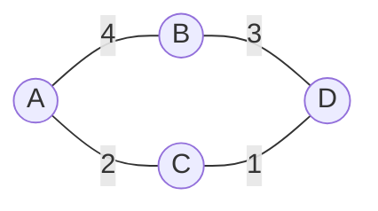

> 前提知識: このセクションは 1-1-4 の内容（集合の基本、要素の関係を扱う考え方）を前提とします。

## このセクションで学ぶこと

- グラフ理論の基本用語（頂点・辺・有向グラフ・無向グラフ・重み付きグラフ）
- グラフをコンピュータで扱うための 2 つの表現方法（隣接行列・隣接リスト）
- 最短経路問題の意味と、ダイクストラ法の動作の概要
- グラフ理論が Web 開発のどんな場面で使われているか

本セクションは、後続の 2-1-4「グラフとハッシュテーブル」やデータベースの推薦システム、ネットワーク設計、AI のレコメンド機能まで広く関わる「ものごとのつながりを数学的に扱う」基礎となります。

---

## Google マップは、なぜ瞬時に最短経路を見つけられるのか

Google マップで目的地を検索すると、数百万もの道路網の中から最短経路が数秒以内に表示されます。Twitter のタイムラインに「あなたへのおすすめユーザ」が表示されるのも、SNS 上のフォロー関係から「友達の友達」を辿る処理が裏側で動いているからです。

これらの処理を支えているのが **グラフ理論** （graph theory）です。グラフ理論は「点と点のつながり」を数学的に扱う分野で、Web 開発の現場では次のような場面で使われています。

- Twitter のフォロー関係（誰が誰をフォローしているか）
- Facebook の友達関係（双方向の繋がり）
- Google マップの経路探索（交差点と道路、距離つき）
- Web ページ間のリンク構造（Google の PageRank アルゴリズムの土台）
- 依存関係の管理（npm パッケージや Composer の依存ツリー）

本セクションでは、これらに共通する「グラフ」という数学構造の基本と、コンピュータでの表現方法、そして最も有名な問題である最短経路問題の解き方の概要を見ていきます。

---

## グラフの基本用語：頂点と辺

グラフ理論では、ものごとを **頂点** （vertex、ノード）と、頂点同士のつながりを **辺** （edge、エッジ）で表します。たとえば「A さん、B さん、C さん」を頂点にして、「A は B と友達」「B は C と友達」というつながりを辺で表現すると、次のような図になります。

```text
A ── B ── C
```

これがグラフの最も単純な形です。グラフには 2 つの大きな種類があります。

**無向グラフ** （undirected graph）: 辺に向きがない。「A と B は友達」のように対称な関係を表します。Facebook の友達関係はこちらです。

**有向グラフ** （directed graph）: 辺に向きがある。「A は B をフォローする（が B は A をフォローしていない）」のような非対称な関係を表します。Twitter のフォロー関係はこちらです。

```text
有向グラフ: A → B   （A は B をフォロー、逆は不明）
無向グラフ: A ── B   （A と B は友達）
```

さらに、辺に **重み** （weight）を持たせたグラフを **重み付きグラフ** （weighted graph）と呼びます。Google マップの場合、辺の重みは「2 つの交差点間の距離（または所要時間）」になります。

| 種類 | 辺の特徴 | 代表的な例 |
|---|---|---|
| 無向グラフ | 向きなし | Facebook の友達、線路網 |
| 有向グラフ | 向きあり | Twitter のフォロー、Web ページのリンク |
| 重み付きグラフ | 辺に数値あり | Google マップの距離、ネットワークの帯域 |

---

## 次数と経路：グラフの基本指標

頂点に接続している辺の数を **次数** （degree）と呼びます。有向グラフでは、その頂点に入ってくる辺の数を **入次数** （in-degree）、出ていく辺の数を **出次数** （out-degree）と区別します。

Twitter で「フォロワー数」が入次数、「フォロー数」が出次数に相当します。

頂点から頂点へ辺を辿って移動する道筋を **経路** （path）と呼びます。同じ頂点を 2 度通らない経路を **単純経路** 、最初と最後の頂点が同じになる経路を **閉路** （cycle、サイクル）と呼びます。閉路を含まないグラフは **木** （tree）と呼ばれ、Composer の依存関係や HTML の DOM 構造はこの木構造に該当します。

---

## グラフをコンピュータで扱う：隣接行列と隣接リスト

グラフを実際にコンピュータで扱うには、頂点と辺をデータ構造として表現する必要があります。代表的な方法が 2 つあります。

**隣接行列** （adjacency matrix）: 頂点数 `n` に対して `n × n` の 2 次元配列を作り、`行列[i][j] = 1`（または重み）で「頂点 `i` から `j` への辺がある」と表現します。

たとえば 4 頂点の無向グラフで `A-B`、`B-C`、`C-D`、`A-D` の辺があるとき、隣接行列は次のようになります。

```text
     A  B  C  D
  A  0  1  0  1
  B  1  0  1  0
  C  0  1  0  1
  D  1  0  1  0
```

無向グラフの隣接行列は対称行列（`行列[i][j] = 行列[j][i]`）になるのが特徴です。重み付きグラフでは `1` の代わりに重みの値を入れます。

**隣接リスト** （adjacency list）: 各頂点に対して「その頂点と接続している頂点のリスト」を持たせる方式です。同じグラフを隣接リストで表すと次のようになります。

```text
A: [B, D]
B: [A, C]
C: [B, D]
D: [A, C]
```

PHP の連想配列で書くなら次のようなイメージです。

```php
// 例: 4 頂点のグラフの隣接リスト表現
$graph = [
    'A' => ['B', 'D'],
    'B' => ['A', 'C'],
    'C' => ['B', 'D'],
    'D' => ['A', 'C'],
];
```

2 つの表現方法には、それぞれ得意・不得意があります。

| 観点 | 隣接行列 | 隣接リスト |
|---|---|---|
| 使用メモリ | n² に比例（疎なグラフでは無駄が多い） | 辺の数に比例（疎なグラフで効率的） |
| 辺の有無の確認 | O(1)（行列を直接参照） | O(次数)（リストを走査） |
| 全隣接頂点の列挙 | O(n)（行を 1 回走査） | O(次数) |
| 適した場面 | 密なグラフ（辺がほぼ全頂点ペア間に存在） | 疎なグラフ（辺の数が頂点数に近い） |

Twitter や Facebook のような SNS では、ユーザ数が数億に対して 1 人あたりのフォロー / 友達数は数百〜数千程度の疎なグラフなので、隣接リストが圧倒的に有利です。

> よくある誤解: 隣接行列のほうが「単純で速そう」に見えますが、n が大きいときは n² のメモリ消費が致命的になります。100 万頂点なら 10¹² 個のセル（1 TB クラス）が必要で、現実的には扱えません。

---

## 最短経路問題とダイクストラ法

グラフ理論で最も有名な問題が **最短経路問題** （shortest path problem）です。「ある頂点から別の頂点まで、辺の重みの合計が最小になる経路はどれか」を求める問題です。

カーナビや Google マップの経路検索は、まさにこの最短経路問題を解いています。最短経路を求めるアルゴリズムはいくつかありますが、試験頻出は **ダイクストラ法** （Dijkstra's algorithm）です。

ダイクストラ法は、1959 年にオランダの計算機科学者 Edsger W. Dijkstra が考案したアルゴリズムで、**重み付きグラフ** で **負の重みがない** 場合に、ある始点から全頂点への最短経路を効率的に求めます。

**ダイクストラ法の基本動作**:

1. 始点の距離を `0`、他の全頂点の距離を `∞`（無限大）に初期化する
2. まだ確定していない頂点の中で、距離が最小のものを選び確定する
3. 確定した頂点から行ける隣接頂点について、現在の距離より「確定した頂点までの距離 + 辺の重み」のほうが小さければ更新する
4. すべての頂点が確定するまで 2〜3 を繰り返す

たとえば次のような重み付きグラフを考えます。

```text
       4
   A ──── B
   │      │
  2│      │3
   │      │
   C ──── D
       1
```

`A` から始めると、最初に `C`（距離 2）が確定し、次に `D`（距離 2 + 1 = 3）が確定し、最後に `B` の距離は `min(4, 3 + 3) = 4` と確定します。経路 `A → C → D → B` ではなく `A → B` の直接ルート（距離 4）が最短だとわかります。



> 補足: 負の重みがあるグラフではダイクストラ法は正しく動きません。負の辺を含む最短経路問題には **ベルマン・フォード法** などの別アルゴリズムを使います。試験では「ダイクストラ法は負の重みに使えない」という点が問われることがあります。

---

## 二部グラフと PageRank：応用編

グラフ理論には他にも多くの応用があります。

**二部グラフ** （bipartite graph）: 頂点を 2 つのグループに分け、辺はグループ間にしか存在しないグラフ。「ユーザと商品」「学生と科目」のように、2 種類のものの関係を表すのに適しています。レコメンドシステムの土台になります。

**PageRank**: Google の検索順位を決める初期のアルゴリズム。Web ページを頂点、リンクを辺とする巨大な有向グラフで、「多くの重要なページからリンクされているページは重要」という再帰的なスコアを計算します。グラフ理論と線形代数（次セクションで扱う行列）を組み合わせた応用例です。

これらは試験範囲では「概要を知っていれば良い」レベルですが、グラフ理論が現代の Web サービスのあちこちで使われていることを示す代表例です。

---

## 要点

- グラフは **頂点** （ノード）と **辺** （エッジ）から成る。辺に向きがあるかどうかで **有向グラフ** と **無向グラフ** に分類
- 辺に数値を持たせたものが **重み付きグラフ** 。Google マップの距離、ネットワーク帯域などを表現
- 頂点に接続する辺の数を **次数** と呼ぶ。有向グラフでは **入次数** と **出次数** に分かれる
- グラフの表現方法は **隣接行列** （`n × n` の 2 次元配列、密なグラフ向き）と **隣接リスト** （疎なグラフ向き）の 2 種類
- **最短経路問題** は始点から終点までの辺の重みの合計を最小化する問題
- **ダイクストラ法** は負の重みがない重み付きグラフで最短経路を求める代表的アルゴリズム

---

次のセクションでは、グラフの表現にも使われた **行列** を本格的に扱います。行列の加減・積算の計算手順、逆行列の概念、そして浮動小数点演算で発生する **情報落ち** と **桁落ち** など数値計算の誤差について理解を深めます。
