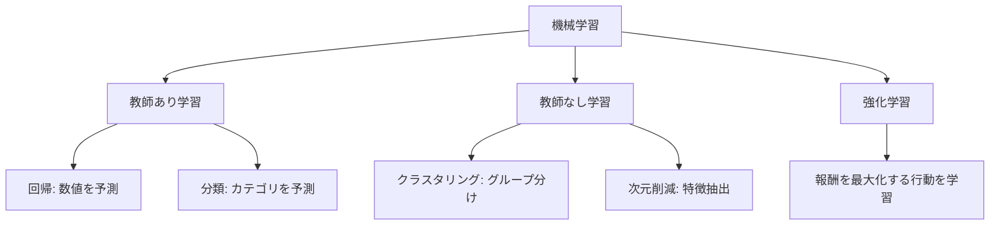
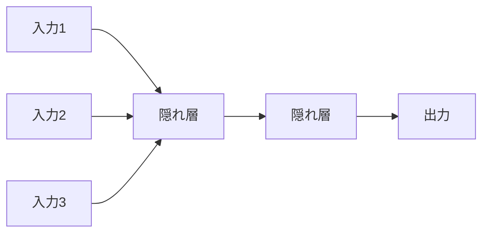

## このセクションで学ぶこと

- 機械学習が「ルールを書く」のではなく「データから法則を学ぶ」アプローチである理由
- 機械学習の 3 分類: 教師あり学習・教師なし学習・強化学習の違いと用途
- ニューラルネットワークの基本構造とディープラーニング、過学習とその対策
- 生成 AI と LLM の基礎: プロンプト、トークン、ハルシネーション

本セクションでは、近年の試験で出題比重が上がっている AI 分野について、用語の意味と相互関係を整理します。

---

## ChatGPT、推薦システム、画像認識は、なぜ「学習」と呼ばれるのか

普段あなたが書いてきたコードは、ほとんどが「ルールベース」です。`if (price > 1000) { 送料無料 }` のように、条件と処理を人間が明示的に書く。これは長い間プログラミングの基本でした。

しかし、メールが「迷惑メールかどうか」を判定するルールを `if` 文だけで書くことを想像してください。「Viagra という単語が含まれていれば迷惑」「英語のメールはすべて迷惑」、こんなルールでは健全なメールも迷惑判定してしまいます。判定ルールが膨大になり、新しいスパム手口が出るたびにルールを書き直す。これでは追いつきません。

そこで生まれたのが **機械学習** （machine learning）のアプローチです。人間がルールを書く代わりに、大量のデータ（「これは迷惑」「これは健全」とラベル付けされたメール）をモデルに与え、モデル自身に判定ルールを発見させる。Amazon の「あなたへのおすすめ」、Google フォトの顔認識、ChatGPT の自然な応答、これらはすべて機械学習の応用です。本セクションでは、その基本概念を整理します。

---

## 機械学習の 3 分類

機械学習は、学習に使うデータの種類によって 3 つに分類されます。試験では「この用途はどの学習か」を問う問題が頻出です。

### 教師あり学習（supervised learning）

入力データと「正解ラベル」のペアを大量に与え、入力から正解を予測するモデルを作る方式です。

| 例 | 入力 | 正解ラベル |
|---|---|---|
| メールのスパム判定 | メール本文 | スパム / 健全 |
| 住宅価格の予測 | 面積、駅距離、築年数 | 価格（円） |
| 画像認識 | 画像のピクセル値 | 「犬」「猫」「車」 |

教師あり学習はさらに 2 つに分かれます。**回帰** （regression）は連続的な数値を予測（住宅価格、明日の気温）、**分類** （classification）は離散的なカテゴリを予測（スパム判定、画像のラベル）するものです。

### 教師なし学習（unsupervised learning）

正解ラベルなしで、データそのものの構造や特徴をモデルに発見させる方式です。

| 例 | 用途 |
|---|---|
| 顧客のクラスタリング | 購買履歴から似た顧客をグループ化（マーケティング） |
| 異常検知 | 通常パターンから外れたログを検出（サイバー攻撃検知） |
| 次元削減 | 多次元データの特徴を圧縮（可視化、前処理） |

EC サイトで「あなたと似た購買履歴のユーザーが買っているもの」を推薦する協調フィルタリングの一部に、教師なし学習が使われています。

### 強化学習（reinforcement learning）

「行動 → 結果に対する報酬」のサイクルを繰り返し、報酬を最大化する行動の方針を学ぶ方式です。正解ラベルは与えず、自分の行動が良かったか悪かったかを試行錯誤しながら学習します。

| 例 | 行動 | 報酬 |
|---|---|---|
| AlphaGo | 囲碁の打ち手 | 勝敗 |
| 自動運転 | アクセル・ブレーキ・ハンドル | 安全な走行、目的地到達 |
| ロボット制御 | 関節の角度変更 | 物をつかめたか |

> 補足: 試験ではこの 3 分類の判別問題が頻出です。「ラベル付きデータがあるか / ないか」「報酬という概念があるか」で見分けると確実です。

---

## ニューラルネットワークとディープラーニング

機械学習のモデルにはさまざまな種類（決定木、サポートベクターマシン、線形回帰など）がありますが、近年の AI ブームを牽引しているのが **ニューラルネットワーク** （neural network、神経網）です。人間の脳の神経細胞（ニューロン）を模倣した数理モデルで、入力に重みを掛けて足し合わせ、活性化関数を通して出力する単位を多層に重ねた構造を持ちます。

層の数が 3 層程度の小さなものを「ニューラルネットワーク」、隠れ層を多数（数十〜数千）重ねた大規模なものを **ディープラーニング** （deep learning、深層学習）と呼びます。ディープラーニングは画像認識、音声認識、自然言語処理で従来手法を圧倒する精度を出し、現在の AI 技術の中心になっています。

代表的なネットワーク構造として、画像処理に強い **CNN** （Convolutional Neural Network、畳み込みニューラルネット）、時系列データに強い **RNN** （Recurrent Neural Network、回帰型ニューラルネット）、そして 2017 年に登場し現在の LLM の基礎となっている **Transformer** があります。試験では用語の名前と用途の対応を覚えておきます。

### 過学習という落とし穴

機械学習を実用するうえで最大の敵が **過学習** （overfitting、過剰適合）です。学習データには高精度で答えられるのに、未知のデータには全然対応できなくなる現象です。

> 例: 試験勉強で過去問の答えだけを丸暗記した状態に近いです。過去問の問題文がそのまま出れば満点ですが、少し言い回しを変えられると一気に得点できなくなります。

過学習を防ぐ代表的な手法には次があります。

| 手法 | 内容 |
|---|---|
| データ分割（訓練 / 検証 / テスト） | 学習に使わないデータで汎化性能を測定する |
| 正則化（L1, L2） | モデルの複雑さに罰則を加える |
| ドロップアウト | 学習中にランダムでニューロンを無効化する |
| データ拡張 | 画像の回転・反転などで学習データを水増しする |

---

## 生成 AI と LLM

2022 年以降に急速に普及した **生成 AI** （generative AI）は、テキスト・画像・音声・動画などの新しいコンテンツを生成するモデルです。代表的なのが ChatGPT のような **LLM** （Large Language Model、大規模言語モデル）で、Transformer 構造を基に、インターネット上の膨大なテキストを学習しています。

### LLM の基本概念

| 用語 | 意味 |
|---|---|
| プロンプト（prompt） | LLM への入力指示文 |
| トークン（token） | LLM が処理する文字の最小単位（日本語は 1 文字 = 1〜3 トークン程度） |
| コンテキストウィンドウ | LLM が一度に扱えるトークン数の上限 |
| ハルシネーション（hallucination） | LLM が事実と異なる内容をもっともらしく生成する現象 |
| ファインチューニング | 既存の LLM を特定タスク用に追加学習する |
| RAG（検索拡張生成） | 外部の知識源を検索し、結果を文脈として LLM に渡す手法 |

### ハルシネーションの注意

ChatGPT に質問すると、もっともらしい間違いを自信満々で返してくることがあります。これが **ハルシネーション** （幻覚）です。LLM は「最も確率の高い次のトークン」を予測するだけで、出力の真偽を保証する仕組みは持っていません。

> よくある誤解: LLM は「知っていることを答える」のではなく、「学習したパターンから最もありそうな続きを生成する」だけです。だから、存在しない論文を引用したり、誤った API 仕様を堂々と説明したりします。実装の現場でも、LLM の出力は必ず一次情報（公式ドキュメント・実機検証）で裏取りすることが鉄則になっています。

### AI 利用の倫理と注意点

試験では AI 活用に伴うリスクや配慮事項も問われます。

- **個人情報・機密情報の入力リスク**: プロンプトに入力した内容が学習データとして使われる可能性がある
- **著作権**: 学習データの著作権、生成物の著作権の扱いが各国で議論中
- **バイアス**: 学習データに含まれる偏見をモデルが継承してしまう
- **説明可能性**: ディープラーニングは内部の判断根拠を人間に説明しにくい（ブラックボックス問題）

これらは Web サービスに AI 機能を組み込む際の設計上の論点で、実務でも頻出するため試験対策と並行して把握しておく価値があります。

<!-- TODO: 画像追加 - 機械学習 3 分類の概念図とニューラルネットワーク模式図 -->

---

## 要点

- **機械学習** は、ルールを書く代わりに「データから法則を学ぶ」アプローチ
- **教師あり学習** : 正解ラベル付きデータで学習。回帰（数値予測）と分類（カテゴリ予測）に分かれる
- **教師なし学習** : ラベルなしでデータの構造を発見。クラスタリング・異常検知・次元削減
- **強化学習** : 行動と報酬の試行錯誤で学習。AlphaGo、自動運転、ロボット制御
- **ニューラルネットワーク** は脳のニューロンを模倣した数理モデル。多層化したものが **ディープラーニング**
- 代表的な構造: **CNN** （画像）、**RNN** （時系列）、**Transformer** （LLM の基礎）
- **過学習** は学習データだけに最適化されて未知データで精度が落ちる現象。データ分割・正則化・ドロップアウトなどで防ぐ
- **生成 AI** （特に **LLM** ）はプロンプトを受けて文章を生成。**ハルシネーション** （事実と異なる出力）に注意

---

次のセクションでは、AI とは別の角度から「言語そのものを形式的に記述する」理論として、有限オートマトン・正規表現・BNF 記法を学びます。正規表現で書いた `^[a-z0-9]+$` がどんな状態遷移で文字列を判定しているのか、JSON のスキーマやコンパイラが言語仕様をどう厳密に定義しているのかを理解します。
