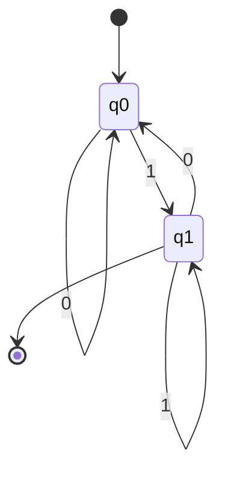

## このセクションで学ぶこと

- 有限オートマトンの状態遷移モデルが「文字列の受理 / 拒否」を判定する仕組み
- 正規表現がオートマトンと等価で、ある種の文字列パターンを記述する力を持つこと
- BNF 記法でプログラミング言語の文法を厳密に定義できる理由
- 形式言語の階層（チョムスキー階層）の概要

本セクションは Chapter 1-3 の最終セクションであり、Part 1 全体を締めくくる位置にあります。

---

## あなたが書いた `^[a-z0-9]+$` は、内部で何をしているのか

ユーザー入力のバリデーションで、こんな正規表現を一度は書いたはずです。

```javascript
// 例: ユーザー名のバリデーション
const isValid = /^[a-z0-9]+$/.test(input);
```

「英小文字と数字だけで、1 文字以上」というルールを 1 行で書けてしまう。便利すぎて疑問に思わず使ってきたかもしれませんが、この `[a-z0-9]+$` は内部でどう動いているのでしょうか。文字を 1 文字ずつ読んで、ルールに合うかをどう判定しているのでしょうか。

答えは「状態を持った機械」が文字列を 1 文字ずつ読み、状態を遷移させ、最後に「受理状態」にいるかどうかでマッチを判定している、というものです。この機械が **有限オートマトン** （finite automaton）で、正規表現と一対一に対応しています。

さらに、JSON のスキーマ定義、HTML のパーサ、コンパイラのエラーメッセージ、API のレスポンスバリデーション、これらはすべて「形式的に定義された言語」を処理する仕組みです。本セクションでは、形式言語と機械処理の根本にある理論を見ていきます。

---

## 有限オートマトン

**有限オートマトン** （FA、finite automaton）は、有限個の状態を持ち、入力文字列を 1 文字ずつ読みながら状態を遷移させていく抽象的な機械です。最後に **受理状態** にいれば「その文字列を受理する」、いなければ「受理しない」と判定します。

有限オートマトンは次の 5 要素で定義されます。

| 要素 | 意味 |
|---|---|
| 状態の集合 Q | 取り得る状態の一覧 |
| 入力アルファベット Σ | 読み取れる文字の種類 |
| 遷移関数 δ | 現在の状態と入力文字から次の状態を決める |
| 初期状態 q₀ | 開始時の状態 |
| 受理状態の集合 F | 受理を表す状態の集合 |

### 例: 「0 と 1 だけからなり、1 で終わる文字列」を判定する有限オートマトン



状態 q₀ と q₁ があり、初期状態は q₀、受理状態は q₁ です。

- 入力 `101` を処理: q₀ → q₁ → q₀ → q₁。最後は q₁ なので **受理**
- 入力 `110` を処理: q₀ → q₁ → q₁ → q₀。最後は q₀ なので **拒否**
- 入力 `1` を処理: q₀ → q₁。最後は q₁ なので **受理**

有限オートマトンには 2 種類あります。**決定性有限オートマトン** （DFA）は、現在の状態と入力文字から次の状態が一意に決まるもの。**非決定性有限オートマトン** （NFA）は、次の状態が複数あり得るものです。理論上は DFA と NFA は等価（変換可能）で、表現できる言語の範囲は同じです。

---

## 正規表現と有限オートマトンの関係

ここで重要な定理があります。**正規表現で表せるパターンと、有限オートマトンで受理できる言語は等価です**。つまり、どんな正規表現も対応する有限オートマトンに変換でき、逆もまた然り。

正規表現の基本記号を整理します。

| 記号 | 意味 | 例 |
|---|---|---|
| `a` | 文字 a そのもの | `cat` は c, a, t の連続 |
| `.` | 任意の 1 文字 | `c.t` は cat, cot, c#t などにマッチ |
| `*` | 直前の 0 回以上の繰り返し | `ab*` は a, ab, abb, abbb… |
| `+` | 直前の 1 回以上の繰り返し | `ab+` は ab, abb, abbb… |
| `?` | 直前の 0 回または 1 回 | `colou?r` は color, colour |
| `[abc]` | a, b, c のいずれか 1 文字 | `[aeiou]` は母音 |
| `[a-z]` | 範囲指定 | `[0-9]` は数字 |
| `^` | 文字列の先頭 | `^abc` は abc で始まる |
| `$` | 文字列の末尾 | `xyz$` は xyz で終わる |
| `\|` | 選言（または） | `cat\|dog` は cat または dog |
| `(...)` | グループ化 | `(ab)+` は ab, abab, ababab… |

冒頭の `^[a-z0-9]+$` を分解すると、「先頭から始まり、英小文字または数字が 1 文字以上連続して、末尾で終わる」というパターンになります。これを処理する有限オートマトンは、「英小文字か数字を受け取れば受理状態にとどまり、それ以外を受け取れば拒否状態に遷移する」という単純な構造です。

> 補足: 正規表現エンジン（JavaScript の `RegExp`、PHP の `preg_match`、grep など）は、内部で正規表現を NFA や DFA に変換してから入力文字列を 1 文字ずつ処理します。長大なパターンが遅くなるのは、NFA で発生する状態爆発（バックトラッキング）が原因なケースが多いです。

> よくある誤解: 正規表現は強力に見えますが、すべての言語を表現できるわけではありません。たとえば「括弧が正しく対応している」（`(())` は OK、`(()` はダメ）というような、入れ子構造の判定は正規表現の力では不可能です。これには次に説明する文脈自由文法が必要になります。

---

## BNF 記法と文脈自由文法

正規表現で表せない、より複雑な言語（プログラミング言語など）の文法を厳密に定義するために使われるのが **BNF 記法** （Backus-Naur Form、バッカス・ナウア記法）です。プログラミング言語の仕様書、JSON の RFC、HTTP のヘッダ仕様など、形式的な文法定義のほとんどで使われています。

BNF の基本構造は「左辺 ::= 右辺」の形で書かれ、右辺で左辺を定義します。`|` で選択肢、`<...>` で非終端記号（さらに展開されるもの）、それ以外で終端記号（実際の文字）を表します。

```text
<digit>   ::= 0 | 1 | 2 | 3 | 4 | 5 | 6 | 7 | 8 | 9
<number>  ::= <digit> | <digit><number>
```

この BNF は「数字 1 桁が `<digit>`、`<number>` は 1 桁か、または 1 桁の後ろにさらに `<number>` が続くもの」を定義しています。再帰的に定義することで、任意の桁数の数字を表現できます。

もう少し実際的な例として、簡単な算術式の BNF を見てみます。

```text
<expr>   ::= <term> | <expr> + <term> | <expr> - <term>
<term>   ::= <factor> | <term> * <factor> | <term> / <factor>
<factor> ::= <number> | ( <expr> )
```

この文法は `3 + 4 * (2 - 1)` のような式を厳密に定義できます。`*` と `/` が `+` と `-` より優先される（先に `<term>` で結合する）構造になっている点も注目してください。コンパイラやインタプリタはこのような BNF を元に **構文解析** （parsing）を行い、ソースコードを抽象構文木に変換します。

BNF を拡張した **EBNF** （Extended BNF）では、繰り返し `{...}` や省略可能 `[...]` などの記号が追加され、より簡潔に書けます。試験では BNF / EBNF どちらの記法も問われる可能性があります。

---

## 形式言語の階層（チョムスキー階層）

最後に、形式言語の階層を整理しておきます。これは **チョムスキー階層** （Chomsky hierarchy）と呼ばれ、言語の複雑さと、それを認識するために必要な機械の能力との対応関係を示しています。

| タイプ | 言語の種類 | 認識する機械 | 文法の例 |
|---|---|---|---|
| 0 型 | 帰納的可算言語 | チューリング機械 | 任意の計算可能な言語 |
| 1 型 | 文脈依存言語 | 線形拘束オートマトン | 文脈依存文法 |
| 2 型 | 文脈自由言語 | プッシュダウンオートマトン | BNF（プログラミング言語） |
| 3 型 | 正規言語 | 有限オートマトン | 正規表現 |

下に行くほど「シンプルな機械で認識できる、単純な言語」になります。正規表現（3 型）が一番シンプルで、BNF で記述する文脈自由言語（2 型）はより複雑、自然言語に近づくほど高い階層の機械が必要になる、というイメージです。

実装の現場では、シンプルなパターンマッチングは正規表現、入れ子構造を持つ言語（HTML、JSON、ソースコード）はパーサ、自然言語処理は深層学習、というように、対象の言語の階層に応じて適切な道具を選ぶことになります。

<!-- TODO: 画像追加 - チョムスキー階層と機械の能力の対応図 -->

---

## 要点

- **有限オートマトン** は状態と遷移関数を持つ抽象機械。入力文字列を 1 文字ずつ読み、最後に受理状態にいれば「受理」
- 有限オートマトンには **決定性 (DFA)** と **非決定性 (NFA)** があり、表現能力は等価
- **正規表現** で表せるパターンと、有限オートマトンが受理する言語は **等価**
- 正規表現の基本記号: `.`（任意 1 文字）、`*`（0 回以上）、`+`（1 回以上）、`?`（0 か 1）、`[]`（文字クラス）、`^`/`$`（先頭 / 末尾）、`|`（または）、`()`（グループ）
- **BNF 記法** はプログラミング言語などの **文脈自由文法** を定義する記法。`::=` で定義し、`|` で選択肢
- **EBNF** は BNF を拡張した記法。繰り返し `{}` や省略 `[]` を追加
- **チョムスキー階層** : 正規言語（有限オートマトン）⊂ 文脈自由言語（プッシュダウンオートマトン）⊂ 文脈依存言語 ⊂ 帰納的可算言語（チューリング機械）

---

ここまでで Part 1（基礎理論）の全 12 セクションを学び終えました。離散数学（2 進数・補数・論理演算・集合）と応用数学（確率・統計・グラフ・行列）でコンピュータが扱う数と論理の土台を固め、本章では情報量・誤り検出 / 訂正・機械学習・形式言語という情報そのものを扱う理論を見てきました。これらはすべて、コンピュータが「データを正確に表現し、保管し、伝達し、活用する」ための基盤となる考え方です。

次のセクションでは、Part 2「アルゴリズムとプログラミング」に進みます。Part 1 で固めた数学的な土台の上に、配列・リスト・スタック・キュー・木・ハッシュテーブルといったデータ構造、整列・探索・再帰・動的計画法といったアルゴリズム、そしてオーダ記法による計算量の見積もりを積み上げていきます。プログラム言語の分類や処理系（コンパイラとインタプリタ）の仕組みも扱い、Web 開発で書いてきたコードが内部でどう実行されているかを理論的に説明できるようになります。
