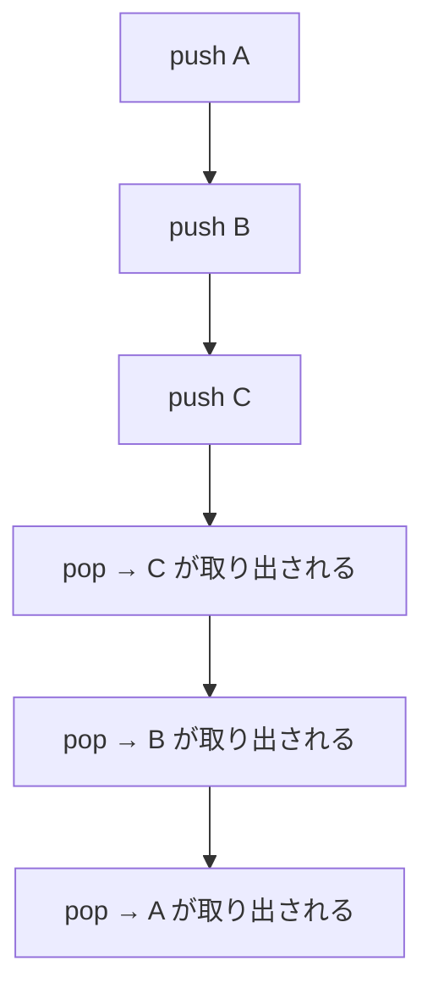

## このセクションで学ぶこと

- スタック（LIFO）の構造と push / pop の挙動
- キュー（FIFO）の構造と enqueue / dequeue の挙動
- スタックとキューが Web 開発のどこで使われているか（関数呼び出し、Undo、ジョブキュー、メッセージキュー）
- 両端キュー（deque）と優先度付きキューの違いと用途
- 括弧の対応チェックや逆ポーランド記法など、スタック / キューの典型的な応用

本セクションは、前セクションで学んだ配列やリストの上に「アクセス順序の制約」を加えたデータ構造を扱います。

---

## あなたが書いた関数呼び出しが、なぜ「最後に呼んだものから戻る」のか

JavaScript でも PHP でも、関数の中から別の関数を呼ぶことは日常茶飯事です。関数 A の中で関数 B を呼び、その中で関数 C を呼ぶ。C が終わると B に戻り、B が終わると A に戻る。最後に呼んだ関数が最初に終わる、この **後入れ先出し** の順序は、誰も明示的に書いていないのに、自然に成立しています。

実はこの順序は、コンピュータが内部で **呼び出しスタック** （call stack）と呼ばれるデータ構造を使って関数呼び出しを管理しているからです。ブラウザの開発者ツールで `console.trace()` を呼び出すと、現在の呼び出しスタックの中身を覗くことができます。

このセクションでは、関数呼び出しの順序を支えている **スタック** と、ジョブキューやメッセージキューに使われる **キュー** という 2 つの基本データ構造を、それらの応用とともに見ていきます。

---

## スタック：最後に入れたものから取り出す（LIFO）

**スタック** （stack）は、要素を「積み上げて」管理するデータ構造です。要素の追加と取り出しは、すべて最上段から行います。最後に積んだものが最初に取り出されるため、この性質を **LIFO** （Last In, First Out、後入れ先出し）と呼びます。

操作は基本的に 2 つだけです。

- **push** : スタックの上に要素を 1 つ追加する
- **pop** : スタックの上から要素を 1 つ取り出す（同時にスタックから削除）

```text
初期    : []
push(A) : [A]
push(B) : [A, B]
push(C) : [A, B, C]    ← C が最上段
pop()   : [A, B]       → C が取り出される
pop()   : [A]          → B が取り出される
```

`push` と `pop` はどちらも、最上段に対する操作だけなので、計算量は **O(1)** です。



スタックは、内部実装としては配列でも連結リストでも実現できます。配列で実装すると、末尾を「最上段」とみなして `push` は末尾追加、`pop` は末尾削除になります。連結リストなら、先頭を「最上段」として実装するのが効率的です。

---

## スタックの実例：関数呼び出し、Undo、ブラウザの戻る

スタックは、Web 開発の様々な場所で活躍しています。

**関数の呼び出しスタック**: 前述のとおり、関数呼び出しの順序を管理する仕組みです。関数を呼び出すとスタックに新しい **スタックフレーム** が積まれ、ローカル変数や戻り先のアドレスが保存されます。関数から戻るときにこのフレームが pop されます。再帰関数が深くなりすぎると `Stack Overflow` というエラーが出るのは、この呼び出しスタックの上限を超えたためです。

**Undo / Redo 機能**: テキストエディタや画像編集ソフトの「元に戻す」（Undo）は、操作履歴をスタックで管理して実現します。操作を行うたびに「やり直し用の情報」をスタックに push し、Undo のときは pop して逆操作を実行します。Ctrl+Z で何度も戻れるのは、スタックに過去の操作が積まれているためです。

**ブラウザの戻るボタン**: ブラウザは訪問した URL の履歴をスタックで管理しています。新しいページに移動するたびに URL を push し、「戻る」ボタンで pop します。

これらの共通点は「最後にやったことを最初に取り消したい」という業務要件です。LIFO の性質がぴったり合うため、スタックが選ばれています。

---

## キュー：最初に入れたものから取り出す（FIFO）

**キュー** （queue）は、要素を「行列」のように管理するデータ構造です。要素は末尾から追加し、取り出しは先頭から行います。最初に並んだものが最初に処理されるため、この性質を **FIFO** （First In, First Out、先入れ先出し）と呼びます。

操作は基本的に 2 つだけです。

- **enqueue** （エンキュー）: キューの末尾に要素を 1 つ追加する
- **dequeue** （デキュー）: キューの先頭から要素を 1 つ取り出す（同時にキューから削除）

```text
初期         : []
enqueue(A)   : [A]
enqueue(B)   : [A, B]
enqueue(C)   : [A, B, C]
dequeue()    : [B, C]    → A が取り出される
dequeue()    : [C]       → B が取り出される
```

キューも内部実装としては配列や連結リストで実現できます。配列の先頭から `dequeue` するときは要素をずらす必要があるため、 **循環バッファ** （ring buffer）と呼ばれる実装で先頭と末尾を別々のインデックスで管理して効率化します。

---

## キューの実例：ジョブキュー、メッセージキュー、印刷待ち

キューも、Web 開発の様々な裏側で動いています。

**ジョブキュー**: Laravel の Queue や Sidekiq、AWS SQS のようなサービスは、時間のかかる処理（メール送信、画像処理、外部 API 呼び出し）を非同期に実行するためにキューを使います。リクエストを受け付けた順に、ワーカーが先頭から取り出して処理します。

```php
// 例: Laravel でメール送信をキューに投入する
SendWelcomeEmail::dispatch($user)->onQueue('emails');
```

このコードを呼ぶと、メール送信のジョブがキューの末尾に enqueue され、ワーカープロセスが先頭から dequeue して順次処理します。

**メッセージキュー**: マイクロサービス間の通信で、サービス A がイベントをキューに送り、サービス B が順に取り出して処理する。RabbitMQ や Apache Kafka が代表例です。送信側と受信側が時間的に分離（**疎結合** ）されるのが利点です。

**印刷待ち行列**: 複数の人が同じプリンタに印刷指示を出すと、リクエストはキューに積まれ、到着順に印刷されます。OS のレベルで実装される最も古典的なキューの応用です。

これらの共通点は「到着順に公平に処理したい」という業務要件です。FIFO の性質がそのまま「順番待ち」の概念と一致します。

---

## 両端キュー（deque）：両端から出し入れできる

**両端キュー** （deque、デック）は、 **キューの両端から要素の追加と削除ができる** 拡張版のキューです。スタックとキューの両方の性質を兼ね備えており、内部実装には双方向リストや循環バッファが使われます。

操作は 4 種類になります。

| 操作 | 内容 |
|---|---|
| push_front | 先頭に要素を追加 |
| push_back | 末尾に要素を追加 |
| pop_front | 先頭から要素を取り出し |
| pop_back | 末尾から要素を取り出し |

両端キューは、たとえばブラウザの履歴のような「両方向に進める」用途や、スライディングウィンドウ系のアルゴリズム（直近 N 件の最大値を高速に求める処理）で使われます。Python の `collections.deque` や Java の `ArrayDeque` が代表的な実装です。

> 補足: スタックは「push / pop が片側のみ」、キューは「片側で追加・反対側で取り出し」、両端キューは「両側で追加 / 取り出しが自由」と整理すると、3 つの関係が見通しやすくなります。

---

## 優先度付きキュー：取り出し順を「優先度」で決める

**優先度付きキュー** （priority queue）は、要素に **優先度** （priority）を付けて格納し、 **優先度が最も高いものから取り出す** データ構造です。FIFO とは取り出し順が異なる点に注意してください。

たとえば次のような順で要素を投入したとします。

```text
enqueue(B, 優先度 3)
enqueue(A, 優先度 1)
enqueue(C, 優先度 2)
```

このとき優先度の高い順（仮に数値が小さいほど高優先度とする）に取り出すと、`A → C → B` の順になります。投入順とは無関係です。

優先度付きキューの代表的な内部実装は、次セクション 2-1-3 で扱う **ヒープ** （heap）です。ヒープを使うと、enqueue と dequeue を共に **O(log n)** で実現できます。

**主な用途**:

- OS のタスクスケジューリング（優先度の高いプロセスから実行）
- ダイクストラ法による最短経路探索（前章 1-2-3 で学んだ「現在の距離が最も短い頂点を次に確定する」を効率化）
- イベント駆動シミュレーション（発生時刻が最も早いイベントから処理）

> よくある誤解: 優先度付きキューは名前に「キュー」と付きますが、 **FIFO ではありません** 。投入順ではなく優先度順に取り出される点が、通常のキューとの決定的な違いです。

---

## スタックの応用 1：括弧の対応チェック

スタックの典型的な応用が、文字列中の括弧が正しく対応しているかを判定する処理です。たとえば `(a+b)*[c-(d+e)]` のような式で、括弧の開閉が合っているかを確認するのに使います。

**手順**:

1. 文字列を 1 文字ずつ走査する
2. 開き括弧 `(` `[` `{` を見つけたらスタックに push
3. 閉じ括弧 `)` `]` `}` を見つけたらスタックから pop して、対応する開き括弧であるか確認
4. 最後にスタックが空であれば、すべての括弧が正しく対応している

```text
入力: ( [ a ] )
( → push        スタック: [(]
[ → push        スタック: [(, []
a → 無視        スタック: [(, []
] → pop ⇒ [   一致    スタック: [(]
) → pop ⇒ (   一致    スタック: []
末尾 → スタックが空 → 対応 OK
```

逆に `( [ ) ]` のような交差した括弧では、`)` が来たときに pop した結果が `[` で対応が取れず、エラーと判定できます。コンパイラの構文解析や、エディタの括弧の色付け機能で広く使われている処理です。

---

## スタックの応用 2：逆ポーランド記法の評価

数式の評価でもスタックは活躍します。**逆ポーランド記法** （Reverse Polish Notation、RPN、後置記法）は、演算子をオペランドの後ろに置く数式の書き方で、スタックを使うと括弧なしで正しく評価できます。

通常の数式 `(3 + 4) * 2` を逆ポーランド記法に変換すると `3 4 + 2 *` になります。これをスタックで評価する手順は次のとおりです。

```text
入力: 3 4 + 2 *
3 → push       スタック: [3]
4 → push       スタック: [3, 4]
+ → 2 つ pop して加算、結果を push  スタック: [7]
2 → push       スタック: [7, 2]
* → 2 つ pop して乗算、結果を push  スタック: [14]
末尾 → スタックの一番上が結果 → 14
```

電卓の内部実装や、Java 仮想マシン（JVM）のバイトコード評価などで、この方式が使われています。

---

## キューの応用：BFS（幅優先探索）

キューの典型的な応用は、グラフや木のノードを「同じ深さのものから順に」探索する **幅優先探索** （BFS、Breadth-First Search）です。詳細は 2-1-4「グラフとハッシュテーブル」と 2-2-2「探索アルゴリズム」で扱いますが、ここでは概要だけ示します。

**手順**:

1. 開始ノードをキューに enqueue
2. キューから dequeue したノードについて、未訪問の隣接ノードをすべてキューに enqueue
3. キューが空になるまで 2 を繰り返す

キューを使うことで「先に到達したノードから先に処理する」という性質が自然に実現でき、結果として「開始ノードから近い順」にノードを訪問できます。SNS で「友達の友達」を辿るときの広がり方も、まさにこの BFS の動きと同じです。

スタックを使うと、対照的に「深い方向へ突き進む」 **深さ優先探索** （DFS、Depth-First Search）になります。スタックとキューの選び方が、探索の戦略そのものを決めるのです。

---

## 要点

- **スタック** （stack）は **LIFO** （後入れ先出し）。 **push** で追加、 **pop** で取り出し。両操作とも O(1)
- **キュー** （queue）は **FIFO** （先入れ先出し）。 **enqueue** で追加、 **dequeue** で取り出し。両操作とも O(1)
- スタックの応用: 関数呼び出しスタック、 **Undo / Redo** 、ブラウザの戻る、括弧の対応チェック、 **逆ポーランド記法** の評価、深さ優先探索
- キューの応用: ジョブキュー、メッセージキュー、印刷待ち行列、幅優先探索
- **両端キュー** （deque）は両端から追加 / 取り出しができる拡張版。スタックとキューの性質を兼ね備える
- **優先度付きキュー** は優先度の高い順に取り出すデータ構造。内部実装はヒープが一般的で、enqueue / dequeue とも **O(log n)** 。FIFO ではない点に注意

---

次のセクションでは、線形なデータ構造から離れ、 **階層構造** を表す **木** （tree）を扱います。二分木、二分探索木、平衡二分探索木（AVL 木・赤黒木）、データベースのインデックス実装で使われる B 木、そして優先度付きキューの内部実装である **ヒープ** まで、計算量と用途を含めて段階的に見ていきます。ファイルシステムや HTML の DOM ツリーが木構造であることを思い出しながら読み進めてください。
