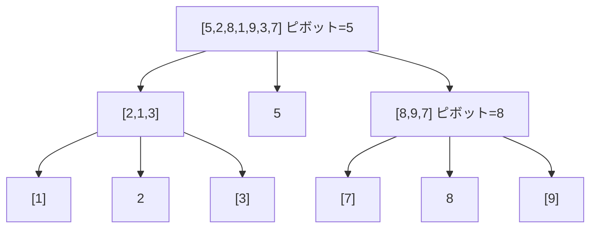

この章では、前章で学んだ配列・リスト・木・ハッシュテーブルなどのデータ構造を「実際に動かす」ためのアルゴリズムを扱います。Web 開発の文脈で言えば、JavaScript の `Array.prototype.sort()` や MySQL の `ORDER BY`、npm パッケージ検索の裏側にある整列・探索アルゴリズムです。

| セクション | テーマ | 試験頻出度 |
|---|---|---|
| 2-2-1 整列アルゴリズム | バブル・選択・挿入・クイック・マージ・ヒープソート | 高 |
| 2-2-2 探索アルゴリズム | 線形・二分・ハッシュ探索 | 高 |
| 2-2-3 再帰と動的計画法 | 再帰、フィボナッチ、ナップサック、DP | 中 |
| 2-2-4 計算量 | O 記法、対数・線形・指数オーダ | 高 |

**この Chapter の進め方**: 最頻出の整列・探索アルゴリズムから入り、続けて再帰と動的計画法という汎用テクニックを学び、最後にアルゴリズムの「速さ」を測る共通の物差しである計算量で締めくくります。

---

> 前提知識: このセクションは 2-1-3 木構造 の内容（特に二分木とヒープの構造）を前提とします。

## このセクションで学ぶこと

- バブル・選択・挿入ソートという 3 つの基本的な整列アルゴリズムの動作
- クイック・マージ・ヒープという O(n log n) クラスの高速な整列アルゴリズム
- 平均計算量・最悪計算量・空間計算量・安定性の 4 つの観点での比較
- JavaScript や PHP の標準ソート関数が内部で何をしているのか

本セクションは「データを並べる」という最も基本的な処理を題材に、計算量とトレードオフの考え方を身につける起点となります。

---

## あなたが書いた Array.sort() は、内部で何をしているのか

JavaScript で配列を並べ替えるとき、あなたは次のようなコードを書いてきたはずです。

```javascript
// 例: 数値配列を昇順に並べ替え
const numbers = [5, 2, 8, 1, 9, 3];
numbers.sort((a, b) => a - b);
// → [1, 2, 3, 5, 8, 9]
```

たった 1 行で終わってしまうこの処理。しかしその裏側では、JavaScript エンジンが「複数のソートアルゴリズムを組み合わせたハイブリッド実装」を動かしています。V8 では Tim Sort（マージソート + 挿入ソート）が、PHP 7 以降の `sort()` では IntroSort 系のハイブリッドが使われています。

ハイブリッドの土台になっている個々のアルゴリズムを知らなければ、なぜそういう組合せになっているのかは理解できません。基本情報技術者試験でも、まさにその「個々のアルゴリズム」が問われます。本セクションでは、教科書的な 6 つの整列アルゴリズムを 1 つずつ見ていきます。

---

## 整列アルゴリズムを比べる 4 つの観点

整列アルゴリズムを比較する際は、次の 4 つの観点で見ます。

- **平均計算量**: 一般的な入力での実行時間のオーダ
- **最悪計算量**: 最悪のケースでの実行時間のオーダ
- **空間計算量**: 必要な追加メモリのオーダ
- **安定性** （stability）: 同じ値の要素同士の元の順序が保たれるかどうか

特に「安定性」は試験で問われやすい概念です。たとえば `[(田中, 80), (鈴木, 80), (佐藤, 70)]` を点数で昇順ソートするとき、安定ソートなら同点の田中と鈴木の元の順序が保たれます。不安定ソートでは順序が入れ替わる可能性があります。

これら 6 つは **比較ソート** （comparison sort）に分類されます。要素同士を大小比較して並べ替える方式で、比較ソートの計算量は理論的に最低でも O(n log n) であることが知られています。

---

## バブルソート：隣接交換の素朴な手法

**バブルソート** （bubble sort）は、隣り合う 2 つの要素を比較して、順序が逆なら交換する処理を繰り返すアルゴリズムです。大きい値が泡のように後ろへ「浮き上がっていく」様子から名付けられました。

```text
初期配列: [5, 2, 8, 1, 3]

1 周目:
  [5, 2, 8, 1, 3] → [2, 5, 8, 1, 3]  (5 と 2 を比較・交換)
  [2, 5, 8, 1, 3] → [2, 5, 8, 1, 3]  (5 と 8 はそのまま)
  [2, 5, 8, 1, 3] → [2, 5, 1, 8, 3]  (8 と 1 を交換)
  [2, 5, 1, 8, 3] → [2, 5, 1, 3, 8]  (8 と 3 を交換)
  → 最大値 8 が末尾に確定
```

これを n-1 回繰り返すと整列が完了します。比較回数は約 n²/2 回、計算量は **平均 O(n²)、最悪 O(n²)** です。追加メモリはほぼ不要で、**空間計算量 O(1)** 、**安定** （同じ値は交換しないため）です。実装が簡単な反面、1,000 件で約 100 万回の比較が必要になり、要素数が増えると遅さが致命的になります。

---

## 選択ソート：最小値を選んで先頭へ

**選択ソート** （selection sort）は、未整列部分の最小値を見つけて、未整列部分の先頭と交換する処理を繰り返します。

```text
初期配列: [5, 2, 8, 1, 3]

1 周目: 未整列部の最小値 1 を先頭の 5 と交換 → [1, 2, 8, 5, 3]
2 周目: 未整列部 [2, 8, 5, 3] の最小値 2 はそのまま → [1, 2, 8, 5, 3]
3 周目: 未整列部 [8, 5, 3] の最小値 3 を 8 と交換 → [1, 2, 3, 5, 8]
```

比較回数は約 n²/2、計算量は **平均 / 最悪ともに O(n²)** 、空間計算量は **O(1)** です。

選択ソートは **不安定** です。最小値を「離れた位置」と交換するため、同じ値の元の順序が崩れる可能性があります。たとえば `[3a, 5, 3b, 2]` で 3a と 2 を交換すると 3a が 3b より後ろに移動してしまいます。

> 補足: バブルソートは交換回数が多いため遅くなりやすく、選択ソートは交換回数が n-1 回で済むため現実の動作はやや速くなります。

---

## 挿入ソート：トランプの手札を整える方式

**挿入ソート** （insertion sort）は、配列を「整列済み部分」と「未整列部分」に分け、未整列部分の先頭要素を整列済み部分の適切な位置に挿入していく方式です。手札のトランプを左から順に並べるときの動きに似ています。

```text
初期: [5] | [2, 8, 1, 3]
2 を [5] に挿入 → [2, 5] | [8, 1, 3]
8 を [2, 5] に挿入 → [2, 5, 8] | [1, 3]
1 を [2, 5, 8] に挿入 → [1, 2, 5, 8] | [3]
3 を [1, 2, 5, 8] に挿入 → [1, 2, 3, 5, 8]
```

平均・最悪計算量は **O(n²)** ですが、**最良計算量は O(n)** という特徴があります。配列がすでにほぼ整列済みなら、各要素は 1 回の比較で正しい位置と分かるため線形時間で終わります。

空間計算量は **O(1)** 、**安定** （同じ値は前の方に挿入される）です。要素数が小さい（数十程度）ときは定数項が小さく、クイックソートやマージソートより高速。V8 や PHP の標準ソートが小さい部分配列で挿入ソートを使うのはこのためです。

---

## クイックソート：分割統治の代表選手

**クイックソート** （quick sort）は、配列を再帰的に分割しながら整列する **分割統治法** （divide and conquer）の代表的なアルゴリズムです。

**基本手順**:

1. 配列から 1 つ要素を選び **ピボット** （pivot）とする
2. ピボットより小さい要素を左、大きい要素を右に振り分ける（**分割**）
3. 左右それぞれの部分配列に対して再帰的に同じ処理を適用する

```text
初期配列: [5, 2, 8, 1, 9, 3, 7]  (ピボット = 5)
分割: [2, 1, 3] | 5 | [8, 9, 7]
左部分 [2, 1, 3] (ピボット = 2) → [1] | 2 | [3]
右部分 [8, 9, 7] (ピボット = 8) → [7] | 8 | [9]
結合: [1, 2, 3, 5, 7, 8, 9]
```



毎回ピボットが配列をほぼ半分に分けると、再帰の深さは log₂ n、各段で n 個の要素を処理するので **平均計算量 O(n log n)** になります。空間計算量は再帰呼び出しの分で **O(log n)** 、**不安定** です。

ただし、整列済み配列に対して端の要素をピボットに選び続けるなどの最悪のケースでは分割が偏り、再帰の深さが n に達して **最悪計算量 O(n²)** になります。実用ではランダムなピボット選択で最悪ケースを回避します。

---

## マージソート：安定した O(n log n) の保証

**マージソート** （merge sort）も分割統治法に基づくアルゴリズムですが、クイックソートとは逆向きの発想で動きます。

**基本手順**:

1. 配列を半分に分ける
2. 左右それぞれを再帰的にソートする
3. ソート済みの左右をマージ（併合）する

```text
初期配列: [5, 2, 8, 1, 9, 3]
分割: [5, 2, 8] と [1, 9, 3] → さらに分割 [5] [2] [8] と [1] [9] [3]
マージ: [5][2]→[2,5]、[2,5][8]→[2,5,8]、[1][9]→[1,9]、[1,9][3]→[1,3,9]
最終: [2, 5, 8] と [1, 3, 9] をマージ → [1, 2, 3, 5, 8, 9]
```

分割の深さは log₂ n で、各段のマージ処理は全体で n 回の比較で済むため、**平均 / 最悪計算量ともに O(n log n)** です。クイックソートと違い最悪ケースでも保証された性能を持つのが特徴。マージ処理に配列と同じサイズの作業領域が必要なので **空間計算量は O(n)** 、**安定** （左を優先すれば同値の順序が保たれる）です。

> 補足: V8 の `Array.sort()` で使われている Tim Sort は、マージソートをベースにしながら整列済みの部分配列（run）を検出して効率化する改良版です。

<!-- TODO: 画像追加 - マージソートの分割とマージの過程を示すツリー図 -->

---

## ヒープソート：ヒープ構造を使った賢いソート

**ヒープソート** （heap sort）は、2-1-3 で学んだ **ヒープ** （heap）を使うアルゴリズムです。最大ヒープでは「親 ≥ 子」の関係が常に保たれるため、配列をヒープに構築すれば「根（先頭）に最大値が来る」ことが保証されます。

**基本手順**:

1. 配列を最大ヒープに構築する（O(n) で可能）
2. 根（最大値）を末尾と交換する
3. 末尾を除外して残りでヒープを再構築する（O(log n)）
4. 全要素が確定するまで 2〜3 を繰り返す

各回の交換と再構築が O(log n) で、それを n 回繰り返すので **平均 / 最悪計算量ともに O(n log n)** です。マージソートと違って追加メモリがほぼ不要で **空間計算量 O(1)** 、**不安定** です。「常に O(n log n) を保証しつつ追加メモリも要らない」優等生ですが、定数項のオーバーヘッドが大きく、実際の動作はクイックソートに劣ることが多いです。

---

## 6 つの整列アルゴリズム比較表

ここまで見てきた 6 つを 1 つの表にまとめます。試験で頻出のため、暗記対象です。

| アルゴリズム | 平均計算量 | 最悪計算量 | 空間計算量 | 安定性 |
|---|---|---|---|---|
| バブルソート | O(n²) | O(n²) | O(1) | 安定 |
| 選択ソート | O(n²) | O(n²) | O(1) | 不安定 |
| 挿入ソート | O(n²) | O(n²) | O(1) | 安定 |
| クイックソート | O(n log n) | O(n²) | O(log n) | 不安定 |
| マージソート | O(n log n) | O(n log n) | O(n) | 安定 |
| ヒープソート | O(n log n) | O(n log n) | O(1) | 不安定 |

> よくある誤解: 「クイックソートは平均が最速だから常に最良」ではありません。最悪計算量は O(n²) で、悪意ある入力（ピボット選びを狙った攻撃）で性能が崩壊する可能性があります。安定性が必要で最悪保証も欲しい場合はマージソート、追加メモリを使いたくないときはヒープソートというように、要件に応じた使い分けが基本です。

---

## 実装の現場：標準ライブラリは何を使っているか

ここまでが「教科書的な」整列アルゴリズムです。一方、現実の言語ランタイムは複数のアルゴリズムを組み合わせています。

- JavaScript（V8 エンジン）: **Tim Sort** （マージソートと挿入ソートのハイブリッド、ECMAScript 2019 から安定性が仕様で保証）
- PHP 7 以降: クイックソートベースのハイブリッド（PHP 8 から安定性が保証）
- Python 3 / Java（オブジェクト配列）: **Tim Sort**

試験で問われるのは「教科書的なアルゴリズムの計算量と特性」です。実装詳細は問われません。

---

## 要点

- **比較ソート** の理論的下限は O(n log n)。これより速くするには非比較ソート（バケットソート、基数ソートなど）が必要
- 計算量 O(n²) の基本ソート: バブル・選択・挿入。実装が簡単だが要素数が増えると遅い
- 計算量 O(n log n) の高速ソート: クイック・マージ・ヒープ
- **クイックソート** は平均 O(n log n)、最悪 O(n²)、空間 O(log n)、不安定
- **マージソート** は平均 / 最悪 O(n log n)、空間 O(n)、安定
- **ヒープソート** は平均 / 最悪 O(n log n)、空間 O(1)、不安定
- **挿入ソート** は最良 O(n)（ほぼ整列済みのときに高速）、安定。小さい配列で使われる
- **安定ソート** は同じ値の要素の元の順序を保つ（同点を別キーで二段ソートするときに重要）

---

次のセクションでは、整列されたデータを「探す」ためのアルゴリズムを学びます。先頭から順に比べる線形探索、整列済みデータで威力を発揮する二分探索、そしてハッシュテーブルを使った O(1) のハッシュ探索という 3 つの探索手法と、それぞれの計算量を理解していきます。
