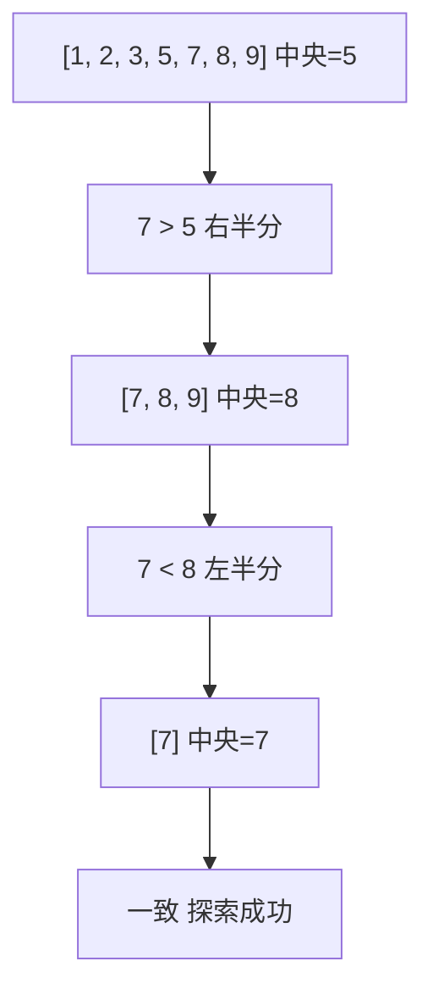

> 前提知識: このセクションは 2-1-4 グラフとハッシュテーブル の内容（特にハッシュテーブルの仕組みと衝突解決）を前提とします。

## このセクションで学ぶこと

- 線形探索（逐次探索）の仕組みと計算量 O(n)
- 二分探索の仕組みと計算量 O(log n)、その前提条件
- ハッシュ探索の仕組みと平均計算量 O(1)、最悪時の挙動
- 整列のコストと探索のコストのトレードオフ

本セクションは前セクションで学んだ整列アルゴリズムの「次の一手」、つまり「並んだデータから目的の値をどう見つけるか」を扱います。

---

## あなたの SQL の WHERE 句、なぜインデックスがあると速いのか

データベースで会員を検索する SQL を書いたことがあるはずです。

```sql
-- 例: メールアドレスでユーザを検索
SELECT * FROM users WHERE email = 'taro@example.com';
```

100 万件のレコードがある `users` テーブルで、`email` カラムにインデックスを張っていない場合、MySQL は先頭から末尾まで全行を 1 行ずつ比較していきます。最悪の場合は 100 万回の比較。これは典型的な **線形探索** （linear search）です。

一方で `email` にインデックスが張られていると、MySQL は B 木（2-1-3 で学んだ）を辿って 20 回程度の比較で目的のレコードを見つけます。これは **二分探索** （binary search）の派生です。

データベースのインデックスが「速さ」を生む仕組みは、突き詰めれば「探索アルゴリズムの選択」です。本セクションでは、線形探索・二分探索・ハッシュ探索という 3 つの基本パターンを通して、その仕組みを見ていきます。

---

## 線形探索：先頭から順に比較する

**線形探索** （linear search、逐次探索とも呼ぶ）は、配列やリストの先頭から末尾まで 1 つずつ比較していく、最も素朴な探索方法です。

```text
配列: [5, 2, 8, 1, 9, 3, 7]
目的: 9 を探す

1 番目: 5 ≠ 9
2 番目: 2 ≠ 9
3 番目: 8 ≠ 9
4 番目: 1 ≠ 9
5 番目: 9 = 9 → 見つかった (5 番目)
```

n 個の要素の中から 1 つを探すとき、最悪では n 回の比較が必要なので **計算量 O(n)** です。平均的には n/2 回ですが、これも n に比例するので結局 O(n) です。

線形探索の最大の利点は **整列されていないデータでも使える** ことです。データが順序を持っていなくても、ただ「片端から見ていく」だけで答えにたどり着けます。

PHP の連想配列でないただの `array` で `in_array($needle, $array)` を呼ぶときも、内部的にはこの線形探索が走っています。

```php
// 例: PHP の in_array は線形探索
$names = ['田中', '鈴木', '佐藤', '高橋', '伊藤'];
if (in_array('佐藤', $names)) {
    // 見つかった
}
```

---

## 二分探索：半分ずつ絞り込む

**二分探索** （binary search）は、**整列済み** のデータに対して使える強力な探索アルゴリズムです。

**基本手順**:

1. 配列の中央の要素を見る
2. 目的の値と一致したら終了
3. 目的の値が中央より小さければ左半分、大きければ右半分にだけ続きの探索を限定する
4. 範囲が 1 要素になるまで 1〜3 を繰り返す

```text
配列(整列済み): [1, 2, 3, 5, 7, 8, 9]
目的: 7 を探す

ステップ 1: 中央 = 5 (位置 4)。7 > 5 なので右半分 [7, 8, 9] を見る
ステップ 2: 中央 = 8 (位置 6)。7 < 8 なので左半分 [7] を見る
ステップ 3: 中央 = 7 (位置 5)。7 = 7 → 見つかった
```



範囲が毎回半分になるので、n 個の中から目的の値を見つけるまでの比較回数は最大で log₂ n 回です。たとえば 1,024 個（2¹⁰）のデータなら最大 10 回、100 万個（約 2²⁰）でも最大約 20 回で済みます。計算量は **O(log n)** です。

擬似コードで書くと次のようになります。

```text
function 二分探索(配列, 目的の値):
  左 = 0
  右 = len(配列) - 1
  while 左 <= 右:
    中央 = (左 + 右) / 2  (整数除算)
    if 配列[中央] == 目的の値:
      return 中央
    else if 配列[中央] < 目的の値:
      左 = 中央 + 1
    else:
      右 = 中央 - 1
  return -1  (見つからなかった)
```

JavaScript と Python での実装イメージは次の通りです。

```javascript
// 例: 二分探索の JavaScript 実装
function binarySearch(arr, target) {
  let left = 0;
  let right = arr.length - 1;
  while (left <= right) {
    const mid = Math.floor((left + right) / 2);
    if (arr[mid] === target) return mid;
    if (arr[mid] < target) left = mid + 1;
    else right = mid - 1;
  }
  return -1;
}
```

```python
# 例: 二分探索の Python 実装
def binary_search(arr, target):
    left, right = 0, len(arr) - 1
    while left <= right:
        mid = (left + right) // 2
        if arr[mid] == target:
            return mid
        elif arr[mid] < target:
            left = mid + 1
        else:
            right = mid - 1
    return -1
```

**二分探索が成立するための前提条件**:

- データが整列済みであること
- データに **ランダムアクセス** （配列のように添字で O(1) で参照できる）が可能なこと

連結リストでは添字での中央アクセスが O(n) になるため、二分探索は実用的になりません。連結リストの代わりに二分探索木や B 木（2-1-3 参照）が使われるのはこのためです。

> よくある誤解: 「二分探索は常に高速」ではありません。データが未整列ならまず整列が必要で、整列には O(n log n) かかります。1 回だけの探索なら線形探索の O(n) のほうが速いケースがあります。

---

## log₂ n を体感する：比較回数のオーダ感覚

試験では「n 個のデータに二分探索を適用したとき、最大の比較回数はおよそ何回か」という問題が頻出します。log₂ n の値を直感的につかんでおくと有利です。

| n | log₂ n | 比較回数の目安 |
|---|---|---|
| 16 | 4 | 4 回 |
| 64 | 6 | 6 回 |
| 256 | 8 | 8 回 |
| 1,024 | 10 | 10 回 |
| 16,384 | 14 | 14 回 |
| 1,048,576 (約 100 万) | 20 | 20 回 |
| 約 10 億 | 30 | 30 回 |

`log₂ 1024 = 10` という値はぜひ覚えておきましょう。線形探索なら 1,024 回かかる処理が、二分探索なら 10 回で終わります。データ量が増えるほど効果は劇的に大きくなります。

---

## ハッシュ探索：ハッシュ関数で直接位置を計算する

**ハッシュ探索** （hash search）は、2-1-4 で学んだ **ハッシュテーブル** （hash table）を使う探索方法です。「比較を繰り返す」のではなく、「目的の値からインデックスを計算して直接アクセスする」という発想で動きます。

**基本動作**:

1. キー（探したい値）に **ハッシュ関数** を適用してインデックスを計算する
2. その位置に直接アクセスして値を取り出す

```text
キー "tanaka" に対して hash("tanaka") = 47 だとすると、
テーブル[47] に "tanaka" のデータが格納されている
```

ハッシュ関数の計算と配列アクセスはどちらも要素数に依存しないので、**平均計算量は O(1)** です。100 万件あっても 100 件あっても、平均的な所要時間は同じです。

PHP の連想配列、JavaScript の `Object` や `Map`、Python の `dict` はすべてハッシュテーブルで実装されています。

```php
// 例: PHP の連想配列はハッシュテーブル
$users = [
    'taro'   => '田中太郎',
    'jiro'   => '鈴木次郎',
    'saburo' => '佐藤三郎',
];
echo $users['jiro']; // → 鈴木次郎 (O(1) で取り出せる)
```

---

## ハッシュ探索の落とし穴：衝突と最悪計算量

ハッシュ関数が「異なるキーから同じインデックスを生成」してしまう現象を **衝突** （collision）と呼びます。

衝突を解決する方法には大きく 2 種類あります（2-1-4 で詳説）。

- **チェイン法** （連鎖法）: 同じインデックスに来た要素を連結リストでつなげる
- **オープンアドレス法** : 衝突したら別の空きスロットを探す

衝突が少ない理想的なハッシュテーブルでは O(1) ですが、悪意ある入力や貧弱なハッシュ関数で衝突が 1 つのスロットに集中すると、連結リストを線形に走査することになり **最悪計算量は O(n)** に劣化します。

| 観点 | 線形探索 | 二分探索 | ハッシュ探索 |
|---|---|---|---|
| 平均計算量 | O(n) | O(log n) | O(1) |
| 最悪計算量 | O(n) | O(log n) | O(n) |
| 整列の必要 | 不要 | 必要 | 不要 |
| 範囲検索 (BETWEEN) | 不向き | 得意 | 不向き |
| 必要メモリ | 小 | 小 | 中(空きスロット必要) |

> よくある誤解: 「ハッシュ探索は範囲検索にも O(1) で使える」は誤り。`age BETWEEN 20 AND 30` のような範囲条件にはハッシュテーブルは無力で、整列済みデータと二分探索（および B 木インデックス）の出番です。MySQL の B 木インデックスが標準で、ハッシュインデックスは一部の DB やメモリエンジンに限定されるのはこの理由です。

---

## 整列のコストと探索のコストのトレードオフ

「線形探索より二分探索のほうが速いから常に二分探索を使う」のは早計です。データの利用パターンによって最適解は変わります。

| 利用パターン | 適した戦略 |
|---|---|
| 1 回だけ探索する | 線形探索（整列のコストを払う価値がない） |
| 何度も同じデータを探索する | 一度整列して二分探索、または最初からハッシュテーブル |
| 厳密一致のみで頻繁に検索 | ハッシュ探索（O(1) 平均） |
| 範囲検索や順序のある検索 | 二分探索 / B 木（O(log n)） |
| 大量の挿入と削除がある | ハッシュテーブルまたは B 木 |

MySQL のインデックス選択もこの考え方に従います。`WHERE email = ?` のような厳密一致が多ければハッシュインデックス（対応する DB エンジンなら）、`WHERE created_at BETWEEN ? AND ?` のような範囲検索が多ければ B 木インデックス、という具合です。

> 補足: 「整列 O(n log n) + 二分探索 O(log n)」と「ハッシュテーブル構築 O(n) + ハッシュ探索 O(1)」を比べると、ハッシュテーブルのほうが構築コストでも有利です。ただし範囲検索やソート済みの順次取り出しは二分探索 / B 木にしかできないため、用途で使い分けます。

---

## 要点

- **線形探索** : 先頭から順に比較。計算量 **O(n)** 、整列不要、最もシンプル
- **二分探索** : 中央と比較して半分に絞る。計算量 **O(log n)** 、整列済みデータが前提
- **ハッシュ探索** : ハッシュ関数でインデックスを直接計算。平均 **O(1)** 、最悪 **O(n)** （衝突集中時）
- `log₂ 1024 = 10` 、`log₂ 100 万 ≒ 20` 、`log₂ 10 億 ≒ 30` という値を体感としてつかむ
- 二分探索はランダムアクセス可能な配列が前提。連結リストでは効果が出ない
- ハッシュ探索は厳密一致に強く、範囲検索は不向き。範囲検索には二分探索や B 木インデックスを使う
- 「1 回限り」なら線形探索、「何度も検索」なら整列 + 二分探索、「厳密一致中心」ならハッシュ探索が定石

---

次のセクションでは、二分探索のように「自分自身を呼び出す」アルゴリズムの構造そのものを **再帰** （recursion）として整理し、そこから派生する強力な技法である **動的計画法** （dynamic programming）を、フィボナッチ数列やナップサック問題を題材に学んでいきます。
