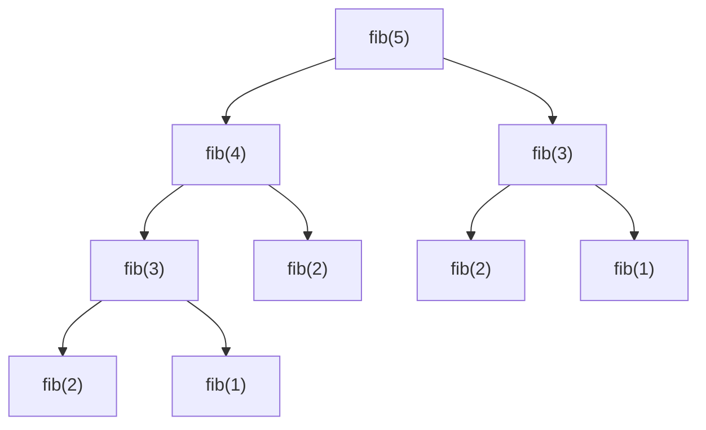

## このセクションで学ぶこと

- 再帰（recursion）の定義と、基底ケース・再帰ケースという 2 つの構成要素
- フィボナッチ数列の素朴な再帰実装が抱える指数的な計算量の問題
- 動的計画法（DP）の 2 つのアプローチ（メモ化・タビュレーション）
- ナップサック問題と DP テーブルによる解法
- 分割統治法と貪欲法、それぞれの考え方と DP との違い

本セクションは「同じ問題を別の問題に分割して解く」という、アルゴリズム設計の汎用テクニックを身につける章です。

---

## あなたが書いた木構造の探索、なぜ自然と再帰になったのか

HTML の DOM ツリーや JSON の入れ子オブジェクトを操作するコードを書いていると、自然と「自分自身を呼び出す関数」を書く場面に出会います。

```javascript
// 例: DOM ツリーを再帰的に走査
function traverse(node) {
  console.log(node.tagName);
  for (const child of node.children) {
    traverse(child); // 自分自身を呼ぶ
  }
}
```

これが **再帰** （recursion）です。木構造やフラクタル、入れ子の階層を持つデータでは、ループより再帰のほうが素直に書けることが多いです。前セクションの二分探索も、見方を変えれば「より小さい範囲に対する二分探索を再度呼ぶ」という再帰的な構造を持っています。

ただし再帰は強力な反面、使い方を誤ると **指数的な計算量爆発** を起こす危険があります。本セクションでは、再帰の基本から始めて、その弱点を克服する **動的計画法** （DP）まで進みます。

---

## 再帰：自分自身を呼び出す関数

**再帰関数** （recursive function）とは、関数の処理の中で自分自身を呼び出す関数のことです。再帰関数は次の 2 つの要素から構成されます。

- **基底ケース** （base case）: 再帰呼び出しをやめる条件
- **再帰ケース** （recursive case）: 自分自身を呼び出して問題を小さくしていく処理

階乗 `n! = n × (n-1) × ... × 2 × 1` を再帰で書くと次のようになります。

```text
function 階乗(n):
  if n == 0:           # 基底ケース: 0! = 1
    return 1
  else:                 # 再帰ケース: n! = n × (n-1)!
    return n × 階乗(n - 1)
```

```python
# 例: 階乗の再帰実装
def factorial(n):
    if n == 0:
        return 1
    return n * factorial(n - 1)

factorial(5)  # → 5 × 4 × 3 × 2 × 1 × 1 = 120
```

**基底ケースを忘れると無限再帰** になり、スタックオーバーフローでプログラムが落ちます。再帰関数を書くときは、まず「いつ止まるか」を明確にしてから書き始めるのが鉄則です。

> よくある誤解: 再帰は「ループより遅い」という印象を持たれがちですが、本質的に遅いわけではありません。後述の素朴な再帰のように「同じ計算を何度も繰り返す」場合に遅くなるのが原因で、設計を変えれば再帰でも十分に高速です。

---

## フィボナッチ数列：素朴な再帰の罠

**フィボナッチ数列** は次のように定義される数列です。

```text
F(0) = 0
F(1) = 1
F(n) = F(n-1) + F(n-2)  (n >= 2)
```

数列としては `0, 1, 1, 2, 3, 5, 8, 13, 21, 34, ...` と続きます。これを素直に再帰で書くと次のようになります。

```python
# 例: 素朴な再帰のフィボナッチ
def fib(n):
    if n < 2:
        return n
    return fib(n - 1) + fib(n - 2)
```

シンプルで美しい実装に見えますが、**致命的な問題** があります。`fib(5)` を計算するときの呼び出しの様子を見てみましょう。



`fib(3)` が 2 回、`fib(2)` が 3 回、... と、同じ計算を何度も繰り返しています。一般に `fib(n)` の呼び出し回数は約 `2^n` 回となり、**計算量は O(2^n)** （指数オーダ）です。

n=40 程度で 1 兆回近い呼び出しが必要になり、現代の CPU でも数十秒〜数分かかってしまいます。これが「素朴な再帰の罠」です。

<!-- TODO: 画像追加 - フィボナッチの素朴再帰における呼び出しツリーと重複計算 -->

---

## 動的計画法（DP）の発想：一度計算した結果を再利用する

この問題を解決するのが **動的計画法** （dynamic programming、DP）です。基本のアイデアはとてもシンプルです。

> 一度計算した部分問題の結果を保存しておき、再度必要になったら計算せずに取り出す

DP には主に 2 つのアプローチがあります。

- **メモ化** （memoization、トップダウン DP）: 再帰の形を保ちつつ、計算結果をキャッシュする
- **タビュレーション** （tabulation、ボトムアップ DP）: 小さい問題から順に表を埋めていく

### メモ化（トップダウン DP）

```python
# 例: メモ化を使ったフィボナッチ
memo = {}

def fib(n):
    if n in memo:
        return memo[n]  # 計算済みなら取り出す
    if n < 2:
        return n
    result = fib(n - 1) + fib(n - 2)
    memo[n] = result    # 結果を保存
    return result
```

これだけで計算量は **O(n)** に劇的に改善します。同じ `fib(k)` が何度呼ばれても、最初の 1 回以外はキャッシュから即座に返るためです。

### タビュレーション（ボトムアップ DP）

ボトムアップ版では、再帰を使わず配列に小さい順に答えを書き込んでいきます。

```python
# 例: タビュレーションのフィボナッチ
def fib(n):
    if n < 2:
        return n
    dp = [0, 1]
    for i in range(2, n + 1):
        dp.append(dp[i - 1] + dp[i - 2])
    return dp[n]
```

```text
dp[0] = 0
dp[1] = 1
dp[2] = dp[1] + dp[0] = 1 + 0 = 1
dp[3] = dp[2] + dp[1] = 1 + 1 = 2
dp[4] = dp[3] + dp[2] = 2 + 1 = 3
dp[5] = dp[4] + dp[3] = 3 + 2 = 5
```

こちらも計算量 **O(n)** 、空間計算量 **O(n)** （直前の 2 つだけ覚えれば O(1) にも縮められます）。

DP が機能するための条件は次の 2 つです。

- **部分問題への分割** が可能（大きい問題を小さい問題に分けられる）
- **部分問題が重複** している（同じ小さい問題が何度も現れる）

フィボナッチはまさにこの条件を満たします。`F(n) = F(n-1) + F(n-2)` という分割があり、左右の枝で `F(k)` が何度も登場するからです。

---

## ナップサック問題：DP の代表例

DP の試験頻出問題が **0-1 ナップサック問題** （0-1 knapsack problem）です。問題はこう設定されます。

> 容量 W のリュックがある。重さ w と価値 v を持つ品物が n 個ある。リュックに入れる品物の組み合わせを選んで、容量を超えない範囲で価値の合計を最大化せよ。各品物は 1 個ずつ（入れるか入れないかの 0/1）。

たとえば次のような例を考えます。

| 品物 | 重さ w | 価値 v |
|---|---|---|
| 1 | 2 | 3 |
| 2 | 3 | 4 |
| 3 | 4 | 5 |
| 4 | 5 | 6 |

容量 W = 5 のリュックに入れて最大化したい場合、品物 1 と品物 2 を入れると 重さ 2+3=5、価値 3+4=7 となり、これが最適解です。

**素朴な解法** : 全ての組み合わせを試す（2^n 通り）。n=30 で 10 億通り、n=50 で 1 千兆通り。指数オーダで現実的でない。

**DP による解法** : 2 次元配列 `dp[i][w]` を「最初の i 個の品物から選び、重さ合計が w 以下のときの最大価値」と定義します。

漸化式は次の通りです。

```text
dp[i][w] = max(
  dp[i-1][w],                              (品物 i を入れない場合)
  dp[i-1][w - w_i] + v_i (w >= w_i のとき) (品物 i を入れる場合)
)
```

DP 表の途中経過は次のようになります（行が品物番号、列が重さ）。

```text
        重さ w
        0  1  2  3  4  5
i=0     0  0  0  0  0  0
i=1     0  0  3  3  3  3   (品物 1: w=2, v=3)
i=2     0  0  3  4  4  7   (品物 2: w=3, v=4)
i=3     0  0  3  4  5  7   (品物 3: w=4, v=5)
i=4     0  0  3  4  5  7   (品物 4: w=5, v=6)
```

dp[4][5] = 7 が答えです。計算量は **O(n × W)** で、品物数と容量に対する多項式時間で解けます。

> 補足: ナップサック問題は実は「擬多項式時間」アルゴリズムであり、計算量 O(n × W) の W は容量の値そのものです。容量が非常に大きいと結局重くなりますが、現実的な問題サイズでは多項式時間と同等の感覚で扱えます。

---

## 分割統治法：再帰の別の形

再帰を使うアルゴリズム設計には、DP のほかに **分割統治法** （divide and conquer）があります。

**分割統治法の基本** :

1. **分割** : 問題を 2 つ以上の小さな部分問題に分ける
2. **統治** : 部分問題を再帰的に解く
3. **結合** : 部分問題の解を組み合わせて元の問題の解を作る

前セクションで学んだ **マージソート** と **クイックソート** 、そして **二分探索** はすべて分割統治法のアルゴリズムです。

分割統治法と DP の違いは次の通りです。

| 観点 | 分割統治法 | 動的計画法 |
|---|---|---|
| 部分問題の関係 | 互いに独立 | 重複する部分問題がある |
| 結果の再利用 | しない | する（メモ化や表で保存） |
| 代表例 | マージソート、クイックソート、二分探索 | フィボナッチ、ナップサック、最長共通部分列 |

部分問題が独立している（重複しない）なら分割統治法、重複しているなら DP、という使い分けです。

---

## 貪欲法：常に局所最適を選ぶ

DP と並んで試験で問われやすいのが **貪欲法** （greedy algorithm）です。

貪欲法は「その時点で最善に見える選択肢を選び続ける」アプローチです。たとえば「両替で硬貨の枚数を最小化する」問題で、毎回最も高額な硬貨を取れるだけ取る方法が貪欲法です。

```text
お釣り 67 円を、500 / 100 / 50 / 10 / 5 / 1 円の硬貨で
最小枚数で渡したい:

50 円硬貨 1 枚 → 残り 17 円
10 円硬貨 1 枚 → 残り 7 円
5 円硬貨 1 枚 → 残り 2 円
1 円硬貨 2 枚 → 残り 0 円

合計 5 枚 (50 + 10 + 5 + 1 + 1)
```

日本の硬貨体系では貪欲法で常に最適解が得られます。しかし、ナップサック問題のように貪欲法では最適解にならない問題もあります。

たとえば前述のナップサック問題で「価値が高い順に詰める」貪欲法を採ると、品物 4（v=6, w=5）を最初に選んで、もう何も入らず合計価値 6 で終わってしまいます。最適解の価値 7（品物 1 + 品物 2）には届きません。

> よくある誤解: 「貪欲法は速いから DP より良い」とは限りません。貪欲法は計算量は速いものの、最適解を保証する場合が限られます。DP は計算量は重いものの、適用できる問題なら必ず最適解を見つけます。問題の性質を見極めて使い分けるのが基本です。試験では「貪欲法 vs DP」の対比が頻出論点です。

---

## 要点

- **再帰関数** は「基底ケース」と「再帰ケース」の 2 要素から成る。基底ケースが無いと無限再帰
- 素朴な再帰のフィボナッチは計算量 **O(2^n)** （指数オーダ）で非実用的
- **動的計画法** （DP）は重複する部分問題の結果を保存して再利用する技法
- DP の 2 アプローチ: **メモ化** （トップダウン）と **タビュレーション** （ボトムアップ）
- DP でフィボナッチは **O(n)** 、0-1 ナップサックは **O(n × W)** で解ける
- **分割統治法** は部分問題が独立な場合に使う（マージソート、クイックソート、二分探索）
- **貪欲法** は局所最適を選び続ける手法。常に最適解になる保証は問題による
- 適用条件: DP は「部分問題への分割」+「部分問題の重複」が成立する場合

---

次のセクションでは、ここまで議論してきた「O(n)」「O(log n)」「O(2^n)」といった計算量の表記そのものを正式に整理します。**O 記法** ・ **Ω 記法** の定義、時間計算量と空間計算量の違い、対数オーダ・線形オーダ・指数オーダの判別方法を学んでいきます。
