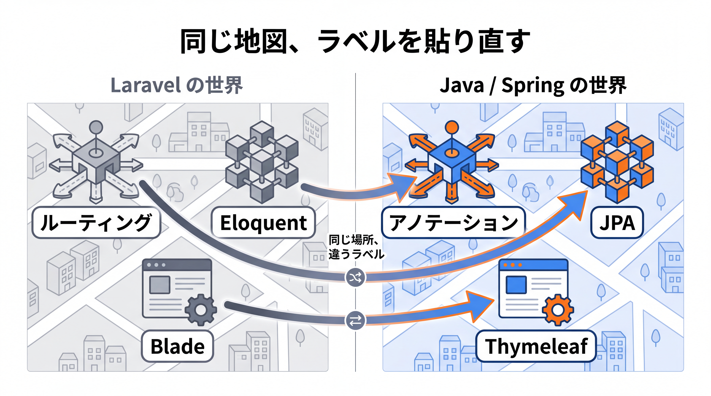
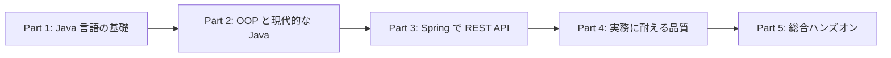

# 1-1-1 なぜ Java / Spring Boot を学ぶのか

本教材の出発点となる Chapter です。Part 1 全体を通して、Java を「読み書きできる」状態を目指します。その最初の一歩として、本章ではこれから Java を学んでいくための土台を固めます。

| セクション | テーマ | 種類 |
|---|---|---|
| 1-1-1 なぜ Java / Spring Boot を学ぶのか | 本教材の目的・全体マップ・Laravel との対応・学び方 | 概念 |
| 1-1-2 Java という言語の正体 | 静的型付け・コンパイル・JVM・PHP との根本的な違い | 概念 |
| 1-1-3 Java プロジェクトの形 | クラス・パッケージ・main メソッド・Maven の構造 | 概念 |

📖 **この Chapter の進め方**: まず本セクションで「なぜ・何を・どう学ぶか」の地図を手にします。次に 1-1-2 で Java という言語の仕組みを理解し、最後に 1-1-3 でコードが宿るプロジェクトの形を確認します。コードを書く準備（環境構築）は Part 5 で行うため、ここでは全体像をつかむことに集中してください。

## 🎯 このセクションで学ぶこと

- 本教材で何を・なぜ・どのように学ぶのかを理解する
- Laravel（PHP）での経験が Java / Spring Boot のどこに対応するのか、その全体マップをつかむ
- 「AI 活用前提・概念主軸・Laravel 対比」という本教材の学び方を理解する

本セクションでは、学ぶ動機（WHY）から始め、教材全体の地図、Laravel との対応マップ、そして学び方の順に見ていきます。

---

## 導入: 案件は Laravel ばかりではない

あなたはすでに Laravel で Web アプリケーションを一通り作れます。ルーティングを定義し、コントローラでリクエストを受け、Eloquent でデータを操作し、バリデーションをかけ、認証を組み、REST API を返し、テストを書く。Web 開発の主要な構成要素を、フレームワークを通じて実務レベルで扱ってきました。これは大きな資産です。

一方で、世の中の案件は Laravel だけで動いているわけではありません。とりわけ企業の業務システムやバックエンドでは、Java と Spring Boot が長年にわたって広く使われ続けています。ここを扱えるようになると、参画できる案件の幅がぐっと広がり、エンジニアとしての選択肢が増えます。本教材は、あなたがすでに持っている「Web 開発の考え方」を最大の足がかりに、Java / Spring Boot の世界へ橋渡しするために存在します。

### 🧠 先輩エンジニアの思考プロセス

> 私は PHP と Laravel で何年か食べてきたあと、Java の案件に移りました。移る前は「別言語だし、また一から覚え直しか」と身構えていたのを覚えています。
>
> 実際に入ってみると、覚え直したのは文法と型くらいでした。ルーティングもコントローラも ORM もバリデーションも、Laravel でやっていたことの置き換え先がちゃんとあります。この教材も、新しい言語を一から積むというより、すでに持っている地図に Java のラベルを貼り直していく作業だと思って読んでください。

---

## 本教材の地図（Part 1 から Part 5 で何を・なぜ）

本教材は 5 つの Part で構成されます。学習の流れは「言語に慣れる → オブジェクト指向で設計する → Spring で API を組む → 品質を備える → ゼロから作る」です。

- **Part 1「Java 言語の基礎」**: 今いる場所です。静的型付けという発想の転換を軸に、変数・型・制御構文・メソッド・配列・コレクション・例外処理まで、Java の基本文法を省略せずに身につけます。
- **Part 2「オブジェクト指向と現代的な Java」**: 継承・インターフェース・ポリモーフィズムといった本格的なオブジェクト指向と、record・enum・Optional・Stream といった現代的な Java を学びます。ここがあなたの最大のギャップであり、Spring を理解する設計の土台になります。
- **Part 3「Spring Boot で REST API を作る」**: DI コンテナの仕組みを核に、Web 層からデータアクセス層までの縦串を通します。Laravel のサービスコンテナやファサードの「魔法」が、ここで明示的な仕組みとして解けます。
- **Part 4「実務に耐える品質をつくる」**: 認証・認可（Spring Security・JWT）、テスト（JUnit・Mockito・MockMvc）、運用の土台（例外設計・ログ・設定の外部化・Docker）を扱います。
- **Part 5「総合ハンズオン」**: ここまでの全知識を統合し、認証付きのタスク管理 REST API をゼロから設計・実装・テストします。AI（Claude Code）との協働を前提に進めます。

💡 Part 1 から Part 4 はコードを示しながら概念を解説し、実際に手を動かす本格的なハンズオンは Part 5 に集約しています。これは、構文の暗記よりも「なぜそう動くのか」という構造の理解を先に固めるためです。

---

## なぜ Java / Spring Boot なのか（WHY）

Java は 1990 年代から企業システムの中核を担い続けてきた言語です。静的型付けによる堅牢さ、JVM という成熟した実行基盤、膨大なライブラリ群を背景に、金融・公共・大規模 Web サービスなど「長く・安全に動かし続けたいシステム」で選ばれてきました。

その Java で Web アプリケーションやバックエンドを作るときのデファクトスタンダードが Spring Boot です。Laravel が PHP の世界で「これさえ使えば一通り作れる」存在であるように、Spring Boot は Java の世界で同じ役割を担います。

つまり Java / Spring Boot を扱えることは、企業バックエンド案件への入り口を一つ増やすことに直結します。Laravel という強みに Java / Spring Boot を加えることで、あなたが参画できる案件のすそ野は確実に広がります。それが本教材のねらいです。

---

## Laravel でできたことは Java でもできる

ここで一度、安心してもらうための地図を広げます。Laravel であなたがやってきたことは、ほぼすべて Java / Spring Boot にも対応物があります。次の表は、本教材を通じて何度も立ち返ることになる「対応マップ」です。今すべてを理解する必要はありません。「知っていることばかりだ」と感じてもらえれば十分です。

| やりたいこと | Laravel（PHP） | Java / Spring Boot |
|---|---|---|
| 言語 | PHP（動的型付け） | Java（静的型付け） |
| フレームワーク本体 | Laravel | Spring Boot |
| 依存管理 | Composer（`composer.json`） | Maven（`pom.xml`） |
| ルーティング | `routes/web.php`・`routes/api.php` | `@GetMapping` などのアノテーション |
| コントローラ | `App\Http\Controllers` | `@RestController` / `@Controller` |
| DI / コンテナ | サービスコンテナ・ファサード | DI コンテナ（`ApplicationContext`） |
| ORM | Eloquent | Spring Data JPA / Hibernate |
| モデル / エンティティ | Eloquent モデル | `@Entity` クラス |
| バリデーション | FormRequest | Bean Validation（`@Valid`） |
| 入出力の整形 | API リソース | DTO（`record`） |
| 認証・認可 | Fortify / Sanctum・ポリシー | Spring Security（JWT） |
| テンプレート（画面） | Blade | Thymeleaf |
| テスト | PHPUnit・Feature テスト | JUnit・MockMvc |
| ミドルウェア | ミドルウェア | フィルタ・インターセプタ |
| 設定 | `.env`・config | `application.yml`・プロファイル |
| ローカル環境 | Sail（Docker） | Docker Compose |
| CLI 操作 | artisan | Maven ゴール |

見てのとおり、空欄はありません。ルーティングはアノテーションに、Eloquent は Spring Data JPA に、FormRequest は Bean Validation に、Blade は Thymeleaf に、PHPUnit は JUnit に対応します。違うのは「言語」と「書き方」であって、「Web 開発の考え方」そのものはそのまま持ち越せます。本教材は、この対応関係を一つずつ丁寧にたどっていきます。

---

## 本教材の歩き方

本教材には、効率よく学ぶための 4 つの方針があります。

- **AI 活用を前提にする**: 現場では、実装に AI（Claude Code など）を活用するのが当たり前になりました。細かな構文は AI が補ってくれます。だからこそ本教材は、構文の丸暗記ではなく「なぜそう動くのか」という構造の理解に時間を投資します。
- **概念を主軸にする**: 各技術を Why（なぜ必要か）から What（何か）、How（どう使うか）の順で解説します。断片的な手順の前に、全体像と理由を先に示します。
- **Laravel と対比する**: 教材全体の背骨として、随所に Laravel / PHP との対比を織り込みます。あなたの既習を足がかりに、Java の具体へ最短で接続します。
- **必要な情報を省略しない**: あなたの Java 知識はゼロからのスタートと想定し、変数や型といった基本文法も Java での書き方を省かず解説します。ただし「クラスとは何か」「ORM とは何か」のように、すでに理解している概念を一から教え直すことはしません。

💡 **本教材のバージョン方針**: 言語は Java 21（LTS）を使います。21 は現場で広く使われている主流のバージョンで、Eclipse Temurin なら少なくとも 2027 年 9 月まで無償アップデートが提供されます（2026年6月時点）。コード例は Java 17 でも通用する書き方を基本にするため、案件ごとにバージョンが違っても応用が効きます。最新の LTS は Java 25（2025 年 9 月リリース）で、必要に応じてコラムで触れます。フレームワークは Spring Boot 4.0.x（2025 年 11 月 GA）をメインにしつつ、現場で遭遇しやすい 3.x への読み替えも随所で補足します。

---

## ✨ まとめ

- 本教材は、Laravel（PHP）の経験を足がかりに Java / Spring Boot を学び、参画できる案件のすそ野を広げることを目的とする
- 学習は「言語（P1）→ オブジェクト指向（P2）→ Spring（P3）→ 品質（P4）→ 総合ハンズオン（P5）」と積み上がる
- Laravel でやってきたことは、ほぼすべて Java / Spring Boot に対応物がある。違うのは言語と書き方であって、Web 開発の考え方は持ち越せる
- 学び方の方針は「AI 活用前提・概念主軸・Laravel 対比・必要な情報を省略しない」の 4 つ

---

次のセクションでは、Java という言語の正体に踏み込みます。PHP が動的型付けでインタプリタ方式なのに対し、Java は静的型付けでコンパイルを経て動きます。この根本的な違いと、JVM という実行モデルを理解します。
