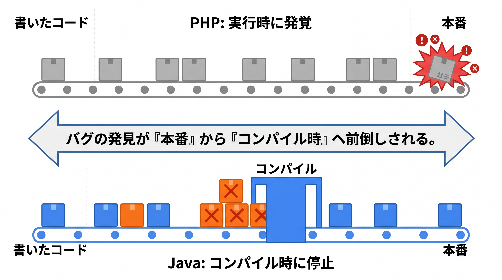
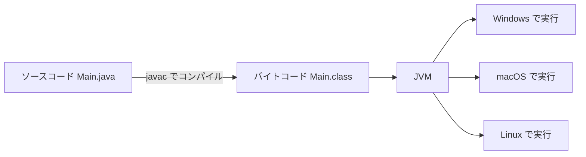

# 1-1-2 Java という言語の正体

📝 **前提知識**: このセクションは「1-1-1 なぜ Java / Spring Boot を学ぶのか」の内容を前提としています。

## 🎯 このセクションで学ぶこと

- PHP（動的型付け）と Java（静的型付け）で、型がいつ決まるのかの違いを説明できる
- コンパイルとは何か、なぜ実行する前にエラーがわかるのかを理解する
- JVM・JDK・JRE の関係と「Write Once, Run Anywhere」という実行モデルを理解する

本セクションでは、まず PHP と Java の型の扱いの違いを押さえ、次にコンパイルという仕組み、そして JVM による実行モデルへと進みます。

---

## 導入: なぜ Java は「すぐに動かない」のか

Laravel で開発していたとき、コードを書いて保存し、ブラウザを更新すれば、その場で結果が見えました。PHP は書いたコードをほぼそのまま解釈して実行するからです。

ところが Java では、コードを書いてから動かすまでに「コンパイル」という一手間が入ります。そして、型の食い違いやタイプミスがあると、実行する前の段階でエラーとして弾かれます。この「一手間」は不便に見えて、実は Java が企業システムで選ばれ続けてきた理由そのものです。なぜそうなのかを、型・コンパイル・JVM の順で解き明かしていきます。

### 🧠 先輩エンジニアの思考プロセス

> 動的型付けに慣れていると、最初は「実行する前に型で怒られる」のがただ煩わしく感じます。私もそうでした。
>
> 見方が変わったのは、Laravel のあるプロジェクトで、状況によって配列だったり null だったりを返すメソッドに振り回され、半日を原因調査に溶かしたときです。Java では、この手の食い違いの多くはコンパイルの段階で止まります。型を書く数秒と、本番で発覚したバグの調査時間を天秤にかければ、どちらが高くつくかは現場ほどはっきりします。



---

## 動的型付け vs 静的型付け（型がいつ決まるか）

最初の、そして最大の違いは「型がいつ決まるか」です。

PHP は **動的型付け** の言語です。変数そのものには型がなく、実行時に代入された値によって型が決まります。同じ変数に、後から別の型の値を入れ直すこともできます。

```php
// PHP: 同じ変数に違う型の値を入れ替えられる
$x = 1;        // このとき $x は整数
$x = "hello";  // 後から文字列に変えても有効
```

一方、Java は **静的型付け** の言語です。変数を宣言するときに型を明示し、その型はコンパイルの時点で固定されます。宣言した型と違う型の値を入れようとすると、実行する前にエラーになります。

```java
// Java: 変数の型は宣言時に固定される
int x = 1;       // x は int（整数）型
x = "hello";     // コンパイルエラー: int に文字列は入れられない
```

整理すると、動的型付けは「値が型を持ち、変数は何でも受け入れる」世界、静的型付けは「変数が型を持ち、合わない値を拒む」世界です。この一点が、これから学ぶ Java のあらゆる場面に効いてきます。メソッドの引数も戻り値も、コレクションの要素も、すべて型を伴います。

---

## コンパイルとは何か（ソースから実行まで）

静的型付けの「実行前のチェック」を可能にしているのが **コンパイル** です。

コンパイルとは、人間が書いたソースコード（`.java` ファイル）を、機械が実行しやすい形式に変換する処理です。Java では `javac`（Java コンパイラ）がこの役割を担い、ソースコードを **バイトコード** （`.class` ファイル）に変換します。

このコンパイルの段階で、コンパイラはコード全体を読み、型の不整合・存在しないメソッドの呼び出し・タイプミスなどを検査します。問題があれば **コンパイルエラー** として報告し、バイトコードを生成しません。つまり、誤りのあるプログラムはそもそも実行できる形になりません。

PHP は基本的にソースコードをその場で解釈して実行する **インタプリタ方式** です。そのため、エラーは実行がその行に到達して初めて表面化します。Java はコンパイルという関門を先に通すことで、多くの誤りを「実行する前」に発見します。

🔑 コンパイルの本質的な価値は、**バグの発見が「本番」から「コンパイル時」へ前倒し** されることにあります。書いている最中にエラーが分かるほど、修正は速く・安全になります。

---

## JVM と「Write Once, Run Anywhere」（実行モデル）

ではコンパイルで生まれたバイトコードは、どこで動くのでしょうか。ここで登場するのが **JVM** （Java Virtual Machine）です。



バイトコードは、特定の OS の CPU に直接依存しない「中間的な命令の集まり」です。これを実際の OS 上で動かすのが JVM です。Windows には Windows 用の JVM、macOS には macOS 用の JVM があり、それぞれが同じバイトコードを読んで実行します。

この仕組みのおかげで、一度コンパイルしたバイトコードは、JVM さえあれば OS を問わず動きます。これが Java の有名な標語 **Write Once, Run Anywhere** （一度書けば、どこでも動く）です。

開発で使う 3 つの用語も、ここで整理しておきましょう。

- **JVM** （Java Virtual Machine）: バイトコードを解釈・実行する仮想マシン。実行の心臓部です。
- **JRE** （Java Runtime Environment）: JVM に標準ライブラリを加えた、プログラムを「動かす」ための最小セットです。
- **JDK** （Java Development Kit）: JRE に加えて、コンパイラ `javac` などの「開発する」ためのツールを含みます。これから開発するあなたが用意するのは JDK です。

包含関係は **JDK ⊃ JRE ⊃ JVM** と覚えておけば十分です。

💡 JVM は、実行中に頻繁に通る箇所をその場でネイティブコードへ変換する **JIT** （Just-In-Time）コンパイルという仕組みで高速化します。PHP も 8 系で JIT を導入しましたが、両者の最も本質的な違いは速度ではなく、繰り返しになりますが「型がいつ決まるか」にあります。

---

## 静的型付けがもたらすもの

ここまでの仕組みが、現場で次のような恩恵をもたらします。Java が大規模・長期のシステムで選ばれる理由でもあります。

- **エラーの早期発見**: 型の食い違いや存在しないメソッドの呼び出しを、実行前のコンパイル時に検出できる。
- **強力な IDE 支援**: 変数やメソッドの型が確定しているため、IDE（IntelliJ IDEA など）が正確な補完・定義ジャンプ・安全なリファクタリングを提供できる。
- **保守性**: 型がそのままコードの仕様書がわりになる。何を受け取り何を返すメソッドなのかが、型から読み取れる。
- **暗黙の型変換が起きない**: PHP のように `"1" + 1` が黙って `2` になるような、意図しない型のすり替えが起きにくい。

これらは裏を返せば、「型を書く手間」と引き換えに得ている安全性です。本教材ではこの先、この型の世界を一つずつ具体的に書けるようにしていきます。

💡 **PHP との比較**: PHP も 7 系以降は `function f(int $x): string` のように引数や戻り値に型を書けます。ただし PHP の型宣言はあくまで任意で、チェックは実行時に行われます。Java では型の記述は必須で、チェックはコンパイル時に行われます。「型を書ける」ことと「型が強制される」ことの差が、両言語の性格を分けています。

---

## ✨ まとめ

- PHP は動的型付け・インタプリタ方式で、型は実行時に決まる。Java は静的型付け・コンパイル方式で、型は書いた時点で決まる
- `javac` がソースコードをバイトコードへコンパイルし、型の誤りなどは実行前にコンパイルエラーとして検出される
- バイトコードは JVM の上で動くため、一度コンパイルすれば OS を問わず動く（Write Once, Run Anywhere）。包含関係は JDK ⊃ JRE ⊃ JVM
- 静的型付けは、エラーの早期発見・強力な IDE 支援・保守性・暗黙の型変換の防止という恩恵をもたらす

---

次のセクションでは、その Java のコードが実際にどんな形で構成されるのかを見ます。パッケージ・クラス・main メソッドという構成単位と、Maven プロジェクトの標準構造を理解し、以降の Part 1 のコード例がすべて宿る最小スケルトンの読み方を確立します。
