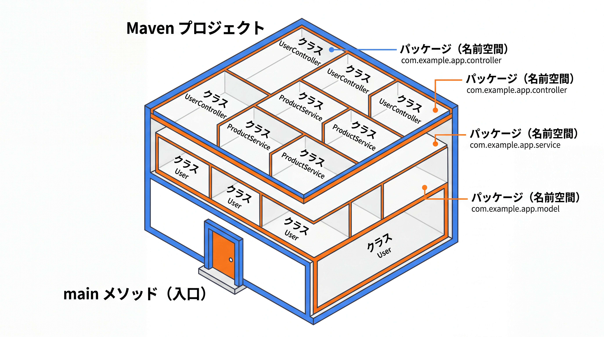

# 1-1-3 Java プロジェクトの形

📝 **前提知識**: このセクションは「1-1-2 Java という言語の正体」の内容を前提としています。

## 🎯 このセクションで学ぶこと

- パッケージ・クラス・main メソッドという、Java コードの構成単位を理解する
- Maven プロジェクトの標準的なディレクトリ構造を把握する
- 以降の Part 1 のコード例がすべて宿る「最小スケルトン」の読み方を身につける

本セクションでは、最小のコードからクラスと main の役割を読み解き、パッケージという名前空間、そして Maven プロジェクトの全体構造へと視野を広げます。

---

## 導入: Java のコードはどこに書くのか

PHP では、極端な話、`index.php` というファイルを 1 つ用意してそこにコードを書けば動きました。Laravel でも入り口は `public/index.php` で、あとは自由度の高いファイル構成の上で開発できます。

Java はそうはいきません。Java のコードは **必ずクラスの中に書く** という決まりがあり、プログラムの開始点も決まった形をしています。最初は窮屈に感じるかもしれませんが、この一貫した「形」こそが、大規模なコードベースでも迷子にならないための地図になります。まずはその最小単位から見ていきましょう。

### 🧠 先輩エンジニアの思考プロセス

> Java のプロジェクトを開いて助かるのは、どこに何があるか迷わない点です。クラス名が分かればファイルのパスが分かり、パッケージを見れば役割の区分が見える。初見のコードでも目的の場所にすぐたどり着けます。
>
> これは Laravel が規約で保っていた秩序と同じ狙いのものです。違うのは、Laravel が「お作法」として勧めていた構造を、Java は言語の決まりとして強制する点。慣れるまでは窮屈ですが、大人数で長く触るコードほど効いてきます。



---

## すべてはクラスの中に（最小スケルトン）

これから Part 1 で登場するコードは、すべて次の「最小スケルトン」の中に書かれていると考えてください。

```java
// Main.java
public class Main {
    public static void main(String[] args) {
        System.out.println("Hello, Java!");
    }
}
```

一行ずつ意味を見ます。

- `public class Main { ... }`: **クラス** の定義です。Java のコードはこのクラスの中に書きます。ファイル名は `Main.java`（クラス名と一致させる）にします。
- `public static void main(String[] args)`: プログラムの開始点となる **main メソッド** です。後述します。
- `System.out.println("Hello, Java!");`: 標準出力に 1 行表示する命令です。PHP の `echo` や `print` に相当します。

⚠️ このスケルトンには `public`・`static`・`void`・クラス本体の文法など、まだ説明していないキーワードが含まれています。今はそれらを **「型紙」** として丸ごと受け取ってください。意味を一つずつ学ぶのは後続のセクションです。Part 1 のコード例は、この `main` メソッドの中（中括弧 `{}` の内側）に書かれているものとして読み進めれば十分です。

---

## パッケージ = 名前空間

クラスが増えてくると、それらを整理する仕組みが必要になります。それが **パッケージ** です。パッケージは、Laravel で言えば PHP の名前空間（namespace）に相当します。

```java
// com/example/app/Main.java
package com.example.app;   // このクラスが属するパッケージ

public class Main {
    public static void main(String[] args) {
        System.out.println("Hello, Java!");
    }
}
```

ファイルの先頭で `package com.example.app;` と宣言すると、このクラスは `com.example.app` というパッケージに属します。そして重要なのは、**パッケージ名はディレクトリ構造と一致する** という点です。上の例なら、ファイルは `com/example/app/Main.java` という場所に置きます。別のパッケージのクラスを使いたいときは、`import` 文で取り込みます。

💡 **Laravel との対応**: PHP では `namespace App\Http\Controllers;` がディレクトリ構造（PSR-4 オートロード）に対応していました。Java のパッケージはこれとよく似ていますが、対応がより厳密で、「パッケージ名 = ディレクトリパス」が言語の規約として固定されています。

---

## main メソッド = プログラムの入り口

`main` メソッドは、プログラムを起動したときに **最初に呼び出される** 特別なメソッドです。JVM はプログラムを実行する際、`public static void main(String[] args)` という決まった形のメソッドを探し、そこから処理を始めます。

引数の `String[] args` は、コマンドラインから渡される文字列の配列（後述する「配列」の一種）です。今の段階では「ここに起動時の追加情報が入る」とだけ理解しておけば十分です。

💡 **Laravel との対応**: ブラウザからのリクエストは `public/index.php` を入り口に Laravel の本体へと入っていきました。Java のアプリにも「最初に呼ばれる場所」があり、それが `main` です。なお Spring Boot では、この `main` がアプリ全体を起動する特別な役割を持ちます。その仕組みは 3-1-3 で扱います。

---

## Maven プロジェクトの標準構造

実際の Java プロジェクトは、これらのクラスを決まった構造のディレクトリに配置します。本教材ではビルドツールに **Maven** を使い、次のような標準構造をとります。

```text
my-app/
├── pom.xml                 # 依存・ビルドの設定（composer.json に相当）
├── src/
│   ├── main/
│   │   ├── java/           # アプリ本体の .java（パッケージはここ以下のディレクトリ）
│   │   │   └── com/example/app/Main.java
│   │   └── resources/      # 設定ファイル等（application.yml など）
│   └── test/
│       └── java/           # テストコード
└── target/                 # コンパイル結果（.class）の出力先（自動生成）
```

Laravel の構成と対応づけると、次のようになります。

| Laravel（PHP） | Maven（Java） | 役割 |
|---|---|---|
| `composer.json` | `pom.xml` | 依存ライブラリとプロジェクト設定の宣言 |
| `vendor/` | ローカルリポジトリ（`~/.m2`） | ダウンロードした依存ライブラリの置き場 |
| PSR-4 オートロード | パッケージとディレクトリの対応 | クラスの場所の特定 |
| artisan コマンド | Maven ゴール（`mvn ...`） | ビルドや各種タスクの実行 |

📝 **環境構築はまだしません**: JDK や Maven のインストール、プロジェクトの生成などは Part 5 のハンズオンで実際に手を動かします。このセクションでは「Java プロジェクトはこういう形をしている」という地図を持てれば十分です。Maven 自体の詳しい仕組み（`pom.xml` の書き方やビルドライフサイクル）は 3-1-2 で扱います。

> 📝 **型紙キーワードの解説はどこで行うか**
>
> 最小スケルトンに現れた未習のキーワードは、それぞれ次のセクションで正式に解説します。今は前方参照として把握しておいてください。
>
> - クラス本体（フィールド・メソッドの定義） → 2-1-1
> - メソッドと `static` → 1-2-3
> - アクセス修飾子 `public` など → 2-1-2

---

## ✨ まとめ

- Java のコードはすべてクラスの中に書き、プログラムは `public static void main(String[] args)` から始まる
- パッケージは名前空間であり、ディレクトリ構造と一致する（PHP の namespace / PSR-4 に対応する）
- Maven プロジェクトは `src/main/java`・`pom.xml` などの標準構造を持つ（`composer.json` に相当するのが `pom.xml`）
- 最小スケルトンの未習キーワードは「型紙」として受け取り、本格的な解説は後続のセクションに委ねる

【Chapter 1-1 の振り返り】本章では、本教材の地図と Laravel との対応（1-1-1）、Java という言語の正体である静的型付け・コンパイル・JVM（1-1-2）、そしてコードが宿るプロジェクトの形（1-1-3）を見渡しました。Java を学ぶ準備が整いました。

---

次の Chapter 1-2 からは、いよいよ Java の基本文法を読み書きできるようにしていきます。最初のセクションでは、変数と型を扱います。変数宣言・プリミティブ型・参照型・`var` による型推論を理解し、Java で型を意識して変数を扱えるようになります。
