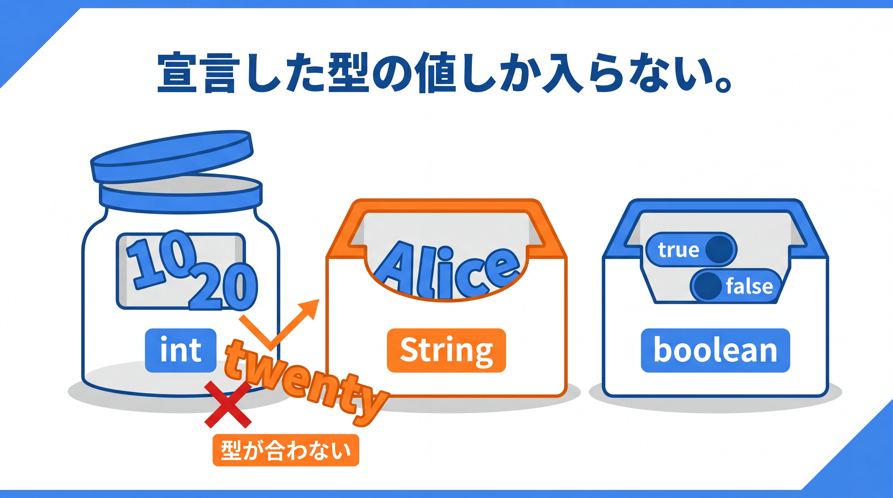
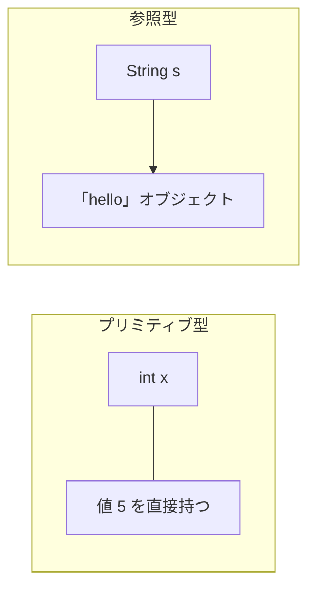

# 1-2-1 変数と型

Chapter 1-2 では、Java の基本文法を読み書きできるようにします。変数と型という「データの器」から始め、それを操作する演算子と制御構文、そして処理をまとめるメソッドや複数の値を扱う配列・文字列へと進みます。

| セクション | テーマ | 種類 |
|---|---|---|
| 1-2-1 変数と型 | 変数宣言・プリミティブ型・参照型・var | 概念 |
| 1-2-2 演算子と制御構文 | 演算子・if / switch・for / while | 概念 |
| 1-2-3 メソッドと配列・文字列 | メソッド・オーバーロード・配列・String | 概念 |

📖 **この Chapter の進め方**: まず本セクションで「データの器」である変数と型を押さえます。次に 1-2-2 でその器を操作する演算子と処理の流れ（制御構文）、最後に 1-2-3 で処理をまとめるメソッドと、まとまったデータ（配列・文字列）を扱います。

📝 **前提知識**: このセクションは「1-1-2 Java という言語の正体」の内容を前提としています。

## 🎯 このセクションで学ぶこと

- 変数宣言の書き方と、Java が「型」をどう扱うかを理解する
- プリミティブ型（8 種）と参照型の違いを説明できる
- `var` による型推論と、型変換（キャスト）の基本を理解する

本セクションでは、変数宣言の基本から始め、プリミティブ型・参照型・型推論・型変換の順に、Java の型の世界を具体的に書けるようにします。

---

## 導入: PHP の `$x` には何でも入った

Laravel を書いていたとき、変数は `$x = 1;` のように `$` を付けるだけで使えました。整数を入れた変数に、後から文字列でも配列でも入れ直せます。変数そのものに型はなく、入っている値が型を決めていました。

Java はここから根本的に変わります。変数は宣言するときに型を書き、その型はコンパイル時に固定されます。最初は宣言が増えて面倒に見えますが、この一手間が 1-1-2 で学んだ静的型付けの安全性を支えています。まずは器の作り方から見ていきましょう。

### 🧠 先輩エンジニアの思考プロセス

> PHP を書いていたころ、私は変数の中身が今どの型なのかを、頭の中やコメントで管理していました。配列のつもりが文字列だった、という取り違えも時々起こします。
>
> Java では型を最初に書く分、その管理を言語に肩代わりしてもらえます。`int total` と宣言すれば、`total` に文字列が紛れ込むことをコンパイラが許しません。宣言が冗長に見える時期は一瞬で、すぐに型そのものがメモがわりに働き始めます。



---

## 変数宣言は「型」から始まる

Java の変数宣言は「型 名前 = 値」の形が基本です。

```java
// 型 名前 = 値;
int count = 10;
String name = "Alice";
boolean active = true;
```

PHP の `$count = 10;` と違い、先頭に `int` という型が付きます。一度 `int` と宣言した変数には `int` の値しか入りません。同じ型の値なら再代入できますが、別の型は受け付けません。

```java
// count は前段で int として宣言済み
count = 20;        // OK（同じ int）
count = "twenty";  // コンパイルエラー（int に文字列は入らない）
```

⚠️ **ローカル変数は初期化が必須**: メソッドの中で宣言した変数は、値を入れる前に使うとコンパイルエラーになります。PHP では未定義の変数を使っても警告止まりでしたが、Java は「まだ何も入っていない変数」の使用を許しません。

---

## プリミティブ型（8 種）

Java の型は、大きく **プリミティブ型** と **参照型** に分かれます。プリミティブ型は言語に組み込まれた基本の型で、次の 8 種です。

| 型 | サイズ | 内容・範囲 | リテラル例 |
|---|---|---|---|
| `byte` | 8 ビット | 整数 -128 〜 127 | `byte b = 100;` |
| `short` | 16 ビット | 整数 -32,768 〜 32,767 | `short s = 1000;` |
| `int` | 32 ビット | 整数 約 -21 億 〜 21 億 | `int n = 100;` |
| `long` | 64 ビット | 非常に大きな整数 | `long big = 10_000_000_000L;` |
| `float` | 32 ビット | 単精度の小数 | `float f = 1.5f;` |
| `double` | 64 ビット | 倍精度の小数 | `double d = 3.14;` |
| `char` | 16 ビット | 1 文字（Unicode） | `char c = 'A';` |
| `boolean` | 規定なし（論理上 1 ビット） | `true` / `false` | `boolean ok = true;` |

整数のリテラルは既定で `int`、小数のリテラルは既定で `double` として扱われます。そのため `long` の大きな値には末尾に `L`、`float` には `f` を付けます。文字は `char` でシングルクォート `'A'`、文字列は後述する `String` でダブルクォート `"A"` と、引用符も区別します。

⚠️ **整数オーバーフロー**: `int` の最大値に 1 を足すと、エラーにならず最小値へ巻き戻ります。桁あふれしそうな大きい整数には `long` を使います。

💡 リテラル中のアンダースコア（`10_000_000_000L` の `_`）は、桁を読みやすくするための区切りです（Java 7 以降）。値そのものには影響しません。

なお、型ごとの **既定値** （`int` は `0`、`boolean` は `false` など）は、クラスのフィールドや配列の要素に対して適用されます。先ほど触れたように、メソッド内のローカル変数には既定値がなく、必ず自分で初期化します。

---

## 参照型とプリミティブ型の違い

プリミティブ型が「値そのもの」を持つのに対し、**参照型** は「オブジェクトへの参照（在りか）」を持ちます。`String`・配列・各種オブジェクトが参照型です。



この違いから、参照型は「何も指していない」状態として `null` を持てます。一方、プリミティブ型は `null` になれません（必ず何らかの値を持ちます）。`String` は最も身近な参照型で、詳しくは 1-2-3 で扱います。

💡 **PHP との対応**: PHP でもオブジェクトは参照的に扱われました。Java では「値を持つか、参照を持つか」が型のグループとしてはっきり分かれている、と捉えると理解しやすくなります。

---

## var による型推論

Java 10 から、ローカル変数は `var` を使って宣言でき、右辺の値から型を推論してくれます。

```java
var count = 10;      // int と推論される
var name = "Alice";  // String と推論される
```

ここで誤解しやすい点を押さえます。`var` を使っても、これは動的型付けではありません。推論された型はその場で固定され、後から別の型を入れることはできません。`var count = 10;` の `count` はあくまで `int` です。

`var` には制約もあります。初期値のない `var x;` や `var x = null;` は型を推論できないため書けません。また、フィールドやメソッドの引数には使えず、ローカル変数専用です。

💡 **バージョン差分**: `var` は Java 10 以降の機能です。Java 8 では使えず、すべて型を明記します（`int count = 10;`）。Java 11 以降なら利用できます。本教材では、右辺から型が自明な場合に読みやすさのため `var` を使うことがあります。

---

## 型変換（キャスト）

型が違う値どうしを扱うとき、型変換が必要になります。Java の型変換は 2 種類です。

**拡大変換** （小さい型から大きい型へ）は安全なので、暗黙に行われます。

```java
int i = 100;
long l = i;   // int から long へ自動変換（拡大）
```

**縮小変換** （大きい型から小さい型へ）は情報が失われる可能性があるため、明示的な **キャスト** `(型)` が必要です。

```java
double d = 3.9;
int n = (int) d;   // 明示的にキャスト。結果は 3（小数部は切り捨て）
```

⚠️ 縮小変換では桁あふれや小数の切り捨てが起こり得ます。キャストは「失われるかもしれないと承知のうえで変換する」という意思表示です。

そして、PHP のような緩い型変換は Java では起こりません。

```php
// PHP: 数値文字列が自動で数値になる
echo "5" + 3;   // 8
```

```java
// Java: + に文字列があると「連結」になる
System.out.println("5" + 3);   // "53"（文字列）
// 数値として足したいなら、明示的に変換する
System.out.println(Integer.parseInt("5") + 3);   // 8
```

🔑 Java の型変換は「暗黙に起きる安全なもの（拡大）」か「自分で明示するもの（縮小・文字列と数値の変換）」のどちらかです。値が **勝手にすり替わらない** ことが、静的型付けの安心感につながっています。

---

## ✨ まとめ

- Java の変数は「型 名前 = 値」で宣言し、宣言した型の値しか入らない。ローカル変数は使う前の初期化が必須
- プリミティブ型は 8 種（`int`・`long`・`double`・`boolean`・`char` など）で値そのものを持つ。参照型はオブジェクトへの参照を持ち、`null` になれる
- `var` はローカル変数の型を右辺から推論する（Java 10 以降）。動的型付けではなく、型は固定される
- 型変換は拡大が暗黙、縮小は明示キャスト。PHP のような緩い型変換は起きない

---

次のセクションでは、宣言した変数を使って計算や判断を行う、演算子と制御構文を学びます。算術・比較・論理の演算子、条件分岐（`if` と `switch` 式）、繰り返し（`for`・拡張 `for`・`while`）を Java の文法で書けるようになります。
