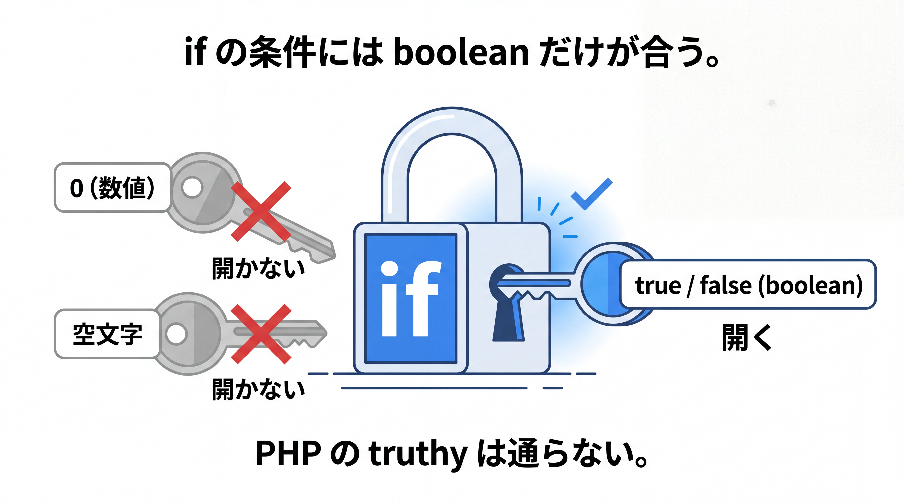

# 1-2-2 演算子と制御構文

📝 **前提知識**: このセクションは「1-2-1 変数と型」の内容を前提としています。

## 🎯 このセクションで学ぶこと

- 算術・比較・論理などの演算子を Java の文法で使える
- 条件分岐（`if` / `else`・`switch` 文・`switch` 式）を書ける
- 繰り返し（`for`・拡張 `for`・`while`・`do-while`）を書ける

本セクションでは、値を計算・比較する演算子から始め、条件によって処理を分ける分岐、同じ処理をくり返す反復へと進みます。

---

## 導入: その条件式、Java では通りません

PHP では `if ($count)` のように、数値や文字列をそのまま条件に書けました。`0` や空文字なら偽、それ以外なら真、という「truthy」の判定です。Java にこの感覚を持ち込むと、最初の関門でつまずきます。Java の `if` は真偽値（`boolean`）しか受け取らないからです。

演算子と制御構文は、変数という器を実際に動かすための文法です。ここでも PHP との細かな差が随所に顔を出します。一つずつ Java の流儀に置き換えていきましょう。

### 🧠 先輩エンジニアの思考プロセス

> PHP から移って最初にコンパイラに怒られたのが、まさにこの `if` でした。`if ($count)` のノリで `if (count)` と書いて、通らない。Java の条件には `boolean` しか書けないと知って、最初は手数が増えたように感じました。
>
> ただ、慣れるとこの厳しさは曖昧さを消してくれます。「`0` は真か偽か」「空配列は？」と悩む余地がそもそもない。条件には必ず「真偽そのもの」を書く、と割り切れるぶん、コードの意図がはっきりします。



---

## 演算子

主な演算子は PHP とよく似ていますが、型に由来する違いがあります。

- **算術**: `+` `-` `*` `/` `%`
- **比較**: `==` `!=` `<` `>` `<=` `>=`（結果は `boolean`）
- **論理**: `&&` `||` `!`（`&&` と `||` は短絡評価）
- **代入**: `=` `+=` `-=` など、**インクリメント / デクリメント**: `++` `--`

```java
int a = 7, b = 2;
System.out.println(a / b);          // 3（整数どうしの割り算は小数を切り捨て）
System.out.println(a % b);          // 1（余り）
System.out.println(a > b && b > 0); // true
```

⚠️ **整数除算**: `int` どうしの `/` は小数を切り捨てます。`7 / 2` は `3` です。小数の結果がほしいときは、どちらかを小数にします（`7.0 / 2` なら `3.5`）。

⚠️ **`==` と参照型**: プリミティブ型では `==` は値を比較しますが、`String` などの参照型では「中身」ではなく「参照（同じオブジェクトか）」を比べます。文字列の中身を比べるには `equals()` を使います。詳しくは 1-2-3 で扱います。

---

## 条件分岐: if / else

`if` の条件には `boolean` を書きます。

```java
int score = 75;
if (score >= 80) {
    System.out.println("合格");
} else if (score >= 60) {
    System.out.println("再評価");
} else {
    System.out.println("不合格");
}
```

⚠️ **PHP の truthy は使えない**: `if (score)` のように数値や文字列をそのまま条件にはできません（コンパイルエラーになります）。`if (score != 0)` のように、必ず `boolean` を返す式を書きます。これは 1-1-2 で見た「暗黙の型変換が起きない」性質の表れです。

---

## switch（文 と 式）

値に応じて分岐を分けたいときは `switch` を使います。Java には書き方が 2 つあります。

**古典的な switch 文** は、各 `case` の最後に `break` を書きます。`break` を忘れると次の `case` へ処理が流れます（フォールスルー）。

```java
// 古典的な switch 文
String role = "admin";
switch (role) {
    case "admin":
        System.out.println("管理者");
        break;
    case "user":
        System.out.println("一般ユーザー");
        break;
    default:
        System.out.println("不明");
}
```

**switch 式** （Java 14 以降）は、アロー `->` で書き、結果を値として返せます。フォールスルーがなく、`break` も不要です。

```java
// switch 式（結果を変数に代入できる）
String label = switch (role) {
    case "admin" -> "管理者";
    case "user"  -> "一般ユーザー";
    default      -> "不明";
};
System.out.println(label);
```

💡 **バージョン差分**: `switch` 式は Java 14 以降の機能です。Java 8 / 11 では古典的な `switch` 文（`break` 必須）を使います。なお `switch` 式では `case "a", "b" ->` のように複数の値をまとめられ、アローの右側で複雑な処理を書いて値を返したいときは `yield` を使います。

アローの右側で複数行の処理が必要なときは、ブロック `{}` と `yield` で値を返します。たとえば、一般ユーザーだけ加点処理を挟んでから値を返すなら、次のように書きます。

```java
// case の右側で複数行の処理をして値を返すときは yield を使う
int point = switch (role) {
    case "admin" -> 100;
    case "user" -> {
        System.out.println("一般ユーザーの加点を計算");
        yield 10;
    }
    default -> 0;
};
System.out.println(point);
```

---

## 繰り返し: for / 拡張 for / while

同じ処理をくり返すには、いくつかの書き方があります。

**基本の for** は、初期化・条件・更新を 1 行に書きます。

```java
for (int i = 0; i < 3; i++) {
    System.out.println(i);   // 0, 1, 2
}
```

**拡張 for（for-each）** は、配列やコレクションの要素を順に取り出します。これは PHP の `foreach` に相当します。

```java
String[] names = {"Alice", "Bob"};
for (String name : names) {
    System.out.println(name);
}
```

```php
// PHP の foreach（対応する書き方）
foreach ($names as $name) {
    echo $name;
}
```

**while** は条件が真の間くり返し、**do-while** は本体を最低 1 回実行してから条件を判定します。途中で抜けるには `break`、次のくり返しへ飛ばすには `continue` を使います（PHP と同じ考え方です）。

コードで見ると次のとおりです。`do-while` は条件が最初から偽でも本体が 1 回は実行される点が `while` との違いです。

```java
// while: 条件が真の間くり返す
int i = 0;
while (i < 3) {
    System.out.println(i);   // 0, 1, 2
    i++;
}

// do-while: 条件が最初から偽でも本体は 1 回実行される
int k = 5;
do {
    System.out.println(k);   // 5 が 1 回だけ出力される
    k++;
} while (k < 3);
```

---

## ✨ まとめ

- 演算子は算術・比較・論理。`int` どうしの除算は小数を切り捨て、剰余は `%`。比較や論理の結果は `boolean`
- `if` の条件は `boolean` 必須。PHP の truthy（`0` や空文字をそのまま条件にする）は使えない
- `switch` は古典的な `switch` 文（`break` 必須・フォールスルーあり）と `switch` 式（Java 14 以降・値を返せる）の 2 通り
- 繰り返しは `for`・拡張 `for`（for-each、PHP の `foreach` に相当）・`while`・`do-while`

---

次のセクションでは、処理をひとまとめにするメソッドと、複数の値を扱う配列・文字列を学びます。メソッドの定義（シグネチャ・戻り値型・オーバーロード・`static`）、配列、そして `String` の不変性を理解し、使えるようになります。
