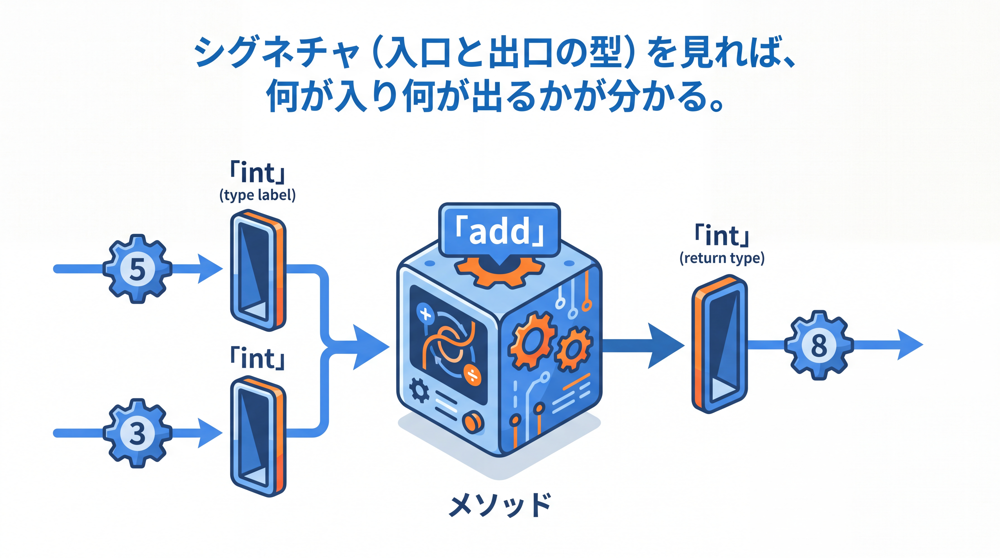

# 1-2-3 メソッドと配列・文字列

📝 **前提知識**: このセクションは「1-2-2 演算子と制御構文」の内容を前提としています。

## 🎯 このセクションで学ぶこと

- メソッドの定義（シグネチャ・戻り値型・`static`）とオーバーロードを理解する
- 配列の宣言・アクセス・注意点を理解する
- `String` の不変性と、`==` ではなく `equals()` で比較する理由を理解する

本セクションでは、処理をまとめるメソッドから始め、固定長のデータである配列、そして文字列を表す `String` の性質へと進みます。

---

## 導入: 型のない関数から、型で守られたメソッドへ

PHP の関数は `function add($a, $b)` のように、引数や戻り値の型を書かなくても定義できました。Java では、メソッド（PHP の関数に相当）の引数と戻り値に必ず型を付けます。型を書く手間と引き換えに、「何を受け取り何を返すのか」がシグネチャを見ただけで分かるようになります。

ここまで、コードは 1-1-3 で見た最小スケルトンの `main` の中に書いてきました。本セクションでは、その `main` から呼び出す自前のメソッドを作れるようにします。

### 🧠 先輩エンジニアの思考プロセス

> Part 1 のコードは `main` の中に書く、と 1-1-3 で話しました。ここで実務的なつまずきを一つ先に共有しておきます。`main` から自分で作ったメソッドを呼ぶとき、そのメソッドにも `static` を付けないとコンパイルエラーになります。
>
> 理由は 2-1-2 でアクセス修飾子と一緒に腑に落ちますが、今は「`main` から直接呼ぶ補助メソッドには `static` を付ける」と型紙として覚えておけば、手が止まりません。



---

## メソッドの定義（シグネチャと static）

メソッドは「修飾子 戻り値型 メソッド名(引数の型と名前) { 本体 }」の形で定義します。

```java
// Main.java
public class Main {
    public static void main(String[] args) {
        int result = add(3, 5);
        System.out.println(result);   // 8
        greet("Alice");
    }

    // int を 2 つ受け取り、int を返す
    static int add(int a, int b) {
        return a + b;
    }

    // 戻り値がない場合は void
    static void greet(String name) {
        System.out.println("Hello, " + name);
    }
}
```

**シグネチャ** とは、メソッド名と引数の型・並びのことです。戻り値の型は必ず書き、返す値がなければ `void` とします。PHP の関数が型を省略できたのに対し、Java では引数・戻り値の型が必須です。これにより、呼び出す側は型の食い違いをコンパイル時に検出できます。

`add` と `greet` に `static` を付けたのは、`static` である `main` から直接呼び出すためです（この意味は 2-1-2 で扱います）。

---

## オーバーロード

Java では、**同じ名前で引数の型や数が違うメソッド** を複数定義できます。これを **オーバーロード** といいます。

```java
// Main クラス内のメソッド定義（抜粋）
static int add(int a, int b) { return a + b; }
static double add(double a, double b) { return a + b; }
static int add(int a, int b, int c) { return a + b + c; }
```

呼び出すときの引数に応じて、適切なメソッドが自動的に選ばれます。ただし、引数が同じで **戻り値の型だけが違う** メソッドは定義できません（区別は引数で行います）。

💡 **PHP との対応**: PHP にはオーバーロードの仕組みがなく、デフォルト引数・可変長引数・ユニオン型で 1 つの関数に対応させていました。Java では、引数の型と数の組み合わせごとに別のメソッドを用意します。

---

## 配列

**配列** は、同じ型の値を固定長で並べたものです。

```java
// main メソッド内のコード
int[] nums = {10, 20, 30};        // 初期値つきで宣言
int[] buf = new int[3];           // 長さ 3、要素は既定値の 0
System.out.println(nums.length);  // 3（長さは .length フィールド）
System.out.println(nums[0]);      // 10（インデックスは 0 始まり）
nums[1] = 25;                     // 要素を代入
```

⚠️ **範囲外アクセス**: 長さ 3 の配列に対する `nums[3]` は `ArrayIndexOutOfBoundsException`（実行時の例外）になります。

⚠️ **`.length` / `.length()` / `.size()` の違い**: 長さの取り方は対象で異なります。配列は `.length`（フィールド、カッコなし）、`String` は `.length()`（メソッド）、後で学ぶ `List` は `.size()` です。混同しやすい定番のつまずきどころです。

💡 **PHP との対応**: PHP の配列は可変長で型が混在でき、連想配列も兼ねていました。Java の配列は固定長・単一型です。可変長やキーと値のペアを扱いたいときは、次の Chapter で学ぶ **コレクション** （`List` / `Map`）を使います。

---

## String と不変性

`String` は参照型で、**不変（immutable）** という重要な性質を持ちます。一度作った文字列の中身は、あとから変更されません。

```java
// main メソッド内のコード
String s = "Hello";
String t = s + ", Java";   // 連結すると新しい文字列ができる
System.out.println(s);     // Hello（s 自体は変わっていない）
System.out.println(t);     // Hello, Java
```

`length()`・`charAt(i)`・`substring(a, b)`・`toUpperCase()`・`contains(...)`・`split(...)` など、多くの便利なメソッドがありますが、いずれも元の文字列を書き換えるのではなく、新しい文字列を返します。

⚠️ **比較は `==` ではなく `equals()`**: `==` は参照（同じオブジェクトか）を比べるため、中身が同じでも `false` になることがあります。文字列の中身を比べるには `equals()` を使います。

```java
// main メソッド内のコード
String a = "abc";
String b = new String("abc");
System.out.println(a == b);        // false（参照が異なる）
System.out.println(a.equals(b));   // true（中身は同じ）
```

これは 1-2-1 で見たとおり、参照型の変数が「参照」を持つためです。中身の一致は `equals()` で判定します（`equals()` の詳しい仕組みと契約は 2-2-1 で扱います）。

💡 ループの中で何度も文字列を連結する場合は、`StringBuilder` を使うと効率的です。`String` は連結のたびに新しいオブジェクトを作るため、大量の連結では `StringBuilder` が向きます。

💡 **バージョン差分**: 複数行の文字列は、テキストブロック `"""..."""`（Java 15 以降）で書けます。Java 8 / 11 では使えないため、`\n` と `+` を使って組み立てます。

---

## ✨ まとめ

- メソッドは「戻り値型 名前(引数)」で定義し、型を必ず書く（戻り値がなければ `void`）。`main` から直接呼ぶ補助メソッドには `static` を付ける
- オーバーロードで同名・引数違いのメソッドを定義できる（PHP にはない仕組み）
- 配列は固定長・単一型で、`.length` と 0 始まりのインデックスでアクセスする（範囲外は例外）。可変長やキー値はコレクションで扱う
- `String` は不変。中身の比較は `==` ではなく `equals()` を使う

【Chapter 1-2 の振り返り】本章では、型を伴う変数（1-2-1）、それを操作する演算子と処理の流れ（1-2-2）、処理をまとめるメソッドとまとまったデータである配列・文字列（1-2-3）を学び、Java の基本文法を一通り読み書きできるようにしました。

---

次の Chapter 1-3 では、複数のデータをまとめて扱う方法と、エラーの扱い方を学びます。最初のセクションでは、`List`・`Map`・`Set` とジェネリクスの基本的な使い方を理解し、用途に応じて選べるようになります。配列では足りなかった「可変長・キーと値・重複の排除」を、コレクションで実現します。
