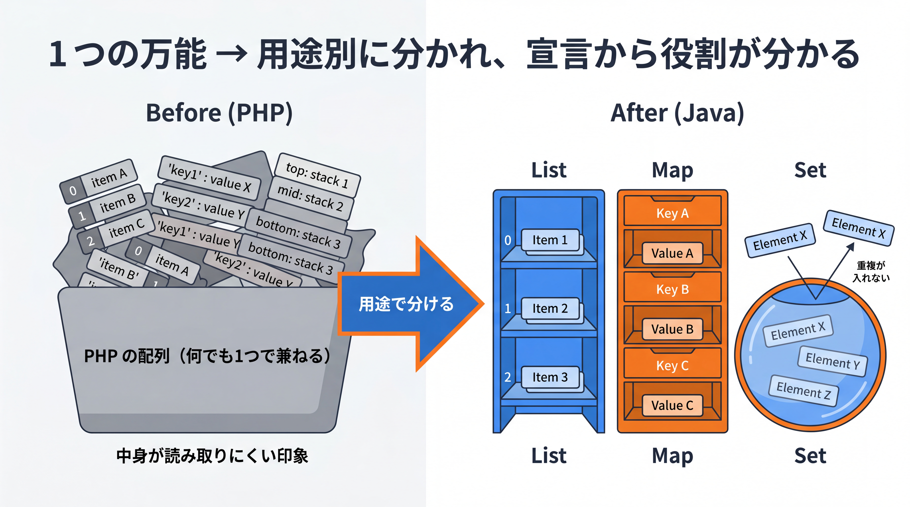
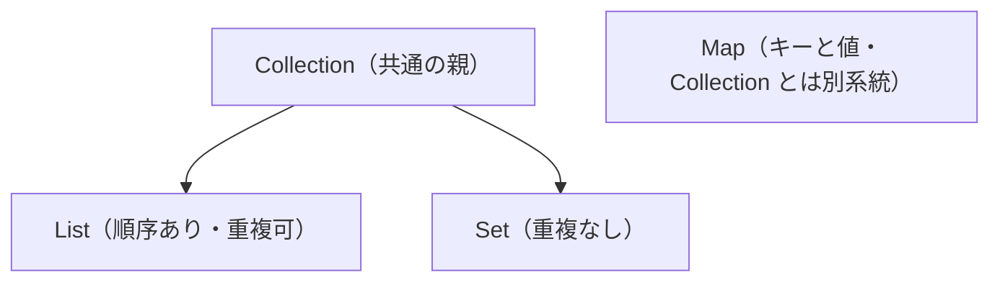

# 1-3-1 コレクション

Chapter 1-3 では、複数のデータをまとめて持つ方法（コレクション）と、エラーを扱う方法（例外処理）を Java の流儀で書けるようにします。ここまでの基本文法に、実務でほぼ毎回使う 2 つの道具を加えます。

| セクション | テーマ | 種類 |
|---|---|---|
| 1-3-1 コレクション | List・Map・Set とジェネリクス（使う側） | 概念 |
| 1-3-2 例外処理 | 例外・try / catch / finally・検査例外・throw | 概念 |

📖 **この Chapter の進め方**: まず本セクションで、複数の値をまとめて持つコレクションを学びます。次に 1-3-2 でエラーを扱う例外処理を学びます。これで Part 1（言語の基礎）が完成し、Part 2 のオブジェクト指向へ進む準備が整います。

📝 **前提知識**: このセクションは「1-2-3 メソッドと配列・文字列」の内容を前提としています。

## 🎯 このセクションで学ぶこと

- `List`・`Map`・`Set` の特徴と基本的な使い方を理解し、用途に応じて選べる
- ジェネリクス（`<型>`）で要素の型を指定し、型安全にコレクションを扱える
- インターフェース型（`List`）と実装（`ArrayList`）を使い分ける考え方を理解する

本セクションでは、配列の限界から出発し、`List`・`Map`・`Set` の使い分け、ジェネリクス、そしてインターフェースと実装の関係へと進みます。

---

## 導入: PHP の配列 1 つでできたことを、Java はどう分けるか

PHP の配列は万能でした。順序のあるリストにも、キーで引く連想配列にも、スタックにも使えます。1 つの仕組みで何でもこなせる反面、その配列が「今どういう使われ方なのか」はコードからは読み取りにくいものでした。

Java はここを複数の型に分けます。順序のある並びは `List`、キーと値のペアは `Map`、重複のない集合は `Set`。さらに要素の型まで指定します。最初は使い分けが増えて見えますが、それぞれの入れ物が何のためのものかが、宣言から一目で分かるようになります。

### 🧠 先輩エンジニアの思考プロセス

> PHP の配列は本当に便利で、リストにも連想配列にもスタックにもなりました。その反面、ある配列が「順序のあるリストなのか、キー引きの辞書なのか」がコードから読み取りにくく、私はよく `var_dump` で中身を確認していました。
>
> Java はここを型で分けます。`List` なのか `Map` なのかが宣言に出るので、その変数が何のための入れ物かが一目で分かります。書く側の手間は増えますが、後から読む側に渡る情報は確実に増えます。



---

## なぜコレクションか（配列の限界）

1-2-3 で見たとおり、配列は固定長・単一型でした。しかし実務では、要素数があらかじめ決まらず動的に増減したり、キーで値を引きたかったり、重複を除きたかったりします。配列だけではこうした要求に応えきれません。

これに応えるのが **コレクション** です。Java は標準ライブラリ（`java.util`）に、用途別のコレクションを用意しています。代表的なのが `List`・`Map`・`Set` の 3 つです。

---

## List（順序のある並び）

`List` は、順序を保ち、重複を許す並びです。最もよく使う実装が `ArrayList` です。

```java
List<String> names = new ArrayList<>();
names.add("Alice");
names.add("Bob");
names.add("Alice");                 // 重複も格納できる
System.out.println(names.get(0));   // Alice（インデックスは 0 始まり）
System.out.println(names.size());   // 3
for (String name : names) {
    System.out.println(name);
}
```

`List<String>` の `<String>` は「要素は `String`」という指定です（後述します）。`new ArrayList<>()` の `<>` は、型を左辺から推論する記法（ダイヤモンド演算子）です。

---

## Map（キーと値）

`Map` は、キーと値のペアを保持します。キーは一意です。代表的な実装が `HashMap` です。

```java
Map<String, Integer> scores = new HashMap<>();
scores.put("Alice", 90);
scores.put("Bob", 75);
System.out.println(scores.get("Alice"));   // 90
for (String key : scores.keySet()) {
    System.out.println(key + " = " + scores.get(key));
}
```

`Map<String, Integer>` は、キーが `String`、値が `Integer` という指定です。PHP の連想配列に近い役割ですが、キーと値の型を明示する点が異なります。なお PHP の連想配列のキーは文字列か整数に限られるのに対し、Java の `Map` は任意の型をキーにできます。

💡 値の型が `int` ではなく `Integer` なのは、コレクションがオブジェクト（参照型）しか格納できないためです。`int` と `Integer` は自動で相互変換されます（オートボクシング）。今は「コレクションの要素には `Integer` を使う」と捉えておけば十分です。

---

## Set（重複のない集合）

`Set` は、重複を自動的に排除する集合です。代表的な実装が `HashSet` です。

```java
Set<String> tags = new HashSet<>();
tags.add("java");
tags.add("spring");
tags.add("java");                          // 重複は無視される
System.out.println(tags.size());           // 2
System.out.println(tags.contains("java")); // true
```

3 つの特徴を表にまとめます。

| コレクション | 順序 | 重複 | 引き方 | 主な用途 | 代表的な実装 |
|---|---|---|---|---|---|
| `List` | あり | 可 | インデックス（0 始まり） | 順序つきの一覧 | `ArrayList` |
| `Map` | 実装による | 値は可・キーは不可 | 任意のキー | キーで引く辞書 | `HashMap` |
| `Set` | 実装による | 不可 | なし | 重複のない集合 | `HashSet` |

これらの関係を図にすると、`List` と `Set` は共通の親 `Collection` を持ち、`Map` はそれとは別系統です。



---

## ジェネリクスの「使う側」: 要素の型を指定する

`List<String>` の `<String>` が **ジェネリクス** です。要素の型を指定することで、別の型を入れようとするとコンパイルエラーになり、取り出すときも型が分かっているためキャストが不要になります。

```java
List<String> names = new ArrayList<>();
names.add("Alice");
names.add(123);                 // コンパイルエラー（String の List に int は入れられない）
String first = names.get(0);    // キャスト不要で String として取り出せる
```

⚠️ 型を指定しない書き方（`List names = new ArrayList();` のように `<>` を省く「raw type」）は避けます。raw type では要素が `Object` 扱いになるため、取り出すたびにキャストが必要になり、誤った型の値が紛れ込んでもコンパイル時に気づけません。必ず要素の型を指定します。

💡 **バージョン差分**: `List.of("a", "b")` で変更不可のリストを簡潔に作れます（Java 9 以降）。Java 8 では `Arrays.asList(...)` などを使います。なお `List.of(...)` で作ったリストは要素の追加・変更ができません（変更したいときは `new ArrayList<>()` を使います）。

ここで扱うのは、あくまでジェネリクスの「使う側」（`<型>` を指定して使う）です。自分でジェネリックなクラスを定義する「定義側」は 2-4-2 で扱います。

なお、`String` 以外の自作クラスを `Set` の要素や `Map` のキーにするときは、`equals` / `hashCode` の実装が必要になります（2-2-1 で扱います）。今は `String` をキーにする範囲で十分です。

---

## インターフェース型と実装の使い分け

`List<String> names = new ArrayList<>();` という宣言では、左辺が `List`（インターフェース型）、右辺が `ArrayList`（具体的な実装）になっています。なぜ左辺を `ArrayList` ではなく `List` にするのでしょうか。

理由は、後で実装を別のもの（たとえば `LinkedList`）に変えても、`List` として扱っている限りコードの他の部分に影響しないからです。これは「型（契約）と実装を分ける」という、Part 2 で学ぶインターフェースとポリモーフィズム（2-3）の考え方の入り口です。今は「変数はインターフェース型（`List`）で受け、生成は実装（`ArrayList`）で行う」という形を覚えておけば十分です。

---

## ✨ まとめ

- コレクションは、固定長・単一型の配列では足りない「可変長・キーと値・重複の排除」を担う
- `List`（順序あり・重複可）、`Map`（キーと値）、`Set`（重複なし）を用途で選ぶ。代表実装は `ArrayList` / `HashMap` / `HashSet`
- ジェネリクス `<型>` で要素の型を指定すると型安全に扱える（raw type は避ける）。`List.of` は Java 9 以降
- 変数はインターフェース型（`List`）で受け、生成は実装（`ArrayList`）で行うのが基本形（ポリモーフィズムの入り口）

---

次のセクションでは、もう一つの実務必須スキルである例外処理を学びます。例外とは何か、`try` / `catch` / `finally` による扱い方、Java 固有の検査例外と非検査例外の違い、そして `throw` による送出を理解し、エラーを型として扱えるようになります。
