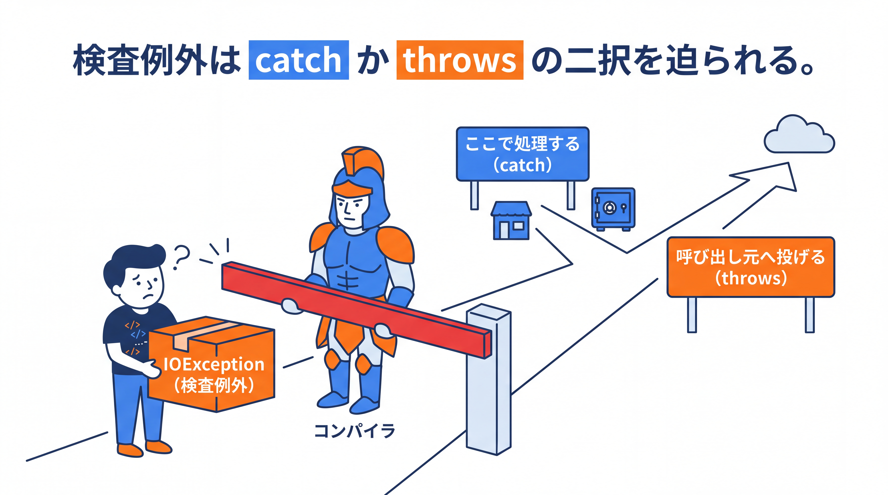
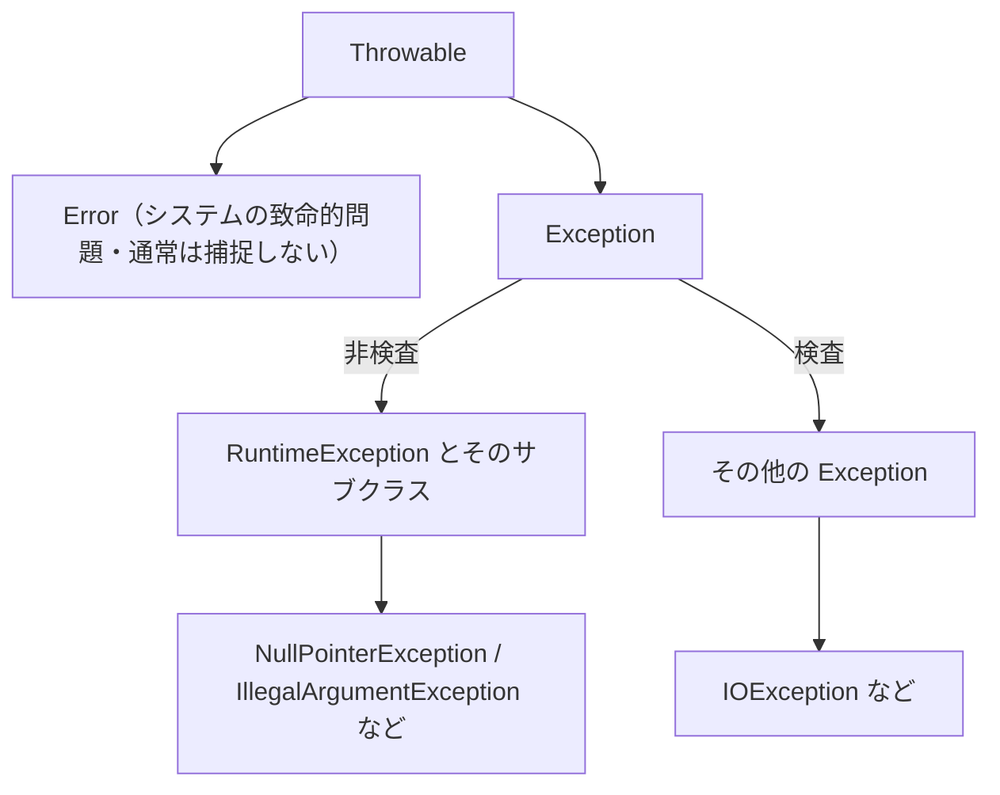

# 1-3-2 例外処理

📝 **前提知識**: このセクションは「1-2-3 メソッドと配列・文字列」の内容を前提としています。

## 🎯 このセクションで学ぶこと

- 例外の役割（正常系と異常系の分離）と、`try` / `catch` / `finally` の使い方を理解する
- 例外の階層と、Java 固有の検査例外・非検査例外の違いを説明できる
- `throw` による送出と独自例外の定義を理解し、エラーを型として扱える

本セクションでは、例外の考え方から始め、扱い方（`try` / `catch` / `finally`）、例外の階層、検査例外と非検査例外の区別、そして送出と独自例外へと進みます。

---

## 導入: 知っている try / catch と、知らない「検査例外」

例外処理そのものは、Laravel でも書いてきました。`try` / `catch` で例外を受け止め、`throw` で投げる。この基本的な考え方は Java でもそのまま通用します。

ただし Java には、PHP になかった仕組みが一つあります。**検査例外** です。これは「この処理は失敗しうるので、必ず備えなさい」とコンパイラが要求してくるもので、Java 初学者がつまずく定番ポイントです。本セクションでは、既知の `try` / `catch` を確認したうえで、この検査例外を中心に Java 固有の流儀を押さえます。

### 🧠 先輩エンジニアの思考プロセス

> 検査例外は、Java を触り始めた PHP 出身者がまず「なんだこれは」と引っかかるところです。ファイルを読むだけのコードで、コンパイラに「この例外を処理しろ」と要求される。PHP では意識しなくてよかったことです。
>
> 検査例外は Java の中でも賛否が分かれる仕組みですが、最初に知っておくと現場で慌てません。「赤線が出たら、`catch` するか `throws` を付けるかの二択」とだけ押さえておけば、まず詰まりません。



---

## 例外とは（正常系と異常系の分離）

処理の失敗を戻り値で表そうとすると、呼び出し側は毎回その戻り値をチェックする必要があり、本来やりたい処理（正常系）がエラーチェックで埋もれてしまいます。

**例外** は、この異常系を別レーンに分離する仕組みです。問題が起きたらその場で例外を投げ、呼び出し側のどこかでまとめて受け止めます。正常系のコードは「うまくいく前提」で素直に書けます。

PHP にも `try` / `catch`・`throw` があり、この基本的な考え方は共通です。Java 固有なのは、このあと見る「検査例外」という区別です。

---

## try / catch / finally

例外は `try` で囲んだ範囲で発生を捕まえ、`catch` で型ごとに受け止めます。`finally` は成功・失敗にかかわらず最後に必ず実行されます。

```java
try {
    int n = Integer.parseInt("abc");   // 変換に失敗すると例外が投げられる
    System.out.println(n);
} catch (NumberFormatException e) {
    System.out.println("数値に変換できません: " + e.getMessage());
} finally {
    System.out.println("成功・失敗にかかわらず必ず実行される");
}
```

`catch` は例外の **型** で受け止めます。複数の型をまとめて受けるには `catch (NumberFormatException | NullPointerException e)` のように書きます（マルチキャッチ）。`finally` は後片付け（接続のクローズなど）に向いています。

💡 ファイルなど後始末が必要な資源は、`try (var reader = ...) { ... }` という形（try-with-resources。仕組み自体は Java 7 以降、`var` での記述は Java 10 以降）を使うと自動的に閉じてくれます。本セクションでは深入りしませんが、こういう書き方があると知っておいてください。

---

## 例外の階層

例外はクラスであり、階層を持ちます。この階層を知っておくと、何を `catch` し、何を `catch` すべきでないかが見えてきます。



- **Throwable**: すべての例外・エラーの頂点。
- **Error**: メモリ不足など、アプリケーション側では対処しようのない致命的な問題。基本的に `catch` しません。
- **Exception**: アプリケーションが扱う例外。ここがさらに 2 種類に分かれます（次節）。

---

## 検査例外 vs 非検査例外（Java 固有）

`Exception` は、`RuntimeException` を境に 2 つに分かれます。この区別が Java 固有の考え方です。

- **非検査例外** （unchecked）: `RuntimeException` とそのサブクラス。コンパイラは処理を強制しません。例として `NullPointerException`・`IllegalArgumentException`・`NumberFormatException`・`ArrayIndexOutOfBoundsException`（1-2-3 で出た配列の範囲外アクセス）があります。多くはプログラムのバグに起因します。
- **検査例外** （checked）: `Exception` のうち `RuntimeException` 以外。コンパイラが処理を強制します。`catch` するか、メソッドに `throws` を宣言するかのどちらかが必須です。例として `IOException`（入出力の失敗）があります。

⚠️ 検査例外を投げうる処理を、`catch` も `throws` もせずに書くとコンパイルエラーになります。先ほどの「赤線が出たら `catch` か `throws`」の二択は、このことを指しています。

💡 **PHP との対応**: PHP には検査例外の概念がなく、すべて非検査例外のように扱えました。そのため最初は戸惑いますが、Java では「この処理は失敗しうる」とコンパイラが前もって教えてくれる仕組み、と捉えると見通しが立ちます。

なお、どの例外をどこで処理すべきかという設計の指針は、4-3-1（例外設計とログ）で扱います。ここでは仕組みの理解に集中します。

---

## throw と独自例外

例外を自分で送出するには `throw` を使います。

```java
static int divide(int a, int b) {
    if (b == 0) {
        throw new IllegalArgumentException("0 で割ることはできません");
    }
    return a / b;
}
```

既存の例外では表現しにくいエラーは、自分で例外クラスを定義できます。多くの場合は `RuntimeException` を継承して非検査例外にします。

```java
// TaskNotFoundException.java
public class TaskNotFoundException extends RuntimeException {
    public TaskNotFoundException(String message) {
        super(message);
    }
}
```

ここで使った `extends` と `super` は継承の機能で、Part 2 の 2-2-1 で正式に学びます。今は「独自例外はこの形で作る」と型紙として捉えてください。

こうして例外を型として定義すると、`catch` で「この種類のエラーだけ」を受け止められます。エラーが単なるメッセージ文字列ではなく **型として扱える** ことが、Java の例外処理の強みです。

---

## ✨ まとめ

- 例外は、異常系を正常系から分離する仕組み。問題が起きたら投げ、`try` / `catch` で受け止め、`finally` で後片付けする
- 例外はクラスの階層を持つ（`Throwable` → `Error` / `Exception` → `RuntimeException`）
- 検査例外（コンパイラが処理を強制）と非検査例外（強制しない）の区別は Java 固有。「赤線が出たら `catch` か `throws`」
- `throw` で送出し、`RuntimeException` などを継承して独自例外を型として定義できる

【Chapter 1-3 の振り返り】本章では、複数のデータをまとめて扱うコレクション（1-3-1）と、エラーを型として扱う例外処理（1-3-2）を学びました。

【Part 1 の振り返り】Part 1 では、Java という言語の正体（静的型付け・コンパイル・JVM）から始め、変数と型・演算子と制御構文・メソッドと配列・文字列、そしてコレクションと例外処理まで、Java を読み書きするための基礎文法を一通り身につけました。型を意識してコードを読み書きする土台ができています。

---

次の Part 2 では、いよいよあなたの最大のギャップである本格的なオブジェクト指向に踏み込みます。最初のセクション 2-1-1 では、クラス・フィールド・メソッド・コンストラクタ・`this` を Java の文法で定義し、PHP の基礎 OOP との違いを押さえます。そこから継承・インターフェース・ポリモーフィズムへと進み、これらは Part 3 で Spring を理解するための設計の土台になります。
