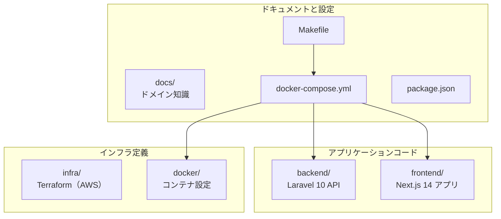

# 1-1-1 LMS リポジトリの構成を把握する

この Chapter「LMS 開発環境の全体像」では、LMS リポジトリの構成と開発ツールの全体像を把握します。

| セクション | テーマ | 種類 |
|---|---|---|
| 1-1-1 | LMS リポジトリの構成を把握する | 混合 |
| 1-1-2 | Docker Compose の応用構成を理解する | 概念 |
| 1-1-3 | Makefile による開発コマンド体系を理解する | 混合 |

📖 **この Chapter の進め方**: まず本セクションでリポジトリの全体像をつかみ、次に Docker Compose で開発環境がどのように構築されているかを理解し、最後に Makefile で日常的な開発コマンドを使いこなせるようにします。概念を学んだらすぐにターミナルで確認する流れで進めてください。

## 🎯 このセクションで学ぶこと

- LMS リポジトリのトップレベル構造と、各ディレクトリの役割を説明できる
- backend / frontend / infra / docker / docs の責務の違いを理解する
- CLAUDE.md / AGENTS.md の階層構造と、AI 協働における役割を理解する

リポジトリの全体像を概念として把握した後、実際にターミナルでディレクトリを探索して理解を定着させます。

---

## 導入: ファイルの山に圧倒されないために

LMS のリポジトリをはじめて開くと、ディレクトリやファイルが大量に並んでいます。`backend/` の中には何十ものフォルダがあり、`frontend/` にも見慣れない構造が広がっています。さらに `infra/` や `docker/` といったディレクトリもあり、どこから手をつければよいかわかりません。

この「圧倒される感覚」は、リポジトリの構造に対するメンタルモデルがないことが原因です。逆に言えば、トップレベルの構成と各ディレクトリの責務を一度把握してしまえば、どんなに大きなリポジトリでも迷わずナビゲートできるようになります。

### 🧠 先輩エンジニアはこう考える

> LMS の開発に参加したとき、最初にやったのはリポジトリのトップレベルを `ls` で眺めることでした。「backend と frontend が分かれているモノレポ構成なんだな」「infra ディレクトリがあるから Terraform でインフラ管理しているんだな」と、ディレクトリ名だけで技術スタックの大枠が読み取れます。コードを読む前に、まず地図を頭に入れる。これが大規模リポジトリを効率よく理解するコツです。

---

## プロジェクト構造の全体像

LMS リポジトリは **モノレポ**（monorepo）構成を採用しています。モノレポとは、フロントエンド・バックエンド・インフラなど複数のプロジェクトを 1 つのリポジトリで管理する方式です。リポジトリを分けるマルチレポ方式と比べて、コードの変更を一括で管理しやすく、チーム間の連携がスムーズになるメリットがあります。

トップレベルの構造は以下のとおりです。

```
lms/
├── AGENTS.md              # AI 協働用ルール（全体）
├── CLAUDE.md              # プロジェクト概要・開発コマンド
├── Makefile               # 共通タスク用コマンド
├── package.json           # Git フック管理（Chapter 1-2 で解説）
├── docker-compose.yml     # 5 サービス構成
├── run-php-lint-and-fix.sh # PHP リント用スクリプト（Chapter 1-2 で解説）
├── backend/               # Laravel API（PHP 8.1 / Laravel 10）
├── frontend/              # Next.js アプリ（Next.js 14 / React 18 / TypeScript）
├── infra/                 # Terraform による AWS インフラ定義
├── docker/                # Docker イメージとコンテナ設定
├── docs/                  # ドキュメント（ドメインモデル・用語集等）
├── data/                  # データファイル
└── onboarding/            # オンボーディング資料
```

🔑 **押さえるべきポイント**: トップレベルを大きく分けると、**アプリケーションコード**（`backend/`、`frontend/`）、**インフラ定義**（`infra/`、`docker/`）、**ドキュメントと設定**（`docs/`、`Makefile`、`docker-compose.yml` 等）の 3 グループになります。この 3 グループの区分を頭に入れておくと、「この変更はどこに影響するか」を素早く判断できます。

以下の図は、リポジトリの構成を役割ごとにグループ化したものです。



---

## backend ディレクトリの構造

`backend/` は **Laravel 10** で構築された API サーバーです。あなたが COACHTECH 教材で学んだ Laravel の MVC 構成をベースに、**Clean Architecture** の考え方を取り入れた拡張構成になっています。

```
backend/app/
├── Console/Commands/    # Artisan コマンド
├── Enums/               # 列挙型
├── Exceptions/          # 例外
├── Http/
│   ├── Controllers/     # コントローラー
│   ├── Middleware/       # ミドルウェア
│   ├── Requests/        # フォームリクエスト
│   └── Resources/       # API リソース
├── Libs/                # ユーティリティ
├── Listeners/           # イベントリスナー
├── Mail/                # メール
├── Models/              # Eloquent モデル
├── Notifications/       # 通知
├── Observers/           # モデルオブザーバー
├── Providers/           # サービスプロバイダー
├── Repositories/        # データアクセス層
├── Services/            # サービス層
├── UseCases/            # ビジネスロジック層
└── Support/             # ヘルパー
```

COACHTECH 教材で学んだ `Controllers/`、`Models/`、`Middleware/` などはそのまま存在しています。LMS で特徴的なのは、以下の 3 つのディレクトリが追加されている点です。

| ディレクトリ | 役割 | 概要 |
|---|---|---|
| `UseCases/` | ビジネスロジック層 | 1 つのユースケース（操作）に対して 1 クラス。コントローラーから呼び出される |
| `Services/` | サービス層 | 外部 API 連携や横断的なビジネスロジックを担当 |
| `Repositories/` | データアクセス層 | Eloquent の操作をモデルから分離し、データ取得ロジックを集約 |

この 3 層構造によって、コントローラーがスリムに保たれ、ビジネスロジックの再利用性とテスタビリティが向上しています。

💡 **今は概要だけ把握すれば十分です**。UseCase / Service / Repository パターンの詳細は Part 4「バックエンド応用と外部連携」で体系的に学びます。ここでは「Laravel の標準構成に 3 つの層が追加されている」ということだけ覚えておいてください。

また、`backend/` の直下には以下の重要なディレクトリもあります。

| ディレクトリ | 役割 |
|---|---|
| `database/` | マイグレーション・シーダー |
| `routes/` | API ルーティング定義 |
| `config/` | 設定ファイル（環境変数の読み込み先） |
| `tests/` | PHPUnit テスト |

---

## frontend ディレクトリの構造

`frontend/` は **Next.js 14**（React 18 / TypeScript）で構築されたフロントエンドアプリケーションです。フロントエンドの知識がなくても、ディレクトリの役割を把握しておくことで、Claude Code への指示が格段にスムーズになります。

```
frontend/src/
├── app/            # Next.js App Router（ルーティング）
├── components/     # 再利用可能コンポーネント
├── features/       # 機能ごとのコンポーネント・API
├── store/          # Zustand ストア（状態管理）
├── type/           # TypeScript 型定義
├── lib/            # ユーティリティ関数
├── hooks/          # カスタムフック
├── providers/      # プロバイダー
├── config/         # 設定
├── constants/      # 定数
└── globals.css     # グローバルスタイル
```

各ディレクトリの役割を簡潔にまとめます。

| ディレクトリ | 役割 | Laravel で例えると |
|---|---|---|
| `app/` | URL とページの対応（ルーティング） | `routes/` |
| `components/` | 再利用可能な UI 部品 | Blade コンポーネント |
| `features/` | 機能単位でまとめたコードの集合 | Controllers + Views を機能で分割したイメージ |
| `store/` | アプリ全体で共有する状態の管理 | セッション |
| `type/` | データの型を定義 | フォームリクエストの型定義に近い |
| `lib/` | 共通のユーティリティ関数 | `app/Libs/` |
| `hooks/` | ロジックの再利用パーツ | トレイト |
| `providers/` | アプリ全体に機能を注入 | サービスプロバイダー |

💡 **今は概要だけ把握すれば十分です**。React のコンポーネント、フック（Hooks）、Next.js の App Router などの概念は Part 2「フロントエンド基盤」で丁寧に解説します。ここでは「backend の構造と対比するとこう対応する」という大まかなイメージを持てれば OK です。

⚠️ **注意**: `frontend/src/` 内には `v1` と `v2` のディレクトリが存在する場所があります。LMS では **v2 が現行バージョン** であり、すべての新規開発は v2 で行います。v1 のコードは参照しないでください。

---

## infra / docker / docs の概要

### infra ディレクトリ

`infra/` は **Terraform 1.11** による AWS インフラ定義です。ECS（コンテナ実行環境）、CloudFront（CDN）、ALB（ロードバランサー）、S3（ストレージ）などのリソースがコードとして定義されています。

```
infra/
├── stacks/       # 環境ごとのインフラ定義
├── shared/       # 環境間で共有する定義
└── versions.tf   # Terraform バージョン制約
```

⚠️ **注意**: `infra/` は **編集禁止** です。インフラの変更が必要な場合は、必ずインフラ担当者に相談してください。意図しない変更が本番環境に影響を与えるリスクがあります。

💡 **今は概要だけ把握すれば十分です**。Terraform と AWS の詳細は Part 5「インフラストラクチャと CI/CD」で学びます。

### docker ディレクトリ

`docker/` はコンテナイメージのビルド設定を環境ごとに管理しています。

```
docker/
├── laravel/      # PHP-FPM（local / production）
├── nginx/        # Nginx（local / production）
├── mysql/        # MySQL 設定
└── php/          # PHP 設定（local / production）
```

ここで注目すべきは、`local` と `production` の設定が分かれている点です。開発環境ではデバッグ用の設定を有効にし、本番環境ではパフォーマンスとセキュリティを優先した設定にするなど、環境ごとに最適化されています。このディレクトリの詳細は次のセクション 1-1-2 で深掘りします。

### docs ディレクトリ

`docs/` は LMS のドメイン知識をまとめたドキュメント群です。

```
docs/
├── db/              # database.dbml（DB スキーマ定義、自動生成）
├── domain-model.md  # ドメインモデル
├── glossary.md      # 用語集
└── processes/       # 業務プロセス
```

⚠️ **注意**: `docs/db/database.dbml` は GitHub Actions で自動生成されるファイルです。手動で編集しないでください。

`domain-model.md` と `glossary.md` は、LMS のビジネスロジックを理解する上で重要な資料です。新しい機能を実装する際や、コードの意図がわからないときに参照すると、ドメインの文脈を素早くつかめます。

---

## CLAUDE.md と AGENTS.md の役割

LMS リポジトリには、Claude Code との協働を支援するための設定ファイルが階層的に配置されています。

```
lms/
├── CLAUDE.md           # プロジェクト全体の概要・開発コマンド
├── AGENTS.md           # 各ディレクトリの CLAUDE.md / AGENTS.md への案内
├── backend/
│   ├── CLAUDE.md       # バックエンド固有の実装パターン
│   └── AGENTS.md       # バックエンドディレクトリ別ガイド
└── frontend/
    ├── CLAUDE.md       # フロントエンド全体の概要
    └── AGENTS.md       # フロントエンドディレクトリ別ガイド
```

この階層構造には明確な設計意図があります。

| ファイル | 役割 | 含まれる情報 |
|---|---|---|
| ルート `CLAUDE.md` | プロジェクト全体の文脈を与える | 技術スタック、ブランチ戦略、開発コマンド、注意事項 |
| ルート `AGENTS.md` | 案内役（ディスパッチャー）+ 全体原則 | プロジェクト全体の重要な原則（infra 編集禁止、v1 ディレクトリ不使用、.env コミット禁止等）と、各サブディレクトリの CLAUDE.md / AGENTS.md への参照 |
| `backend/CLAUDE.md` | バックエンド固有のルール | Laravel 実装パターン、アーキテクチャ方針 |
| `backend/AGENTS.md` | バックエンドの詳細ガイド | ディレクトリ別の役割と実装ガイドライン |
| `frontend/CLAUDE.md` | フロントエンド固有のルール | Next.js の構成、コーディング規約 |
| `frontend/AGENTS.md` | フロントエンドの詳細ガイド | ディレクトリ別の役割と実装ガイドライン |

🔑 **Claude Code を使うときのポイント**: Claude Code はリポジトリの CLAUDE.md を自動的に読み込みます。つまり、CLAUDE.md に書かれたルールやパターンに沿ったコードを生成してくれます。あなたが Claude Code に指示を出すとき、「backend の CLAUDE.md に書いてある UseCase パターンに従って」のように参照先を指定すると、より正確なコードが得られます。

📝 LMS では大きめのタスクに取り組む際、`.steering/` ディレクトリに要件・設計・タスクリストを作成するルールがあります。これも CLAUDE.md に記載されている開発プロセスの一部です。

---

## 🏃 実践: ターミナルでリポジトリ構造を探索する

ここまで概念として学んだリポジトリ構造を、実際にターミナルで確認してみましょう。

### 🏃 Step 1: トップレベル構造を確認する

LMS リポジトリのルートに移動し、トップレベルの構造を確認します。

```bash
cd /Users/yotaro/lms
ls -la
```

出力されるファイルとディレクトリを、先ほど学んだ 3 グループ（アプリケーションコード / インフラ定義 / ドキュメントと設定）に分類してみてください。

### 🏃 Step 2: backend の構造を確認する

backend ディレクトリの `app/` 配下を確認します。

```bash
ls backend/app/
```

COACHTECH 教材で見慣れた `Controllers/`、`Models/`、`Middleware/` に加えて、`UseCases/`、`Services/`、`Repositories/` が存在していることを確認してください。

### 🏃 Step 3: frontend の構造を確認する

frontend ディレクトリの `src/` 配下を確認します。

```bash
ls frontend/src/
```

`app/`、`components/`、`features/`、`store/` などのディレクトリがあることを確認してください。先ほどの対照表（Laravel との対応関係）を思い出しながら、各ディレクトリの役割をイメージしてみましょう。

### 🏃 Step 4: CLAUDE.md の内容を確認する

ルートの CLAUDE.md を開いて、プロジェクト全体の情報を確認します。

```bash
head -50 CLAUDE.md
```

技術スタック、ブランチ戦略（main が本番、staging がステージング）、注意事項（infra/ は編集禁止、.env はコミット禁止）などが記載されています。

次に、backend と frontend それぞれの CLAUDE.md も確認してみましょう。

```bash
head -30 backend/CLAUDE.md
head -30 frontend/CLAUDE.md
```

ルートの CLAUDE.md がプロジェクト全体のルールを定義し、サブディレクトリの CLAUDE.md がそれぞれの領域に特化したルールを追加していることがわかります。

### 🏃 Step 5: docs ディレクトリを確認する

ドメイン知識のドキュメントを確認します。

```bash
ls docs/
head -20 docs/glossary.md
```

用語集を眺めると、LMS が扱うドメイン（コース、受講生、メンターなど）の概要がつかめます。新しい機能を実装するときに、ここに立ち返ると用語のブレを防げます。

---

## ✅ 完成チェックリスト

- [ ] `ls` でトップレベルのディレクトリ構造を確認し、3 グループ（アプリケーションコード / インフラ定義 / ドキュメントと設定）に分類できた
- [ ] `backend/app/` 配下で `UseCases/`、`Services/`、`Repositories/` が存在していることを確認した
- [ ] `frontend/src/` 配下のディレクトリ構成を確認し、Laravel との対応関係をイメージできた
- [ ] ルート、backend、frontend の CLAUDE.md を確認し、階層構造の違いを理解した
- [ ] `docs/` のドキュメント群を確認し、ドメイン知識の参照先を把握した

---

## ✨ まとめ

- LMS リポジトリは **モノレポ構成** で、`backend/`（Laravel 10）と `frontend/`（Next.js 14）が 1 つのリポジトリにまとまっている
- トップレベルは **アプリケーションコード / インフラ定義 / ドキュメントと設定** の 3 グループに大別できる
- backend は Laravel の標準 MVC に加え、**UseCase / Service / Repository** の 3 層が追加された Clean Architecture 拡張構成
- frontend は Next.js の **App Router** を中心に、`components/`、`features/`、`store/` などで機能を整理した構成
- `infra/` は **編集禁止**、`docs/db/database.dbml` は **自動生成** という重要な制約がある
- **CLAUDE.md / AGENTS.md** はルートとサブディレクトリに階層的に配置され、Claude Code に文脈を与える役割を持つ

---

次のセクションでは、LMS の開発環境を支える Docker Compose の構成を詳しく見ていきます。5 つのサービスがどのように連携して動いているのかを理解し、開発時のコンテナ操作に自信を持てるようにします。
