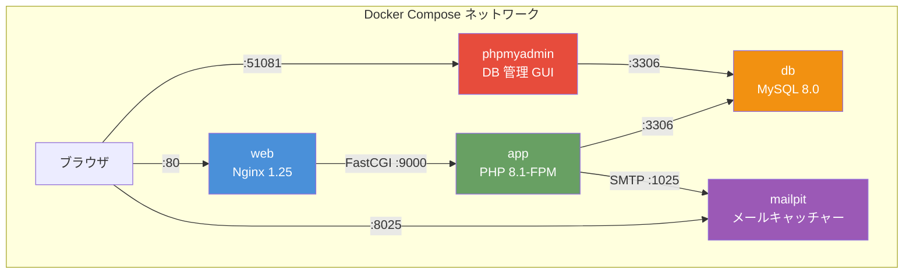
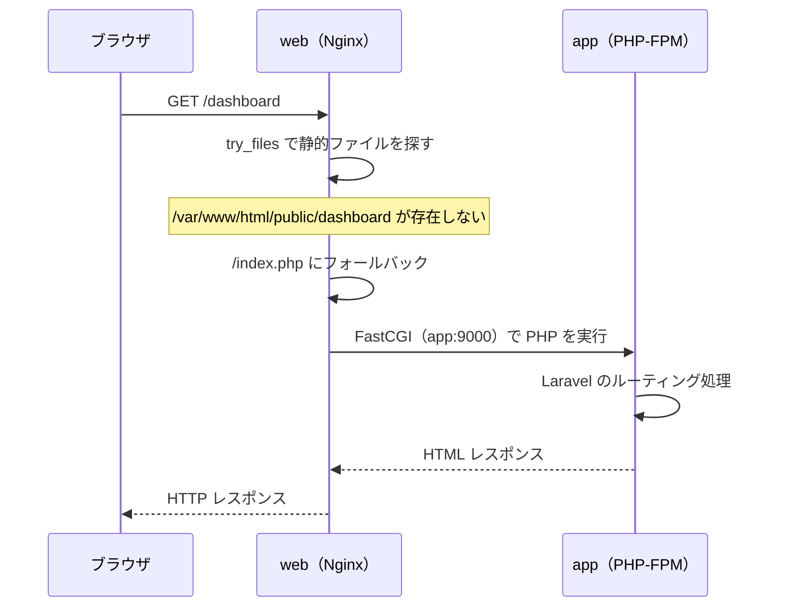

# 1-1-2 Docker Compose の応用構成を理解する

📝 **前提知識**: このセクションは COACHTECH 教材 tutorial-6（Docker 基礎）の内容を前提としています。Docker / Docker Compose の基本操作を理解していることを前提に進めます。

## 🎯 このセクションで学ぶこと

- LMS の docker-compose.yml が定義する 5 サービス構成の全体像と各サービスの役割を理解する
- サービス間の通信経路（Nginx → PHP-FPM → MySQL）を説明できる
- bind mount と named volume の使い分けの設計意図を理解する
- 環境変数のデフォルト値パターン（`${VAR:-default}`）を理解する
- docker/ ディレクトリの local/production 分離パターンを理解する

このセクションでは、LMS の Docker Compose 構成を「なぜこのように分けているのか」という設計意図から読み解いていきます。

---

## 導入: なぜ 5 サービスも必要なのか

COACHTECH 教材の tutorial-6 では、1つまたは 2つのコンテナで Laravel アプリケーションを動かしていました。PHP の組み込みサーバー（`php artisan serve`）を使えば、コンテナ1つでも Web アプリケーションは動きます。

しかし、LMS の docker-compose.yml を開くと、そこには **5つのサービス** が定義されています。app、web、db、phpmyadmin、mailpit。なぜこれだけのサービスが必要なのでしょうか。

答えは **「本番環境に近い構成をローカルで再現するため」** です。本番環境では、Web サーバー（Nginx）とアプリケーションサーバー（PHP-FPM）は別プロセスとして動作します。データベースも独立したサーバーです。この構成をローカルでも再現しておくことで、「ローカルでは動くのに本番で動かない」という問題を最小限に抑えられます。さらに、開発効率を上げるための支援ツール（phpMyAdmin、Mailpit）もサービスとして組み込まれています。

### 🧠 先輩エンジニアはこう考える

> LMS の開発で一番ありがたいのは、ローカル環境が本番と同じ Nginx + PHP-FPM 構成になっていることです。以前、PHP の組み込みサーバーで開発していたプロジェクトでは、Nginx 固有の URL リライトや FastCGI の挙動差でデプロイ後にバグが発覚することがありました。Docker Compose で本番相当の構成を手元に持てるのは、地味だけど開発効率に大きく効いてきます。phpMyAdmin や Mailpit も「あると便利」ではなく「ないと困る」レベルで日常的に使っています。

---

## 5 サービスの全体像

まず、LMS の docker-compose.yml が定義する 5 サービスの全体像を把握しましょう。



各サービスの役割を整理すると、以下のようになります。

| サービス | ベースイメージ（Dockerfile で指定） | 役割 | ポート |
|---|---|---|---|
| **app** | php:8.1-fpm-bullseye | PHP アプリケーションの実行（Laravel） | 9000（FastCGI、内部のみ） |
| **web** | nginx:1.25-alpine | HTTP リクエストの受付と静的ファイル配信 | 80 |
| **db** | mysql/mysql-server:8.0 | データベース | 3306 |
| **phpmyadmin** | phpmyadmin/phpmyadmin | データベース管理の Web GUI | 51081 |
| **mailpit** | axllent/mailpit:latest | 開発用メールキャッチャー | 8025（Web UI）、1025（SMTP） |

📝 各サービスは `docker-compose.yml` の `build` ディレクティブで `docker/` 内の Dockerfile を指定してビルドされます（phpmyadmin と mailpit は既成イメージを直接使用）。

🔑 **設計のポイント**: サービスは大きく2つのグループに分けられます。**本番にも存在するコアサービス**（app / web / db）と、**開発環境でのみ使う支援サービス**（phpmyadmin / mailpit）です。本番環境では、データベースには AWS RDS（マネージドデータベースサービス）を使用し、メール送信には SendGrid を利用しています。phpMyAdmin や Mailpit のような開発支援ツールは本番には含まれません。

---

## app サービス: PHP-FPM コンテナ

app サービスは LMS の心臓部です。Laravel 10 のアプリケーションコードを PHP 8.1-FPM で実行します。

### Dockerfile の構造

以下は主要部分の抜粋です。実ファイルでは locale 設定や追加パッケージ（`git`, `unzip` 等）のインストール、権限設定なども含まれています。

```dockerfile
# docker/laravel/local/Dockerfile
FROM php:8.1-fpm-bullseye

# Composer をマルチステージビルドでコピー
COPY --from=composer:2.3 /usr/bin/composer /usr/bin/composer

# PHP 拡張のインストール
RUN apt-get update && \
    apt-get install -y libicu-dev libzip-dev && \
    docker-php-ext-install intl pdo_mysql zip bcmath

EXPOSE 9000
```

💡 **PHP-FPM とは**: PHP-FPM（FastCGI Process Manager）は、PHP を FastCGI プロトコルで動作させるプロセスマネージャです。PHP の組み込みサーバー（`php artisan serve`）と異なり、Nginx などの Web サーバーと連携して動作するように設計されています。ポート 9000 で FastCGI リクエストを待ち受けます。

各 PHP 拡張の用途は以下の通りです。

| 拡張 | 用途 |
|---|---|
| **intl** | 国際化（日付・通貨フォーマット等） |
| **pdo_mysql** | MySQL への接続（Laravel の Eloquent が内部で使用） |
| **zip** | Composer パッケージの展開、ZIP ファイル操作 |
| **bcmath** | 高精度の数値計算（決済処理等） |

### volumes の設計

docker-compose.yml の app サービスには 3 つの volumes 設定があります。

```yaml
# docker-compose.yml（app サービスの volumes 部分）
volumes:
  - type: bind
    source: ./backend
    target: /var/www/html
  - type: volume
    source: psysh-store
    target: /root/.config/psysh
    volume:
      nocopy: true
  - ./docker/php/local/php.ini:/usr/local/etc/php/conf.d/local.ini
```

🔑 **bind mount と named volume の使い分け** は、Docker Compose 構成を読む上で重要なポイントです。

| 種類 | 用途 | LMS での使用例 |
|---|---|---|
| **bind mount** | ホストのファイルをコンテナにリアルタイム同期。開発中のコード編集がすぐ反映される | `./backend` → `/var/www/html` |
| **named volume** | Docker が管理するデータ領域。コンテナを削除してもデータが残る | `psysh-store`、`db-store` |
| **bind mount（ファイル単位）** | 設定ファイルをホストから注入 | `php.ini` → コンテナ内の conf.d/ |

1つ目の bind mount（`./backend` → `/var/www/html`）は、ホストマシン上の `backend/` ディレクトリをコンテナ内に直接マウントしています。あなたがエディタで PHP ファイルを編集すると、コンテナ内にも即座に反映されます。これが開発時のライブリロードを実現する仕組みです。

2つ目の named volume（`psysh-store`）は、Laravel Tinker（PsySH）のコマンド履歴を永続化するためのものです。コンテナを `docker compose down` で停止・削除しても、次回起動時に Tinker の履歴が引き継がれます。

3つ目は PHP の設定ファイル（`php.ini`）をコンテナに注入しています。

### php.ini のカスタマイズ

以下は開発で特に重要な設定の抜粋です。

```ini
; docker/php/local/php.ini
upload_max_filesize = 64M
post_max_size = 128M
memory_limit = 256M
display_errors = on
error_log = /dev/stderr
```

ローカル開発用の php.ini では、以下の点がカスタマイズされています。

- **upload_max_filesize / post_max_size**: LMS では教材ファイルや画像のアップロード機能があるため、デフォルトの 2M / 8M では不十分です。64M / 128M に引き上げています
- **display_errors = on**: 開発環境ではエラーを画面に表示してデバッグしやすくしています（本番では off）
- **error_log = /dev/stderr**: エラーログを標準エラー出力に送ることで、`docker compose logs app` でログを確認できるようにしています

### 環境変数の設計

app サービスの `environment` セクションには、多数の環境変数が定義されています。

```yaml
# docker-compose.yml（app サービスの environment 部分、抜粋）
environment:
  - APP_DEBUG=${APP_DEBUG:-true}
  - APP_ENV=${APP_ENV:-local}
  - DB_HOST=${DB_HOST:-db}
  - DB_DATABASE=${DB_DATABASE:-laravel}
  - MAIL_HOST=${MAIL_HOST:-mailpit}
  - MAIL_PORT=${MAIL_PORT:-1025}
```

ここで使われている `${VAR:-default}` は、Docker Compose の **変数置換とデフォルト値** の構文です。ホストの `.env` ファイルや環境変数に `VAR` が定義されていればその値を使い、未定義であれば `default` の値を使います。

📝 **注意**: ここでの `.env` は Laravel の `.env` ではなく、**docker-compose.yml と同じディレクトリにある `.env`** です。Docker Compose は起動時にこのファイルを読み込み、`${VAR}` を展開します。LMS では、ほとんどの環境変数にデフォルト値が設定されているため、`.env` を作成しなくても `docker compose up` で起動できるようになっています。

🔑 `DB_HOST=db` という値に注目してください。これは Docker Compose のサービス名です。Docker Compose は同じネットワーク内のサービスを **サービス名で名前解決** できます。app コンテナから `db` というホスト名でアクセスすると、db コンテナの MySQL に接続されます。同様に `MAIL_HOST=mailpit` は mailpit コンテナを指しています。

---

## web サービス: Nginx コンテナ

web サービスは HTTP リクエストの入り口です。ブラウザからのリクエストを受け取り、静的ファイルはそのまま返し、PHP の処理が必要なリクエストは app コンテナに転送します。

### リクエストフロー



### app.conf の設定

以下は核となる設定の抜粋です。実ファイルにはセキュリティヘッダ（`X-Frame-Options` 等）、`client_max_body_size`、CloudFront/ALB のログ設定なども含まれています。

```nginx
# docker/nginx/local/conf.d/app.conf
server {
    listen 80;
    root /var/www/html/public;
    index index.php;

    location / {
        try_files $uri $uri/ /index.php?$query_string;
    }

    location ~ \.php$ {
        fastcgi_pass app:9000;
        fastcgi_param SCRIPT_FILENAME $document_root$fastcgi_script_name;
        include fastcgi_params;
    }
}
```

この設定のポイントを順に見ていきます。

**`root /var/www/html/public`**: Laravel のドキュメントルートは `public/` ディレクトリです。Nginx はこのディレクトリを起点にファイルを探します。

**`try_files $uri $uri/ /index.php?$query_string`**: Nginx のリクエスト処理の核となる設定です。以下の順序で処理されます。

1. `$uri`: リクエストされたパスにファイルが存在するか確認（CSS、JS、画像等の静的ファイル）
2. `$uri/`: ディレクトリとして存在するか確認
3. `/index.php?$query_string`: どちらも存在しなければ `index.php` に転送（Laravel のルーティングに委ねる）

**`fastcgi_pass app:9000`**: PHP ファイルへのリクエストを app コンテナの FastCGI（ポート 9000）に転送します。`app` はサービス名であり、Docker Compose の内部 DNS で app コンテナの IP アドレスに解決されます。

💡 **なぜ Nginx と PHP-FPM を分けるのか**: 静的ファイル（CSS、JS、画像）の配信は Nginx が得意とする領域です。PHP-FPM に静的ファイルの配信まで任せると、不要なプロセスが占有されてパフォーマンスが低下します。Nginx が静的ファイルを高速に捌き、PHP の処理だけを PHP-FPM に委ねることで、効率的なリソース利用が実現できます。

### web サービスの volumes

```yaml
# docker-compose.yml（web サービスの volumes 部分）
volumes:
  - type: bind
    source: ./backend
    target: /var/www/html
  - ./docker/nginx/local/conf.d/app.conf:/etc/nginx/conf.d/default.conf:ro
```

web サービスにも `./backend` がマウントされています。これは Nginx が `public/` ディレクトリの静的ファイル（CSS、JS、画像）を直接配信する必要があるためです。PHP ファイルの実行は app コンテナが担いますが、静的ファイルの読み取りは Nginx 自身が行います。

2つ目のマウントの末尾にある `:ro`（read-only）は、コンテナ内から設定ファイルを変更できないようにするオプションです。設定ファイルの変更はホスト側で行い、コンテナに反映させるという運用を強制しています。

---

## db サービス: MySQL コンテナ

db サービスは MySQL 8.0 を実行します。

### my.cnf のカスタマイズ

以下は主要な設定の抜粋です。

```ini
# docker/mysql/my.cnf
[mysqld]
character-set-server = utf8mb4
collation-server = utf8mb4_0900_ai_ci

slow_query_log = 1
slow_query_log_file = /var/log/mysql/mysql-slow.log
long_query_time = 1.0

general_log = 1
general_log_file = /var/log/mysql/mysql-general.log

[mysql]
default-character-set = utf8mb4

[client]
default-character-set = utf8mb4
```

**文字コード設定**: `utf8mb4` は MySQL で絵文字を含む全ての Unicode 文字を扱える文字コードです。`utf8mb4_0900_ai_ci` は MySQL 8.0 で導入された照合順序で、`ai`（アクセント非依存）、`ci`（大文字小文字非依存）の比較を行います。

**スロークエリログ**: `long_query_time = 1.0` で、実行に 1 秒以上かかったクエリを記録します。パフォーマンス問題の早期発見に役立ちます。

**一般クエリログ**: 全てのクエリを記録します。開発環境では「どんな SQL が実行されているか」を確認するのに便利ですが、本番環境ではパフォーマンスへの影響が大きいため通常は無効にします。

### データの永続化

```yaml
# docker-compose.yml（db サービスの volumes 部分）
volumes:
  - type: volume
    source: db-store
    target: /var/lib/mysql
```

db サービスのデータは **named volume**（`db-store`）で永続化されています。bind mount ではなく named volume を使う理由は以下の通りです。

- **パフォーマンス**: macOS の bind mount はファイルシステムの変換オーバーヘッドがあり、特にデータベースのような大量のファイル I/O が発生する用途ではパフォーマンスが大幅に低下します
- **永続性**: `docker compose down` でコンテナを削除してもデータが保持されます（`docker compose down -v` を実行しない限り）

⚠️ **注意**: `docker compose down -v` を実行すると named volume も削除されます。つまりデータベースの中身が全て消えます。マイグレーションやシーダーで復元できる状態にしておくことが重要です。

---

## 開発支援サービス: phpMyAdmin と Mailpit

### phpMyAdmin

phpMyAdmin はブラウザから MySQL を操作できる Web GUI ツールです。

```yaml
# docker-compose.yml（phpmyadmin サービス）
phpmyadmin:
  image: "phpmyadmin/phpmyadmin"
  ports:
    - "${PMA_PUBLISHED_PORT:-51081}:80"
  environment:
    PMA_HOST: db
  depends_on:
    - db
```

`PMA_USER` と `PMA_PASSWORD` が設定されているため、`docker compose up` 後にブラウザで `http://localhost:51081` にアクセスすると自動的にログインされます。

<!-- TODO: 画像追加 - phpMyAdmin の画面 -->

**`depends_on`** は、サービスの起動順序を制御する設定です。phpMyAdmin は db サービスに接続するため、db が先に起動している必要があります。`depends_on: - db` を指定することで、db コンテナが起動した後に phpmyadmin コンテナが起動されます。

💡 ポート番号が `51081` のように大きい値になっているのは、よく使われるポート（80、8080 等）との衝突を避けるためです。LMS のフロントエンド（Next.js）が 3000 番、バックエンド（Nginx）が 80 番を使うため、支援ツールは競合しないポート番号を選んでいます。

### Mailpit

Mailpit は開発用の **メールキャッチャー** です。アプリケーションが送信したメールを実際には配送せず、全てキャッチして Web UI で確認できるようにします。

```yaml
# docker-compose.yml（mailpit サービス）
mailpit:
  image: axllent/mailpit:latest
  ports:
    - ${MAILPIT_WEB_PORT:-8025}:8025
    - ${MAILPIT_SMTP_PORT:-1025}:1025
```

Mailpit は 2 つのポートを公開しています。

| ポート | プロトコル | 用途 |
|---|---|---|
| **8025** | HTTP | Web UI（ブラウザでメール一覧を確認） |
| **1025** | SMTP | メール受信（Laravel からのメール送信先） |

<!-- TODO: 画像追加 - Mailpit の Web UI 画面 -->

app サービスの環境変数で `MAIL_HOST=mailpit`、`MAIL_PORT=1025` が設定されているため、Laravel がメールを送信すると Mailpit の SMTP サーバーに届きます。`http://localhost:8025` で送信されたメールの内容を確認できます。

🔑 Mailpit がなぜ重要かというと、LMS には会員登録時の確認メール、パスワードリセット、通知メールなど多くのメール送信機能があるためです。開発中にこれらのメールが実際のアドレスに送信されてしまうと大問題です。Mailpit を使えば、メールの見た目や内容を安全に確認できます。

---

## Docker 設定ファイルの構造

LMS の Docker 設定ファイルは `docker/` ディレクトリにまとめられており、**local（開発環境）と production（本番環境）を明確に分離** しています。

```
docker/
├── laravel/
│   ├── local/Dockerfile        # 開発用: Composer あり、デバッグ向け
│   └── production/Dockerfile   # 本番用: 最適化済み、軽量化
├── nginx/
│   ├── local/
│   │   ├── Dockerfile
│   │   └── conf.d/app.conf     # 開発用: デバッグログ多め
│   └── production/
│       ├── Dockerfile
│       └── conf.d/app.conf     # 本番用: パフォーマンス最適化
├── mysql/
│   ├── Dockerfile
│   └── my.cnf                  # MySQL 設定（local/production 共通）
└── php/
    ├── local/php.ini           # 開発用: エラー表示 on
    └── production/php.ini      # 本番用: エラー表示 off、最適化
```

🔑 **local/production 分離パターン** の意図は以下の通りです。

- **開発環境**（local）: デバッグしやすさを優先。エラー表示 on、詳細なログ出力、Composer インストール済み
- **本番環境**（production）: セキュリティとパフォーマンスを優先。エラー非表示、最小限のログ、不要なツールを排除

docker-compose.yml はこの構造を `dockerfile` ディレクティブで参照しています。

```yaml
# docker-compose.yml（app サービスの build 部分）
app:
  build:
    context: .
    dockerfile: ./docker/laravel/local/Dockerfile
```

`context: .` はビルドコンテキスト（Docker に送るファイルの起点）がリポジトリルートであることを示します。`dockerfile` で local 用の Dockerfile を指定しています。本番デプロイ時には、CI/CD パイプラインが `docker/laravel/production/Dockerfile` を使ってイメージをビルドします（これは Part 5 のインフラセクションで詳しく扱います）。

📝 MySQL の Dockerfile と my.cnf には local/production の区別がありません。開発環境と本番環境で同じ設定を使うことで、文字コードやクエリの挙動に差異が出るのを防いでいます。ただし、本番環境の MySQL は Docker コンテナではなく AWS RDS（マネージドデータベースサービス）を使用しています。この Dockerfile は主にローカル開発環境用です。

---

## 環境変数とデフォルト値

docker-compose.yml 全体を通じて使われている `${VAR:-default}` パターンをまとめます。

```yaml
# パターン: ${環境変数名:-デフォルト値}
- APP_DEBUG=${APP_DEBUG:-true}       # .env 未定義なら true
- DB_HOST=${DB_HOST:-db}             # .env 未定義なら db（サービス名）
- WEB_PUBLISHED_PORT=${WEB_PUBLISHED_PORT:-80}  # .env 未定義なら 80
```

このパターンの利点は **「設定なしでも動く」** ことです。

1. **新しく参加した開発者** は、リポジトリをクローンして `docker compose up -d` を実行するだけで環境が立ち上がります。`.env` の作成や設定は不要です
2. **ポートが競合する場合** は、プロジェクトルートの `.env` ファイルを作成して該当のポート番号を上書きできます

```bash
# .env（docker-compose.yml と同じディレクトリ）
# 80 番ポートが他のプロジェクトで使われている場合
WEB_PUBLISHED_PORT=8080
DB_PUBLISHED_PORT=33060
```

⚠️ **注意**: docker-compose.yml の環境変数には、AWS のアクセスキーや LINE Notify のトークンなど、外部サービスの認証情報も含まれています。これらのデフォルト値はダミー値（`XXXXXXXX` 等）になっており、実際の値は各開発者が `.env` ファイルで設定します。**`.env` ファイルは `.gitignore` に含まれており、リポジトリにはコミットされません**。

---

## ✨ まとめ

- LMS の Docker Compose は **5 サービス構成**（app / web / db / phpmyadmin / mailpit）で、本番環境に近い構成をローカルで再現している
- **app（PHP-FPM）と web（Nginx）の分離** により、静的ファイル配信と PHP 処理を効率的に分担している。Nginx は `try_files` で静的ファイルを探し、なければ `fastcgi_pass app:9000` で PHP-FPM に転送する
- **bind mount** はソースコードのリアルタイム同期に、**named volume** はデータの永続化（DB データ、Tinker 履歴）に使い分けている
- **phpMyAdmin と Mailpit** は開発環境専用の支援ツール。本番には存在しない
- `docker/` ディレクトリは **local/production 分離パターン** で環境ごとの設定を管理している
- **`${VAR:-default}` パターン** により、設定なしでもすぐに開発環境を起動できる設計になっている

---

次のセクションでは、これらの Docker コンテナを操作するための Makefile コマンド体系について学びます。LMS では `docker compose exec` を直接打つ代わりに、Makefile で短縮コマンドが用意されています。
