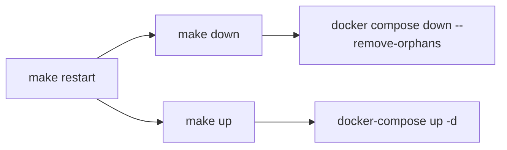
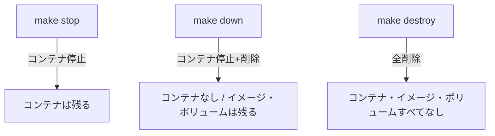

# 1-1-3 Makefile による開発コマンド体系を理解する

## 🎯 このセクションで学ぶこと

- Makefile の基本構文（ターゲット・レシピ・変数・連鎖呼び出し）を理解する
- LMS の約 40 の make コマンドを 7 つのカテゴリに分類し、全体像を把握する
- 重要コマンド（`make fresh`、`make init`、`make cache`）の内部処理を読み解く
- 主要コマンドを実際に実行して動作を確認する

Makefile の基本構文を学んだ後、LMS のコマンド体系を整理し、最後に実際にコマンドを実行して確認します。

---

## 導入: 長いコマンドを毎回打ち続ける問題

LMS の開発では、コンテナ内で Laravel のコマンドを実行する場面が頻繁にあります。たとえば、マイグレーションを実行するだけでもこれだけのタイピングが必要です。

```bash
docker compose exec app php artisan migrate
```

データベースを再構築してシーダーを流す場合は、さらに複数のコマンドを順番に実行しなければなりません。

```bash
docker compose exec app php artisan migrate:fresh
docker compose exec app php artisan schema:dump
docker compose exec app php artisan db:seed
```

これを1日に何度も繰り返すのは非現実的です。タイプミスのリスクもありますし、「この操作にはどのコマンドをどの順番で実行すればいいか」をチームメンバー全員が覚えている必要があります。

**Makefile** はこの問題を解決します。上の3つのコマンドは `make fresh` の一言で済みます。チーム全員が同じコマンド体系を使うため、手順の属人化も防げます。

### 🧠 先輩エンジニアはこう考える

> LMS の開発では、新機能を作るときにマイグレーション追加 → DB 再構築 → シード投入 → テスト実行という流れを1日に何回も繰り返します。`docker compose exec app ...` を毎回打っていた頃は、コマンドの打ち間違いで「あれ、シーダー流し忘れた？」みたいなことがよくありました。Makefile に操作を集約してからは `make fresh && make test` だけで済むので、コマンドの実行ではなく開発そのものに集中できるようになりました。Claude Code に「make fresh が失敗する」と伝えれば、内部で何が実行されているかも含めて調査してくれるので、Makefile のコマンド体系を知っておくことはデバッグの精度にも直結します。

---

## Makefile の基本構文

Makefile はもともと C 言語のビルドツール `make` の設定ファイルですが、LMS ではシェルコマンドのショートカット集として活用しています。基本構文は3つの要素で構成されます。

### ターゲットとレシピ

Makefile の最小単位は **ターゲット**（コマンド名）と **レシピ**（実行される処理）の組み合わせです。

```makefile
# ターゲット名:
# [TAB] レシピ（実行されるシェルコマンド）
up:
	docker-compose up -d
```

この定義があれば、ターミナルで `make up` と打つだけで `docker-compose up -d` が実行されます。

🔑 **レシピの行頭はスペースではなく TAB 文字** でなければなりません。スペースを使うとエラーになります。これは Makefile で最もよくある構文エラーです。

> ⚠️ **よくあるエラー**: レシピのインデントにスペースを使用
>
> ```
> Makefile:2: *** missing separator.  Stop.
> ```
>
> **原因**: レシピ行の先頭がスペースになっている
>
> **対処法**: TAB 文字に置き換える。エディタの設定で「Makefile ではタブを使う」ようにしておくと安全です

1つのターゲットに複数のレシピを書くこともできます。上から順に実行されます。

```makefile
seed:
	docker compose exec app php artisan db:seed
```

### `@make` による連鎖呼び出し

ターゲットの中から別のターゲットを呼び出せます。LMS の Makefile ではこのパターンが多用されています。

```makefile
restart:
	@make down
	@make up
```

`make restart` を実行すると、まず `make down`（コンテナ停止・削除）が実行され、次に `make up`（コンテナ起動）が実行されます。`@` を付けるとコマンド自体の表示が抑制され、出力がすっきりします。

この仕組みにより、小さなターゲットを組み合わせて複雑な操作を構築できます。



### 変数

外部から値を渡したい場合は **変数** を使います。`$(変数名)` の形式でレシピ内に埋め込みます。

```makefile
single-test:
	docker compose exec app php artisan test $(FILENAME)
```

実行時に変数を指定します。

```bash
make single-test FILENAME=tests/Feature/UserTest.php
```

`$(FILENAME)` が `tests/Feature/UserTest.php` に置き換わり、指定したテストファイルだけが実行されます。

LMS の Makefile では `single-test-filter` でさらに `$(METHOD)` 変数も使い、特定のテストメソッドだけを実行できるようになっています。

```makefile
single-test-filter:
	docker compose exec app php artisan test --filter $(METHOD) $(FILENAME)
```

```bash
make single-test-filter METHOD=test_user_can_login FILENAME=tests/Feature/AuthTest.php
```

💡 **補足**: LMS の Makefile には依存関係（`ターゲット: 依存ターゲット` の形式）は使われていません。代わりに `@make` による明示的な連鎖呼び出しで処理の順序を制御しています。

💡 **補足**: LMS の Makefile では `docker-compose`（ハイフン付き、Docker Compose V1 形式）と `docker compose`（スペース区切り、V2 形式）が混在しています。現在の Docker Desktop では両方とも V2 エンジンで実行されるため、動作に違いはありません。

---

## LMS のコマンド体系を整理する

LMS の Makefile には約 40 のターゲットが定義されています。一見多く感じますが、7 つのカテゴリに分類すると全体像がすっきりします。

<!-- TODO: 画像追加 - 7カテゴリの全体像図 -->

### カテゴリ一覧

| カテゴリ | 主な用途 | コマンド例 |
|---|---|---|
| **Docker 操作** | コンテナの起動・停止・削除 | `up`, `stop`, `down`, `restart`, `destroy`, `ps` |
| **初期構築** | プロジェクトの新規作成・再構築 | `init`, `remake`, `create-project`, `build`, `down-v` |
| **DB 操作** | マイグレーション・シード・リセット | `migrate`, `fresh`, `seed`, `rollback-test`, `dacapo` |
| **テスト** | PHPUnit テストの実行 | `test`, `single-test`, `single-test-filter` |
| **キャッシュ** | 各種キャッシュの生成・削除 | `cache`, `cache-clear`, `optimize`, `optimize-clear` |
| **ログ** | コンテナログの表示 | `logs`, `logs-watch`, `log-web`, `log-app`, `log-db` + `-watch` 系 |
| **シェル接続・ツール** | コンテナ接続・開発補助ツール | `app`, `web`, `db`, `sql`, `tinker`, `ide-helper`, `l5-generate` |

### Docker 操作

日常的に最もよく使うカテゴリです。

| コマンド | 内部処理 | 用途 |
|---|---|---|
| `make up` | `docker-compose up -d` | コンテナをバックグラウンドで起動 |
| `make stop` | `docker compose stop` | コンテナを停止（データは保持） |
| `make down` | `docker compose down --remove-orphans` | コンテナを停止・削除。孤立コンテナも削除 |
| `make restart` | `down` → `up` | コンテナを再起動 |
| `make destroy` | `docker compose down --rmi all --volumes --remove-orphans` | コンテナ・イメージ・ボリュームを全削除 |
| `make ps` | `docker compose ps` | コンテナの稼働状況を一覧表示 |

🔑 `stop` と `down` の違いを理解しておくことが重要です。`stop` はコンテナを停止するだけで、コンテナ自体は残ります。`down` はコンテナを停止した上で削除します。`destroy` はさらにイメージとボリューム（DB データ含む）まで全削除するため、使用には注意が必要です。



⚠️ **注意**: `make destroy` を実行すると DB のデータもすべて消えます。開発中のデータを失いたくない場合は `make stop` または `make down` を使いましょう。

### 初期構築

プロジェクトのセットアップに使うコマンドです。日常的には使いませんが、仕組みを知っておくとトラブル時に役立ちます。

| コマンド | 内部処理 | 用途 |
|---|---|---|
| `make init` | コンテナビルド → composer install → .env コピー → key:generate → storage:link → 権限設定 → `fresh` | 既存プロジェクトの初期セットアップ |
| `make remake` | `destroy` → `init` | 環境を完全にリセットして再構築 |
| `make create-project` | ディレクトリ作成 → ビルド → Laravel インストール → 初期設定 → `fresh` | 新規 Laravel プロジェクト作成（初回のみ） |

`make init` の処理の流れを見てみましょう。

```makefile
# Makefile
init:
	docker-compose up -d --build
	docker-compose exec app composer install
	docker-compose exec app cp .env.example .env
	docker-compose exec app php artisan key:generate
	docker-compose exec app php artisan storage:link
	docker-compose exec app chmod -R 777 storage bootstrap/cache
	@make fresh
```

7 行のレシピが順番に実行され、最後に `@make fresh` で DB の構築まで行います。つまり `make init` 1つで、クローンしたばかりのリポジトリを開発可能な状態にできます。

`make remake` は `make destroy` + `make init` です。「環境がおかしくなったのでゼロからやり直したい」というときに使います。

💡 **補足**: Makefile には `laravel-install` と `install-recommend-packages` というターゲットも定義されていますが、これらは `create-project` の内部で使われるコマンドであり、単独で実行する機会はほとんどありません。

### DB 操作

開発中に最も頻繁に使うカテゴリの1つです。

| コマンド | 内部処理 | 用途 |
|---|---|---|
| `make migrate` | `php artisan migrate` | 未実行のマイグレーションを適用 |
| `make fresh` | スキーマ SQL 削除 → `migrate:fresh` → `schema:dump` → `db:seed` | DB を完全に再構築 |
| `make seed` | `php artisan db:seed` | シーダーのみ実行 |
| `make rollback-test` | `migrate:fresh` → `migrate:refresh` | マイグレーションの巻き戻しテスト |

#### `make fresh` の内部処理を読み解く

`make fresh` は LMS 開発で最も重要なコマンドの1つです。内部処理を詳しく見てみましょう。

```makefile
# Makefile
fresh:
	docker compose exec app rm -f database/schema/mysql-schema.sql
	docker compose exec app php artisan migrate:fresh
	docker compose exec app php artisan schema:dump
	docker compose exec app php artisan db:seed
```

4つのステップで構成されています。

1. **既存のスキーマ SQL を削除**: `database/schema/mysql-schema.sql` を削除します
2. **`migrate:fresh`**: すべてのテーブルを DROP してからマイグレーションを最初から実行します
3. **`schema:dump`**: 現在の DB 構造を `mysql-schema.sql` にダンプします
4. **`db:seed`**: シーダーでテストデータを投入します

📝 **なぜ `schema:dump` が含まれるのか**: Laravel 10 では、`schema:dump` で生成されたスキーマ SQL ファイルがあると、マイグレーション実行時にそのファイルを先に読み込んでから未適用のマイグレーションだけを実行します。これにより、マイグレーションファイルが大量にあっても高速に DB を構築できます。LMS では `make fresh` のたびにこのスキーマ SQL を最新化しているため、チームメンバー全員が常に最新の DB 構造を共有できます。

🔑 **マイグレーションを追加したら `make fresh` を実行する** というルールは、このスキーマ SQL の自動更新のためです。`make migrate` だけではスキーマ SQL が更新されません。

### テスト

| コマンド | 内部処理 | 用途 |
|---|---|---|
| `make test` | `php artisan test` | 全テスト実行 |
| `make single-test FILENAME=...` | `php artisan test $(FILENAME)` | 指定ファイルのテスト実行 |
| `make single-test-filter METHOD=... FILENAME=...` | `php artisan test --filter $(METHOD) $(FILENAME)` | 指定メソッドのテスト実行 |

開発中は `make single-test` で対象のテストだけを実行し、コミット前に `make test` で全テストを確認するのが一般的なフローです。

### キャッシュ

Laravel 10 にはルート・設定・イベント・ビューなど複数のキャッシュがあります。LMS の Makefile ではキャッシュの **生成** と **削除** が対称的に定義されています。

| コマンド | 内部処理 | 用途 |
|---|---|---|
| `make cache` | autoload 最適化 → `optimize`（ルート・設定キャッシュ）→ イベントキャッシュ → ビューキャッシュ | 本番向けの全キャッシュ生成 |
| `make cache-clear` | composer キャッシュクリア → `optimize:clear` → イベントクリア | 全キャッシュ削除 |
| `make optimize` | `php artisan optimize` | ルート・設定キャッシュの生成 |
| `make optimize-clear` | `php artisan optimize:clear` | ルート・設定キャッシュの削除 |

`make cache` と `make cache-clear` の対称構造を見てみましょう。

```makefile
# Makefile
cache:
	docker compose exec app composer dump-autoload -o
	@make optimize
	docker compose exec app php artisan event:cache
	docker compose exec app php artisan view:cache

cache-clear:
	docker compose exec app composer clear-cache
	@make optimize-clear
	docker compose exec app php artisan event:clear
```

`cache` が生成する4種類のキャッシュ（autoload、ルート/設定、イベント、ビュー）に対して、`cache-clear` が対応するクリアコマンドを実行します。「キャッシュが原因でおかしな挙動になっている」と感じたら、まず `make cache-clear` を実行するのが定石です。

💡 **補足**: 開発中は基本的にキャッシュなしで動かします。`make cache` は本番デプロイ前やパフォーマンスを確認したいときに使います。

### ログ

コンテナの出力を確認するコマンド群です。サービスごとに個別のログを見ることもできます。

| コマンド | 内部処理 | 用途 |
|---|---|---|
| `make logs` | `docker compose logs` | 全コンテナのログを表示 |
| `make logs-watch` | `docker compose logs --follow` | 全コンテナのログをリアルタイム表示 |
| `make log-web` / `make log-web-watch` | `docker compose logs [--follow] web` | Web サーバー（Nginx）のログ |
| `make log-app` / `make log-app-watch` | `docker compose logs [--follow] app` | アプリ（PHP-FPM）のログ |
| `make log-db` / `make log-db-watch` | `docker compose logs [--follow] db` | DB（MySQL）のログ |

命名規則が統一されているのがポイントです。`log-{サービス名}` で通常表示、`log-{サービス名}-watch` で `--follow`（リアルタイム追従）になります。`-watch` 系は `Ctrl + C` で停止します。

### シェル接続・ツール

コンテナ内に入って作業したり、開発補助ツールを実行したりするコマンドです。

| コマンド | 内部処理 | 用途 |
|---|---|---|
| `make app` | `docker compose exec app bash` | PHP アプリコンテナにシェル接続 |
| `make web` | `docker compose exec web bash` | Web サーバーコンテナにシェル接続 |
| `make db` | `docker compose exec db bash` | DB コンテナにシェル接続 |
| `make sql` | DB コンテナで `mysql -u ... -p... ...` | MySQL クライアントに直接接続 |
| `make tinker` | `php artisan tinker` | Laravel の REPL を起動 |
| `make ide-helper` | `clear-compiled` → `ide-helper:generate` → `ide-helper:meta` → `ide-helper:models` | IDE 補完用ファイル生成 |
| `make l5-generate` | `php artisan l5-swagger:generate` | Swagger ドキュメント生成 |

`make sql` はシェルに入らずに直接 MySQL クライアントを起動できる便利なコマンドです。環境変数 `$MYSQL_USER`、`$MYSQL_PASSWORD`、`$MYSQL_DATABASE` を自動で参照するため、認証情報を手打ちする必要がありません。

📝 Makefile 内の `$$MYSQL_USER` のように `$` が2つ重なっているのは、Makefile の変数展開を避けてシェル変数として渡すためのエスケープです。

💡 **補足**: Makefile には `redis` ターゲット（`docker compose exec redis redis-cli`）も定義されていますが、現在の LMS の `docker-compose.yml` には Redis サービスが含まれていないため、このコマンドは使用できません。

---

## 🏃 実践: 主要コマンドを実行して動作を確認する

ここまで学んだコマンド体系を、実際に手を動かして確認します。

## 📌 実行前の確認
- [ ] LMS リポジトリ（`/Users/yotaro/lms`）をクローン済みであること
- [ ] Docker Desktop が起動していること
- [ ] ターミナルで LMS リポジトリのルートディレクトリにいること（`cd /Users/yotaro/lms`）

### 🏃 Step 1: コンテナの状態を確認する

まず、コンテナの稼働状況を確認します。

```bash
make ps
```

コンテナが起動していない場合は以下のような出力になります。

```
NAME    IMAGE   COMMAND   SERVICE   CREATED   STATUS   PORTS
```

コンテナが起動している場合は、各コンテナの名前・状態・ポートマッピングが表示されます。起動していなければ `make up` で起動しましょう。

```bash
make up
```

再度 `make ps` を実行して、全コンテナが `running` 状態であることを確認してください。

### 🏃 Step 2: ログを確認する

全コンテナのログを確認します。

```bash
make logs
```

大量のログが表示されるはずです。特定のサービスだけを見たい場合は、サービス名を指定します。

```bash
make log-app
```

リアルタイムでログを追いたい場合は `-watch` を付けます。

```bash
make log-app-watch
```

ログがリアルタイムに流れるのを確認したら、`Ctrl + C` で停止してください。

### 🏃 Step 3: コンテナにシェル接続する

アプリコンテナの中に入ってみましょう。

```bash
make app
```

コンテナ内のシェルに入ると、プロンプトが変わります。`php artisan --version` を実行して Laravel のバージョンを確認してみましょう。

```bash
php artisan --version
```

確認できたら `exit` でコンテナから出ます。

```bash
exit
```

💡 **補足**: `make app` でコンテナに入って直接コマンドを打つ方法もありますが、普段は `make migrate` のように Makefile 経由で実行するのが便利です。「Makefile に定義されていない一時的な操作」をしたいときに `make app` を使います。

### 🏃 Step 4: Makefile の中身を確認する

最後に、Makefile の中身を実際に読んでみましょう。

```bash
head -30 Makefile
```

このセクションで学んだターゲット・レシピ・`@make` 呼び出しの構造が実際のファイルで確認できるはずです。`make fresh` の定義も探してみてください。

```bash
grep -A 5 '^fresh:' Makefile
```

4行のレシピ（スキーマ SQL 削除 → `migrate:fresh` → `schema:dump` → `db:seed`）が確認できれば、このセクションの概念解説と実際のコードが結びついたことになります。

---

## ✅ 完成チェックリスト

- [ ] `make ps` でコンテナの稼働状況を確認できた
- [ ] `make logs` または `make log-app` でログを確認できた
- [ ] `make log-app-watch` でリアルタイムログを表示し、`Ctrl + C` で停止できた
- [ ] `make app` でアプリコンテナにシェル接続し、`exit` で戻れた
- [ ] Makefile の中身を開き、ターゲットとレシピの構造を確認できた
- [ ] `make fresh` の4つのステップ（スキーマ削除・migrate:fresh・schema:dump・db:seed）を説明できる
- [ ] 7 つのカテゴリ（Docker 操作・初期構築・DB 操作・テスト・キャッシュ・ログ・シェル接続/ツール）の役割を説明できる

---

## ✨ まとめ

- **Makefile** はターゲット（コマンド名）とレシピ（実行処理）で構成され、`@make` で他のターゲットを連鎖呼び出しできる
- LMS の約 40 のコマンドは **7 カテゴリ**（Docker 操作・初期構築・DB 操作・テスト・キャッシュ・ログ・シェル接続/ツール）に分類できる
- **`make fresh`** は DB 再構築だけでなく `schema:dump` によるスキーマ SQL の自動更新を含むため、マイグレーション追加時には必ず実行する
- **`make cache`** と **`make cache-clear`** は対称構造になっており、キャッシュ起因の問題には `make cache-clear` が定石
- コマンドの中身を理解していれば、Claude Code に「`make fresh` が失敗する」と伝えるだけで的確なデバッグが期待できる

---

この Chapter では、LMS の開発環境を構成する Docker Compose の仕組みと Makefile によるコマンド体系を学びました。次の Chapter では、コード品質を自動で維持するためのリンターとフォーマッターの役割と仕組みについて学びます。
