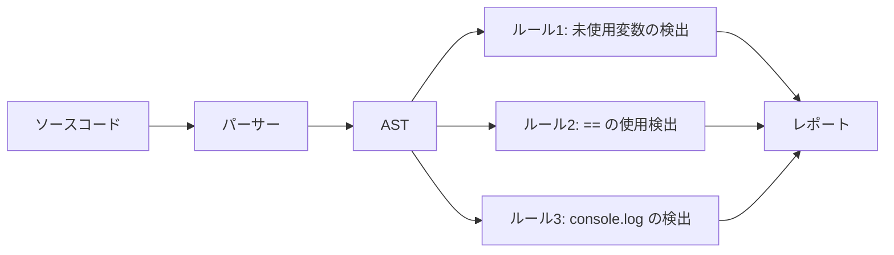
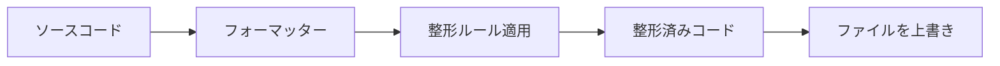
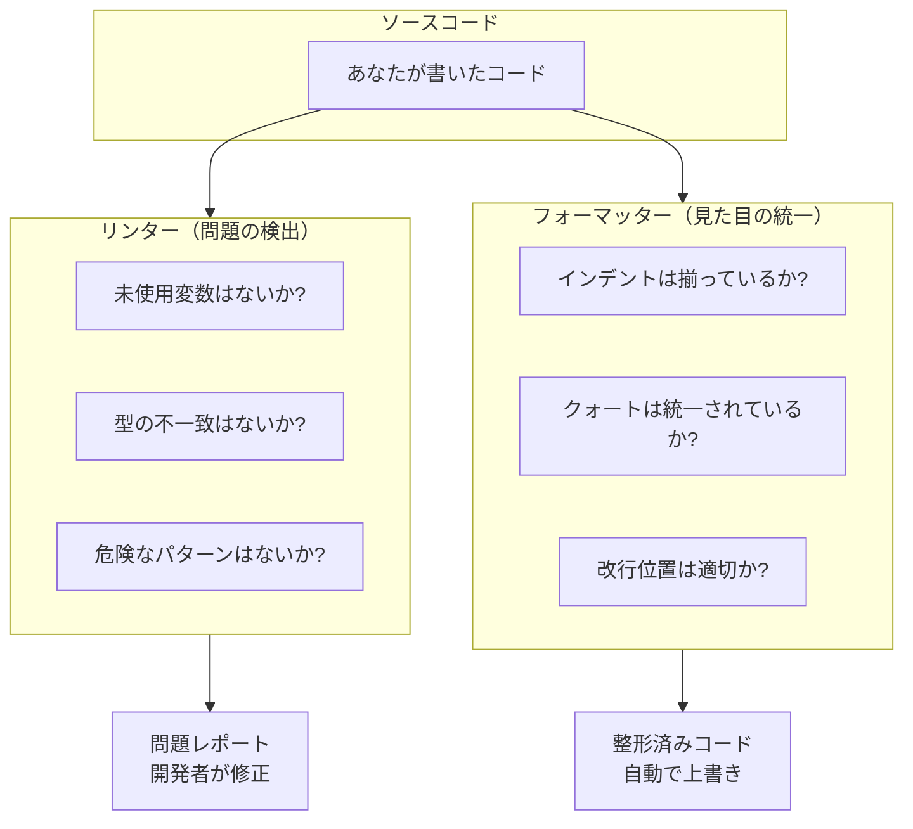
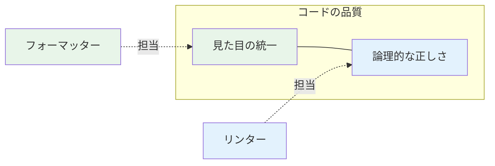
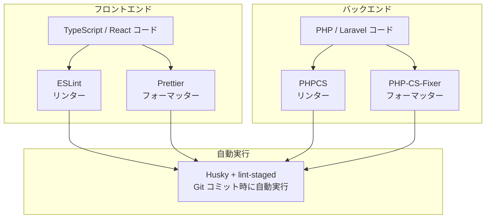

# 1-2-1 リンターとフォーマッターの役割と仕組み

この Chapter「コード品質ツールチェーン」では、コードの品質を自動的に維持するためのツール群を学びます。LMS では、フロントエンド・バックエンドそれぞれにリンターとフォーマッターが導入されており、さらに Git フックで自動実行される仕組みが整っています。

| セクション | 内容 |
|---|---|
| 1-2-1 リンターとフォーマッターの役割と仕組み | リンターとフォーマッターの違いと、なぜ両方必要かを理解する（本セクション） |
| 1-2-2 フロントエンドのコード品質ツール | ESLint と Prettier の設定構造を理解する |
| 1-2-3 バックエンドのコード品質ツール | PHP-CS-Fixer と PHPCS の設定構造を理解する |
| 1-2-4 Git フックによる自動化 | Husky と lint-staged でコミット時に自動チェックする仕組みを理解し、実行確認する |

📖 **この Chapter の進め方**: まず本セクションでリンターとフォーマッターの概念的な違いを押さえ、次にフロントエンド（1-2-2）とバックエンド（1-2-3）それぞれの具体的なツールを学びます。最後に Git フック（1-2-4）でこれらを自動化する仕組みを理解し、実際に動かして確認します。

---

## 🎯 このセクションで学ぶこと

- リンター（静的解析ツール）が何を検出し、なぜ必要かを理解する
- フォーマッター（コード整形ツール）が何を行い、なぜ必要かを理解する
- リンターとフォーマッターの役割の違いと、両方を併用する理由を理解する

このセクションでは、特定のツール（ESLint や Prettier 等）の詳細には踏み込まず、リンターとフォーマッターという2種類のツールがそれぞれ何をするのかという概念を確立します。

---

## 導入: 「動くコード」だけでは足りない理由

あなたが PHP で書いた以下の2つのコードを見てください。どちらも全く同じ動作をします。

```php
// パターン A
function getUser($id){
$user = User::find($id);
if($user == null){
return null;
}
return $user;
}
```

```php
// パターン B
function getUser(int $id): ?User
{
    $user = User::find($id);

    if ($user === null) {
        return null;
    }

    return $user;
}
```

パターン A はインデントがなく、型宣言もなく、`==` で比較しています。パターン B はインデントが揃い、型が明示され、`===` で厳密比較しています。1人で開発しているなら好みの問題かもしれませんが、チーム開発では話が変わります。

メンバーごとにスタイルがバラバラだと、コードレビューで「インデントを直してください」「ここはシングルクォートに統一してください」といった本質的でない指摘が増えます。ロジックのレビューに集中したいのに、見た目の指摘に時間を取られるのは非効率です。また、`==` と `===` の使い分けのような、見た目ではなく意味に関わる問題は、レビューで見落とすとバグの原因になります。

この2つの課題を、それぞれ別の仕組みで解決するのがリンターとフォーマッターです。

### 🧠 先輩エンジニアはこう考える

> LMS の開発でも、初期はコードスタイルが統一されていなくて「この書き方に直してください」というレビューコメントが多かった時期がありました。ESLint や Prettier を導入してからは、スタイルの指摘がほぼゼロになり、レビューで「このロジックの意図は？」「このエラーハンドリングで大丈夫？」といった本質的な議論に集中できるようになりました。ツールに任せられることはツールに任せる、これがチーム開発の鉄則です。

---

## リンターとは何か

**リンター** は、コードを実行せずにソースコードを解析し、問題のあるパターンを検出するツールです。「静的解析ツール」とも呼ばれます。「静的」とは、プログラムを動かさずにコードのテキストだけを読んで判断するという意味です。

### リンターが検出するもの

リンターが検出する問題は、大きく3つのカテゴリに分かれます。

**1. 論理的な問題（バグの可能性）**

コードは動くが、意図と異なる挙動をする可能性がある箇所です。

```php
// PHP の例: == による緩い比較
if ($status == 0) {
    // $status が "" (空文字) や false でも true になる
}
```

```javascript
// JavaScript の例: 未使用の変数
const result = fetchData();
// result を一度も使っていない → 書き忘れ？不要なコード？
```

**2. ベストプラクティスからの逸脱**

動作に問題はないが、その言語やフレームワークで推奨されていない書き方です。

```javascript
// JavaScript の例: var の使用
var name = "太郎"; // var はスコープが関数単位で予期しない挙動の原因に
let name = "太郎"; // let はブロックスコープで安全
```

```php
// PHP の例: 戻り値の型宣言がない
function getPrice($item) { // 何が返るか分からない
    return $item->price;
}

function getPrice(Item $item): int { // int が返ると明確
    return $item->price;
}
```

**3. コーディング規約違反**

チームやプロジェクトで決めたルールへの違反です。

```javascript
// JavaScript の例: console.log の残存
console.log("debug: ここに来た"); // 本番コードに残すべきではない
```

```php
// PHP の例: 名前空間の宣言漏れ
// ファイル先頭に namespace 宣言がない
class UserController extends Controller { ... }
```

### リンターの動作の仕組み

リンターは、ソースコードを **AST（Abstract Syntax Tree: 抽象構文木）** という構造に変換し、その構造に対してルールを適用します。



AST とは、コードの構造をツリー状に表現したデータです。たとえば `const x = 1 + 2;` というコードは「変数宣言」「名前: x」「初期値: 加算式」「左辺: 1」「右辺: 2」というツリーに変換されます。リンターはこのツリーを走査しながら、各ルールに違反するパターンがないかをチェックします。

📝 **AST の詳細を理解する必要はありません。** 重要なのは、リンターが「コードを実行せずに構造を読み取って問題を検出する」という点です。

### リンターの出力

リンターは問題を検出すると、ファイル名・行番号・ルール名とともに報告します。

```bash
# ESLint（JavaScript/TypeScript のリンター）の出力例
src/components/UserList.tsx
  3:7   error  'result' is defined but never used  no-unused-vars
  15:5  warn   Unexpected console statement        no-console
```

```bash
# PHPCS（PHP のリンター）の出力例
FILE: app/Http/Controllers/UserController.php
 12 | ERROR | Missing function doc comment
 25 | ERROR | Expected 1 space after closing parenthesis; found 0
```

🔑 **リンターの本質**: リンターは「何が間違っているか（問題の検出）」を担当します。コードの意味や構造に踏み込んで、バグの可能性や規約違反を指摘します。

---

## フォーマッターとは何か

**フォーマッター** は、コードのロジックを一切変えずに、見た目（スタイル）を統一するツールです。「コード整形ツール」とも呼ばれます。

### フォーマッターが整形するもの

フォーマッターが扱うのは、コードの意味に影響しない見た目の要素です。

| 整形対象 | 整形前 | 整形後 |
|---|---|---|
| インデント | タブとスペースが混在 | スペース4つに統一 |
| クォート | `"text"` と `'text'` が混在 | `'text'` に統一 |
| セミコロン | あったりなかったり | 常にあり、または常になし |
| 改行位置 | 1行が200文字以上 | 80文字で折り返し |
| 波括弧の位置 | 同じ行、次の行が混在 | 次の行に統一 |
| 末尾のカンマ | あったりなかったり | 常にあり |
| 空行 | 3行空いたり0行だったり | 適切な空行に統一 |

### フォーマッターの動作の仕組み

フォーマッターの動作はリンターより単純です。コードを読み取り、設定されたルールに従って整形し、ファイルを上書きします。



重要な特徴は、フォーマッターは **コードの意味を変えない** ということです。変数名を変えたり、ロジックを書き換えたりすることはありません。インデント、スペース、改行、クォートの種類など、純粋に見た目だけを変更します。

### フォーマッターの動作例

PHP のフォーマッター（PHP-CS-Fixer）を例にとります。

整形前:

```php
function getUser($id){
$user=User::find( $id );
if($user==null){return null;}
return $user;
}
```

整形後:

```php
function getUser($id)
{
    $user = User::find($id);
    if ($user == null) {
        return null;
    }
    return $user;
}
```

演算子の前後にスペースが入り、インデントが揃い、波括弧が適切な位置に移動しました。しかし、`==` が `===` に変わることはありません。`==` を `===` に変えるとコードの意味（比較のロジック）が変わるため、それはフォーマッターの仕事ではなくリンターが指摘すべき問題です。

🔑 **フォーマッターの本質**: フォーマッターは「どう見えるか（見た目の統一）」を担当します。コードの意味には一切触れず、スタイルだけを自動で揃えます。

---

## リンターとフォーマッターの違い

ここまでの内容を対照表で整理します。

| 観点 | リンター | フォーマッター |
|---|---|---|
| **目的** | コードの問題を検出する | コードの見た目を統一する |
| **対象** | ロジック・構造・規約 | インデント・スペース・改行 |
| **判断基準** | 「正しいか / 正しくないか」 | 「統一されているか / いないか」 |
| **出力** | 警告・エラーの報告 | 整形済みコードの出力 |
| **自動修正** | 一部のルールのみ自動修正可能 | 全て自動で修正 |
| **例（フロントエンド）** | ESLint | Prettier |
| **例（バックエンド）** | PHPCS | PHP-CS-Fixer |



💡 **覚え方**: リンターは「コードドクター」、フォーマッターは「コードスタイリスト」です。ドクターは「この問題箇所に対処が必要です」と診断しますが、治すのは開発者です。スタイリストは「この服（コード）の着こなしを整えますね」と言って、自動で直してくれます。

---

## なぜ両方必要なのか

「リンターだけ」「フォーマッターだけ」ではカバーできない領域があるため、両方を組み合わせて使います。

### フォーマッターだけの場合

フォーマッターは見た目を整えますが、コードの論理的な問題には気づきません。

```javascript
// フォーマッター適用後: 見た目はきれいだが...
const data = fetchUserData();
// data を使っていない（未使用変数）→ フォーマッターは検出しない

if (status == '0') {
    // == による緩い比較 → フォーマッターは検出しない
    deleteUser(id);
}
```

見た目が整っていても、未使用変数や緩い比較といった潜在的な問題は残ります。

### リンターだけの場合

リンターは問題を検出しますが、スタイルの統一は得意ではありません。リンターにもスタイル系のルール（インデントやクォートのルール等）はありますが、以下の問題があります。

- **設定が複雑**: スタイル系のルールを1つ1つ設定する必要がある
- **自動修正が不完全**: 全てのスタイルルールが自動修正に対応しているわけではない
- **競合のリスク**: リンターのスタイルルールとフォーマッターが競合する場合がある

そのため、現在のベストプラクティスは「スタイルの統一はフォーマッターに任せ、リンターはロジックの問題検出に集中させる」という役割分担です。

### 補完関係

リンターとフォーマッターは、互いの弱点を補う関係にあります。



| シナリオ | フォーマッターの役割 | リンターの役割 |
|---|---|---|
| インデントがバラバラ | 自動で統一する | (関与しない) |
| 未使用の変数がある | (関与しない) | 警告を出す |
| `==` で比較している | (関与しない) | `===` を使うよう指摘 |
| 行が長すぎる | 自動で折り返す | (関与しない) |
| `console.log` が残っている | (関与しない) | 警告を出す |
| セミコロンが不統一 | 自動で統一する | (関与しない) |

⚠️ **注意**: リンターとフォーマッターを併用する場合、スタイル系のルールが競合することがあります。たとえば、リンターが「セミコロンを付けろ」と言い、フォーマッターが「セミコロンを外す」と言うと、修正のたびにお互いが書き換え合う無限ループになります。この競合を避けるための設定方法は、次のセクション（1-2-2, 1-2-3）で具体的に説明します。

---

## LMS のツール構成の全体像

LMS では、フロントエンドとバックエンドそれぞれに、リンターとフォーマッターが1つずつ導入されています。

| 領域 | リンター | フォーマッター |
|---|---|---|
| フロントエンド（TypeScript / React） | ESLint | Prettier |
| バックエンド（PHP / Laravel 10） | PHPCS | PHP-CS-Fixer |

<!-- TODO: 画像追加 - LMS のコード品質ツール構成図 -->



この図のポイントは、4つのツールが最終的に **Husky + lint-staged** という仕組みで Git コミット時に自動実行されるという点です。開発者はコードを書いて `git commit` するだけで、リンターとフォーマッターが自動的に走り、問題があればコミットがブロックされます。

各ツールの詳細な設定や使い方は、今は概要だけ把握すれば十分です。次のセクション以降で1つずつ掘り下げていきます。

📝 **フロントエンドとバックエンドで異なるツールを使う理由**: 各言語にはその言語に最適化されたツールがあります。ESLint は JavaScript/TypeScript の AST を理解し、PHPCS は PHP の AST を理解します。言語の文法が異なる以上、同じツールで両方をカバーすることはできないため、それぞれの言語専用のツールを使い分けます。

---

## ✨ まとめ

- **リンター** は、コードを実行せずに論理的な問題や規約違反を検出する静的解析ツールです。「何が間違っているか」を指摘しますが、自動修正は一部に限られます
- **フォーマッター** は、コードのロジックを変えずに見た目（インデント、クォート、改行等）を統一するツールです。全て自動で整形してくれます
- 両者は「論理的な正しさ」と「見た目の統一」という異なる側面を担当しており、片方だけではコード品質を十分に維持できません。併用することで補完関係が生まれます
- LMS では、フロントエンドに ESLint + Prettier、バックエンドに PHPCS + PHP-CS-Fixer を導入し、Git フック（Husky + lint-staged）で自動実行しています

---

次のセクションでは、フロントエンド側のツールである ESLint と Prettier について、設定ファイルの構造やルールの仕組みを具体的に学びます。
