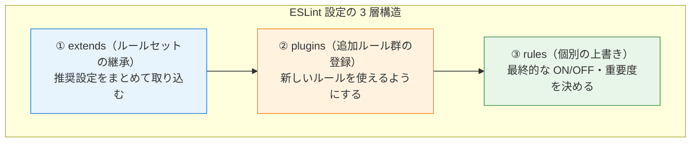

# 1-2-2 フロントエンドのコード品質ツール

## 🎯 このセクションで学ぶこと

- ESLint の 3 層構造（extends・plugins・rules）を理解し、設定ファイルの「読み方」を身につける
- LMS の `.eslintrc.json` に定義された各ルールの意味と設計意図を把握する
- Prettier の設定項目とプラグインの役割を理解する
- ESLint と Prettier の競合回避の仕組みを理解する

ESLint の設定構造を体系的に学んだ後、LMS の実際の設定ファイルを題材にコードリーディングを行い、最後に実行コマンドを確認します。

---

## 導入: 設定ファイルを開いたら意味不明な階層が並んでいた

フロントエンドの開発環境をセットアップすると、プロジェクトルートに `.eslintrc.json` や `.prettierrc` といった設定ファイルが置かれています。試しに `.eslintrc.json` を開いてみると、`extends`、`plugins`、`rules` という見慣れないキーが並び、それぞれに複数の値が設定されています。

```json
{
  "extends": ["next/core-web-vitals", "plugin:@typescript-eslint/recommended", "prettier"],
  "plugins": ["@typescript-eslint"],
  "rules": { "@typescript-eslint/no-unused-vars": "warn" }
}
```

「`extends` と `plugins` は何が違うのか」「`rules` で個別に設定しているのに `extends` にも似たような名前がある」「最後の `prettier` は何のためにあるのか」。これらの疑問に答えられないと、ルールを追加・変更したいときに何をどこに書けばいいかわかりません。

このセクションでは、ESLint の設定ファイルを **3 つの層** に分解して理解し、「設定ファイルを読めば何がどう効いているか説明できる」状態を目指します。

### 🧠 先輩エンジニアはこう考える

> LMS の開発で ESLint の設定を触る場面は意外と多いです。「新しいライブラリを入れたら ESLint が大量にエラーを出す」「特定のルールが厳しすぎて開発効率が下がる」といったとき、設定の構造を理解していないと Claude Code に的確な指示が出せません。逆に「extends の最後に prettier がある理由」「plugins と extends の関係」がわかっていれば、「この extends を追加して、この rules で上書きして」と具体的に伝えられます。設定ファイルの構造を一度理解しておけば、ルールの暗記は不要です。

---

## ESLint の 3 層構造

ESLint の設定ファイルは、大きく **3 つの層** で構成されています。下から順に積み上げるイメージで理解するとわかりやすくなります。



### ① extends: ルールセットをまとめて継承する

**extends** は、誰かが作った「おすすめルールセット」をまとめて取り込む仕組みです。

Laravel で例えると、`php-cs-fixer` の `@PSR12` ルールセットに近い考え方です。PSR-12 に含まれる数十のルールを1つずつ設定する代わりに、`@PSR12` と書くだけで一括適用できます。ESLint の `extends` も同じで、1行書くだけで数十のルールが有効になります。

```json
{
  "extends": ["next/core-web-vitals"]
}
```

この1行で、Next.js 14 が推奨する Web パフォーマンス関連のルールがすべて有効になります。

🔑 **extends に書く順番には意味があります**。後に書いたものが前のルールを上書きします。同じルールが複数の extends で定義されている場合、リストの最後にあるものが優先されます。

### ② plugins: 新しいルールを「登録」する

**plugins** は、ESLint が標準で持っていないルールを追加する仕組みです。

ここが初心者にとって混乱しやすいポイントです。`plugins` に追加しただけでは、ルールは **有効になりません**。あくまで「このルールが使える状態にする」だけです。実際にルールを有効にするには、`rules` で個別に ON にするか、`extends` でそのプラグインの推奨設定を取り込みます。

```json
{
  "plugins": ["@typescript-eslint"],
  "rules": {
    "@typescript-eslint/no-unused-vars": "warn"
  }
}
```

この例では、`plugins` で `@typescript-eslint` のルール群を登録し、`rules` で `no-unused-vars` ルールだけを `warn`（警告）レベルで有効にしています。

💡 **補足**: `extends` に `"plugin:@typescript-eslint/recommended"` と書くと、プラグインの登録と推奨ルールの有効化を同時に行えます。そのため、`extends` で推奨設定を取り込んでいる場合、`plugins` への明示的な追加は必須ではないケースもあります。LMS では明示的に `plugins` にも記載しており、これは設定の意図を明確にするための慣習です。

### ③ rules: 最終的な調整をする

**rules** は、`extends` で取り込んだルールを個別に上書きする層です。「推奨設定は大筋で使いたいが、このルールだけは変えたい」というときに使います。

各ルールには 3 つの重要度レベルがあります。

| レベル | 意味 |
|---|---|
| `"off"` または `0` | ルールを無効化 |
| `"warn"` または `1` | 警告を出すが、エラーにはしない |
| `"error"` または `2` | エラーとして扱い、`--fix` でも自動修正されない場合はチェックに失敗する |

```json
{
  "rules": {
    "no-console": "warn",
    "semi": ["error", "never"]
  }
}
```

ルールによっては、第 2 引数以降でオプションを指定できます。`"semi": ["error", "never"]` は「セミコロンを付けたらエラー」という意味です。

### 3 層の処理順序

設定が適用される順序をまとめると、次のようになります。


🔑 **重要なのは「rules が最終決定権を持つ」ということです**。extends でどんなルールが有効になっていても、rules で `"off"` にすれば無効化できます。逆に、extends に含まれていないルールでも、plugins で登録されていれば rules で有効化できます。

---

## LMS の ESLint 設定を読み解く

ここからは、LMS の実際の設定ファイルを題材に、3 層構造の理解を実践します。

```json
// frontend/.eslintrc.json
{
  "extends": [
    "next/core-web-vitals",
    "plugin:import/recommended",
    "plugin:import/warnings",
    "plugin:@typescript-eslint/recommended",
    "plugin:tailwindcss/recommended",
    "prettier"
  ],
  "parser": "@typescript-eslint/parser",
  "plugins": ["@typescript-eslint"],
  "rules": {
    "@next/next/no-img-element": "off",
    "@typescript-eslint/consistent-type-imports": [
      "error",
      { "prefer": "type-imports", "fixStyle": "separate-type-imports" }
    ],
    "@typescript-eslint/no-unused-vars": [
      "warn",
      { "vars": "all", "varsIgnorePattern": "^_", "args": "after-used", "argsIgnorePattern": "^_" }
    ],
    "object-shorthand": "error",
    "tailwindcss/no-custom-classname": "off",
    "tailwindcss/classnames-order": "off",
    "react/jsx-curly-brace-presence": "error",
    "react/self-closing-comp": ["error", { "component": true, "html": false }],
    "import/no-unresolved": "off"
  },
  "settings": {
    "tailwindcss": { "callees": ["classnames", "clsx", "ctl", "cn"] }
  }
}
```

### extends: 6 つのルールセットの役割

LMS では 6 つのルールセットを extends で取り込んでいます。それぞれの役割を見ていきましょう。

| extends | 役割 |
|---|---|
| `next/core-web-vitals` | Next.js 14 の推奨ルール + Web パフォーマンス指標（Core Web Vitals）に関するルール。画像の最適化、リンクの適切な使い方などをチェック |
| `plugin:import/recommended` | `import` 文の書き方に関する推奨ルール。存在しないモジュールの import や、名前の間違いを検出 |
| `plugin:import/warnings` | `import` 文に関する追加の警告ルール。重複 import や不要な import を検出 |
| `plugin:@typescript-eslint/recommended` | TypeScript コードの推奨ルール。型に関する問題や TypeScript 固有の書き方をチェック |
| `plugin:tailwindcss/recommended` | Tailwind CSS のクラス名に関する推奨ルール。存在しないクラス名やクラスの並び順をチェック |
| `prettier` | **ESLint のフォーマット系ルールを無効化する**。Prettier との競合を防ぐ（詳細は後述） |

📝 `plugin:○○/recommended` という書式は「○○プラグインの推奨ルールセットを extends として取り込む」という意味です。`plugin:` プレフィックスが付くのは、npm パッケージとして配布されているプラグインの中に定義されたルールセットを参照するためです。一方、`next/core-web-vitals` や `prettier` のように `plugin:` が付かないものは、専用の config パッケージ（`eslint-config-next`、`eslint-config-prettier`）から提供されるルールセットです。

### parser: TypeScript を ESLint で扱うために

```json
"parser": "@typescript-eslint/parser"
```

ESLint は標準では JavaScript しか解析できません。TypeScript のコードを解析するには、TypeScript 専用のパーサー（構文解析器）が必要です。`@typescript-eslint/parser` を指定することで、ESLint が TypeScript の構文（型注釈やインターフェースなど）を理解できるようになります。

💡 **補足**: TypeScript や型注釈については Part 2 で詳しく学びます。ここでは「ESLint が TypeScript を読むために専用のパーサーが必要」という点だけ押さえておけば十分です。

### plugins: @typescript-eslint の登録

```json
"plugins": ["@typescript-eslint"]
```

`extends` で `plugin:@typescript-eslint/recommended` を指定しているため、推奨ルールは既に有効です。ここで `plugins` に明示的に追加しているのは、`rules` で推奨セットに含まれないルール（`consistent-type-imports` など）を個別に有効化するためです。

### rules: 各ルールの意味と設計意図

LMS の `rules` で個別に設定されている各ルールを見ていきましょう。

#### `@typescript-eslint/consistent-type-imports`

```json
"@typescript-eslint/consistent-type-imports": [
  "error",
  { "prefer": "type-imports", "fixStyle": "separate-type-imports" }
]
```

TypeScript では、値（変数や関数）と型（インターフェースや型エイリアス）の両方を `import` できます。このルールは、型だけを import する場合に `import type` という専用の構文を使うことを強制します。

```typescript
// NG: 型も値も同じ import 文
import { User, UserType } from './types'

// OK: 型は import type で分離
import { User } from './types'
import type { UserType } from './types'
```

🔑 `import type` で型を分離すると、ビルド時に型の import が完全に除去されるため、バンドルサイズ（最終的なファイルサイズ）の削減に寄与します。型はあくまで開発時のチェック用で、実行時には不要だからです。

#### `@typescript-eslint/no-unused-vars`

```json
"@typescript-eslint/no-unused-vars": [
  "warn",
  { "vars": "all", "varsIgnorePattern": "^_", "args": "after-used", "argsIgnorePattern": "^_" }
]
```

未使用の変数を警告するルールです。ただし、変数名が `_`（アンダースコア）で始まる場合は警告を出しません。これは「意図的に使わない変数」を明示するための慣習です。

```typescript
// 警告が出る: value を宣言したが使っていない
const value = getData()

// 警告が出ない: _ プレフィックスで「意図的に未使用」と明示
const _unusedValue = getData()

// 関数の引数でも同様
// 警告が出ない: 第1引数は使わないが、第2引数の index が必要な場合
items.map((_item, index) => index)
```

`"args": "after-used"` は「使用された最後の引数より後の引数のみチェックする」という設定です。コールバック関数で「2番目の引数だけ使いたい」というケースに対応しています。

#### `object-shorthand`

```json
"object-shorthand": "error"
```

JavaScript のオブジェクト定義で、プロパティ名と変数名が同じ場合に省略記法を強制するルールです。

```typescript
const name = 'LMS'
const version = 2

// NG: 冗長な書き方
const config = { name: name, version: version }

// OK: 省略記法
const config = { name, version }
```

PHP にはこの省略記法がないため、最初は違和感があるかもしれません。JavaScript / TypeScript では非常に一般的な書き方で、LMS のコードベース全体で使われています。

#### `tailwindcss/no-custom-classname: off`

```json
"tailwindcss/no-custom-classname": "off"
```

Tailwind CSS のプラグインは、デフォルトで Tailwind に存在しないクラス名を使うとエラーにします。しかし LMS では独自の CSS クラスも併用しているため、このルールを無効化しています。

#### `tailwindcss/classnames-order: off`

```json
"tailwindcss/classnames-order": "off"
```

Tailwind CSS クラスの並び順を強制するルールです。LMS ではこのルールを無効化し、代わりに Prettier のプラグイン（`prettier-plugin-tailwindcss`）でクラス名の自動整列を行っています。ESLint で警告を出すよりも、Prettier で自動修正するほうが開発体験が良いという判断です。

#### `react/jsx-curly-brace-presence`

```json
"react/jsx-curly-brace-presence": "error"
```

React の JSX（JavaScript の中に HTML のような記法を埋め込む構文）で、不要な中括弧 `{}` の使用を禁止するルールです。

```tsx
// NG: 文字列リテラルに不要な中括弧
<Button label={"送信"} />

// OK: 中括弧なしで直接文字列を渡す
<Button label="送信" />
```

💡 **補足**: JSX や React コンポーネントの詳細は Part 2 で学びます。ここでは「不要な記法を禁止してコードを統一するルール」と理解しておけば十分です。

#### `react/self-closing-comp`

```json
"react/self-closing-comp": ["error", { "component": true, "html": false }]
```

子要素を持たない React コンポーネントに対して、自己閉じタグ（`<Component />`）の使用を強制するルールです。HTML 要素（`<div>`、`<span>` など）には適用しない設定になっています。

```tsx
// NG: 子要素がないのに開きタグと閉じタグがある
<UserProfile></UserProfile>

// OK: 自己閉じタグ
<UserProfile />

// HTML 要素は対象外（html: false）
<div></div>  // これは OK
```

#### `import/no-unresolved: off`

```json
"import/no-unresolved": "off"
```

import 先のモジュールが実際に存在するかチェックするルールです。LMS ではこれを無効化しています。理由は、Next.js 14 の **パスエイリアス**（`@/` で始まる import パス）を `eslint-plugin-import` が正しく解決できないためです。

```typescript
// Next.js のパスエイリアス: @ が src/ ディレクトリを指す
import { fetchUser } from '@/lib/api'
```

この `@/lib/api` は `src/lib/api` を指しますが、ESLint の import プラグインはこの変換を認識できず、「モジュールが見つからない」と誤検知します。実際のモジュール解決は TypeScript と Next.js が行うため、ESLint 側のチェックは不要です。

### settings: プラグインの追加設定

```json
"settings": {
  "tailwindcss": { "callees": ["classnames", "clsx", "ctl", "cn"] }
}
```

`settings` はプラグインに追加情報を渡すための領域です。ここでは Tailwind CSS プラグインに対して、「`classnames`、`clsx`、`ctl`、`cn` という関数の引数も Tailwind のクラス名として扱ってほしい」と伝えています。

LMS では、複数のクラス名を条件付きで結合する `cn` ユーティリティ関数を多用しています。この設定がないと、`cn("flex", "items-center")` のような呼び出しの中にある Tailwind クラスがチェック対象にならなくなります。

---

## Prettier の設定

Prettier はコードフォーマッター（整形ツール）です。ESLint がコードの「品質」をチェックするのに対し、Prettier はコードの「見た目」を統一します。

LMS の Prettier 設定を見てみましょう。

```json
// frontend/.prettierrc
{
  "trailingComma": "all",
  "tabWidth": 2,
  "semi": false,
  "singleQuote": true,
  "jsxSingleQuote": true,
  "printWidth": 100,
  "bracketSpacing": true,
  "plugins": ["prettier-plugin-organize-imports", "prettier-plugin-tailwindcss"]
}
```

### 各設定項目の意味

| 設定 | 値 | 意味 |
|---|---|---|
| `trailingComma` | `"all"` | 配列やオブジェクトの最後の要素にもカンマを付ける |
| `tabWidth` | `2` | インデント幅をスペース 2 つにする |
| `semi` | `false` | 文末のセミコロンを付けない |
| `singleQuote` | `true` | 文字列をシングルクォートで統一する |
| `jsxSingleQuote` | `true` | JSX 内の属性もシングルクォートで統一する |
| `printWidth` | `100` | 1行の最大文字数を 100 文字にする |
| `bracketSpacing` | `true` | オブジェクトの中括弧の内側にスペースを入れる |

具体例で見るとイメージしやすくなります。

```typescript
// Prettier 適用前（バラバラなスタイル）
const user = {name: "Taro",age: 25, email: "taro@example.com", role: "admin"}
const greeting = "Hello";

// Prettier 適用後（統一されたスタイル）
const user = {
  name: 'Taro',
  age: 25,
  email: 'taro@example.com',
  role: 'admin',
}
const greeting = 'Hello'
```

`semi: false` でセミコロンが除去され、`singleQuote: true` でシングルクォートに統一され、`bracketSpacing: true` で中括弧の内側にスペースが入っています。`printWidth: 100` を超える行は自動で折り返され、`trailingComma: "all"` により最後の `'admin',` にも末尾カンマが付いています。

📝 **`trailingComma: "all"` の利点**: 最後の要素にもカンマを付けるスタイルは、Git の差分を最小限にする効果があります。新しい要素を追加したとき、前の行にカンマを追加する変更が不要になるため、差分が「追加した1行だけ」になります。

### plugins: import 整列と Tailwind クラス整列

Prettier のプラグインは、フォーマットの対象を拡張する仕組みです。

| プラグイン | 役割 |
|---|---|
| `prettier-plugin-organize-imports` | import 文をアルファベット順に自動整列し、未使用の import を除去する |
| `prettier-plugin-tailwindcss` | Tailwind CSS のクラス名を推奨順に自動整列する |

```typescript
// 整列前
import { useState } from 'react'
import { Button } from '@heroui/react'
import { z } from 'zod'
import type { User } from '@/types'

// prettier-plugin-organize-imports 適用後（アルファベット順に整列）
import { Button } from '@heroui/react'
import { useState } from 'react'
import { z } from 'zod'

import type { User } from '@/types'
```

```tsx
// 整列前: クラス名の順序がバラバラ
<div className='text-white p-4 flex bg-blue-500 items-center' />

// prettier-plugin-tailwindcss 適用後: 推奨順に整列
<div className='flex items-center bg-blue-500 p-4 text-white' />
```

Tailwind CSS の推奨順は、レイアウト（`flex`）→ 配置（`items-center`）→ 背景（`bg-blue-500`）→ 余白（`p-4`）→ テキスト（`text-white`）のように、外側から内側に向かう論理的な順序です。

---

## ESLint と Prettier の競合回避

ESLint と Prettier を同時に使うと、1つ問題が発生します。ESLint にもコードの見た目に関するルール（インデント、セミコロン、クォートなど）が存在し、Prettier のフォーマットと矛盾することがあるのです。

例えば、ESLint が「セミコロンを付けるべき」と主張し、Prettier が「セミコロンを除去する」と主張したら、どちらを実行しても片方が怒り続けることになります。

### eslint-config-prettier による解決

この問題を解決するのが、`extends` の最後に配置された `"prettier"` です。

```json
{
  "extends": [
    "next/core-web-vitals",
    "plugin:import/recommended",
    "plugin:import/warnings",
    "plugin:@typescript-eslint/recommended",
    "plugin:tailwindcss/recommended",
    "prettier"              // ← 最後に配置
  ]
}
```

この `"prettier"` は `eslint-config-prettier` というパッケージが提供するルールセットで、**ESLint のフォーマット系ルールをすべて無効化** します。


🔑 **`"prettier"` を extends の最後に置く理由**: extends は後に書いたものが前のルールを上書きします。最後に `"prettier"` を配置することで、それ以前の extends で有効になったフォーマット系ルールをすべて打ち消せます。もし途中に配置すると、それ以降の extends でフォーマット系ルールが再び有効になってしまいます。

この仕組みにより、役割が明確に分離されます。

| ツール | 担当 |
|---|---|
| **ESLint** | コードの品質チェック（未使用変数、import の問題、型の不整合など） |
| **Prettier** | コードのフォーマット（インデント、クォート、セミコロンなど） |

---

## 実行コマンド

LMS のフロントエンドでは、ESLint と Prettier をそれぞれ個別に実行するスクリプトと、まとめて実行するスクリプトが `package.json` に定義されています。

```json
// frontend/package.json（scripts 抜粋）
{
  "scripts": {
    "lint": "run-p -l -c --aggregate-output lint:*",
    "lint:eslint": "eslint .",
    "lint:prettier": "prettier --check .",
    "fix": "run-s fix:prettier fix:eslint",
    "fix:eslint": "npm run lint:eslint -- --fix",
    "fix:prettier": "npm run lint:prettier -- --write"
  }
}
```

### チェック系コマンド

`npm run lint` を実行すると、`lint:eslint` と `lint:prettier` が **並列** で実行されます。

| コマンド | 実行内容 |
|---|---|
| `npm run lint` | ESLint チェックと Prettier チェックを並列実行 |
| `npm run lint:eslint` | ESLint のみ実行（ルール違反を検出） |
| `npm run lint:prettier` | Prettier のみ実行（フォーマット崩れを検出、修正はしない） |

`run-p` は `npm-run-all` パッケージが提供するコマンドで、`-p` は並列実行（parallel）を意味します。`lint:*` というワイルドカードで、`lint:` で始まるすべてのスクリプトを対象にします。

### 自動修正コマンド

`npm run fix` を実行すると、`fix:prettier` → `fix:eslint` の順で **直列** に実行されます。

| コマンド | 実行内容 |
|---|---|
| `npm run fix` | Prettier で整形 → ESLint で自動修正を直列実行 |
| `npm run fix:eslint` | ESLint の自動修正可能なルール違反を修正 |
| `npm run fix:prettier` | Prettier でフォーマットを適用 |

`run-s` は直列実行（serial）を意味します。Prettier を先に実行する理由は、フォーマットを整えてから ESLint のチェックを行うことで、フォーマット起因の ESLint エラーを防ぐためです。

💡 **補足**: `--` は npm スクリプトに追加の引数を渡す構文です。`npm run lint:eslint -- --fix` は、`eslint .` に `--fix` オプションを追加して `eslint . --fix` として実行します。

---

## ✨ まとめ

- ESLint の設定は **3 層構造**（extends → plugins → rules）で理解する。extends でルールセットをまとめて取り込み、plugins で追加ルールを登録し、rules で最終的な上書きを行う
- **extends の順序は重要**。後に書いたものが前を上書きするため、`"prettier"` は必ず最後に配置する
- **Prettier** はコードの見た目を統一するフォーマッター。プラグインで import 整列や Tailwind クラス整列も自動化できる
- ESLint と Prettier の競合は **eslint-config-prettier** が解決する。ESLint はコード品質、Prettier はフォーマットという役割分担が成立する
- `npm run lint` でチェック、`npm run fix` で自動修正。fix は Prettier → ESLint の順で直列実行される

---

次のセクションでは、バックエンド側のコード品質ツールである PHP-CS-Fixer と PHPCS の設定構造を学びます。
