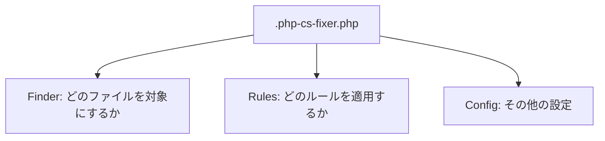
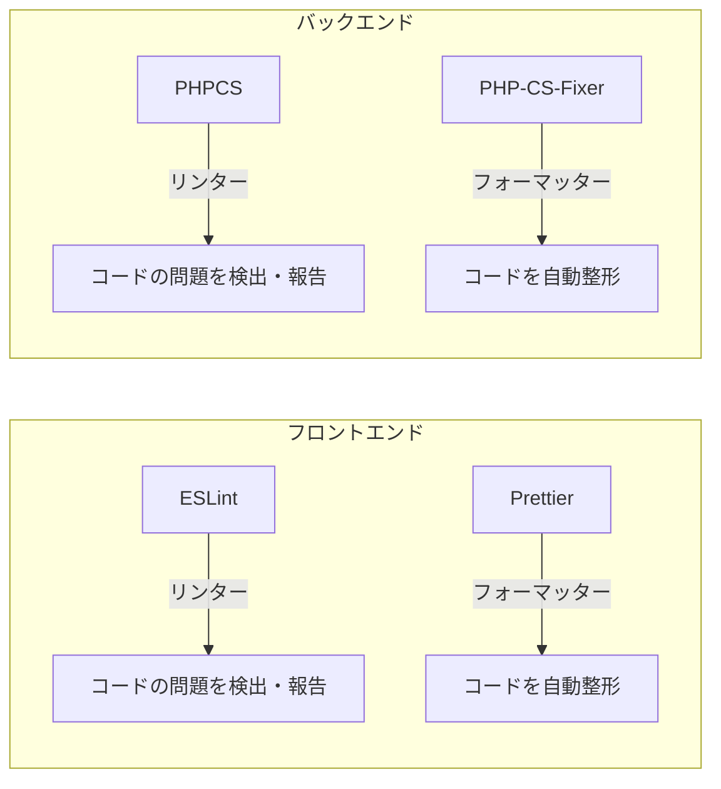
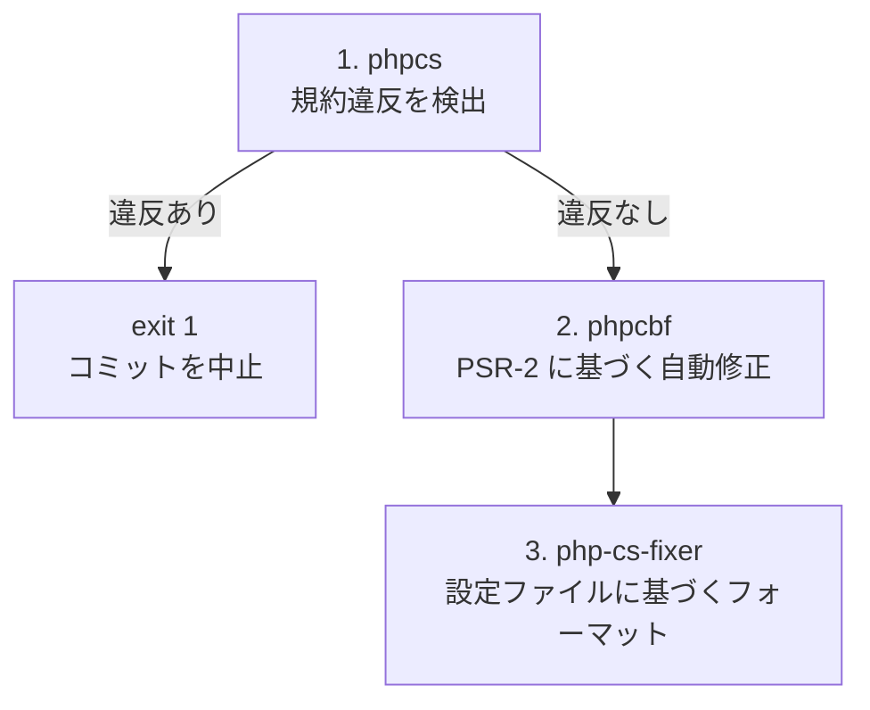

# 1-2-3 バックエンドのコード品質ツール

## 🎯 このセクションで学ぶこと

- PHP の共通コーディング規約である PSR の位置づけと PSR-12 の概要を理解する
- PHP-CS-Fixer の設定ファイル（`.php-cs-fixer.php`）の構造を読み解く
- PHPCS（PHP_CodeSniffer）の設定ファイル（`phpcs.xml`）の構造を読み解く
- PHP-CS-Fixer と PHPCS の役割の違いを整理する
- `run-php-lint-and-fix.sh` の処理フローを理解する

PSR という共通規約の背景を押さえた上で、LMS の設定ファイルを1つずつ読み解き、最後にフロントエンドのツールとの対応関係を整理します。

---

## 導入: Laravel プロジェクトでコードスタイルがバラつく問題

Laravel は柔軟なフレームワークです。コントローラの書き方、変数の命名、use 文の並び順など、「動くけれど人によって書き方が違う」箇所が無数にあります。たとえば、同じ配列を書くにしても `array()` と `[]` の2通りがあり、文字列のクォートもシングルとダブルが混在しがちです。

```php
// 開発者 A のスタイル
$items = array("apple", "banana");

// 開発者 B のスタイル
$items = ['apple', 'banana'];
```

どちらも正しく動きますが、1つのプロジェクト内でスタイルが混在すると、コードレビューで本質的なロジックの議論ではなく「ここはシングルクォートに統一して」といった指摘が増えてしまいます。

PHP コミュニティにはこの問題に対する共通の解決策があります。それが **PSR** です。

### 🧠 先輩エンジニアはこう考える

> LMS の開発でも、初期はコードスタイルのバラつきに悩みました。特に use 文の並び順やインデントの不統一は、Git の差分を見るときにノイズになります。「この差分、ロジックの変更かと思ったらインデントの修正だけだった」ということが何度もありました。PHP-CS-Fixer と PHPCS を導入してからは、コミット前に自動でスタイルが統一されるので、レビューではロジックに集中できるようになりました。フロントエンドの ESLint と Prettier の関係と同じ構図です。

---

## PSR とは何か

**PSR** は PHP-FIG（PHP Framework Interop Group）が策定している PHP のコーディング規約と技術仕様の総称です。PSR は「PHP Standards Recommendations」の略で、PHP コミュニティ全体で共有される「標準的な書き方のルール集」と理解してください。

PSR には番号ごとに異なるテーマの仕様があります。コードスタイルに関係する主要な PSR を整理しましょう。

| PSR | 名前 | 内容 |
|---|---|---|
| PSR-1 | Basic Coding Standard | 基本的なコーディング規約。ファイルのエンコーディング（UTF-8）、クラス名の命名（StudlyCaps）、メソッド名の命名（camelCase）など |
| PSR-12 | Extended Coding Style Guide | PSR-1 を拡張した詳細なスタイルガイド。インデント（4スペース）、行の長さ（120文字推奨）、波括弧の位置、use 文の並び順など |

PSR-1 が「最低限これだけは守ろう」という基本ルール、PSR-12 がそれを拡張した詳細なスタイルガイドです。Laravel のコードベースも PSR-12 に準拠しており、LMS でも PSR-12 をベースにしています。

📝 PSR にはコードスタイル以外の仕様（PSR-4: オートローディング、PSR-7: HTTP メッセージインターフェースなど）もありますが、このセクションではコードスタイルに関わる PSR-1 と PSR-12 に焦点を当てます。

🔑 重要なのは、PSR はあくまで「推奨」であり強制力はないという点です。しかし、Laravel を含む主要フレームワークが PSR-12 に準拠しているため、PHP 開発の事実上の標準となっています。ツールを使って自動的に PSR-12 に準拠させるのが現代の PHP 開発の一般的なアプローチです。

---

## PHP-CS-Fixer: コードを自動整形するフォーマッター

**PHP-CS-Fixer** は PHP のコードフォーマッターです。コーディング規約に違反しているコードを検出し、自動的に修正します。前のセクションで学んだ Prettier がフロントエンドのフォーマッターであるのと同様に、PHP-CS-Fixer はバックエンドのフォーマッターです。

LMS の設定ファイルを読み解いていきましょう。

### 設定ファイルの全体構造

```php
// backend/.php-cs-fixer.php
<?php
$finder = PhpCsFixer\Finder::create()
    ->in([__DIR__ . '/app'])
    ->name('*.php')
    ->notName('*.blade.php')
    ->ignoreDotFiles(true)
    ->ignoreVCS(true);

return (new PhpCsFixer\Config())
    ->setRules([
        '@PSR12' => true,
        'array_syntax' => ['syntax' => 'short'],
        'single_quote' => true,
        'no_unused_imports' => true,
        'ordered_imports' => ['sort_algorithm' => 'alpha'],
    ])
    ->setFinder($finder)
    ->setUsingCache(false);
```

この設定ファイルは大きく3つのブロックで構成されています。



### Finder: 対象ファイルのスコープ指定

**Finder** は「どのファイルに PHP-CS-Fixer を適用するか」を定義します。

```php
$finder = PhpCsFixer\Finder::create()
    ->in([__DIR__ . '/app'])        // app/ ディレクトリ配下を対象
    ->name('*.php')                 // .php ファイルのみ
    ->notName('*.blade.php')        // Blade テンプレートは除外
    ->ignoreDotFiles(true)          // .で始まるファイルを除外
    ->ignoreVCS(true);              // .git/ 等を除外
```

| メソッド | 意味 |
|---|---|
| `in()` | 検索対象のディレクトリ。`app/` ディレクトリに限定 |
| `name()` | ファイル名のパターン。`.php` 拡張子のファイルのみ |
| `notName()` | 除外するファイル名のパターン |
| `ignoreDotFiles()` | `.gitignore` 等のドットファイルを除外 |
| `ignoreVCS()` | `.git/` 等のバージョン管理ディレクトリを除外 |

💡 **補足**: Blade テンプレート（`.blade.php`）を除外しているのは、Blade ファイルには PHP と HTML が混在しており、PHP-CS-Fixer のルールをそのまま適用すると Blade の構文が壊れる可能性があるためです。

📝 LMS では `in()` に `app/` のみを指定しています。`config/` や `routes/` や `database/` は対象外です。これはフォーマットの適用範囲をビジネスロジックが集中する `app/` ディレクトリに絞る設計判断です。

### Rules: 適用するルールの定義

**Rules** は「どのようなスタイルに整形するか」を定義します。LMS で設定されている5つのルールを1つずつ見ていきましょう。

```php
->setRules([
    '@PSR12' => true,
    'array_syntax' => ['syntax' => 'short'],
    'single_quote' => true,
    'no_unused_imports' => true,
    'ordered_imports' => ['sort_algorithm' => 'alpha'],
])
```

**`@PSR12`**: PSR-12 準拠のルールセットを一括で有効化します。`@` で始まるルールは **プリセット** （ルールの集合体）です。PSR-12 が定めるインデント、波括弧の位置、名前空間の書き方など、数十個のルールがこの1行で有効になります。

**`array_syntax`**: 配列の書き方を `[]`（短縮構文）に統一します。

```php
// 修正前
$items = array('apple', 'banana');

// 修正後
$items = ['apple', 'banana'];
```

PHP 5.4 以降は `[]` が使えるため、現代の PHP では短縮構文が標準です。

**`single_quote`**: 文字列リテラルのクォートをシングルクォートに統一します。

```php
// 修正前
$name = "John";

// 修正後
$name = 'John';
```

⚠️ **注意**: 変数展開を含むダブルクォート（`"Hello, $name"`）は変換されません。変数展開が不要な文字列だけがシングルクォートに変換されます。

**`no_unused_imports`**: 使われていない `use` 文を自動で削除します。

```php
// 修正前
use App\Models\User;
use App\Models\Post;  // この行は削除される（コード内で Post を使っていない場合）

class UserController {
    public function index() {
        return User::all();
    }
}
```

開発中にクラスを参照して後から削除した場合、use 文だけが残ってしまうことはよくあります。このルールが自動で掃除してくれます。

**`ordered_imports`**: `use` 文をアルファベット順に並べ替えます。

```php
// 修正前
use Illuminate\Http\Request;
use App\Models\User;
use App\Http\Controllers\Controller;

// 修正後
use App\Http\Controllers\Controller;
use App\Models\User;
use Illuminate\Http\Request;
```

use 文の順序が統一されると、「このクラスは use されているか」を目視で素早く確認できるようになります。

### setUsingCache(false): キャッシュの無効化

```php
->setUsingCache(false);
```

PHP-CS-Fixer はデフォルトでキャッシュファイル（`.php-cs-fixer.cache`）を生成し、前回チェック済みのファイルをスキップすることで高速化を図ります。LMS ではこのキャッシュを無効化しています。

これは、Git フック経由で実行する際にキャッシュが原因で「変更したのにフォーマットされない」という問題を防ぐためです。LMS のバックエンドのファイル数であれば、キャッシュなしでも実行速度に大きな影響はありません。

---

## PHPCS（PHP_CodeSniffer）: コーディング規約違反を検出するリンター

**PHPCS**（PHP_CodeSniffer）は PHP のリンターです。コーディング規約に違反しているコードを検出し、レポートします。PHP-CS-Fixer がコードを「修正する」のに対して、PHPCS はコードの問題を「報告する」ことが主な役割です。

### 設定ファイルの構造

```xml
<!-- backend/phpcs.xml -->
<?xml version="1.0"?>
<ruleset name="Laravel Project">
    <description>PHP_CodeSniffer rules for coachtech-lms-api project</description>
    <arg name="colors" />
    <arg value="ps" />
    <rule ref="PSR1.Methods.CamelCapsMethodName.NotCamelCaps" />
    <exclude-pattern>*/tests/*</exclude-pattern>
</ruleset>
```

PHP-CS-Fixer の設定が PHP ファイルだったのに対して、PHPCS の設定は XML ファイルです。各要素を見ていきましょう。

**`<ruleset>`**: ルールセット全体を囲む要素です。`name` 属性はこのルールセットの名前で、エラーメッセージ等に表示されます。

**`<arg>`**: コマンドライン引数を設定ファイル内で指定します。

| 属性 | 値 | 意味 |
|---|---|---|
| `name="colors"` | - | 出力をカラー表示にする |
| `value="ps"` | - | `p`（進捗表示）と `s`（ルール名の表示）を有効化 |

**`<rule ref="PSR1.Methods.CamelCapsMethodName.NotCamelCaps">`**: このルールを **有効化（検出対象に追加）** しています。ルール名の構造は以下のとおりです。

```
PSR1.Methods.CamelCapsMethodName.NotCamelCaps
 |      |           |                |
 |      |           |                └─ エラーコード
 |      |           └─ スニッフ（チェック項目）名
 |      └─ カテゴリ
 └─ 規約セット
```

このルールは「メソッド名が camelCase でない場合に違反として報告する」というものです。PHPCS のデフォルトでは PSR-1 の全ルールが有効ではないため、`<rule ref="...">` で必要なルールを明示的に有効化しています。

**`<exclude-pattern>`**: 指定したパターンに一致するファイルをチェック対象から除外します。`*/tests/*` により、テストディレクトリ配下のファイルは PHPCS のチェック対象外になります。つまり、上記のルールでキャメルケースを強制しつつ、テストファイルは除外しているため、テストでは `test_user_can_login` のようなスネークケースのメソッド名を使えます。

---

## PHP-CS-Fixer と PHPCS の違い

2つのツールは似ているようで役割が異なります。対照表で整理しましょう。

| 観点 | PHP-CS-Fixer | PHPCS |
|---|---|---|
| **主な役割** | フォーマッター（自動整形） | リンター（規約違反の検出・報告） |
| **動作** | 違反を検出して **自動修正** する | 違反を検出して **報告** する |
| **設定ファイル** | `.php-cs-fixer.php`（PHP） | `phpcs.xml`（XML） |
| **ルールのベース** | `@PSR12` プリセット + 個別ルール | PSR-1 / PSR-2 等のルール参照 |
| **自動修正** | 常に自動修正 | `phpcbf` コマンドで一部自動修正可能 |
| **フロントエンドの対応ツール** | Prettier | ESLint |

🔑 ポイントは **PHP-CS-Fixer はフォーマッター寄り、PHPCS はリンター寄り** ということです。PHP-CS-Fixer は「コードをこう整形する」と決めて自動修正します。PHPCS は「このコードは規約に違反している」と報告し、修正は開発者に委ねます（ただし `phpcbf` という付属ツールで一部は自動修正できます）。

この関係は、前のセクションで学んだフロントエンドのツールと同じ構図です。



---

## run-php-lint-and-fix.sh の処理フロー

LMS では、PHP のリントとフォーマットを1つのシェルスクリプトにまとめて実行しています。このスクリプトは Git フック（次のセクションで詳しく学びます）から呼び出されます。

```bash
# run-php-lint-and-fix.sh
#!/bin/sh
changed_files=$(git diff --cached --name-only | grep '^backend/.*\.php$'| grep -v 'backend/routes/api.php')
docker_paths=""

for file in $changed_files; do
    docker_path=${file#backend/}
    docker_paths="$docker_paths $docker_path"
done

if [ -n "$docker_paths" ]; then
    # 1. phpcs: 規約チェック
    if ! docker-compose exec -T app vendor/bin/phpcs --standard=phpcs.xml $docker_paths; then
        echo "phpcs failed"
        exit 1
    fi
    # 2. phpcbf: 自動修正
    docker-compose exec -T app vendor/bin/phpcbf --standard=PSR2 $docker_paths
    # 3. php-cs-fixer: フォーマット
    docker-compose exec -T app vendor/bin/php-cs-fixer fix --config=.php-cs-fixer.php $docker_paths
else
    echo "No PHP files to process"
fi
```

### 対象ファイルの抽出

スクリプトの冒頭で、Git のステージング領域（`--cached`）から変更された PHP ファイルを抽出しています。

```bash
changed_files=$(git diff --cached --name-only | grep '^backend/.*\.php$'| grep -v 'backend/routes/api.php')
```

| 部分 | 意味 |
|---|---|
| `git diff --cached --name-only` | ステージ済み（`git add` 済み）のファイル名一覧を取得 |
| `grep '^backend/.*\.php$'` | `backend/` 配下の `.php` ファイルだけに絞り込む |
| `grep -v 'backend/routes/api.php'` | `routes/api.php` を除外する |

`routes/api.php` を除外しているのは、このファイルが自動生成される部分を含んでおり、フォーマッターが不要な変更を加える可能性があるためです。

その後の `for` ループでは、`backend/app/Models/User.php` のようなパスから `backend/` プレフィックスを除去して `app/Models/User.php` に変換しています。これは Docker コンテナ内のパスに合わせるためです。

### 3段階の処理パイプライン

対象ファイルがある場合、3つのツールが順番に実行されます。



**Step 1: phpcs（規約チェック）**

```bash
if ! docker-compose exec -T app vendor/bin/phpcs --standard=phpcs.xml $docker_paths; then
    echo "phpcs failed"
    exit 1
fi
```

`phpcs.xml` に定義されたルールでコードをチェックします。違反が見つかった場合は `exit 1` でスクリプト全体を終了し、コミットを中止します。ここが **ゲートキーパー** の役割を果たしています。

**Step 2: phpcbf（自動修正）**

```bash
docker-compose exec -T app vendor/bin/phpcbf --standard=PSR2 $docker_paths
```

`phpcbf`（PHP Code Beautifier and Fixer）は PHPCS の付属ツールで、検出された違反のうち自動修正可能なものを修正します。`--standard=PSR2` で PSR-2 規約を基準にしています。

**Step 3: php-cs-fixer（フォーマット）**

```bash
docker-compose exec -T app vendor/bin/php-cs-fixer fix --config=.php-cs-fixer.php $docker_paths
```

最後に PHP-CS-Fixer が `.php-cs-fixer.php` の設定に基づいてコードをフォーマットします。`@PSR12` プリセットに加えて、シングルクォート化や use 文の整列などが適用されます。

🔑 3つのツールが **phpcs（検出）→ phpcbf（部分修正）→ php-cs-fixer（フォーマット）** の順で実行される点がポイントです。まず phpcs で致命的な規約違反がないかチェックし、問題がなければ phpcbf と php-cs-fixer で段階的にコードを整形します。

📝 3つのツールはすべて `docker-compose exec -T app` 経由で Docker コンテナ内で実行されます。`-T` フラグは擬似 TTY の割り当てを無効化するオプションで、スクリプトからの自動実行時に必要です。PHP-CS-Fixer や PHPCS はコンテナ内の `vendor/bin/` にインストールされているため、ホストマシンに PHP 環境がなくても動作します。

---

## フロントエンドのツールとの対比

前のセクションで学んだフロントエンドのツールと、このセクションで学んだバックエンドのツールの対応関係を改めて整理します。

| 役割 | フロントエンド | バックエンド |
|---|---|---|
| **リンター**（問題の検出・報告） | ESLint | PHPCS |
| **フォーマッター**（コードの自動整形） | Prettier | PHP-CS-Fixer |
| **規約のベース** | ESLint recommended + Next.js プリセット | PSR-12 |
| **設定ファイル形式** | JSON（`.eslintrc.json`, `.prettierrc`） | PHP + XML（`.php-cs-fixer.php`, `phpcs.xml`） |
| **実行環境** | Node.js（ホストマシン） | Docker コンテナ内（PHP） |

フロントエンドもバックエンドも「リンター + フォーマッター」という2層構造は同じです。違いは言語エコシステムと実行環境にあります。フロントエンドのツールは Node.js 上で直接動きますが、バックエンドのツールは Docker コンテナ内で動きます。これは LMS の開発環境が Docker ベースであることに起因しています。

💡 **補足**: この「リンターとフォーマッターの2層構造」というメンタルモデルを持っておくと、新しい言語やフレームワークのツールチェーンに出会ったときも「リンターはどれか、フォーマッターはどれか」という軸で整理できます。

---

## ✨ まとめ

- **PSR** は PHP-FIG が策定した PHP の標準規約であり、PSR-12 がスタイルガイドの事実上の標準。LMS は PSR-12 をベースにしている
- **PHP-CS-Fixer** はフォーマッターとして、Finder（対象ファイル）と Rules（ルール）と Config（設定）の3つのブロックで構成される。`@PSR12` プリセットを基盤に、配列構文やクォートなどの個別ルールを追加している
- **PHPCS** はリンターとして、`phpcs.xml` でルールと除外パターンを定義する。付属の `phpcbf` で一部の自動修正も可能
- **run-php-lint-and-fix.sh** は phpcs（検出）→ phpcbf（部分修正）→ php-cs-fixer（フォーマット）の3段階パイプラインで、ステージ済みの PHP ファイルだけを対象に実行される
- フロントエンド（ESLint + Prettier）とバックエンド（PHPCS + PHP-CS-Fixer）は **リンター + フォーマッターの2層構造** という同じパターンを持つ

---

次のセクションでは、ここまで学んだフロントエンドとバックエンドのコード品質ツールが、Git フック（Husky と lint-staged）によってコミット時に自動実行される仕組みを学びます。
