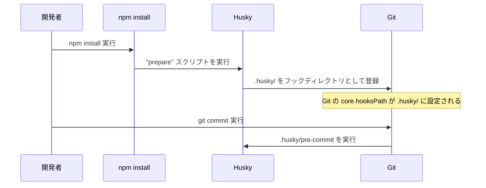
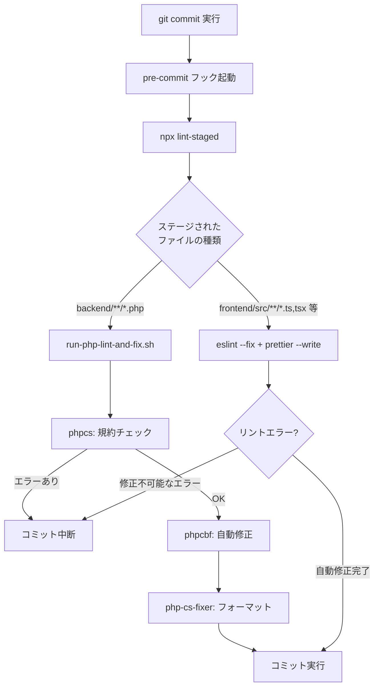
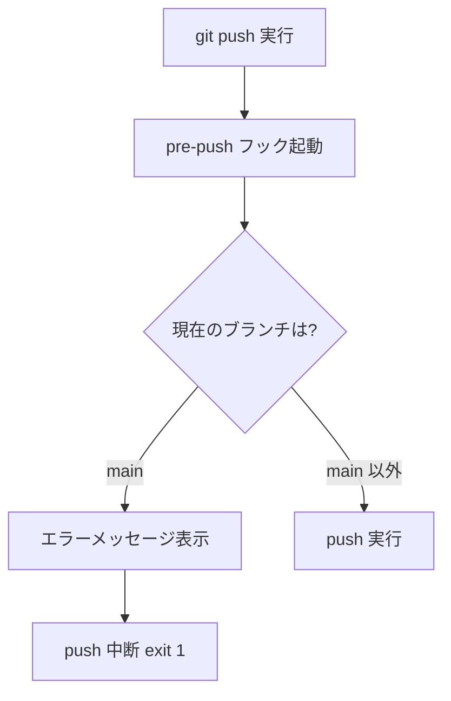

# 1-2-4 Git フックによる自動化

## 🎯 このセクションで学ぶこと

- Git フックの仕組みと主要なフックの種類を理解する
- Husky が Git フックをチームで共有可能にする仕組みを理解する
- lint-staged がステージされたファイルだけを対象にリントを実行する合理性を理解する
- LMS の pre-commit / pre-push フックの全体像を把握し、実際に動作を確認する

前のセクションまでで ESLint・Prettier・PHP-CS-Fixer・PHPCS といった品質ツールを学びました。このセクションでは、それらのツールをコミット時に自動実行する仕組みを理解し、実際に動作を確認します。

---

## 導入: ツールがあっても実行し忘れる問題

ESLint や PHP-CS-Fixer などの品質ツールは、正しく使えばコードの品質を一定に保てます。しかし、これらのツールは手動で実行する必要があります。

開発に集中しているとき、コミット前にリンターを実行し忘れることは珍しくありません。リンターを通さずにコミットし、そのまま PR を出してしまうと、レビューで「フォーマットが崩れています」という指摘が入り、本質的なコードレビューの前に修正のやり取りが発生します。

この問題の根本原因は「人間が忘れずに実行すること」に依存している点です。解決策はシンプルで、**コミット時にツールを自動実行する** 仕組みを作ればよいのです。Git にはそのための機能が組み込まれています。

### 🧠 先輩エンジニアはこう考える

> LMS の開発初期は、リンターの実行をレビュー時のチェックリストに入れていました。でも、忙しいときほど忘れるんですよね。CI で検知しても、修正してコミットし直す手間がかかります。Git フックを導入してからは「コミットした時点でコードが整形済み」という前提でレビューできるようになり、レビューの質が上がりました。品質を仕組みで担保するという考え方は、チーム開発の基本です。

---

## Git フックとは

**Git フック** は、Git の特定の操作（コミット、プッシュなど）の前後に自動でスクリプトを実行する仕組みです。Git リポジトリの `.git/hooks/` ディレクトリに所定の名前でスクリプトを配置すると、対応する操作のタイミングで実行されます。

### 主なフックの種類

Git には多くのフックがありますが、日常の開発で使うのは主に以下の2つです。

| フック | 実行タイミング | 主な用途 |
|---|---|---|
| **pre-commit** | `git commit` の実行直前 | リント・フォーマットの自動実行 |
| **pre-push** | `git push` の実行直前 | 特定ブランチへの直接 push の禁止 |

pre-commit フックがゼロ以外の終了コード（`exit 1`）を返すと、コミットが中断されます。つまり、リンターがエラーを検出した場合、そのコミットは実行されません。これにより、品質基準を満たさないコードがリポジトリに入ることを防げます。

### .git/hooks/ の問題点

Git フックの仕組みは強力ですが、1つ大きな問題があります。`.git/` ディレクトリは Git の管理対象外です。つまり、`.git/hooks/` に配置したスクリプトは `git clone` や `git pull` で共有されません。

チームメンバーが各自の `.git/hooks/` にスクリプトを手動コピーする運用は現実的ではありません。新しいメンバーがセットアップを忘れればフックなしで開発を進めてしまいますし、フックの内容を更新したときに全員が手動で反映する必要があります。

この問題を解決するのが **Husky** です。

---

## Husky: Git フックをチームで共有する

**Husky** は、Node.js プロジェクトで Git フックを管理するためのツールです。LMS では Husky 9 を使用しています。

Husky の核心的なアイデアは、Git フックのスクリプトを `.git/hooks/` ではなくプロジェクトルートの **`.husky/`** ディレクトリに配置することです。`.husky/` は通常のディレクトリなので、Git で管理・共有できます。

### Husky の仕組み

Husky がフックを有効にするまでの流れを整理します。



ポイントは `package.json` の `"prepare"` スクリプトです。

```json
// package.json
{
    "scripts": {
        "prepare": "husky"
    }
}
```

`"prepare"` は npm のライフサイクルスクリプトで、`npm install` の実行後に自動で呼ばれます。つまり、チームメンバーが `npm install`（LMS では `make npm-install` や `make init`）を実行するだけで、Git フックが自動的にセットアップされます。手動でフックをコピーする必要はありません。

💡 **npm のライフサイクルスクリプト** とは、`npm install` や `npm publish` などの特定の操作の前後に自動実行されるスクリプトです。`"prepare"` は `npm install` の後に毎回実行されるため、Husky のセットアップに最適です。

### LMS の .husky/ ディレクトリ

LMS の `.husky/` ディレクトリには2つのフックスクリプトがあります。

```bash
# .husky/pre-commit
#!/usr/bin/env sh
npx lint-staged
```

```bash
# .husky/pre-push
#!/usr/bin/env sh
branch="$(git rev-parse --abbrev-ref HEAD)"

if [ "$branch" = "main" ]; then
    echo "❌ You are trying to push directly to main. This is not allowed."
    exit 1
fi
```

pre-commit は `npx lint-staged` を実行し、pre-push は main ブランチへの直接 push を禁止しています。それぞれの詳細は後述します。

---

## lint-staged: ステージされたファイルだけにリントを実行する

pre-commit フックでリンターを実行するとき、プロジェクト全体のファイルを対象にすると2つの問題が生じます。

1. **パフォーマンス**: LMS のフロントエンドには数百の TypeScript ファイルがあります。全ファイルに ESLint を実行すると、コミットのたびに数十秒から数分待つことになります
2. **責任範囲**: 自分が変更していないファイルのリントエラーでコミットがブロックされるのは不合理です。過去のコードに残っている警告まで修正しないとコミットできない、という状態は開発を止めてしまいます

**lint-staged** はこの問題を解決するツールです。名前のとおり、`git add` でステージされたファイル（つまり、今回コミットしようとしているファイル）だけにリントを実行します。

🔑 **lint-staged の原則**: 「自分が変更したファイルだけを、自分の責任で品質担保する」。これにより、パフォーマンスと責任範囲の両方の問題が解消されます。

---

## LMS の Git フック全体像

ここまでの概念を踏まえて、LMS の Git フックがどのように動作するかを全体像で把握しましょう。

### pre-commit フローの全体像



### pre-push フローの全体像



### lint-staged の設定を読み解く

lint-staged の設定は、ルートの `package.json` 内に記述されています。

```json
// package.json
{
    "lint-staged": {
        "backend/**/*.php": [
            "./run-php-lint-and-fix.sh"
        ],
        "frontend/src/**/*.{js,jsx,ts,tsx}": [
            "eslint --fix",
            "prettier --write"
        ]
    }
}
```

この設定は、**glob パターン** でファイルを振り分け、それぞれに異なるコマンドを実行する仕組みです。

| glob パターン | 対象ファイル | 実行されるコマンド |
|---|---|---|
| `backend/**/*.php` | バックエンドの全 PHP ファイル | `run-php-lint-and-fix.sh`（phpcs → phpcbf → php-cs-fixer） |
| `frontend/src/**/*.{js,jsx,ts,tsx}` | フロントエンドの JS/TS ファイル | `eslint --fix` → `prettier --write` |

`**` はディレクトリの深さに関係なく再帰的にマッチするワイルドカード、`*.{js,jsx,ts,tsx}` は拡張子が js, jsx, ts, tsx のいずれかにマッチするパターンです。

配列内のコマンドは **上から順に実行** されます。フロントエンドの場合、まず ESLint がコードの問題を検出・修正し、次に Prettier がフォーマットを整えます。この順序は、セクション 1-2-2 で学んだ ESLint と Prettier の役割分担に対応しています。

### run-php-lint-and-fix.sh の中身

バックエンドの PHP ファイルに対しては、`run-php-lint-and-fix.sh` というシェルスクリプトが実行されます。

```bash
# run-php-lint-and-fix.sh
#!/bin/sh

# ステージされた PHP ファイルのリストを取得（api.php は除外）
changed_files=$(git diff --cached --name-only | grep '^backend/.*\.php$'| grep -v 'backend/routes/api.php')
docker_paths=""

# パスを Docker コンテナ内のパスに変換（backend/ プレフィックスを除去）
for file in $changed_files; do
    docker_path=${file#backend/}
    docker_paths="$docker_paths $docker_path"
done

if [ -n "$docker_paths" ]; then
    # 1. phpcs: コーディング規約チェック（失敗したらコミット中断）
    if ! docker-compose exec -T app vendor/bin/phpcs --standard=phpcs.xml $docker_paths; then
        echo "phpcs failed"
        exit 1
    fi

    # 2. phpcbf: PSR-2 準拠の自動修正
    docker-compose exec -T app vendor/bin/phpcbf --standard=PSR2 $docker_paths

    # 3. php-cs-fixer: 設定ファイルに基づくフォーマット
    docker-compose exec -T app vendor/bin/php-cs-fixer fix --config=.php-cs-fixer.php $docker_paths
else
    echo "No PHP files to process"
fi
```

このスクリプトのポイントを整理します。

- `git diff --cached --name-only` でステージされたファイルの一覧を取得しています。`--cached` はステージ領域（インデックス）を対象にするオプションです
- `backend/routes/api.php` は自動生成される部分を含むため、リントの対象から除外しています
- ファイルパスから `backend/` プレフィックスを除去しているのは、phpcs 等が Docker コンテナの中で実行されるためです。コンテナ内のワーキングディレクトリは `/var/www/html`（= リポジトリの `backend/` に対応）なので、パスを変換する必要があります
- phpcs がエラーを返した場合のみ `exit 1` でコミットを中断します。phpcbf と php-cs-fixer は自動修正ツールなので、エラーで中断する必要はありません

📝 フロントエンドの ESLint と Prettier は Node.js で直接実行されますが、バックエンドの phpcs・phpcbf・php-cs-fixer は Docker コンテナ内で実行されます。これは、PHP のツールがコンテナ内にインストールされているためです。そのため、**バックエンドの PHP ファイルをコミットする際は Docker コンテナが起動している必要があります**。

---

## 🏃 実践: Git フックの動作を確認する

ここからは、実際に LMS リポジトリで Git フックの動作を確認します。

### 🏃 Step 1: フロントエンドファイルの変更でフックを確認する

フロントエンドの TypeScript ファイルを少し変更してコミットし、ESLint と Prettier が自動で実行されることを確認します。

まず、作業用ブランチを作成します。

```bash
cd /Users/yotaro/lms
git checkout -b test/git-hook-practice
```

フロントエンドの適当なファイルに、フォーマットが崩れた状態で軽微な変更を加えます。たとえば、不要なスペースを追加します。

```bash
# 既存ファイルの末尾に空行を追加する例
echo "" >> frontend/src/constants/index.ts
```

変更をステージしてコミットします。

```bash
git add frontend/src/constants/index.ts
git commit -m "test: verify pre-commit hook"
```

コミット実行時に、ターミナルに lint-staged の出力が表示されます。以下のような出力が確認できるはずです。

```
✔ Preparing lint-staged...
✔ Running tasks for staged files...
✔ Applying modifications from tasks...
✔ Cleaning up temporary files...
```

この出力は、lint-staged が ESLint と Prettier をステージされたファイルに対して実行し、問題なく完了したことを示しています。

### 🏃 Step 2: フック実行の詳細を確認する

lint-staged の出力をより詳しく見たい場合は、`npx lint-staged` を直接実行することもできます。ステージされたファイルがある状態で以下を実行してみましょう。

```bash
# 再度変更を加えてステージ
echo "" >> frontend/src/constants/index.ts
git add frontend/src/constants/index.ts

# lint-staged を直接実行（verbose モード）
npx lint-staged --verbose
```

verbose モードでは、どのファイルに対してどのコマンドが実行されたかが詳細に表示されます。glob パターンのマッチングと、ESLint → Prettier の実行順序を確認できます。

確認が終わったら、変更をリセットしておきます。

```bash
git restore --staged --worktree frontend/src/constants/index.ts
```

### 🏃 Step 3: pre-push フックを確認する（main ブランチでの push 拒否）

pre-push フックは、main ブランチへの直接 push を禁止します。動作を確認してみましょう。

pre-push フックは push する変更がないと発火しないため、ダミーのコミットを作成してから push を試みます。

```bash
# main ブランチに切り替え
git checkout main

# ダミーの変更を作成（pre-push の動作確認用）
echo "# test" >> README.md
git add README.md
git commit -m "test: verify pre-push hook"

# push を試みる（pre-push フックで拒否される）
git push origin main
```

以下のメッセージが表示され、push が中断されます。

```
❌ You are trying to push directly to main. This is not allowed.
```

フックで拒否されたことを確認できたら、ダミーコミットを取り消してクリーンアップします。

```bash
# ダミーコミットを取り消す
git reset --soft HEAD~1
git restore --staged README.md
git checkout -- README.md
```

⚠️ **注意**: この手順はフックの動作確認のためのものです。実際の開発では main ブランチに直接コミット・push することはありません。必ずフィーチャーブランチで作業し、PR 経由でマージしてください。

最後に、テスト用ブランチを削除して元の状態に戻します。

```bash
git branch -D test/git-hook-practice
```

---

## ✅ 完成チェックリスト

- [ ] Git フックが `.git/hooks/` に配置されるスクリプトであること、pre-commit と pre-push の役割を説明できる
- [ ] Husky が `.husky/` ディレクトリと `"prepare"` スクリプトでフックを共有可能にする仕組みを説明できる
- [ ] lint-staged がステージされたファイルだけを対象にする理由（パフォーマンス・責任範囲）を説明できる
- [ ] LMS の `package.json` の lint-staged 設定を見て、どのファイルにどのツールが実行されるか読み取れる
- [ ] フロントエンドファイルのコミット時に lint-staged の出力を確認できた
- [ ] pre-push フックが main ブランチへの直接 push を拒否することを確認できた

---

## ✨ まとめ

- **Git フック** は Git 操作の前後にスクリプトを自動実行する仕組みです。`.git/hooks/` に配置しますが、このディレクトリは Git で共有されないという問題があります
- **Husky** は `.husky/` ディレクトリにフックスクリプトを配置し、`npm install` 時に自動でセットアップすることで、チーム全員が同じフックを使える状態を保ちます
- **lint-staged** はステージされたファイルだけにリントを実行します。パフォーマンスと責任範囲の両面で合理的なアプローチです
- LMS の pre-commit フックは、フロントエンドには ESLint + Prettier、バックエンドには phpcs + phpcbf + php-cs-fixer を自動実行します
- LMS の pre-push フックは、main ブランチへの直接 push を禁止し、PR ベースの開発フローを強制します
- これらの仕組みにより、「ツールの実行を忘れる」という人的ミスを排除し、コードの品質を仕組みで担保しています

---

Part 1 では、LMS リポジトリの構成、Docker Compose の応用構成、Makefile によるコマンド体系、そしてリンター・フォーマッター・Git フックによる品質ツールチェーンを学びました。これらは LMS の開発を支える土台です。次の Part 2 では、LMS のフロントエンドを支える JavaScript・TypeScript・React・Next.js の世界に入っていきます。
