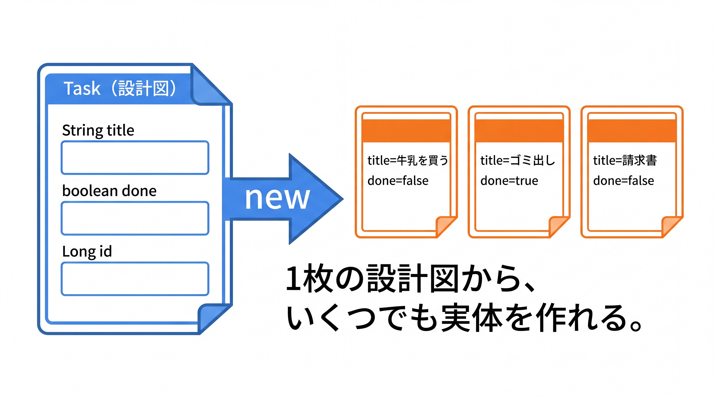
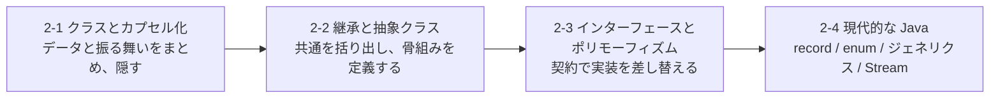

# 2-1-1 クラスとインスタンス

Chapter 2-1 では、Java のオブジェクト指向の出発点として、クラスを自分で設計し、カプセル化で実装を守るところまでを扱います。Part 1 では「コードはすべて `main` の中に書く」前提でしたが、ここからは `Task` や `User` のような独立したクラスを設計する側に回ります。

| セクション | テーマ | 種類 |
|---|---|---|
| 2-1-1 クラスとインスタンス | フィールド・コンストラクタ・this・インスタンスメソッド | 概念 |
| 2-1-2 カプセル化とアクセス修飾子 | private / protected / public・getter / setter・static | 概念 |

📖 **この Chapter の進め方**: まず本セクションで、クラスを Java の文法で定義し、フィールド・コンストラクタ・メソッドを持つ「設計図」を書けるようにします。次に 2-1-2 で、アクセス修飾子とカプセル化を学び、その設計図に「外から触ってよい部分・隠すべき部分」の境界を引きます。

📝 **前提知識**: このセクションは「1-2-3 メソッドと配列・文字列」の内容を前提としています。

## 🎯 このセクションで学ぶこと

- クラスとインスタンスの関係を Java の文法（クラス定義・`new`）で書ける
- 型付きフィールド・コンストラクタ・`this`・インスタンスメソッドを使ってクラスを設計できる
- PHP の基礎オブジェクト指向と Java の書き方の違いを説明できる

本セクションでは、Part 2 全体の地図を確認したあと、クラスの定義から始め、フィールド・コンストラクタと `this`・メソッド、そして 1 ファイル 1 クラスという Java の形へと進みます。

---

## 導入: main の中から、クラスを設計する側へ

Part 1 のコードは、すべて `main` メソッドの中に書いてきました。学ぶ分にはそれで十分でしたが、実務のアプリケーションを `main` の一枚岩で書くことはありません。タスク管理アプリなら、タスクという概念を `Task` クラスで、利用者を `User` クラスで表し、データと操作をそれぞれのクラスにまとめます。

そして「クラスで設計する」という考え方そのものは、あなたはすでに持っています。Laravel で Eloquent モデルやコントローラを書いたとき、あなたはクラスを定義し、プロパティを持たせ、メソッドを呼んでいました。クラス・インスタンス・コンストラクタ・`$this` も使ってきました。足りないのは概念ではなく、Java での **書き方** です。型付きのフィールド、コンストラクタ、`this` を Java の文法でどう書くか。本セクションはそこを最短で埋めます。

### 🧠 先輩エンジニアの思考プロセス

> PHP でクラスを書くとき、プロパティに型を付けるかどうかは自由でした。私も昔は `public $title;` のように型なしで書きがちで、後から「これ文字列だったか、配列だったか」と `var_dump` で確かめることがよくありました。Java はフィールドに必ず型を書きます。`String title;` と宣言した時点で、それが文字列であることがコードに刻まれます。
>
> 最初は型を書く手間が増えたように感じますが、得るものの方が大きいです。フィールドの型が決まっていると、おかしな値を入れようとした時点でコンパイラが止めてくれます。私の体感では、PHP 時代に動かして初めて気づいていた「型の取り違え」の多くが、Java では書いた直後に消えました。



---

## Part 2 の地図: オブジェクト指向で「設計」する

Part 2 は、本教材の中であなたの最大のギャップを埋める Part です。Part 1 が「Java を読み書きする」ための文法だったのに対し、Part 2 は「Java でどう **設計** するか」を扱います。学ぶ順序は次のとおりです。



- **2-1 クラスとカプセル化**: データ（フィールド）と振る舞い（メソッド）を 1 つのクラスにまとめ、外から触ってよい部分とそうでない部分の境界を引きます。
- **2-2 継承と抽象クラス**: 似たクラスの共通部分を親クラスに括り出し、「共通の骨組みだけ決めて中身は子に任せる」設計を学びます。ここからが PHP の基礎では扱わなかった領域です。
- **2-3 インターフェースとポリモーフィズム**: 「何ができるか」という契約だけを型として定義し、実装を後から差し替えられる設計を学びます。これは Part 3 で学ぶ Spring の DI（依存性注入）を理解するための必須の前提です。
- **2-4 現代的な Java**: `record`・`enum`・ジェネリクス・`Optional`・`Stream` という、近年の Java を簡潔で型安全にする道具を学びます。

🔑 とりわけ **2-3** が重要です。Laravel のサービスコンテナが実装を差し替えられた仕組みの根っこは、このポリモーフィズムにあります。Part 2 を終えると、Part 3 で「なぜ Spring がそう動くのか」を自分の言葉で説明できる土台が整います。

---

## クラスとインスタンス（Java の書き方）

まず、もっとも単純な `Task` クラスを書いてみます。1-1-3 で見たとおり Java のコードはクラスの中に書きますが、ここからは `main` を持つ `Main` とは別に、`Task` という独立したクラスを定義します。

```java
// Task.java
public class Task {
    String title;     // タイトル
    boolean done;     // 完了したかどうか
}
```

`Task` は「タスクとはどういうデータを持つものか」を定義した **設計図** です。設計図そのものはデータを持ちません。実際のタスク（実体）を作るには、`new` でインスタンスを生成します。

```java
// Main.java
public class Main {
    public static void main(String[] args) {
        Task task = new Task();   // Task のインスタンスを 1 つ生成する
        task.title = "牛乳を買う";
        task.done = false;
        System.out.println(task.title);   // 牛乳を買う
    }
}
```

- **クラス** は型であり設計図、**インスタンス** はその設計図から作られた実体です。1 つのクラスから、いくつでもインスタンスを作れます。
- `new Task()` がインスタンスを生成し、`Task task` の左辺ではクラス名 `Task` がそのまま変数の型になります。これは 1-2-1 で見た参照型の一種です。
- インスタンスのフィールドには `task.title` のようにドット `.` でアクセスします。

💡 **PHP との対応**: PHP では `$task = new Task();` のように、変数に型を書かずにインスタンスを受けました。Java では `Task task = new Task();` と、左辺にクラス名が型として付きます。`new` でインスタンスを作る点、`.`（PHP の `->`）でメンバーにアクセスする点は同じ感覚です。Eloquent モデルを `new` していたのと同じことを、自分で定義したクラスでやっているだけです。

---

## フィールド（型付きの属性）

クラスが持つデータを **フィールド** と呼びます（PHP のプロパティに相当します）。Java のフィールドには必ず型を付けます。

```java
// Task.java
public class Task {
    Long id;          // ID（まだ採番されていない状態を表せるよう Long）
    String title;     // タイトル
    boolean done;     // 完了フラグ
}
```

フィールドを初期化せずに宣言した場合、型に応じた **既定値** が入ります。数値型は `0`、`boolean` は `false`、`String` や `Long` のような参照型は `null` です。たとえば上の `Task` を `new` した直後は、`id` と `title` が `null`、`done` が `false` の状態になります。

💡 `id` の型を `long`（プリミティブ型）ではなく `Long`（参照型）にしたのは、「まだ ID が決まっていない」状態を `null` で表せるようにするためです。プリミティブの `long` は必ず `0` を持ってしまい、「未採番」を表せません。1-2-1 で見たとおり、`null`（値が無い状態）を持てるのは参照型だけだからです。データベースの自動採番と組み合わせる場面（3-4-1）で効いてきます。

💡 **PHP との対応**: PHP のプロパティは `public $title;` のように型を省略できました（型付きプロパティも書けますが任意でした）。Java はフィールドの型が必須です。型を書く手間と引き換えに、そのフィールドに入る値の種類がコード上で保証されます。

---

## コンストラクタと this

先ほどは `new Task()` でインスタンスを作ったあと、`task.title = ...` と 1 つずつフィールドを埋めました。これだと、タイトルを入れ忘れた中途半端なタスクが簡単に作れてしまいます。生成と同時に必要な値を渡したい。そこで使うのが **コンストラクタ** です。

```java
// Task.java
public class Task {
    Long id;
    String title;
    boolean done;

    // コンストラクタ: インスタンス生成時に呼ばれる
    Task(Long id, String title) {
        this.id = id;
        this.title = title;
        this.done = false;
    }
}
```

コンストラクタは **クラス名と同じ名前** のメソッドのような構文で、戻り値の型を書きません。`new Task(...)` としたときに呼ばれ、フィールドの初期化を担います。

`this` は **今まさに操作しているこのインスタンス自身** を指します。`this.title = title` は「（左辺）このインスタンスのフィールド `title` に、（右辺）引数で受け取った `title` を代入する」という意味です。引数名とフィールド名が同じときに、どちらを指すのかを `this.` で区別します。

コンストラクタができたので、生成は次のように書けます。

```java
// Main.java
Task task = new Task(1L, "牛乳を買う");
System.out.println(task.title);   // 牛乳を買う
System.out.println(task.done);    // false
```

> ⚠️ **注意**: コンストラクタを 1 つも書かなかった場合、Java は引数なしのコンストラクタ（既定コンストラクタ）を自動で用意します。Part 1 までの `new Task()` が動いていたのはこのためです。しかし上のように引数つきコンストラクタを 1 つでも定義すると、既定コンストラクタは自動では作られません。その状態で `new Task()` と書くとコンパイルエラーになります。引数なしでも生成したいなら、引数なしのコンストラクタも自分で書き足します。

なお、引数の組み合わせが違うコンストラクタを複数定義することもできます（1-2-3 で学んだオーバーロードと同じ仕組みです）。

💡 **PHP との対応**: PHP のコンストラクタは `__construct`、自身は `$this` でした。Java ではコンストラクタ名がクラス名と一致し、`$this` は `this`、`->` は `.` になります。PHP 8 の「コンストラクタプロモーション」（`public function __construct(private string $title)` のように引数宣言だけでフィールドを定義する書き方）に近い簡潔さは、Java では 2-4-1 で学ぶ `record` が担います。

---

## メソッド（インスタンスの振る舞い）

1-2-3 では `main` から呼ぶ補助メソッドに `static` を付けました。一方、クラスのインスタンスに属するメソッドを **インスタンスメソッド** と呼び、こちらには `static` を付けません。インスタンスメソッドは、そのインスタンスのフィールドを読み書きできます。

```java
// Task.java
public class Task {
    Long id;
    String title;
    boolean done;

    Task(Long id, String title) {
        this.id = id;
        this.title = title;
        this.done = false;
    }

    // このタスクを完了にする
    void complete() {
        this.done = true;
    }

    // 表示用の文字列を組み立てて返す
    String describe() {
        String status = this.done ? "完了" : "未完了";
        return this.title + "（" + status + "）";
    }
}
```

インスタンスメソッドは、インスタンス経由で呼び出します。

```java
// Main.java
Task task = new Task(1L, "牛乳を買う");
System.out.println(task.describe());   // 牛乳を買う（未完了）
task.complete();
System.out.println(task.describe());   // 牛乳を買う（完了）
```

`task.complete()` を呼ぶと、そのメソッドの中の `this` は `task` を指し、`task` の `done` が `true` に変わります。別の `Task` インスタンスを作って `complete()` を呼んでも、変わるのはそのインスタンスだけです。インスタンスごとに状態（フィールドの値）が独立している、という点がポイントです。

💡 `static` メソッド（1-2-3）は特定のインスタンスを必要とせず `Main.add(3, 5)` のようにクラスから直接呼べました。一方インスタンスメソッドは `task.complete()` のように、対象のインスタンスがあって初めて呼べます。この使い分けと「なぜ `main` は `static` なのか」は、次の 2-1-2 で `static` メンバーとして正式に扱います。

---

## 1 ファイル 1 クラスという形

ここまで `Main` と `Task` という 2 つのクラスを書きました。Java では、`public` を付けたクラスは **ファイル名と一致させる** という規約があり、1 つのファイルに `public` クラスは 1 つだけ置けます。`Main` クラスは `Main.java`、`Task` クラスは `Task.java` という別々のファイルになります。

```text
src/main/java/com/example/app/
├── Main.java   # main メソッド（プログラムの入り口）
└── Task.java   # Task クラス（タスクという概念を表す）
```

1-1-3 では「Part 1 のコードは `main` の中に書く」と説明しましたが、Part 2 からはこのように、概念ごとにクラスを分けてファイルに置きます。同じパッケージ（同じディレクトリ）にあるクラスどうしは、`import` なしでそのまま使えます。`Main` から `Task` をそのまま `new` できていたのはこのためです。

💡 **PHP との対応**: PHP でも PSR-4 オートロードのもとで「1 ファイル 1 クラス」「ファイル名 = クラス名」が広く守られていました。Java はこれを慣習ではなく言語の規約として強制します。1-1-3 で見た「パッケージ名 = ディレクトリ構造」と地続きの考え方です。

---

## ✨ まとめ

- クラスは設計図（型）、インスタンスは `new` で作る実体。1 つのクラスからインスタンスを何個でも作れる。変数にはクラス名が型として付く
- フィールドは型付きの属性。コンストラクタで生成時に初期化し、`this` は操作中のインスタンス自身を指す
- インスタンスメソッドは `static` を付けず、インスタンス経由で呼んでそのインスタンスの状態を操作する（`static` との違いは 2-1-2）
- `public` クラスはファイル名と一致させ、1 ファイル 1 クラスにする。同じパッケージ内のクラスは `import` なしで使える

---

次のセクションでは、ここまでむき出しだったフィールドに公開範囲の境界を引きます。`private` / `protected` / `public`（と何も付けないパッケージプライベート）というアクセス修飾子と getter / setter を使って、なぜ実装を隠すのか（カプセル化）を学びます。さらにクラスに属する `static` メンバーを扱い、1-2-3 以来「型紙」だった「`main` や補助メソッドが `static` な理由」を回収します。
