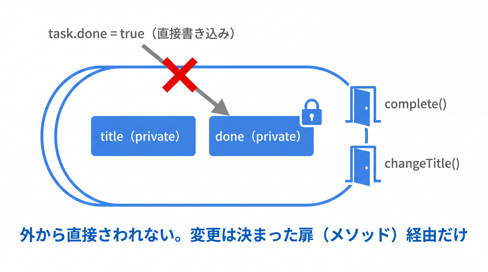

# 2-1-2 カプセル化とアクセス修飾子

📝 **前提知識**: このセクションは「2-1-1 クラスとインスタンス」の内容を前提としています。

## 🎯 このセクションで学ぶこと

- `public` / `protected` / パッケージプライベート（無修飾）/ `private` の 4 つの公開範囲を理解する
- カプセル化の目的（実装を隠して不変条件を守る）を説明できる
- getter / setter（JavaBeans 規約）と、クラスに属する `static` メンバーの役割を理解する

本セクションでは、アクセス修飾子から始め、なぜ実装を隠すのか（カプセル化）、getter / setter、そしてクラスに属する `static` メンバーへと進みます。

---

## 導入: フィールドがむき出しだと、ルールを守らせられない

2-1-1 で作った `Task` は、フィールドがむき出しでした。`task.done = true` も `task.title = ""` も、どこからでも自由に書けます。一見便利ですが、ここに落とし穴があります。たとえば「タイトルは空にしてはいけない」「完了状態は決められた手順でだけ変える」といったルール（**不変条件**）を、フィールドがむき出しのままでは守らせる手段がありません。

むき出しのフィールドは、ルールを破る抜け道になります。これを塞ぐのが **アクセス修飾子** と **カプセル化** です。フィールドの公開範囲を絞り、変更はメソッド経由に限定することで、「正しくない状態のオブジェクトはそもそも作れない」という設計に近づけます。

### 🧠 先輩エンジニアの思考プロセス

> PHP の現場では、プロパティをとりあえず `public` にして外から直接いじる書き方をよく見ましたし、私もやっていました。動くのですが、後で「この値、どこで書き換わっているんだ」と追いかけるのに苦労します。Java の現場に移って驚いたのは、フィールドはまず `private`、という習慣が徹底していたことです。
>
> 慣れてみると、これは追跡のコストを下げる投資でした。`private` にしておけば、そのフィールドを書き換えているのは同じクラスの中だけだと断言できます。私は一度、完了フラグを `public` にしていたせいで、あちこちから書き換えられて状態が壊れるバグを踏みました。フラグを `private` にして「完了にする」メソッド経由でしか変えられないようにしたら、その種のバグは出なくなりました。



---

## アクセス修飾子（4 つの公開範囲）

Java には、クラス・フィールド・メソッドの公開範囲を決める 4 段階のアクセス修飾子があります。

| 修飾子 | 公開範囲 |
|---|---|
| `public` | どこからでもアクセスできる |
| `protected` | 同じパッケージ内 ＋ サブクラスからアクセスできる |
| （何も付けない） | 同じパッケージ内からのみアクセスできる（パッケージプライベート） |
| `private` | 同じクラス内からのみアクセスできる |

公開範囲は `public` がもっとも広く、`private` がもっとも狭くなります。`protected` はサブクラス（継承、2-2-1 で学びます）が関わるため、今は「`public` と `private` の中間がある」程度に捉えておけば十分です。

2-1-1 の `Task` を `private` で締めてみます。

```java
// Task.java
public class Task {
    private Long id;
    private String title;
    private boolean done;

    public Task(Long id, String title) {
        this.id = id;
        this.title = title;
        this.done = false;
    }
}
```

こうすると、外部から `task.title = "..."` と書くとコンパイルエラーになります。フィールドへのアクセスは、このクラスが用意したメソッド経由に限られます。

> ⚠️ **PHP との重要な違い**: PHP では、プロパティやメソッドに可視性を **書かなかった場合は `public`** 扱いでした。Java は逆で、**何も付けないとパッケージプライベート** （同じパッケージ内だけに公開）になります。「`public` のつもりが、別パッケージから見えない」というすれ違いの原因になりやすいので、意図して `public` にしたいときは必ず `public` と書きます。

なお、クラス自体にも `public class Task` のように修飾子が付きます。これはクラスの公開範囲で、フィールドやメソッドにはそれぞれ個別に修飾子を付けられます。

---

## カプセル化: なぜ実装を隠すのか

**カプセル化** とは、データ（フィールド）と操作（メソッド）を 1 つのクラスにまとめたうえで、外から見えなくてよい部分を隠すことです。その目的は、先ほど触れた **不変条件を守る** ことにあります。

`Task` に「タイトルは空にできない」「完了は `complete()` でだけ行う」というルールを持たせてみます。

```java
// Task.java
public class Task {
    private Long id;
    private String title;
    private boolean done;

    public Task(Long id, String title) {
        this.id = id;
        this.title = title;
        this.done = false;
    }

    // 完了にする手続きを 1 か所に閉じ込める
    public void complete() {
        this.done = true;
    }

    // タイトル変更は空文字を弾く（不変条件を守る）
    public void changeTitle(String newTitle) {
        if (newTitle == null || newTitle.isBlank()) {
            throw new IllegalArgumentException("タイトルは空にできません");
        }
        this.title = newTitle;
    }
}
```

`done` と `title` を `private` にしたことで、状態を変える経路は `complete()` と `changeTitle()` の 2 つに限定されました。外部のコードは「完了を直接 `true` にする」ことも「空タイトルを直接代入する」こともできません。`changeTitle()` は空文字を弾くので、`Task` のタイトルが空になることはありえなくなります。これがカプセル化の効き目です。

🔑 公開する操作（メソッド）と隠す実装（フィールド）を分けておくと、内部の作り（フィールドの持ち方）を後から変えても、外への影響を抑えられます。外部が依存するのは「何ができるか」であって「内部でどう持っているか」ではない、という状態をつくれます。

---

## getter と setter

フィールドを `private` にすると、外部から値を読むこともできなくなります。そこで、読み書きが必要な分だけ、それ専用のメソッドを用意します。値を読むメソッドを **getter**、書くメソッドを **setter** と呼びます。

Java には **JavaBeans 規約** という命名の慣習があり、フレームワーク（Spring や Jackson など）はこの名前を手がかりにフィールドを読み書きします。

- 読み取り: `getXxx()`。ただし `boolean` のフィールドは `isXxx()` とするのが慣習
- 書き込み: `setXxx(...)`

次のように、`Task` に必要な getter を加えます（クラス定義は省略して示します）。

```java
// Task.java
public Long getId() {
    return this.id;
}

public String getTitle() {
    return this.title;
}

public boolean isDone() {     // boolean は get ではなく is
    return this.done;
}
```

ここで重要なのは、getter / setter を **すべてのフィールドに機械的には付けない** という点です。たとえば `done` には setter を置かず、`complete()` だけを公開しました。こうすると「完了にする」操作だけを許し、「完了を取り消す」操作は禁じる、といった設計上の意図を型に込められます。

> ⚠️ **注意**: 何も考えずすべてのフィールドに getter / setter を付けると、結局フィールドをむき出しにしたのとほとんど変わらなくなります。「外から本当に必要な操作だけを公開する」ことが、カプセル化の要点です。

💡 **Laravel との対応**: Eloquent ではアクセサ / ミューテタ（`getTitleAttribute` / `setTitleAttribute`）や `$fillable` / `$guarded` で、属性の出入りをコントロールしていました。Java では、getter / setter を「用意するかどうか」と「その可視性」で同じことを実現します。

💡 getter / setter を手で書くのは退屈なので、現場では IDE の自動生成や Lombok（`@Getter` / `@Setter`）で省略することが多いです。また、変更しない不変データであれば、2-4-1 で学ぶ `record` がアクセサを自動生成します。ここでは仕組みを理解するために手で書いています。

---

## static メンバー（クラスに属する）

ここまでのフィールドとメソッドは、インスタンスごとに存在しました（`task` ごとに `title` が違う）。これに対して `static` を付けたメンバーは、インスタンスではなく **クラスそのものに属します**。全インスタンスで共有され、インスタンスを 1 つも作らなくても使えます。

ここで、1-2-3 から持ち越してきた疑問を回収します。なぜ `main` や補助メソッドには `static` が必要だったのか。理由はこうです。`main` は **プログラム開始時、まだインスタンスが 1 つも存在しない状態** で JVM から呼ばれます。特定のインスタンスに属していては呼びようがないので、クラスに属する `static` でなければなりません。同じく、`main` から直接呼ぶ補助メソッドも、インスタンスなしで呼べるよう `static` にする必要がありました。

```java
// Main.java
public class Main {
    public static void main(String[] args) {
        int result = add(3, 5);   // インスタンスなしで呼べる
        System.out.println(result);
    }

    static int add(int a, int b) {
        return a + b;
    }
}
```

`static` は、定数や、インスタンスをまたいで共有したい値にも使います。次は `Task` に `static` メンバーを加えた例です（一部のフィールドやメソッドは省略しています）。

```java
// Task.java
public class Task {
    // 定数: 全タスク共通で変わらない（static final）
    public static final int MAX_TITLE_LENGTH = 100;

    // クラスで共有するカウンタ
    private static int count = 0;

    private Long id;
    private String title;

    public Task(Long id, String title) {
        this.id = id;
        this.title = title;
        count++;                  // 生成するたびにクラスの count が増える
    }

    public static int getCount() {   // インスタンスなしで呼べる
        return count;
    }
}
```

`static` メンバーは `Task.getCount()`・`Task.MAX_TITLE_LENGTH` のように **クラス名から** 呼びます。インスタンスメソッドを `task.complete()` とインスタンスから呼んだのと対照的です。`static final` を組み合わせると「変更できない定数」になり、定数名は大文字スネークケース（`MAX_TITLE_LENGTH`）にするのが慣習です。

> ⚠️ **注意**: `static` メソッドの中では `this` が使えません。特定のインスタンスに属していないためです。同じ理由で、`static` メソッドからインスタンスのフィールド（`title` など）に直接アクセスすることもできません。

💡 **PHP との対応**: PHP の `static` プロパティ / メソッド、`self::` / `static::` でのアクセス、`const` による定数に対応します。呼び出しは PHP の `Task::getCount()` が Java では `Task.getCount()` になります（`::` が `.` に変わるだけです）。

---

## ✨ まとめ

- アクセス修飾子は `public` / `protected` / パッケージプライベート（無修飾）/ `private` の 4 段階。PHP と違い、無修飾は `public` ではなくパッケージプライベートになる
- カプセル化は、フィールドを `private` にして変更をメソッド経由に限定し、不変条件を守る仕組み
- 読み書きは必要な分だけ getter / setter（JavaBeans 規約: `getXxx` / `setXxx` / `isXxx`）で公開する。すべてを機械的に公開しない
- `static` メンバーはクラスに属し、インスタンスなしで使える。`main` が `static` なのはこのため。`static final` は定数として使う

【Chapter 2-1 の振り返り】本章では、Java でクラスを設計する出発点を固めました。クラス・インスタンス・フィールド・コンストラクタ・`this`・メソッド（2-1-1）に、アクセス修飾子とカプセル化・`static`（2-1-2）を重ね、「データと振る舞いをまとめ、外に見せる部分を選ぶ」という単一クラスの設計ができるようになりました。

---

次の Chapter 2-2 では、複数のクラスの関係に踏み込みます。最初のセクション 2-2-1 では、`extends` と `super`、メソッドのオーバーライドと `@Override`、そしてすべてのクラスの親である `Object` クラス（`equals` / `hashCode` / `toString` の契約）を学び、継承で共通化できるようになります。Eloquent モデルが `extends Model` していた意味も、ここで腑に落ちます。
