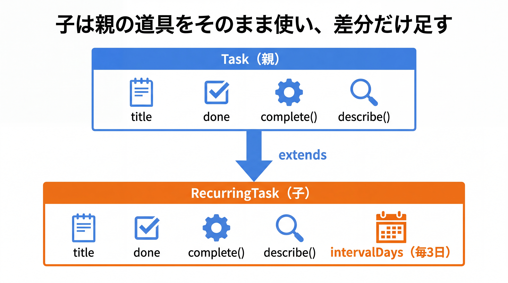
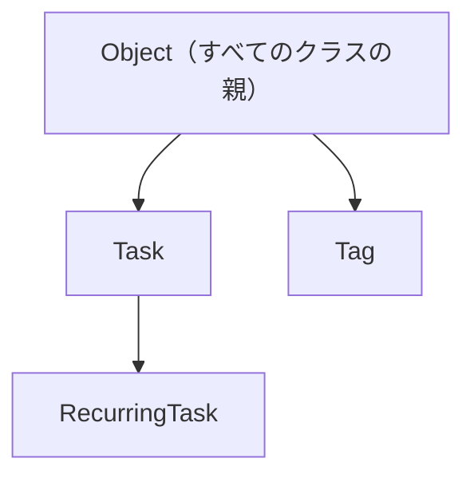

# 2-2-1 継承

Chapter 2-2 では、複数のクラスをまたぐ最初の関係である継承を扱います。似たクラスの共通部分を親クラスに括り出し、抽象クラスで「共通の骨組みだけ決めて中身は子に任せる」設計までを学びます。

| セクション | テーマ | 種類 |
|---|---|---|
| 2-2-1 継承 | extends・super・オーバーライド・Object・equals / hashCode | 概念 |
| 2-2-2 抽象クラス | abstract クラス / メソッド・共通の骨組み | 概念 |

📖 **この Chapter の進め方**: まず 2-2-1 で、継承の仕組み（`extends`・`super`・オーバーライド）と、すべてのクラスの親である `Object` を学びます。次に 2-2-2 で、継承を一歩進めた抽象クラスへ進み、共通の骨組みだけを定義する設計を扱います。

📝 **前提知識**: このセクションは「2-1-2 カプセル化とアクセス修飾子」の内容を前提としています。

## 🎯 このセクションで学ぶこと

- 継承（`extends` / `super`）でクラスの共通部分を親に括り出せる
- メソッドのオーバーライドと `@Override` の意味を理解する
- すべてのクラスの親 `Object` と、`equals` / `hashCode` / `toString` の契約を理解する

本セクションでは、継承とは何かから始め、`extends` と `super`、オーバーライドと `@Override`、すべての親である `Object`、そして `equals` / `hashCode` の契約と `toString` へと進みます。

---

## 導入: 似たクラスのコピペと、Eloquent の extends Model

タスク管理アプリを作っていると、「普通のタスク」と「毎日・毎週など繰り返すタスク」のように、よく似たクラスが必要になることがあります。繰り返すタスクは、普通のタスクが持つ機能（タイトル、完了にする操作）をすべて備えたうえで、繰り返し間隔という情報が増えただけです。このとき、普通のタスクのコードをまるごとコピーして 1 行足す、というのは避けたいところです。コピーは、片方を直したときにもう片方を直し忘れる事故のもとになります。

この「共通部分は 1 か所にまとめ、差分だけを足す」を実現するのが **継承** です。そして継承は、あなたが Laravel ですでに使っていた仕組みでもあります。Eloquent モデルはどれも `class User extends Model` と書かれていて、`save()` や `where()` を自分で書かなくても使えました。あれは `Model` という親クラスの機能を、子クラスが継承していたからです。本セクションでは、その仕組みを「使う側」から「書く側」へと引き上げます。

### 🧠 先輩エンジニアの思考プロセス

> Laravel を使っていたころ、すべてのモデルが `extends Model` と書いてあるのを、私はおまじないだと思っていました。`save()` も `where()` も自分では書いていないのに使える。その正体が継承だと腑に落ちたのは、Java で自分が継承を書く側になってからです。親に共通の機能を置けば、子はそれを書かずに使える。Eloquent はまさにそれをやっていました。
>
> もう一つ、継承がらみで現場で必ず一度は踏むのが `equals` の罠です。私は中身が同じはずのオブジェクトを `Set` に入れたのに重複が消えず、半日溶かしたことがあります。原因は `equals` だけ実装して `hashCode` を書いていなかったこと。このセクションの後半で扱う「セットで実装する」という契約は、最初に知っておくと損をしません。



---

## 継承とは（共通化のための is-a 関係）

**継承** とは、あるクラス（親）の持つフィールドやメソッドを、別のクラス（子）が受け継ぐ仕組みです。親を **スーパークラス**、子を **サブクラス** と呼びます。

継承は「子は親の一種である」という関係（**is-a 関係**）が成り立つときに使います。「繰り返しタスクはタスクの一種である」「管理者ユーザーはユーザーの一種である」のように、自然に「〜は〜の一種だ」と言えるならば、継承が候補になります。

まず、親となる `Task` を確認します（2-1 で作ったものに、表示用の `describe()` を公開メソッドとして加えた形です）。

```java
// Task.java
public class Task {
    private Long id;
    private String title;
    private boolean done;

    public Task(Long id, String title) {
        this.id = id;
        this.title = title;
        this.done = false;
    }

    public void complete() {
        this.done = true;
    }

    public String describe() {
        String status = this.done ? "完了" : "未完了";
        return this.title + "（" + status + "）";
    }
}
```

💡 **Laravel との対応**: Eloquent のモデルが `extends Model` することで `save()` などを受け継いでいたのと同じ関係を、これから `Task` を親にして自分で作ります。違うのは、Laravel ではフレームワークが用意した親を継承していたのに対し、ここでは親も子も自分で設計する点です。

---

## extends と super

繰り返しタスクを表す `RecurringTask` を、`Task` を継承して定義します。継承には `extends` キーワードを使います。

```java
// RecurringTask.java
public class RecurringTask extends Task {
    private int intervalDays;   // 何日ごとに繰り返すか

    public RecurringTask(Long id, String title, int intervalDays) {
        super(id, title);                  // 親 Task のコンストラクタを呼ぶ
        this.intervalDays = intervalDays;
    }
}
```

ポイントは 2 つあります。

- `extends Task` と書くことで、`RecurringTask` は `Task` のフィールド（`id`・`title`・`done`）とメソッド（`complete()`・`describe()`）をすべて受け継ぎます。
- `super(id, title)` は **親クラスのコンストラクタを呼ぶ** 命令です。子のコンストラクタの先頭で、まず親の初期化を済ませる必要があります。`super` は「親の部分」を指すキーワードです。

実際に使ってみると、自分では書いていない `complete()` がそのまま使えることが分かります。

```java
// Main.java
RecurringTask recurring = new RecurringTask(2L, "ゴミ出し", 3);
System.out.println(recurring.describe());   // ゴミ出し（未完了）

recurring.complete();                        // Task から受け継いだメソッドがそのまま使える
System.out.println(recurring.describe());    // ゴミ出し（完了）
```

⚠️ Java の継承は **単一継承** です。1 つのクラスが `extends` できる親は 1 つだけで、`extends A, B` のように複数の親は継承できません。これは PHP のクラス継承と同じ制約です（複数の型を満たしたいときは、2-3 で学ぶインターフェースを使います）。

💡 `private` なフィールドは継承されても、子クラスから直接は読み書きできません（`private` は同じクラス内だけ、でした）。子から直接アクセスしたいフィールドがあれば、親側で `protected`（2-1-2 の表で触れた、サブクラスに公開する修飾子）にします。

---

## オーバーライドと @Override

`RecurringTask` の `describe()` は、今は親 `Task` のものをそのまま使うので「ゴミ出し（未完了）」としか表示しません。繰り返し間隔も表示したい場合、子クラスで `describe()` を **上書き** できます。これを **オーバーライド** と呼びます。

```java
// RecurringTask.java
public class RecurringTask extends Task {
    private int intervalDays;

    public RecurringTask(Long id, String title, int intervalDays) {
        super(id, title);
        this.intervalDays = intervalDays;
    }

    @Override
    public String describe() {
        return super.describe() + "（毎 " + this.intervalDays + " 日）";
    }
}
```

```java
// Main.java
RecurringTask recurring = new RecurringTask(2L, "ゴミ出し", 3);
System.out.println(recurring.describe());   // ゴミ出し（未完了）（毎 3 日）
```

- `super.describe()` は **親のメソッドを呼ぶ** 書き方です。親の結果（`ゴミ出し（未完了）`）を再利用したうえで、繰り返し間隔を付け足しています。親の処理を完全に置き換えるのではなく、拡張したいときに便利です。
- メソッドの上に付けた `@Override` は **アノテーション** で、「これは親のメソッドを上書きするつもりだ」とコンパイラに伝えます。

🔑 `@Override` を付ける利点は、書き間違いを防げることです。もし `describe` を `descrieb` と綴り間違えると、それはオーバーライドではなく「新しい別のメソッド」の定義になり、親の `describe()` が呼ばれ続けます。`@Override` を付けておけば、上書き対象が親に存在しない場合にコンパイラがエラーで知らせてくれます。オーバーライドするときは必ず付ける習慣にしておくと安全です。

💡 **Laravel との対応**: Eloquent モデルで `$fillable` を子モデルごとに定義し直したり、`booted()` を上書きしたりしたのも、考え方はオーバーライドと同じです。親が用意した振る舞いを、子で必要に応じて差し替えていました。

---

## すべてのクラスの親: Object

Java では、`extends` を書かなかったクラスも、実は暗黙のうちに `Object` というクラスを継承しています。`Task` は `extends` を書いていませんが、内部的には `Object` のサブクラスです。つまり `Object` は **すべてのクラスの先祖** にあたります。



`Object` には、最初からいくつかのメソッドが定義されています。これまで、どんなオブジェクトに対しても `toString()` や `equals()` が呼べたのは、すべてのクラスが `Object` からこれらを受け継いでいたからです。よく使うのは次の 3 つです。

- `toString()`: オブジェクトを文字列で表現する
- `equals(Object o)`: 別のオブジェクトと等しいかを判定する
- `hashCode()`: オブジェクトを表す整数（ハッシュ値）を返す

これらの既定の実装は、多くの場合あなたが期待する動きとは違います。そこを正すために、これらをオーバーライドします。次の 2 つの節で、その意味と「契約」を押さえます。

---

## equals と hashCode の契約

`Object` の既定の `equals()` は、**参照が同じか** （メモリ上の同じインスタンスか）だけを見ます。中身が同じでも、別々に `new` したインスタンスは等しくないと判定されます。

```java
Tag a = new Tag("java");
Tag b = new Tag("java");
System.out.println(a == b);        // false（別インスタンス。参照が違う）
System.out.println(a.equals(b));   // false（既定の equals も参照を見るため）
```

1-2-3 で `String` の比較に `==` ではなく `equals()` を使ったのを思い出してください。`String` は「中身が同じなら等しい」と判定するよう、`equals()` をあらかじめオーバーライドしてあります。自作クラスでも「中身が同じなら等しい」としたければ、自分で `equals()` をオーバーライドします。

```java
// Tag.java
public class Tag {
    private final String name;

    public Tag(String name) {
        this.name = name;
    }

    public String getName() {
        return name;
    }

    @Override
    public boolean equals(Object o) {
        if (this == o) return true;                 // 同じインスタンスなら true
        if (!(o instanceof Tag)) return false;      // 型が違えば false
        Tag other = (Tag) o;
        return Objects.equals(this.name, other.name);   // 中身（name）で比較
    }

    @Override
    public int hashCode() {
        return Objects.hash(this.name);
    }
}
```

`Objects.equals(...)` と `Objects.hash(...)` は `java.util.Objects` が提供するヘルパーで、`null` も安全に扱ってくれます。これで、中身が同じ `Tag` どうしは等しいと判定されます。

```java
Tag a = new Tag("java");
Tag b = new Tag("java");
System.out.println(a.equals(b));   // true（name が同じ）
```

ここで重要なのが、`equals` と `hashCode` の **契約** です。

🔑 `equals(b)` が `true` を返す 2 つのオブジェクトは、`hashCode()` も必ず等しい値を返さなければならない。

この契約があるため、`equals` をオーバーライドするときは `hashCode` も **必ずセットで** オーバーライドします。なぜなら、`HashSet` や `HashMap` は、まず `hashCode()` で値を振り分ける入れ物（バケット）を選び、その中で `equals()` を使って一致を確認するからです。`equals` だけ直して `hashCode` を放置すると、中身が同じオブジェクトでも別のバケットに入ってしまい、`Set` で重複が消えなかったり、`Map` のキーで引けなかったりします。これが導入で触れた「半日溶かす」罠の正体です。

1-3-1 で「自作クラスを `Set` の要素や `Map` のキーにするときは `equals` / `hashCode` の実装が必要」と書いたのは、このことでした。`String` を要素やキーにする分には、`String` がすでに両方を正しく実装しているので、何もしなくても期待どおり動いていたわけです。

💡 これらを毎回手で書くのは大変です。2-4-1 で学ぶ `record` は、`equals` / `hashCode` / `toString` を、保持するデータ（コンポーネント）から **自動生成** してくれます。「中身が同じなら等しい」値を表す型は、`record` で書くと一気に簡潔になります。

⚠️ 自動採番される ID を持つエンティティ（3-4 で扱う JPA の `@Entity`）では、`equals` / `hashCode` の実装にさらに注意が必要です（永続化の前後で同一性が崩れやすい）。これは 3-4-1 で扱います。ここでは、`Tag` のように「値が同じなら等しい」とみなせる値オブジェクト的なクラスで契約を押さえれば十分です。

---

## toString

`Object` の既定の `toString()` は、`Tag@1b6d3586` のようなクラス名とハッシュ値の文字列を返します。人間にはほとんど読めません。デバッグやログで中身を確認できるよう、`toString()` をオーバーライドして読みやすい表現を返すのが定石です。

```java
// Tag.java
@Override
public String toString() {
    return "Tag{name='" + name + "'}";
}
```

```java
Tag tag = new Tag("java");
System.out.println(tag);   // Tag{name='java'}
```

`System.out.println(tag)` のようにオブジェクトをそのまま渡すと、内部で `toString()` が自動的に呼ばれます。オーバーライドしておくと、ログ出力やデバッグのときに中身が一目で分かります。

💡 `toString()` も、`record` を使えば全コンポーネントを含む形で自動生成されます（2-4-1）。

---

## ✨ まとめ

- 継承（`extends`）は、親クラスのフィールドとメソッドを子クラスが受け継ぐ仕組み。「子は親の一種」という is-a 関係のときに使う。Java は単一継承（親は 1 つだけ）
- `super(...)` で親のコンストラクタを、`super.メソッド()` で親のメソッドを呼べる
- オーバーライドは親のメソッドを子で上書きすること。`@Override` を付けると上書きミスをコンパイラが検出してくれる
- すべてのクラスは `Object` を継承する。`equals` をオーバーライドするときは `hashCode` も必ずセットで（契約）。`toString` は読みやすい表現を返すよう上書きする

---

次のセクションでは、継承の一歩進んだ形である抽象クラスを学びます。`abstract` を付けたクラスと抽象メソッドを使い、共通の骨組みだけを親に定義して、具体的な実装は具象クラス（子）に実装させる設計ができるようになります。
