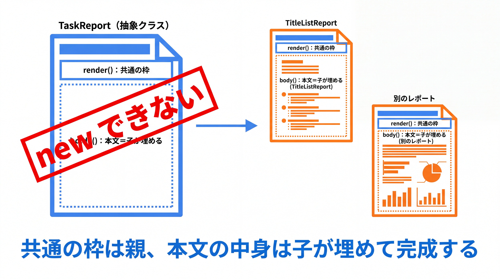

# 2-2-2 抽象クラス

📝 **前提知識**: このセクションは「2-2-1 継承」の内容を前提としています。

## 🎯 このセクションで学ぶこと

- `abstract` クラスが、インスタンス化できない「共通の型」であることを理解する
- 抽象メソッドで、実装を具象クラス（子）に強制できる
- 継承・抽象クラス・（次章で学ぶ）インターフェースの使いどころを区別できる

本セクションでは、抽象クラスとは何かから始め、抽象メソッド、具象メソッドとの併用、そして継承と抽象クラスの使いどころへと進みます。

---

## 導入: 「親そのものは存在しないが、共通部分はまとめたい」

2-2-1 の `Task` と `RecurringTask` では、親 `Task` も単体で意味を持つクラスでした。`new Task(...)` で普通のタスクを作れます。しかし設計をしていると、「親クラスそのものを直接 `new` させたくない」「共通の枠組みだけ親に置き、肝心の中身は子に必ず実装させたい」という場面が出てきます。

たとえば「タスクの一覧をレポートにまとめる」処理を考えます。レポートには「ヘッダと件数の枠」という共通部分がありますが、本文の作り方（タイトルだけ並べる、完了状況も出す、など）は種類ごとに違います。このとき「レポート」という親は、枠だけ持っていて本文の作り方は決まっていない、いわば未完成のクラスです。こうした未完成の共通部分を表すのが **抽象クラス** です。

### 🧠 先輩エンジニアの思考プロセス

> Laravel で各コントローラが継承していた基底 `Controller` を思い出してください。あのクラスを単体で `new Controller()` する意味はなく、共通の足場を提供するためだけにありました。Java の抽象クラスは、まさにあの「単体では使わないが、共通部分を担う親」を、言語の仕組みとしてはっきり表したものです。
>
> 私が抽象クラスを重宝するのは、「処理の大枠は同じで、一部だけ差し替えたい」ときです。大枠を親の具象メソッドに書き、差し替えたい一点だけを抽象メソッドにして子に任せる。こうしておくと、新しい種類を足すときに「どこを実装すればいいか」が型として明示されるので、実装漏れがコンパイル時に分かります。



---

## 抽象クラスとは（インスタンス化できない共通の型）

**抽象クラス** は、クラス宣言に `abstract` を付けたクラスです。最大の特徴は、**直接インスタンス化できない** （`new` できない）ことです。先ほどの「レポート」を抽象クラスで表してみます。

```java
// TaskReport.java
public abstract class TaskReport {
    protected final List<Task> tasks;

    protected TaskReport(List<Task> tasks) {
        this.tasks = tasks;
    }

    // 共通の骨組み（具象メソッド）: どのレポートでも同じ枠
    public String render() {
        return "==== タスクレポート（全 " + tasks.size() + " 件）====\n" + body();
    }

    // 本文の作り方は種類ごとに違う（抽象メソッド・本体を書かない）
    protected abstract String body();
}
```

`abstract class TaskReport` は「レポートという共通の型」を表しますが、本文の作り方が決まっていないため、それ単体では完成しません。だから次のように `new` しようとするとコンパイルエラーになります。

```java
// new TaskReport(tasks);   // コンパイルエラー: 抽象クラスはインスタンス化できない
```

💡 抽象クラスは「`new` できない」だけで、フィールド（上の `tasks`）・コンストラクタ・具象メソッド（上の `render()`）を **普通のクラスと同じように持てます**。状態と共通実装を持てる点が、次章で学ぶインターフェースとの大きな違いです。

---

## 抽象メソッド（実装を子に強制する）

`body()` に付けた `abstract` が **抽象メソッド** です。抽象メソッドは **本体（`{ }` の中身）を持たず**、宣言だけして末尾をセミコロンで終えます。「このメソッドは存在するが、中身は子クラスが実装する」という約束です。

抽象クラスを継承した子（具象クラス）は、親の抽象メソッドを **必ず実装しなければなりません**。実装しないとコンパイルエラーになります。実際にレポートの一種を作ってみます。

```java
// TitleListReport.java
public class TitleListReport extends TaskReport {

    public TitleListReport(List<Task> tasks) {
        super(tasks);
    }

    @Override
    protected String body() {
        StringBuilder sb = new StringBuilder();
        for (Task task : tasks) {
            sb.append("- ").append(task.describe()).append("\n");
        }
        return sb.toString();
    }
}
```

`TitleListReport` は `TaskReport` を継承し、抽象メソッド `body()` を実装しています（`@Override` を付けます）。本文は親から受け継いだ `tasks`（`protected` なので子から使えます）をもとに組み立てています。これで `TitleListReport` は完成したクラスになり、`new` できます。

```java
// Main.java
List<Task> tasks = List.of(new Task(1L, "牛乳を買う"), new Task(2L, "ゴミ出し"));

TaskReport report = new TitleListReport(tasks);   // 抽象クラス型の変数に、具象クラスのインスタンスを入れる
System.out.println(report.render());
// ==== タスクレポート（全 2 件）====
// - 牛乳を買う（未完了）
// - ゴミ出し（未完了）
```

🔑 抽象クラスは「共通の骨組み（`render()`）」を親に置き、「種類ごとに違う部分（`body()`）」だけを子に実装させます。新しいレポートの種類（たとえば完了タスクだけを集計するレポート）を足したくなったら、`TaskReport` を継承して `body()` を実装するだけで済みます。共通部分を書き直す必要はありません。

💡 上の `TaskReport report = new TitleListReport(...)` のように、**親の型の変数に子のインスタンスを入れられる** 点に注目してください（抽象クラス `TaskReport` 型の変数に、具象クラス `TitleListReport` の実体を入れています）。呼ぶ側は「これはレポートだ」とだけ知っていればよく、どの種類かを気にせず `render()` を呼べます。これは次章のポリモーフィズム（2-3-2）につながる重要な性質です。

---

## 具象メソッドとの併用（大枠は親、可変部分は子）

抽象クラスの典型的な使い方は、いま見たように **「処理の大枠（手順）を親の具象メソッドに書き、その中で呼ぶ一部の手順だけを抽象メソッドにして子に任せる」** ものです。`render()`（大枠）が `body()`（可変部分）を呼び出す構造がそれにあたります。

この形にしておくと、手順全体の流れは親が一手に管理でき、子は差分だけに集中できます。レポートの種類が増えても「ヘッダと件数の枠」は親の `render()` に一度書けば全種類で共通になり、枠の仕様変更も親の 1 か所で済みます。

⚠️ 抽象メソッドを 1 つでも持つクラスは、必ず `abstract` クラスにしなければなりません（抽象メソッドがあるのに `new` できてしまうと、本体のないメソッドを呼べてしまい矛盾するためです）。逆に、抽象クラスは抽象メソッドを 1 つも持たなくても構いません（「`new` させたくない共通の親」を表すために `abstract` だけ付けることもあります）。

---

## 継承・抽象クラス・インターフェースの使いどころ

ここまでで、クラスをまたぐ仕組みが 2 つ出そろいました。次章のインターフェースも含めて、使いどころを整理しておきます。

- **普通の継承（具象クラスを継承）**: 親も単体で意味を持ち `new` できる。子は親を特殊化する。例: `Task` と `RecurringTask`
- **抽象クラス**: 親は未完成で `new` できない。共通のフィールドや具象メソッド（状態と実装）は持てるが、一部の実装を子に強制する。例: `TaskReport` と `TitleListReport`
- **インターフェース（2-3 で学ぶ）**: 状態も共通実装も基本的に持たず、「できることの約束（契約）」だけを定義する。1 つのクラスが複数のインターフェースを満たせる

🔑 おおまかな指針は次のとおりです。**共通の状態や実装を子に分け与えたい** なら抽象クラス、**「何ができるか」という約束だけを複数のクラスに課したい** ならインターフェースです。Java は単一継承なので「親は 1 つ」しか持てませんが、インターフェースは複数満たせます。この違いが、次章で実装を差し替える設計を学ぶときに効いてきます。

💡 **Laravel との対応**: Laravel の基底 `Controller`（共通実装を持つ親）は抽象クラス的、`Illuminate\Contracts\...` の各 Contract（実装を持たない約束）はインターフェースにあたります。あなたはすでに両方を「使う側」で触れていました。

---

## ✨ まとめ

- 抽象クラスは `abstract` を付けたクラスで、直接 `new` できない「共通の型」。フィールド・コンストラクタ・具象メソッドは普通のクラスと同様に持てる
- 抽象メソッドは本体を持たない宣言で、継承した具象クラスに実装を強制する（未実装はコンパイルエラー）
- 「大枠を親の具象メソッドに、可変部分を抽象メソッドに」という形で、共通処理を一元化しつつ差分だけを子に任せられる
- 共通の状態・実装を分け与えたいなら抽象クラス、約束だけを複数のクラスに課したいならインターフェース（2-3）

【Chapter 2-2 の振り返り】本章では、クラスをまたぐ関係を学びました。継承（2-2-1）で共通部分を親に括り出し、`extends`・`super`・オーバーライド・`Object` と `equals` / `hashCode` の契約を押さえ、抽象クラス（2-2-2）で「共通の骨組みだけ定義して中身は子に任せる」設計を手にしました。

---

次の Chapter 2-3 では、インターフェースとポリモーフィズムに進みます。最初のセクション 2-3-1 では、`interface` と `implements`、そして「契約としての型」という考え方、デフォルトメソッドを学び、実装から完全に分離した型を定義できるようになります。抽象クラスとの違いも、ここではっきりさせます。
