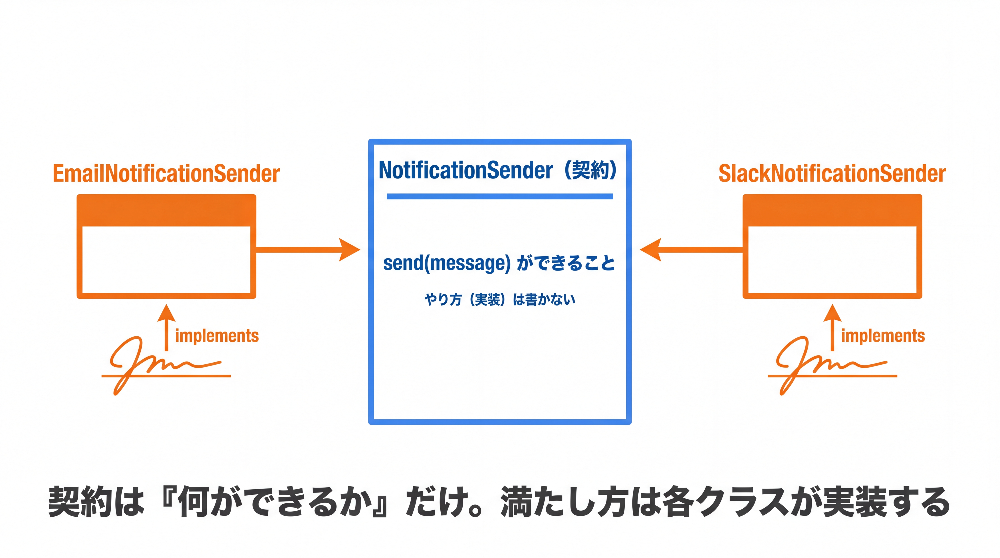

# 2-3-1 インターフェース

Chapter 2-3 では、Part 2 の山場であるインターフェースとポリモーフィズムを扱います。「契約」によって型と実装を切り離し、実装を後から差し替えられる設計を学びます。これは Part 3 の Spring（とりわけ DI）を理解するための、もっとも重要な土台です。

| セクション | テーマ | 種類 |
|---|---|---|
| 2-3-1 インターフェース | interface・implements・契約としての型・デフォルトメソッド | 概念 |
| 2-3-2 ポリモーフィズム | 多態性・実装の差し替え・DI の布石 | 概念 |

📖 **この Chapter の進め方**: まず 2-3-1 で、インターフェースという「契約としての型」を定義し、実装できるようにします。次に 2-3-2 で、その契約を使って実装を差し替えるポリモーフィズムと、それが Spring の DI をどう支えているのかを学びます。

📝 **前提知識**: このセクションは「2-2-2 抽象クラス」の内容を前提としています。

## 🎯 このセクションで学ぶこと

- インターフェースが「契約としての型」であることを理解する
- `interface` を定義し、`implements` でクラスに契約を満たさせられる
- デフォルトメソッド・定数を理解し、抽象クラスとの違いを説明できる

本セクションでは、インターフェースとは何かから始め、`implements`、デフォルトメソッド、定数や `static` メソッド、そして抽象クラスとの使い分けへと進みます。

---

## 導入: Laravel の Contracts の正体

Laravel を使っていたとき、`Illuminate\Contracts` の下にある「〜Interface」「〜Contract」という型に触れたことがあるはずです。キャッシュやログのように「中身は環境によって変わるが、できることは決まっている」ものは、こうした契約の型で受け渡しされていました。Redis を使おうとファイルを使おうと、「キャッシュとして読み書きできる」という約束さえ満たしていれば差し替えられた、あの仕組みです。

その約束を表すのが **インターフェース** です。インターフェースは「何ができるか」というメソッドの一覧（契約）だけを定義し、「どう実現するか」という実装は持ちません。前章の抽象クラスが「共通の実装も一部持てる未完成の親」だったのに対し、インターフェースは実装をほとんど持たず、契約に徹します。本セクションでは、その契約を自分で定義し、クラスに満たさせる立場に立ちます。

### 🧠 先輩エンジニアの思考プロセス

> Laravel の Contracts を、私は最初ただの型ヒント用の何かだと思っていました。引数にインターフェースを書くと、なぜか実装が差し替わって動く。その裏で「契約を満たすクラスなら何でも受け付ける」という仕組みが働いていたと理解したのは、自分でインターフェースを設計するようになってからです。
>
> 書く側に回ると、視点が変わります。「このクラスは内部でどう作るか」ではなく「外から見て何ができるべきか」を先に決める。実装の前に契約を決めておくと、後から実装を差し替えても呼ぶ側は一切変えずに済みます。この感覚は、次のポリモーフィズムと DI で一気に効いてきます。



---

## インターフェースとは（契約としての型）

タスクの通知を送る機能を例に考えます。通知の「送り方」はメール・Slack などいろいろですが、どの手段でも「メッセージを送れる」という点は共通です。この共通の約束を、インターフェースで定義します。

```java
// NotificationSender.java
public interface NotificationSender {
    void send(String message);   // 本体を持たない（契約だけ）
}
```

`class` ではなく `interface` で宣言します。`send` メソッドには本体（`{ }`）がありません。「`NotificationSender` を名乗るなら `send(String)` を必ず持っていること」という **約束** だけを述べています。

💡 インターフェースのメソッドは、自動的に `public` かつ抽象メソッド扱いになります（`public abstract` を省略して書いているのと同じです）。だから実装する側では `public` で実装します。

---

## implements と「契約を満たす」

インターフェースを実際のクラスに実装させるには `implements` を使います。契約で宣言されたメソッドを、すべて実装する義務があります。

```java
// EmailNotificationSender.java
public class EmailNotificationSender implements NotificationSender {
    @Override
    public void send(String message) {
        System.out.println("メール送信: " + message);
    }
}
```

`implements NotificationSender` と書いたら、`send(String)` を実装しなければコンパイルエラーになります（抽象クラスの抽象メソッドと同じく、実装が強制されます）。オーバーライドと同様に `@Override` を付けておくと安全です。使うときは、ふつうのクラスと同じく `new` してメソッドを呼びます。

```java
// Main.java
NotificationSender sender = new EmailNotificationSender();
sender.send("タスクが期限切れです");   // メール送信: タスクが期限切れです
```

ここで `NotificationSender sender = new EmailNotificationSender();` のように、**変数の型をインターフェース、実体を実装クラス** にできる点に注目してください。1-3-1 で `List<String> names = new ArrayList<>();` と書いたのと同じ形です。あのとき左辺を `List`（インターフェース）にしていた理由が、ここでつながります。

クラスは **複数のインターフェースを実装できます**。`extends` で継承できる親は 1 つだけ（単一継承）でしたが、`implements` は複数並べられます。さらに、クラスを継承しつつ複数のインターフェースを実装することもできます。

```java
public class EmailNotificationSender extends SomeBase implements NotificationSender, AutoCloseable {
    // SomeBase を継承しつつ、2 つのインターフェースを実装する
}
```

🔑 「親（実装）は 1 つだけ受け継ぐが、満たせる契約（インターフェース）はいくつでも持てる」。これがインターフェースの大きな特徴です。

---

## デフォルトメソッド

インターフェースは原則として実装を持ちませんが、Java 8 以降は **デフォルトメソッド** という例外があります。`default` を付けると、インターフェース側に実装を書けます。実装クラスは、それをそのまま使えます。

```java
// NotificationSender.java
public interface NotificationSender {
    void send(String message);

    // デフォルトメソッド: 実装を持つ。実装クラスは書かなくても使える
    default void sendUrgent(String message) {
        send("【至急】" + message);   // 抽象メソッド send を利用してよい
    }
}
```

`EmailNotificationSender` は `sendUrgent` を実装しなくても、`sender.sendUrgent("会議です")` を呼べます（中で `send` が呼ばれ、`メール送信: 【至急】会議です` が出ます）。

💡 デフォルトメソッドが導入された理由は、すでに広く実装されているインターフェースに、**後からメソッドを足せるようにするため** です。`default` がなければ、インターフェースにメソッドを 1 つ追加するだけで、世界中の実装クラスがすべてコンパイルエラーになってしまいます。実際、Java 8 で `Collection` に `stream()` などが加わったのも、この仕組みのおかげです（`stream()` は 2-4-3 で扱います）。

---

## 定数と static メソッド

補足として、インターフェースは定数と `static` メソッドも持てます。

- インターフェースに書いたフィールドは、自動的に `public static final`（定数）になります。
- Java 8 以降は、インターフェースに属する `static` メソッド（ユーティリティ的な関数）も定義できます。

どちらも補助的な機能です。インターフェースの中心はあくまで「契約としての抽象メソッド」であり、「必要ならデフォルト実装を添える」程度に捉えておけば十分です。

---

## 抽象クラス vs インターフェース

前章の抽象クラスと、本章のインターフェースは似て見えますが、役割が違います。整理しておきます。

| 観点 | 抽象クラス | インターフェース |
|---|---|---|
| 使うキーワード | `extends`（継承する） | `implements`（実装する） |
| 持てる数 | 1 つだけ（単一継承） | 複数を同時に満たせる |
| インスタンスの状態（フィールド） | 持てる | 持てない（定数のみ） |
| コンストラクタ | 持てる | 持てない |
| メソッドの実装 | 具象メソッドを自由に持てる | 原則なし（デフォルト / `static` で一部のみ） |
| 表す関係 | is-a（〜の一種である） | can-do（〜できる） |

🔑 おおまかな指針は次のとおりです。**共通の状態や実装を子に分け与えたい** なら抽象クラス、**「何ができるか」という約束だけを課したい** ならインターフェースです。実装の共有が要らず、複数の型を満たしたい場面では、インターフェースが向きます。迷ったらインターフェースを優先し、共通実装を持たせたくなったら抽象クラスを検討する、という順序が無難です。

💡 **Laravel との対応**: Laravel の基底 `Controller`（共通実装を持つ親）は抽象クラス的、`Illuminate\Contracts\...` の各 Contract（実装を持たない約束）はインターフェースにあたります。あなたが「使う側」で触れていた両者の違いが、定義側から見るとこの表のとおりに整理できます。

---

## ✨ まとめ

- インターフェースは「何ができるか」という契約（抽象メソッドの一覧）だけを定義する型。実装は持たない
- `implements` で契約を満たす。宣言されたメソッドの実装は必須で、未実装はコンパイルエラー。クラスは複数のインターフェースを実装できる
- デフォルトメソッド（`default`）はインターフェースに実装を添える例外的な仕組み。既存実装を壊さずメソッドを追加するために使う
- 抽象クラスは is-a・状態と実装を共有、インターフェースは can-do・複数満たせる。迷ったらインターフェースを優先する

---

次のセクションでは、ポリモーフィズム（多態性）を学びます。インターフェース型の変数で実装を差し替えられる仕組みと、その設計上の利点（疎結合・テスト容易性）を理解し、Spring がなぜインターフェース中心に作られているのか（DI の布石）までをつかみます。
