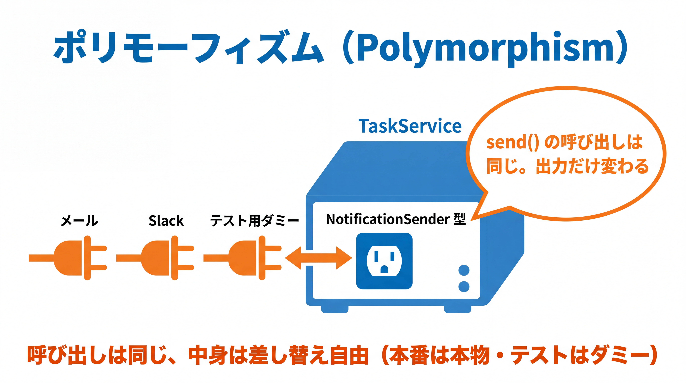
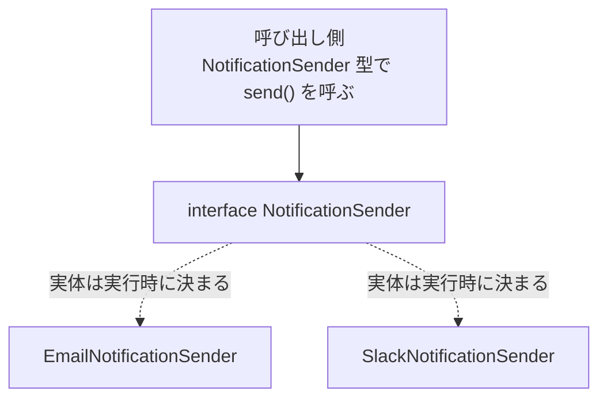
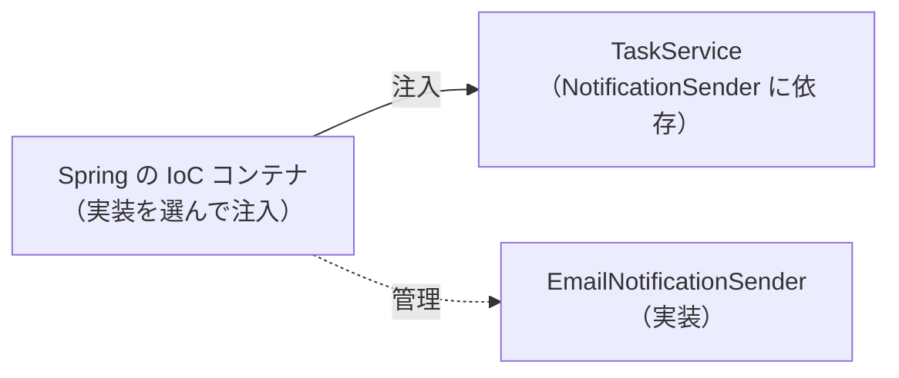

# 2-3-2 ポリモーフィズム

📝 **前提知識**: このセクションは「2-3-1 インターフェース」の内容を前提としています。

## 🎯 このセクションで学ぶこと

- ポリモーフィズム（多態性）を理解し、インターフェース型で実装を差し替えられる
- 実装の差し替えがもたらす利点（疎結合・テスト容易性・拡張性）を説明できる
- Spring がインターフェース中心に作られている理由（DI の布石）をつかむ

本セクションでは、ポリモーフィズムとは何かから始め、インターフェース型で実装を差し替える書き方、その利点、そして Spring の DI へのつながりへと進みます。

---

## 導入: 同じ呼び出しが、相手によって違う振る舞いをする

2-3-1 で `NotificationSender` インターフェースと、その実装 `EmailNotificationSender` を作りました。ここに Slack で送る実装を足したくなったとします。`SlackNotificationSender` を作って `send` を実装すれば済みますが、問題は「通知を使う側」のコードです。メールから Slack に変えるたびに、通知を呼び出している箇所をすべて書き換えるのは避けたいところです。

ここで効くのが **ポリモーフィズム** （多態性）です。呼び出す側がインターフェース（`NotificationSender`）にだけ依存していれば、実体がメールでも Slack でも、コードを変えずに同じ `send(...)` の呼び出しで動きます。Laravel のサービスコンテナで実装を差し替えても呼び出し側が変わらなかった、あの仕組みの根っこがこれです。

### 🧠 先輩エンジニアの思考プロセス

> Laravel のサービスコンテナで実装を差し替えたとき、私は「便利だな」で済ませていました。本番では本物の決済 API、テストではダミー、と切り替えられる。その裏で何が起きているのかを説明できるようになったのは、ポリモーフィズムを理解してからです。呼ぶ側がインターフェースだけに依存していれば、中身は後から自由に挿し替えられる。ただそれだけのことでした。
>
> 現場の Java では、Service クラスが別の部品を `interface` 型で受け取る書き方が当たり前です。最初は「なぜ具象クラスを直接使わないのか」と回りくどく感じましたが、テストを書くようになって腑に落ちました。インターフェースで受けておくと、テストのときに偽物の部品をすっと差し込めます。この一手間が、後で何倍にもなって返ってきます。



---

## ポリモーフィズムとは（多態性）

**ポリモーフィズム** とは、同じ型（インターフェースや親クラス）として扱われる複数の実装が、それぞれ異なる振る舞いをすることです。呼び出し側は共通の型を通じてメソッドを呼び、実際にどの実装が動くかは、変数が指している実体によって実行時に決まります（これを動的ディスパッチと呼びます）。

`NotificationSender` に Slack 実装を加えてみます。

```java
// SlackNotificationSender.java
public class SlackNotificationSender implements NotificationSender {
    @Override
    public void send(String message) {
        System.out.println("Slack 送信: " + message);
    }
}
```

これで `NotificationSender` の実装が 2 つになりました。同じ型の変数に、どちらの実体も入れられます。

```java
// Main.java
NotificationSender sender;

sender = new EmailNotificationSender();
sender.send("こんにちは");   // メール送信: こんにちは

sender = new SlackNotificationSender();
sender.send("こんにちは");   // Slack 送信: こんにちは
```

`sender.send("こんにちは")` という **まったく同じ呼び出し** が、`sender` の実体に応じて違う出力になります。これがポリモーフィズムです。



---

## インターフェース型で受けて、実装を差し替える

ポリモーフィズムが本当に効くのは、あるクラスが別の部品を **インターフェース型で受け取る** ときです。タスクを完了し、通知を送る `TaskService` を考えます。

```java
// TaskService.java
public class TaskService {
    private final NotificationSender sender;   // 具象ではなくインターフェースに依存

    public TaskService(NotificationSender sender) {   // 実装を外から受け取る
        this.sender = sender;
    }

    public void completeTask(Task task) {
        task.complete();
        sender.send(task.describe() + " を完了しました");
    }
}
```

`TaskService` は `NotificationSender` という契約にしか依存しておらず、それがメールなのか Slack なのかを知りません。どの実装を使うかは、`TaskService` を作るときに外から渡します。

```java
// Main.java
// メールで通知する TaskService
TaskService emailService = new TaskService(new EmailNotificationSender());

// Slack で通知する TaskService（TaskService のコードは 1 行も変えていない）
TaskService slackService = new TaskService(new SlackNotificationSender());
```

🔑 通知手段を切り替えても、`TaskService` のコードは一切変わりません。変わるのは「外から何を渡すか」だけです。クラスが必要な部品を外から受け取るこの形を **依存性の注入** （DI）と呼びます。詳しくは 3-2-1 で扱いますが、その中身がまさに今やっているポリモーフィズムです。

---

## なぜうれしいのか（疎結合・テスト容易性・拡張性）

インターフェース型で受けて実装を差し替えられることには、3 つの実利があります。

**疎結合**。`TaskService` は具象クラス（`EmailNotificationSender`）ではなく抽象（`NotificationSender`）に依存します。依存の矢印が具体的な実装に刺さっていないので、実装側を変更・交換しても `TaskService` は影響を受けません。結びつきがゆるい（疎）状態を保てます。

**テスト容易性**。テストのとき、本物のメールや Slack を送るわけにはいきません。インターフェースで受けていれば、「実際には送らず、送った内容を記録するだけ」の偽物を差し込めます。

```java
// RecordingNotificationSender.java
public class RecordingNotificationSender implements NotificationSender {
    private final List<String> sent = new ArrayList<>();

    @Override
    public void send(String message) {
        sent.add(message);            // 実際には送らず、記録するだけ
    }

    public List<String> getSent() {
        return sent;
    }
}
```

この偽物を `new TaskService(new RecordingNotificationSender())` のように渡せば、`completeTask` が本当に通知を送ろうとしたかを、記録を見て検証できます。こうしたテスト用の差し替え（モックやスタブ）は 4-2 で本格的に扱いますが、その前提がこのポリモーフィズムです。

**拡張性**。新しい通知手段（たとえば LINE）を足したいときは、`NotificationSender` を実装した新しいクラスを作るだけで済みます。`TaskService` をはじめとする既存のコードに手を入れる必要はありません。「機能追加のときは新しいクラスを足す。既存は変えない」という形に近づきます。

---

## Spring が interface 中心な理由（DI の布石）

ここまでの「インターフェースに依存し、実装は外から注入する」という形は、Spring の設計思想そのものです。Spring では、インターフェースと実装の対応づけを **IoC コンテナ** （DI コンテナ）が管理し、あなたのクラスが必要とする実装を、コンテナが自動で注入します。だからこそ、現場の Spring コードは具象クラスではなくインターフェースに依存して書かれます。



Laravel のサービスコンテナで、インターフェースに対して実装を結びつけ（バインドし）、必要な箇所へ解決して渡していたのと、考え方は同じです。あなたが触れていた「サービスコンテナの魔法」の正体は、このポリモーフィズムと、それを束ねるコンテナでした。

🔑 いまは「ポリモーフィズムが DI を支えている」ことをつかめれば十分です。`IoC` や `Bean`、コンテナの具体的な動きは Part 3（3-2-1）で正式に解き明かします。Part 2 で学んだインターフェースとポリモーフィズムは、そのまま Spring を理解する鍵になります。

---

## ✨ まとめ

- ポリモーフィズムは、同じ型として扱う複数の実装が異なる振る舞いをすること。どの実装が動くかは実体に応じて実行時に決まる
- 部品をインターフェース型で受け取り、実装を外から渡すと、呼び出し側を変えずに実装を差し替えられる（これが DI の中身）
- 利点は疎結合・テスト容易性（偽物を差し込める）・拡張性（新実装を足すだけ）
- Spring はインターフェースと実装の対応を IoC コンテナが管理し実装を注入する。その土台がポリモーフィズム（詳細は 3-2-1）

【Chapter 2-3 の振り返り】本章では、Part 2 の山場を越えました。インターフェース（2-3-1）で「契約としての型」を定義・実装できるようになり、ポリモーフィズム（2-3-2）で実装を差し替えられる設計と、それが Spring の DI を支える仕組みであることをつかみました。Part 3 で Spring を学ぶ準備が整っています。

---

次の Chapter 2-4 では、現代的な Java に入ります。最初のセクション 2-4-1 では、`record`（不変データ・DTO 向きの型）と `enum` を学び、データを表す型を簡潔に定義できるようになります。2-2-1 で手書きした `equals` / `hashCode` / `toString` が、`record` でどう自動化されるのかも、ここで確認します。
