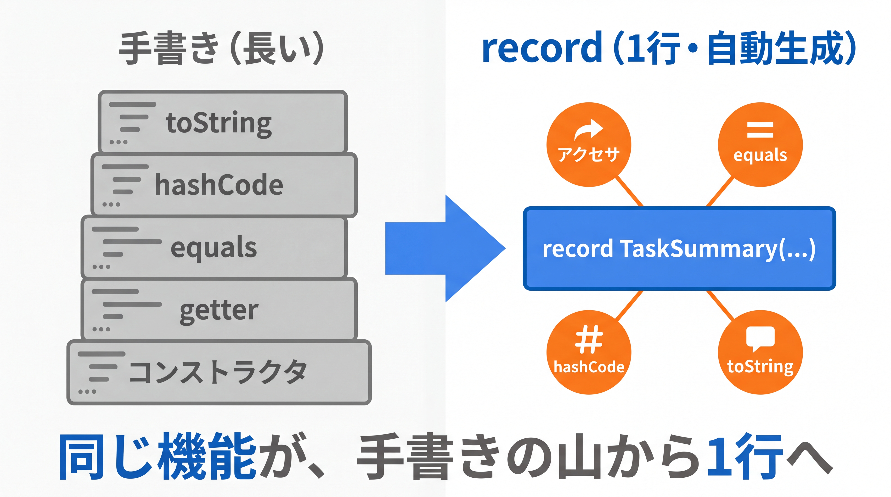

# 2-4-1 record と enum

Chapter 2-4 では、近年の Java を簡潔で型安全にする道具を学びます。データを表す型（`record` / `enum`）、型を部品化するジェネリクス、そして関数型の書き方（ラムダ・`Stream`）と null 安全（`Optional`）です。これらは Part 3 以降で Spring のコードを読み書きするための土台になります。

| セクション | テーマ | 種類 |
|---|---|---|
| 2-4-1 record と enum | record（不変データ）・enum（決まった値の集合） | 概念 |
| 2-4-2 ジェネリクスの定義 | 型パラメータ・ジェネリッククラス / メソッド・境界 | 概念 |
| 2-4-3 Optional とラムダ・Stream 入門 | ラムダ・関数型インターフェース・Stream・Optional | 概念 |

📖 **この Chapter の進め方**: まず 2-4-1 でデータを表す型（`record`・`enum`）を、次に 2-4-2 で型をパラメータ化するジェネリクスを学びます。最後に 2-4-3 で、ラムダ・関数型インターフェース・`Stream`・`Optional` を入門レベルで押さえ、Part 2 を締めくくります。

📝 **前提知識**: このセクションは「2-1-2 カプセル化とアクセス修飾子」の内容を前提としています。

## 🎯 このセクションで学ぶこと

- `record` で不変データを表す型を 1 行で定義でき、何が自動生成されるかを説明できる
- コンパクトコンストラクタと `record` の制約・使いどころを理解する
- `enum` で「決まった値の集合」を型として定義でき、フィールドやメソッドも持たせられる

本セクションでは、`record` の定義と自動生成、コンパクトコンストラクタと制約、続いて `enum` の基本とフィールド・メソッドを持つ `enum` へと進みます。

---

## 導入: データを運ぶだけのクラスに、定型コードを書き続ける退屈

2-2-1 で `Tag` クラスを作ったとき、中身を比較するために `equals` と `hashCode` を手で書き、表示のために `toString` も書きました。さらにフィールドを読むための getter も要ります。やっていることは「値を保持して、読めて、比べられて、表示できる」だけなのに、定型コードが積み上がります。

API のリクエストやレスポンスのように「データを運ぶだけ」の型は、実務で大量に登場します。そのたびに同じ定型を書く（あるいは IDE で自動生成する）のは退屈で、しかも手書きだとフィールドを足したときに `equals` の更新を忘れる、といった事故も起きます。これを 1 行で解決するのが **`record`** です。あわせて、「ステータスは TODO・DOING・DONE のどれか」のような **決まった値の集合** を型で表す **`enum`** も学びます。どちらも「データを型として簡潔に表す」ための道具です。

### 🧠 先輩エンジニアの思考プロセス

> データを運ぶだけのクラスに、私は何度 getter と `equals` と `toString` を書いたか分かりません。Laravel なら配列や stdClass でさっと済ませていた「ただの値の入れ物」を、Java では律儀にクラスにして、IDE の自動生成ボタンを連打していました。`record` を知ったときは、あの定型作業が 1 行で消えて拍子抜けしたほどです。
>
> `enum` も、現場に出てから評価が変わった機能です。ステータスを `String` の "todo" や "done" で持っていたころは、綴り間違いや想定外の値が紛れ込むバグに悩まされました。`enum` にしてからは、定義した値以外はそもそもコンパイルが通りません。「ありえない値が来ない」と型で保証できる安心感は、一度知ると手放せません。



---

## record（不変データを簡潔に）

**`record`** は、データを保持するための型を簡潔に定義する仕組みです（Java 16 で正式導入）。タスクの概要を表す型を作ってみます。

```java
// TaskSummary.java
public record TaskSummary(Long id, String title, boolean done) {
}
```

`record` 名のあとのカッコに並べた `Long id`・`String title`・`boolean done` を **コンポーネント** と呼びます。たったこれだけで、ふつうのクラスなら手書きしていたものが自動で備わります。使い方を見てみます。

```java
// Main.java
TaskSummary s = new TaskSummary(1L, "牛乳を買う", false);

System.out.println(s.title());   // 牛乳を買う（アクセサは get なしの title()）
System.out.println(s.done());    // false
System.out.println(s);           // TaskSummary[id=1, title=牛乳を買う, done=false]
```

---

## record が自動生成するもの

`record` が自動で用意してくれるのは、次のものです。

- **正規コンストラクタ**: 全コンポーネントを引数に取るコンストラクタ（`new TaskSummary(1L, "牛乳を買う", false)`）
- **アクセサ**: 各コンポーネントを返すメソッド。名前はコンポーネント名そのまま（`id()`・`title()`・`done()`）で、JavaBeans の `getXxx` とは違い **`get` が付きません**
- **`equals` / `hashCode`**: 全コンポーネントの値で比較する実装。2-2-1 で `Tag` に手書きした「中身が同じなら等しい」が、自動で手に入ります
- **`toString`**: 全コンポーネントを含む読みやすい表現

```java
TaskSummary a = new TaskSummary(1L, "牛乳を買う", false);
TaskSummary b = new TaskSummary(1L, "牛乳を買う", false);
System.out.println(a.equals(b));   // true（中身が同じなら等しい。自動生成された equals）
```

🔑 2-2-1 で `Tag` のために手書きした `equals` / `hashCode` / `toString` は、`record` を使えば 1 行の定義から自動生成されます。「中身が同じなら等しい」という値を表す型は、`record` で書くのが基本になります。

⚠️ アクセサが `getTitle()` ではなく `title()` である点は、JavaBeans 規約に慣れると戸惑うところです。Spring の JSON 変換（Jackson）などのフレームワークは `record` に対応しているので心配は要りませんが（3-3-2 で扱います）、「`record` のアクセサは `get` なし」と覚えておいてください。

---

## コンパクトコンストラクタと record の制約

`record` でも、生成時に値を検証したいことがあります。そのための簡潔な書き方が **コンパクトコンストラクタ** です。引数リストを書かず、検証だけを書きます（フィールドへの代入はコンパイラが自動で行います）。

```java
// TaskSummary.java
public record TaskSummary(Long id, String title, boolean done) {
    public TaskSummary {                       // 引数リストを書かない
        if (title == null || title.isBlank()) {
            throw new IllegalArgumentException("タイトルは空にできません");
        }
    }
}
```

これで、空タイトルの `TaskSummary` を作ろうとすると例外になります。2-1-2 でカプセル化のために `private` フィールド＋検証メソッドで実現した「不正な状態を作らせない」を、`record` ではコンパクトコンストラクタで担えます。

`record` には、データを表す型に徹するための制約があります。

- **不変（イミュータブル）**: コンポーネントは `final` で、setter はありません。一度作ったら値を変えられません。だから DTO や値オブジェクトのように「作って渡すだけ」のデータに向きます
- **暗黙に `final`**: `record` は継承できません（サブクラスを作れない）
- **クラスは継承できないが、インターフェースは実装できる**: `record TaskSummary(...) implements Comparable<TaskSummary>` のように契約を満たせます
- 追加のインスタンスフィールドは持てません（コンポーネント以外の状態は持たない）。一方、メソッドや `static` メンバーは追加できます

💡 **どこで使うか**: API の入出力を表す DTO（3-3-2）や、`Tag` のような値オブジェクトが典型です。逆に、3-4 で学ぶ JPA の `@Entity`（DB の行に対応し、値が変化しうる）は `record` には向きません。エンティティは可変な通常のクラスで作ります（3-4-1）。

💡 **PHP との対応**: PHP には `record` はありませんが、考え方は PHP 8.1 の `readonly` プロパティや、値オブジェクトとして使う不変クラスに近いです。「一度作ったら変えない、中身で等価を判断するデータ」という用途が共通します。

---

## enum（決まった値の集合を型に）

**`enum`** は、取りうる値があらかじめ決まっている型を定義します。タスクのステータスを例にします。

```java
// TaskStatus.java
public enum TaskStatus {
    TODO, DOING, DONE
}
```

`TaskStatus` 型の変数には、`TaskStatus.TODO`・`TaskStatus.DOING`・`TaskStatus.DONE` の 3 つしか入りません。`String` で `"todo"` と持つのと違い、綴り間違いや想定外の値はコンパイルの時点で弾かれます。

```java
TaskStatus status = TaskStatus.TODO;

// 1-2-2 で学んだ switch 式と相性がよい（定数名は修飾なしで書ける）
String label = switch (status) {
    case TODO -> "未着手";
    case DOING -> "進行中";
    case DONE -> "完了";
};
System.out.println(label);   // 未着手
```

`enum` には便利なメソッドが備わっています。

- `TaskStatus.values()`: 全定数を配列で返す（`for (TaskStatus s : TaskStatus.values())` で全件処理できる）
- `TaskStatus.valueOf("DONE")`: 名前の文字列から定数を得る
- `status.name()`: 定数の名前（`"TODO"`）を返す

🔑 「決まった値のどれか」を `int` や `String` で表すと、不正な値が紛れ込む余地が残ります。`enum` はその余地を型で塞ぎ、扱える値を定義したものだけに限定します。

---

## フィールド・メソッドを持つ enum

Java の `enum` は、単なる名前の一覧にとどまりません。各定数に **付随するデータ（フィールド）** や **振る舞い（メソッド）** を持たせられます。優先度を、数値と日本語ラベル付きで定義してみます。

```java
// Priority.java
public enum Priority {
    LOW(1, "低"),
    MEDIUM(2, "中"),
    HIGH(3, "高");

    private final int level;
    private final String label;

    Priority(int level, String label) {   // コンストラクタ（各定数が引数を渡す）
        this.level = level;
        this.label = label;
    }

    public int getLevel() {
        return level;
    }

    public String getLabel() {
        return label;
    }
}
```

各定数（`LOW`・`MEDIUM`・`HIGH`）が、宣言時に `(1, "低")` のようにコンストラクタへ引数を渡しています。これで、定数ごとに値を結びつけられます。

```java
Priority p = Priority.HIGH;
System.out.println(p.getLabel());   // 高
System.out.println(p.getLevel());   // 3
```

💡 `enum` のコンストラクタは外部から呼べません（暗黙に `private` 相当で、定数の宣言時にだけ使われます）。`new Priority(...)` のように増やすことはできず、取りうる値は定義した 3 つに固定されます。これが「決まった値の集合」を保証する仕組みです。

💡 **PHP との対応**: PHP 8.1 の `enum`（`enum Status: string { case Todo = 'todo'; }` のような backed enum）に対応します。Java の `enum` は、複数のフィールドやメソッドを持てる点でより多機能で、ちょっとしたロジックを定数ごとに持たせられます。

---

## ✨ まとめ

- `record` はデータを表す型を 1 行で定義し、正規コンストラクタ・アクセサ（`get` なし）・`equals` / `hashCode` / `toString` を自動生成する。2-2-1 で手書きした定型が消える
- `record` は不変で継承できないが、インターフェースは実装できる。コンパクトコンストラクタで生成時の検証を書ける。DTO・値オブジェクト向き（エンティティには使わない）
- `enum` は取りうる値を定義したものだけに限定する型。`values()` / `valueOf()` / `name()` が使え、`switch` と相性がよい
- `enum` はフィールド・メソッド・コンストラクタを持て、定数ごとにデータや振る舞いを結びつけられる

---

次のセクションでは、ジェネリクスの定義側を学びます。型パラメータを使って型安全なクラスやメソッドを自分で定義できるようになり、1-3-1 で使った `List<String>` のようなコレクションが、内部でどうやって型を守っているのかを説明できるようになります。
