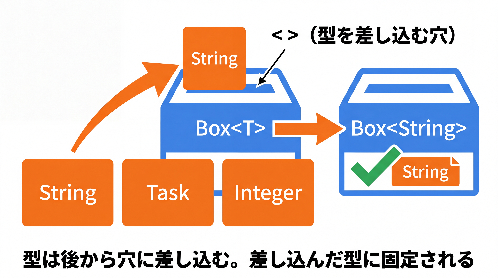

# 2-4-2 ジェネリクスの定義

📝 **前提知識**: このセクションは「2-3-1 インターフェース」「1-3-1 コレクション」の内容を前提としています。

## 🎯 このセクションで学ぶこと

- ジェネリクス（型パラメータ）が「型を後から差し込めるようにする」仕組みだと理解する
- ジェネリッククラスとジェネリックメソッドを自分で定義できる
- コレクションが内部でどう型を守っているかを説明でき、`Repository<User>` のような型表現を読める

本セクションでは、ジェネリクスとは何かから始め、ジェネリッククラス・ジェネリックメソッドの定義、境界のある型パラメータ、そしてコレクションが型を守る仕組みへと進みます。

---

## 導入: List<String> の `<>` の正体

1-3-1 でコレクションを学んだとき、`List<String>` の `<String>` を「要素の型の指定」として使いました。あのとき、型を指定すると別の型を入れようとした瞬間にコンパイルエラーになり、取り出すときもキャストが不要でした。あの `<>` の仕組みを **ジェネリクス** と呼びます。

1-3-1 ではこれを「使う側」として扱いました。本セクションでは「定義する側」に回ります。自分でクラスやメソッドを書くとき、`List` の作者がやったように「型を後から差し込めるようにする」書き方を身につけます。これができると、型安全な部品を自作できるだけでなく、Spring に出てくる `JpaRepository<User, Long>` のような型表現も「ただの穴埋め」として読めるようになります。

### 🧠 先輩エンジニアの思考プロセス

> 1-3-1 で `List<String>` を使ったとき、`<String>` を「そういう書き方」として受け入れていた人は多いと思います。私もそうでした。定義側を書くようになって初めて、あれが「型を後から差し込めるようにする」仕組みだと分かりました。`List` を作った人は、`String` のリストになるか `Task` のリストになるかを決めずに書いている。決めるのは使う私たちです。
>
> ジェネリクスのありがたみは、Spring を触ると一気に分かります。`JpaRepository<User, Long>` のような型が出てきたとき、「`User` を `Long` の ID で扱うリポジトリ」だと型から読めます。ジェネリクスを知らないとこの表記が暗号に見えますが、定義側の発想を一度つかんでおけば、ただの穴埋めだと分かります。



---

## ジェネリクスとは（型をパラメータにする）

ジェネリクスがないと何が困るのか、まず「何でも入る箱」を素朴に作ってみます。どんな型でも入れられるようにするには、すべての親である `Object`（2-2-1）で受けるしかありません。

```java
// 型を Object で受ける素朴な箱（問題あり）
public class Box {
    private Object value;
    public void set(Object value) { this.value = value; }
    public Object get() { return value; }
}
```

```java
Box box = new Box();
box.set("hello");
String s = (String) box.get();   // 取り出すたびにキャストが必要
```

この箱には 2 つの問題があります。取り出すたびに `(String)` のキャストが要ること、そして `box.set(123)` のように別の型を入れてもコンパイルが通ってしまい、キャストの瞬間に実行時エラーになりうることです。型の安全がコンパイル時に保証されていません。

**ジェネリクス** は、この「入れる型」をパラメータ（後から決められる変数のようなもの）にして解決します。

---

## ジェネリッククラスの定義

クラス名の後ろに `<T>` と書くと、`T` という **型パラメータ** を持つジェネリッククラスになります。

```java
// Box.java
public class Box<T> {                // T は「後から決まる型」
    private T value;
    public void set(T value) { this.value = value; }
    public T get() { return value; }
}
```

`T` は型の置き場所です。使うときに `Box<String>` とすれば `T` が `String` に固定され、`Box<Task>` とすれば `Task` に固定されます。

```java
Box<String> box = new Box<>();
box.set("hello");
String s = box.get();   // キャスト不要。String として取り出せる
box.set(123);           // コンパイルエラー（String ではない）
```

キャストが消え、誤った型はコンパイル時に弾かれます。素朴な `Object` 版が抱えていた 2 つの問題が、両方とも解決しました。

💡 型パラメータの名前は 1 文字の大文字にするのが慣習です。`T`（Type）、`E`（Element）、`K`（Key）、`V`（Value）などがよく使われます。`Map<K, V>` のように複数の型パラメータを持つこともできます。

---

## ジェネリックメソッド

クラス全体ではなく、特定のメソッドだけを型パラメータ化することもできます。**戻り値の型の前** に `<T>` を置きます。

```java
// リストの先頭要素を返す（空なら null）。どんな型のリストにも使える
public static <T> T firstOrNull(List<T> list) {
    return list.isEmpty() ? null : list.get(0);
}
```

```java
String first = firstOrNull(List.of("a", "b"));        // T は String と推論される
Integer head = firstOrNull(List.of(10, 20, 30));      // T は Integer と推論される
```

呼び出すときに型を明示しなくても、引数から `T` が何かをコンパイラが推論します。1 つのメソッド定義が、さまざまな型のリストに対して型安全に働きます。

---

## 境界のある型パラメータ（extends）

`Box<T>` の `T` は「どんな型でもよい」ため、その中では `Object` のメソッドしか呼べません。「数値なら何でも」のように **型の範囲を制限** したいときは、`<T extends 上限の型>` と書きます。これを境界のある型パラメータと呼びます。

```java
// T は Number（およびそのサブクラス）に限定する
public static <T extends Number> double sum(List<T> numbers) {
    double total = 0;
    for (T n : numbers) {
        total += n.doubleValue();   // Number のメソッドが呼べる
    }
    return total;
}
```

```java
System.out.println(sum(List.of(1, 2, 3)));        // 6.0（Integer は Number）
System.out.println(sum(List.of(1.5, 2.5)));       // 4.0（Double も Number）
// sum(List.of("a", "b"));                          // コンパイルエラー（String は Number ではない）
```

`<T extends Number>` と制限したことで、`T` の値に対して `Number` が持つメソッド（`doubleValue()` など）を呼べるようになります。制限がなければ `T` は `Object` 扱いで、こうした計算はできません。

💡 型パラメータには、`List<? extends Number>` のように `?`（ワイルドカード）を使う、より柔軟な指定方法もあります。入門段階では「`<>` の中に `?` が出てくることがある」と知っておけば十分で、本教材では深入りしません。

---

## コレクションが型を守る仕組みと、型消去

ここまで来ると、1-3-1 のコレクションが内部でしていたことが見えてきます。`List` や `Map` は、実は次のように型パラメータを持つジェネリックなインターフェースとして定義されています。

- `List<E>`: 要素の型が `E`。`List<String>` とすれば `E` が `String` に固定され、`add(String)` しか受け付けず、`get()` は `String` を返す
- `Map<K, V>`: キーの型が `K`、値の型が `V`

つまり、あなたが `Box<T>` でやったことと同じ仕組みで、コレクションは型を守っていました。`List<String>` に `Integer` を入れられなかったのも、`get()` でキャストが不要だったのも、ジェネリクスのおかげです。

🔑 この発想は Spring のあちこちに現れます。3-4 で出てくる `JpaRepository<User, Long>` は、「`User` というエンティティを `Long` 型の ID で扱うリポジトリ」という意味で、`<>` の中に型を差し込んだものです。ジェネリクスの定義側を一度理解しておけば、こうした型はすべて「穴埋め」として読めます。

最後に 1 つだけ注意点に触れておきます。Java のジェネリクスは **コンパイル時の仕組み** で、実行時には型パラメータの情報が消えます（型消去と呼びます）。`List<String>` も `List<Integer>` も、実行時にはただの `List` です。普段は意識しなくても書けますが、「ジェネリクスはコンパイラが型をチェックするための仕組みで、実行時には残らない」とだけ頭の隅に置いておくと、後でつまずきにくくなります。

---

## ✨ まとめ

- ジェネリクスは「入れる型」をパラメータにする仕組み。`Object` で受けてキャストする素朴なやり方の、キャストの手間と実行時エラーの危険を取り除く
- クラスは `class Box<T>`、メソッドは戻り値の型の前に `<T>` を置いて型パラメータを宣言する。使うときに型が固定・推論される
- `<T extends Number>` で型の範囲を制限すると、その型が持つメソッドを呼べる（ワイルドカード `?` は入門では概要のみ）
- `List<E>` / `Map<K, V>` も同じ仕組みで型を守っている。`JpaRepository<User, Long>` のような表記も穴埋めとして読める。ジェネリクスはコンパイル時の仕組み（型消去）

---

次のセクションは Part 2 の締めくくりです。ラムダ式と関数型インターフェース、コレクションを宣言的に処理する `Stream`、そして null 安全を型で扱う `Optional` を学び、コレクション操作を簡潔に書けるようになります。
