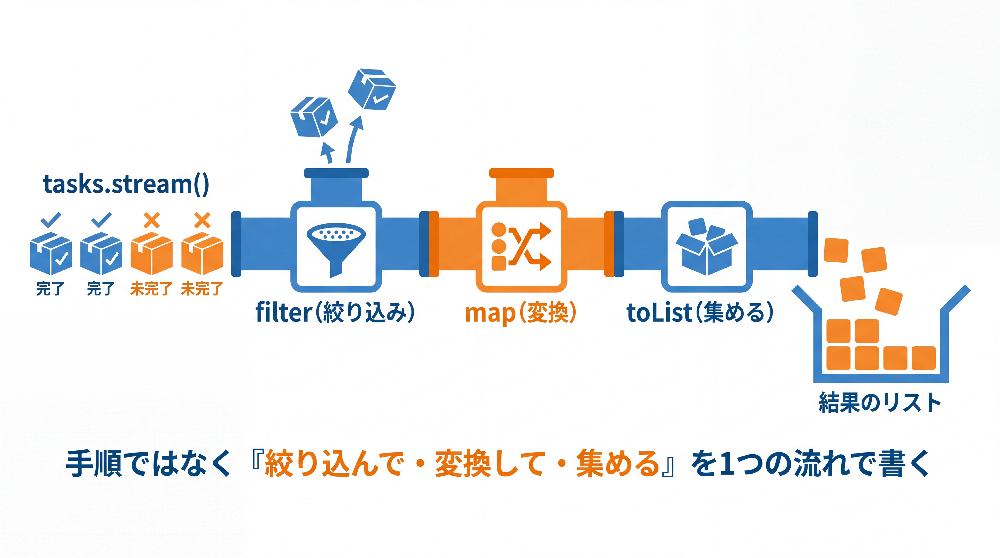

# 2-4-3 Optional とラムダ・Stream 入門

📝 **前提知識**: このセクションは「2-4-2 ジェネリクスの定義」の内容を前提としています。

## 🎯 このセクションで学ぶこと

- ラムダ式と関数型インターフェースを理解し、処理を値として渡せる
- `Stream` でコレクションを宣言的に（絞り込み・変換・集約）処理できる
- `Optional` で「値が無いかもしれない」を型として安全に扱える

本セクションでは、ラムダ式から始め、その正体である関数型インターフェース、コレクションを処理する `Stream`、そして null 安全を担う `Optional` へと進みます。Part 2 の総仕上げです。

---

## 導入: 手続き的なループと、null チェックの嵐から離れる

コレクションを扱うコードは、放っておくと「空のリストを用意し、`for` で回し、条件に合うものを詰め直す」という手順の羅列になりがちです。やりたいことは「絞り込んで、変換して、集める」だけなのに、手順が前面に出て意図が読みにくくなります。さらに Java では、メソッドが値を返さないとき `null` を返す習慣があり、受け取った側が `null` チェックを忘れて `NullPointerException` を出す、という事故が定番でした。

この 2 つの悩みに、現代的な Java は道具を用意しています。コレクション処理を「何をしたいか」で書ける **`Stream`**、そしてその土台となる **ラムダ式** と **関数型インターフェース**。さらに、「値が無いかもしれない」ことを型で表して `null` 事故を防ぐ **`Optional`** です。本セクションでは、この 4 つを入門レベルで一気に押さえます。Eloquent のコレクションを `->filter()->map()` でつないだ経験が、そのまま足がかりになります。

### 🧠 先輩エンジニアの思考プロセス

> Java 8 より前のコードを引き継いだとき、コレクションを処理するたびに `for` ループと一時的な `List` を作っては詰め直す書き方が並んでいて、何をしたいのか読み取るのに時間がかかりました。`Stream` を使うと「絞り込んで、変換して、集める」という意図が、そのまま 1 つの流れで書けます。Eloquent のコレクションを `->filter()->map()` でつないでいた感覚に近いです。
>
> `Optional` は、null との付き合い方を変えてくれました。以前は「ここは null かもしれない」を頭の中で覚えておくしかなく、忘れて `NullPointerException` を出すのが定番でした。戻り値が `Optional` だと、型が「中身が無い場合はどうするのか」を必ず意識させてくれます。最初は少しうるさく感じますが、本番で null に足をすくわれる回数が確実に減ります。



---

## ラムダ式（処理を値として渡す）

**ラムダ式** は、「処理（メソッドの中身）」を、その場で簡潔に書いて値のように渡すための記法です。2-3-1 の `NotificationSender` は `send` という 1 つのメソッドだけを持つインターフェースでした。これを実装するとき、従来は **匿名クラス** （名前を付けずにその場で実装するクラス）を書いていました。

```java
// 従来: 匿名クラスで実装する
NotificationSender s1 = new NotificationSender() {
    @Override
    public void send(String message) {
        System.out.println("送信: " + message);
    }
};
```

同じことを、ラムダ式ならこう書けます。

```java
// ラムダ式: 引数 -> 処理
NotificationSender s2 = message -> System.out.println("送信: " + message);
s2.send("こんにちは");   // 送信: こんにちは
```

`message -> System.out.println(...)` が、`send` メソッドの実装そのものです。`->` の左に引数、右に処理を書きます。書き方にはいくつか形があります。

```java
(a, b) -> a + b                  // 引数が複数。1 つの式ならその値が戻り値になる
name -> System.out.println(name) // 引数が 1 つならカッコを省略できる
() -> "固定値"                    // 引数がないとき
(x, y) -> {                      // 複数行のときは { } で囲み、return を書く
    int sum = x + y;
    return sum * 2;
}
```

---

## 関数型インターフェース

ラムダ式はどんな型として扱われるのでしょうか。答えは **関数型インターフェース** です。これは **抽象メソッドをちょうど 1 つだけ持つインターフェース** のことで、ラムダ式はその唯一のメソッドの実装になります。`NotificationSender` は `send` 1 つだけなので、関数型インターフェースです。`@FunctionalInterface` を付けると、「これは 1 メソッドの約束だ」と明示でき、うっかり 2 つ目の抽象メソッドを足すとコンパイラが警告します。

Java は、よく使う関数型インターフェースを `java.util.function` パッケージに標準で用意しています。代表的なものは次の 4 つです。

| インターフェース | 抽象メソッド | 役割 |
|---|---|---|
| `Function<T, R>` | `R apply(T t)` | `T` を受け取り `R` を返す（変換） |
| `Predicate<T>` | `boolean test(T t)` | `T` を受け取り真偽を返す（判定） |
| `Consumer<T>` | `void accept(T t)` | `T` を受け取り、消費する（戻り値なし） |
| `Supplier<T>` | `T get()` | 引数なしで `T` を供給する |

たとえば `s -> s.length()` は「`String` を受けて長さ（`int`）を返す」ので `Function<String, Integer>` です（戻り値の `int` は、1-3-1 で触れたオートボクシングで `Integer` に変換されます）。`s -> s.isBlank()` は「`String` を受けて真偽を返す」ので `Predicate<String>` として扱えます。次に学ぶ `Stream` は、これらを引数に取って動きます。

💡 ラムダが既存のメソッドを呼ぶだけのときは、**メソッド参照** でさらに短く書けます。`s -> System.out.println(s)` は `System.out::println`、`task -> task.describe()` は `Task::describe` と書けます。`クラス名::メソッド名` の形です。

---

## Stream（コレクションを宣言的に処理）

**`Stream`** は、コレクションを「絞り込み・変換・集約」の流れで宣言的に処理する仕組みです。`for` ループで手順を書く代わりに、「何をしたいか」をメソッドのつながりで表します。未完了タスクのタイトルだけを取り出す例を見ます。

```java
List<Task> tasks = List.of(
    new Task(1L, "牛乳を買う"),
    new Task(2L, "ゴミ出し"),
    new Task(3L, "請求書を送る")
);

List<String> activeTitles = tasks.stream()    // ① ストリームにする
    .filter(task -> !task.isDone())             // ② 条件で絞る（引数は Predicate）
    .map(task -> task.describe())               // ③ 変換する（引数は Function）
    .toList();                                  // ④ リストに集める（終端操作）
// [牛乳を買う（未完了）, ゴミ出し（未完了）, 請求書を送る（未完了）]
```

処理は 2 種類に分かれます。

- **中間操作** （`filter`・`map` など）: ストリームを返し、つなげていける。実際の処理は **遅延** され、終端操作が呼ばれるまで動かない
- **終端操作** （`toList`・`count`・`forEach` など）: ここで初めて処理が走り、結果（リストや件数など）を取り出す

`filter` には `Predicate`（判定）、`map` には `Function`（変換）をラムダで渡しています。③ は前述のメソッド参照で `.map(Task::describe)` とも書けます。ほかにも、件数を数える `count()`、各要素に処理を行う `forEach` などがあります。

```java
long activeCount = tasks.stream().filter(task -> !task.isDone()).count();   // 3
```

💡 **Laravel との対応**: Eloquent コレクションの `->filter()` / `->map()` と発想は同じです。違いは、`Stream` は一度終端操作を呼ぶと使い切りになる（同じストリームを再利用できない）点です。必要なら `tasks.stream()` から作り直します。

> 💡 **バージョン差分**: 終端操作の `toList()` は Java 16 以降で使えます。それ以前は `.collect(Collectors.toList())` と書きます。両者には違いがあり、`toList()` が返すのは変更不可のリスト、`Collectors.toList()` が返すのは（多くの実装では）変更可能なリストです。現場のバージョンに応じて使い分けます。

---

## Optional（null 安全）

**`Optional<T>`** は、「`T` 型の値があるかもしれないし、ないかもしれない」ことを表す型です。`null` を直接返す代わりに `Optional` を返すと、受け取った側は「中身が無い場合」を必ず意識することになり、`NullPointerException` を防げます。`Stream` で「最初の 1 件」を探す `findFirst()` は、見つからないこともあるので `Optional` を返します。

```java
Optional<Task> found = tasks.stream()
    .filter(task -> task.getId().equals(2L))
    .findFirst();                               // Optional<Task>（見つからなければ空）
```

中身の取り出し方には、いくつかの方法があります。

```java
// 1. 在不在を確かめてから取り出す
if (found.isPresent()) {
    System.out.println(found.get().describe());
}

// 2. 無ければ既定値を使う
Task task = found.orElse(new Task(0L, "（該当なし）"));

// 3. 無ければ例外を投げる（1-3-2 で作った独自例外を使う）
Task task2 = tasks.stream()
    .filter(t -> t.getId().equals(99L))
    .findFirst()
    .orElseThrow(() -> new TaskNotFoundException("ID 99 のタスクが見つかりません"));

// 4. 中身があれば変換、無ければ既定の文字列
String label = found
    .map(Task::describe)
    .orElse("（該当なし）");
```

`Optional` の作り方と主なメソッドを整理します。

- 作る: `Optional.of(値)`（`null` 不可）、`Optional.ofNullable(値)`（`null` かもしれない）、`Optional.empty()`（空）
- 調べる: `isPresent()` / `isEmpty()`
- 取り出す: `orElse(既定値)`、`orElseGet(供給ラムダ)`、`orElseThrow(...)`。`get()` は中身が無いと例外になるため、できるだけ使わない
- 変換する: `map(変換)`、`filter(判定)`、`ifPresent(処理)`

⚠️ `Optional` は **メソッドの戻り値** に使うのが基本です。「見つからないことがある」検索結果などに向きます。フィールドやメソッドの引数を `Optional` 型にするのは推奨されません（かえって扱いが複雑になります）。

💡 **Laravel との対応**: Eloquent の `find()` が `null` を返し、`findOrFail()` が例外を投げたのを思い出してください。`Optional` は「無いかもしれない」を型で明示し、`orElseThrow(...)` を付ければ `findOrFail()` 相当になります。「無いかもしれない結果」を、呼び出し側に型で伝えられるのが `Optional` の利点です。

---

## ✨ まとめ

- ラムダ式は「処理を値として渡す」記法（`引数 -> 処理`）。1 つのメソッドだけを持つ関数型インターフェースの実装になる
- `Function` / `Predicate` / `Consumer` / `Supplier` が標準の関数型インターフェース。既存メソッドを呼ぶだけなら `クラス名::メソッド名` のメソッド参照で短く書ける
- `Stream` はコレクションを宣言的に処理する。中間操作（`filter` / `map`、遅延）をつなぎ、終端操作（`toList` / `count` / `forEach`）で結果を得る。`toList()` は Java 16 以降
- `Optional<T>` は「値が無いかもしれない」を表す型。戻り値に使い、`orElse` / `orElseThrow` / `map` で安全に扱う。`null` 事故を型で防ぐ

【Chapter 2-4 の振り返り】本章では、現代的な Java を学びました。データを表す型（`record`・`enum`、2-4-1）、型を部品化するジェネリクス（2-4-2）、そして関数型の書き方（ラムダ・`Stream`）と null 安全（`Optional`、2-4-3）です。これらは、簡潔で型安全なコードを書くための現代 Java の標準装備です。

【Part 2 の振り返り】Part 2 では、Java のオブジェクト指向と現代的な機能を通して、「設計する力」を身につけました。クラスとカプセル化（2-1）でデータと振る舞いをまとめて隠し、継承と抽象クラス（2-2）で共通部分を括り出し、インターフェースとポリモーフィズム（2-3）で実装を差し替えられる設計を学び、現代的な Java（2-4）で簡潔・型安全な道具をそろえました。とりわけ 2-3 のインターフェースとポリモーフィズムは、次の Part 3 で学ぶ Spring の DI を理解する直接の土台です。読者にとって最大のギャップだった本格的なオブジェクト指向を、ここで越えました。

---

次の Part 3 では、いよいよ Spring Boot に入ります。最初のセクション 3-1-1 では、Spring エコシステムの全体像と Spring Boot の役割、スターターによる依存のまとめ方、オートコンフィギュレーション、そして「規約より設定」という考え方を学び、Spring Boot が何を自動化しているのかを俯瞰します。Part 2 で身につけたインターフェースとポリモーフィズムが、その理解を支えます。
