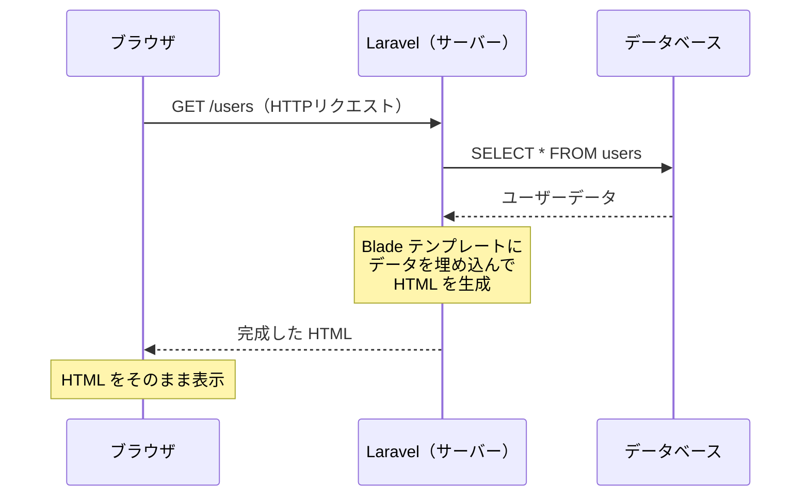
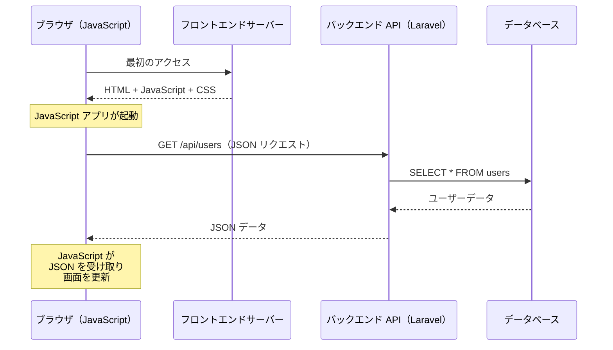
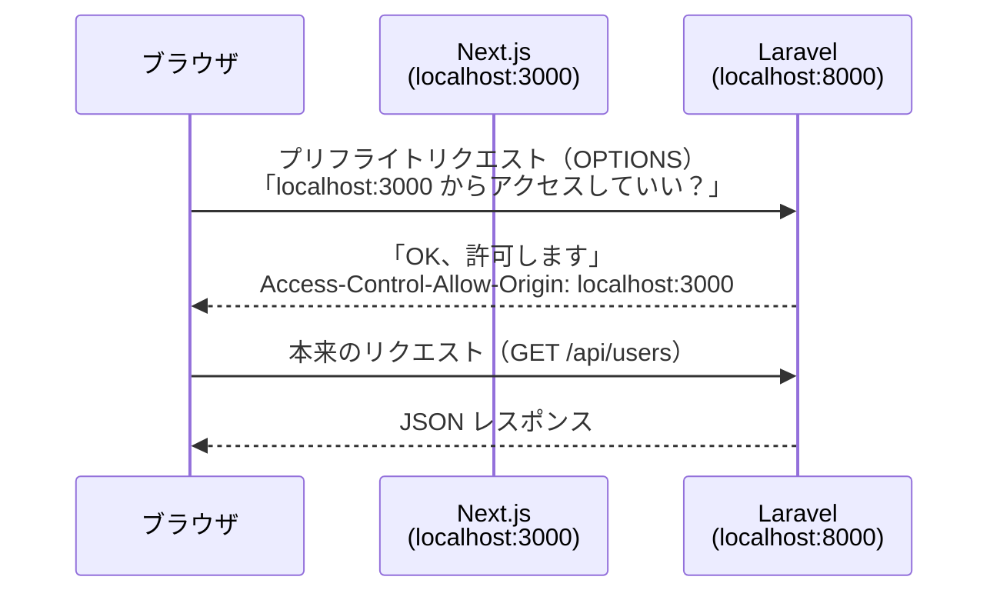
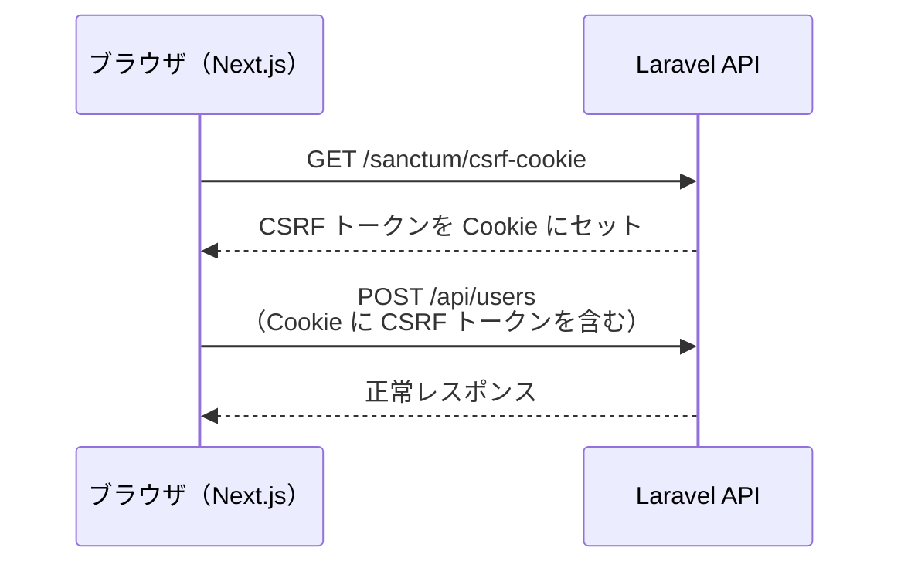
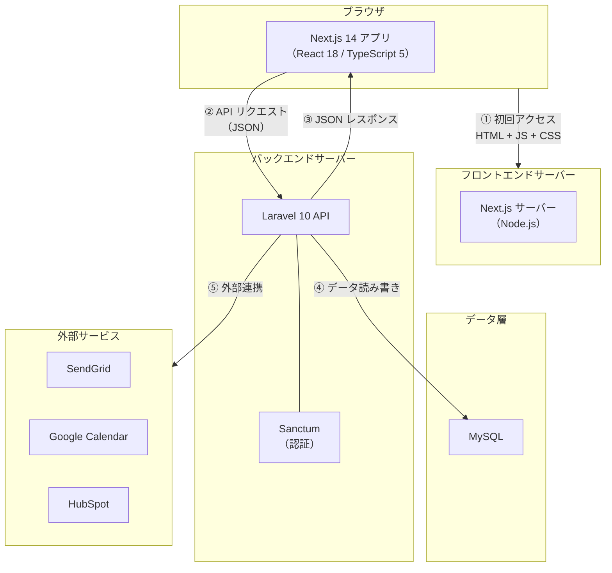

# 2-1-1 モダン Web アプリケーションのアーキテクチャ

この Chapter では、PHP の知識を起点に JavaScript 固有の概念を効率的に学びます。Web アプリケーションのアーキテクチャの変化を理解した上で、JavaScript の言語特性、構文、非同期処理、モジュールシステムを段階的に習得していきます。

この Chapter「JavaScript の基礎」は以下の 5 セクションで構成されます。

| セクション | テーマ | 種類 |
|---|---|---|
| 2-1-1 | モダン Web アプリケーションのアーキテクチャ | 概念 |
| 2-1-2 | JavaScript と PHP の根本的な違い | 概念 |
| 2-1-3 | 変数・関数・スコープ | 概念 |
| 2-1-4 | 非同期処理 | 概念 |
| 2-1-5 | モジュールシステムと配列操作 | 概念 |

**Chapter ゴール**: PHP の知識を起点に、JavaScript 固有の概念を効率的に学ぶ

📖 **この Chapter の進め方**: まず本セクションで Web アプリのアーキテクチャが SPA + API に移行した背景を理解し、次に JavaScript の言語特性を PHP と対比して学び、構文・非同期・モジュールと段階的に知識を積み上げていきます。

## 🎯 このセクションで学ぶこと

- 従来のサーバーサイドレンダリング（Laravel + Blade）と SPA + API アーキテクチャの違いを理解する
- フロントエンドとバックエンドが別アプリケーションとして API で通信する構造を理解する
- CORS・CSRF・Cookie/Token ベース認証のセキュリティ基礎概念を理解する
- LMS が採用している Next.js 14 + Laravel 10 のアーキテクチャ全体像を把握する

まず Laravel + Blade の構成が抱える課題から出発し、SPA + API アーキテクチャがなぜ生まれたかを理解した上で、通信の仕組みとセキュリティの基礎概念、そして LMS の実際のアーキテクチャへとつなげていきます。

---

## 導入: Blade テンプレートの限界

あなたが COACHTECH 教材で学んだ Laravel アプリケーションでは、ユーザーがページにアクセスするたびにサーバーが HTML を組み立てて返していました。Blade テンプレートにデータを埋め込み、完成した HTML をブラウザに送る。この構成はシンプルで理解しやすく、小規模なアプリケーションには適しています。

しかし、アプリケーションが成長するにつれて、いくつかの問題が顕在化します。

- **ページ遷移のたびに画面全体が再読み込みされる**: ユーザーがリンクをクリックするたびに白い画面が一瞬表示され、体験が途切れます
- **フロントエンドの複雑さに Blade が対応しきれない**: リアルタイムの入力バリデーション、ドラッグ&ドロップ、モーダルの状態管理など、リッチな UI を Blade + jQuery で実現しようとすると、コードが急速に複雑化します
- **フロントエンドとバックエンドの開発が密結合になる**: Blade テンプレートは Laravel プロジェクトの中に存在するため、UI の変更にもバックエンドのデプロイが必要になります

LMS はまさにこの課題に直面したアプリケーションです。受講生の学習管理、カレンダー連携、リアルタイムな進捗表示など、リッチな UI が求められる機能が多く、Blade テンプレートだけでは対応が困難でした。そこで LMS は、フロントエンド（Next.js 14）とバックエンド（Laravel 10）を完全に分離した **SPA + API アーキテクチャ** を採用しています。

### 🧠 先輩エンジニアはこう考える

> LMS の開発を始めた頃、最初は「なぜわざわざフロントエンドとバックエンドを分けるのか」と疑問に思いました。Laravel だけで作れば1つのリポジトリで完結するのに、と。でも実際に管理画面のカレンダー機能やリアルタイムな進捗バーを Blade で作ろうとすると、JavaScript のコードが Blade テンプレートのあちこちに散らばって、どこで何が起きているのか追えなくなるんです。フロントエンドを分離してからは、UI のロジックは UI の世界で、データの処理はバックエンドの世界で、それぞれ整理して開発できるようになりました。最初の学習コストは高いですが、中長期的には開発速度が確実に上がります。


---

## サーバーサイドレンダリング（MVC）の仕組み

まず、あなたが慣れ親しんでいる Laravel + Blade の構成を改めて整理しましょう。この構成は **サーバーサイドレンダリング（SSR）** と呼ばれ、MVC（Model-View-Controller）パターンに基づいています。



この流れを Laravel のコードで見ると、以下のようになります。

```php
// routes/web.php
Route::get('/users', [UserController::class, 'index']);
```

```php
// app/Http/Controllers/UserController.php
class UserController extends Controller
{
    public function index()
    {
        $users = User::all();
        return view('users.index', compact('users'));
    }
}
```

```html
<!-- resources/views/users/index.blade.php -->
<html>
<body>
    <h1>ユーザー一覧</h1>
    @foreach ($users as $user)
        <p>{{ $user->name }}</p>
    @endforeach
</body>
</html>
```

🔑 **ポイント**: サーバーサイドレンダリングでは、**サーバーが HTML を完成させてからブラウザに送る** という点が重要です。ブラウザは受け取った HTML をそのまま描画するだけで、データの取得やページの組み立てには関与しません。

この構成では、ユーザーが別のページに遷移するたびに同じ流れが繰り返されます。つまり、毎回サーバーに新しい HTML を要求し、ページ全体を再読み込みします。

---

## SPA + API アーキテクチャへの進化

### SPA とは何か

**SPA（Single Page Application）** は、最初に 1 つの HTML ページを読み込んだ後、ページ遷移を JavaScript で制御するアーキテクチャです。ユーザーがリンクをクリックしても、ブラウザはサーバーに新しい HTML を要求しません。代わりに、JavaScript が必要なデータだけをサーバーから取得し、画面の必要な部分だけを書き換えます。



サーバーサイドレンダリングとの最大の違いは、**サーバーが返すのは HTML ではなく JSON データ** であるという点です。画面の組み立て（レンダリング）はブラウザ側の JavaScript が担当します。

### なぜ分離するのか

フロントエンドとバックエンドを分離するメリットとデメリットを整理します。

**メリット**:

| 観点 | 内容 |
|---|---|
| **ユーザー体験** | ページ全体の再読み込みが不要になり、滑らかな画面遷移を実現できる |
| **開発の独立性** | フロントエンドとバックエンドを別々にデプロイできる。UI の修正にバックエンドの再デプロイが不要 |
| **技術選択の自由** | フロントエンドに React/Next.js、バックエンドに Laravel と、それぞれ最適な技術を選べる |
| **チーム分業** | フロントエンド担当とバックエンド担当が並行して開発できる |
| **API の再利用** | 同じ API をモバイルアプリや外部サービスからも利用できる |

**デメリット**:

| 観点 | 内容 |
|---|---|
| **初期の学習コスト** | フロントエンドフレームワーク（React, Next.js 等）の学習が必要 |
| **複雑性の増加** | 2つのアプリケーションを管理・デプロイする必要がある |
| **SEO の考慮** | SPA は JavaScript で画面を描画するため、検索エンジンへの対策が必要（Next.js はこの課題を解決する機能を持っています。詳しくは後のセクションで扱います） |

💡 **補足**: LMS のような業務アプリケーション（管理画面中心、ログイン必須）では SEO の重要度は低いため、SPA + API のデメリットが目立ちにくく、メリットを最大限享受できます。

---

## フロントエンドとバックエンドの通信

フロントエンドとバックエンドが分離された構成では、両者は **API（Application Programming Interface）** を通じて通信します。具体的には、**HTTP リクエスト** で JSON データをやり取りします。

### API と JSON

COACHTECH 教材で学んだ HTTP メソッドの知識はそのまま活かせます。違いは、レスポンスの形式が HTML ではなく **JSON（JavaScript Object Notation）** になる点です。

Laravel での比較を見てみましょう。

```php
// Blade（HTML を返す）
Route::get('/users', [UserController::class, 'index']);

// API（JSON を返す）
Route::get('/api/users', [UserApiController::class, 'index']);
```

```php
// Blade 版: HTML を返す
public function index()
{
    $users = User::all();
    return view('users.index', compact('users'));
}

// API 版: JSON を返す
public function index()
{
    $users = User::all();
    return response()->json($users);
}
```

API 版では `view()` の代わりに `response()->json()` を使います。Blade テンプレートで HTML を組み立てる代わりに、データをそのまま JSON 形式で返すのです。

### HTTP メソッドと CRUD の対応

API では、HTTP メソッドとリソースの操作が明確に対応します。これは Laravel のリソースルーティングと同じ考え方です。

| HTTP メソッド | 操作 | 例 |
|---|---|---|
| `GET` | 取得（Read） | `GET /api/users` |
| `POST` | 作成（Create） | `POST /api/users` |
| `PUT` / `PATCH` | 更新（Update） | `PUT /api/users/1` |
| `DELETE` | 削除（Delete） | `DELETE /api/users/1` |

### リクエストとレスポンスの流れ

実際の通信の中身を具体的に見てみましょう。フロントエンドからバックエンドにユーザー一覧を取得するリクエストを送る場合です。

**リクエスト**:

```
GET /api/users HTTP/1.1
Host: api.example.com
Accept: application/json
Cookie: laravel_session=xxxxx
```

**レスポンス**:

```json
{
    "data": [
        {
            "id": 1,
            "name": "田中太郎",
            "email": "tanaka@example.com"
        },
        {
            "id": 2,
            "name": "佐藤花子",
            "email": "sato@example.com"
        }
    ]
}
```

🔑 **ポイント**: API 通信で重要なのは、フロントエンドとバックエンドが **JSON という共通のデータ形式** を使って会話するという点です。フロントエンドが何の技術で作られていようと、正しい HTTP リクエストを送れば同じ JSON が返ってきます。

---

## セキュリティの基礎概念

フロントエンドとバックエンドを分離すると、同じ Laravel プロジェクト内で完結していたときには意識しなかったセキュリティの課題が生まれます。ここでは 3 つの重要な概念を解説します。

### CORS（Cross-Origin Resource Sharing）

**CORS** は、異なるオリジン（ドメイン）間での HTTP リクエストを制御する仕組みです。

Blade テンプレートの場合、フロントエンド（HTML）とバックエンド（Laravel）は同じサーバーで動いているため、「同じオリジン」です。しかし、SPA + API では以下のように異なるオリジンになります。

| アプリケーション | オリジンの例 |
|---|---|
| フロントエンド（Next.js） | `http://localhost:3000` |
| バックエンド（Laravel） | `http://localhost:8000` |

ブラウザにはセキュリティ上の制約として **同一オリジンポリシー** があり、デフォルトでは異なるオリジンへのリクエストをブロックします。CORS は、バックエンド側が「このオリジンからのリクエストは許可する」と明示することで、この制約を安全に緩和する仕組みです。



LMS の Laravel 側では、`config/cors.php` で CORS の設定が行われています。

以下は主要部分の抜粋です。

```php
// backend/config/cors.php
return [
    'paths' => ['*'],
    'allowed_methods' => ['*'],
    'allowed_origins' => ['*'],
    'supports_credentials' => true,
];
```

⚠️ **注意**: `allowed_origins` に `'*'`（すべて許可）を指定するのは開発環境では便利ですが、本番環境ではフロントエンドのドメインのみを許可するのがセキュリティ上のベストプラクティスです。

### CSRF（Cross-Site Request Forgery）

**CSRF** は、悪意のあるサイトがユーザーのセッションを利用して、意図しないリクエストをバックエンドに送る攻撃です。

COACHTECH 教材で Blade テンプレートの `<form>` に `@csrf` ディレクティブを書いたことを覚えていますか？ あれが CSRF 対策です。

```php
<!-- Blade テンプレートでの CSRF 対策 -->
<form method="POST" action="/users">
    @csrf
    <input type="text" name="name">
    <button type="submit">登録</button>
</form>
```

SPA + API アーキテクチャでも CSRF 対策は必要です。ただし、`@csrf` ディレクティブは Blade の機能なので使えません。代わりに、フロントエンドが API を呼ぶ前に **CSRF トークン** をバックエンドから取得し、リクエストヘッダに含める方式を取ります。



### 認証方式: Cookie ベース vs Token ベース

API で「このリクエストは誰が送っているのか」を識別する方法には、大きく 2 つのアプローチがあります。

**Cookie ベース認証（セッション認証）**:

- ログイン時にサーバーがセッションを作成し、セッション ID を Cookie に保存する
- 以降のリクエストで Cookie が自動的に送信され、サーバーがセッションからユーザーを特定する
- Blade テンプレートの認証と同じ仕組み

**Token ベース認証**:

- ログイン時にサーバーが Token（文字列）を発行し、フロントエンドが保存する
- 以降のリクエストで Token をヘッダに含めて送信する
- モバイルアプリや外部サービス連携で多く使われる

| 項目 | Cookie ベース | Token ベース |
|---|---|---|
| 保存場所 | ブラウザの Cookie | フロントエンドのメモリや Local Storage |
| 送信方法 | 自動（ブラウザが付与） | 手動（ヘッダに設定） |
| CSRF 対策 | 必要 | 不要（Cookie を使わないため） |
| 適用先 | SPA（同一ドメインに近い構成） | モバイルアプリ、外部 API |

LMS では **Laravel Sanctum** を使い、**Cookie ベース（セッション認証）** を採用しています。Sanctum は Laravel 標準の認証の仕組みを SPA に拡張するパッケージです。フロントエンド（Next.js）とバックエンド（Laravel）が同じファーストパーティアプリケーションとして動作する場合に最適な選択です。

```php
// backend/config/sanctum.php
'stateful' => explode(',', env('SANCTUM_STATEFUL_DOMAINS', sprintf(
    '%s%s',
    'localhost,localhost:3000,127.0.0.1,127.0.0.1:8000,::1',
    Sanctum::currentApplicationUrlWithPort()
))),
```

この `stateful` 設定に `localhost:3000`（Next.js の開発サーバー）が含まれていることで、Next.js からのリクエストが Cookie ベースのセッション認証で処理されます。

💡 **補足**: Sanctum の詳しい仕組みと実装パターンは Part 4 のバックエンド応用で扱います。今は「LMS では Cookie ベースの認証を使い、Sanctum がそれを実現している」という全体像を把握すれば十分です。

---

## LMS のアーキテクチャ

ここまでの概念を踏まえ、LMS が実際にどのようなアーキテクチャを採用しているか、全体像を見てみましょう。



LMS のアーキテクチャを構成要素ごとに整理します。

| 構成要素 | 技術 | 役割 |
|---|---|---|
| フロントエンド | Next.js 14 / React 18 / TypeScript 5 | UI の描画、ユーザー操作の処理、API との通信 |
| バックエンド | PHP 8.1 / Laravel 10 | ビジネスロジック、データベース操作、API エンドポイントの提供 |
| 認証 | Laravel Sanctum | Cookie ベースのセッション認証、CSRF 保護 |
| データベース | MySQL | データの永続化 |
| 外部サービス | SendGrid, Google Calendar, HubSpot 等 | メール送信、カレンダー連携、顧客管理 |

📝 **LMS のリポジトリ構成**: LMS は 1 つのリポジトリ（モノレポ）の中に `frontend/`（Next.js）と `backend/`（Laravel）が同居しています。アプリケーションとしては独立していますが、リポジトリは 1 つにまとめることで、バージョン管理やデプロイの一貫性を保っています。

### 従来構成との対比

最後に、COACHTECH 教材で学んだ構成と LMS の構成を並べて比較します。

| 項目 | COACHTECH 教材の構成 | LMS の構成 |
|---|---|---|
| アーキテクチャ | サーバーサイドレンダリング（MVC） | SPA + API |
| フロントエンド | Blade テンプレート（Laravel 内） | Next.js 14（別アプリケーション） |
| バックエンド | Laravel（HTML を返す） | Laravel 10（JSON を返す） |
| 通信 | 不要（同一アプリ内） | HTTP API（JSON） |
| 認証 | Laravel 標準セッション | Sanctum（Cookie ベース） |
| CSRF 対策 | `@csrf` ディレクティブ | Sanctum の CSRF Cookie |
| CORS | 不要（同一オリジン） | 必要（異なるオリジン） |

🔑 **ポイント**: LMS の構成は複雑に見えますが、バックエンド側は「HTML の代わりに JSON を返す Laravel」です。あなたが学んだ Laravel の知識（ルーティング、コントローラー、Eloquent、ミドルウェア）はすべてそのまま活きます。変わったのは **View 層が Blade から Next.js に移った** という点です。

---

## ✨ まとめ

- **サーバーサイドレンダリング（Blade）** はサーバーが HTML を完成させてブラウザに返す構成。シンプルだが、リッチな UI やフロントエンドの独立した開発には向かない
- **SPA + API アーキテクチャ** はフロントエンドとバックエンドを別アプリケーションとして分離し、JSON でデータをやり取りする構成。UI の自由度と開発の独立性が高まる
- フロントエンドとバックエンドが異なるオリジンで動くため、**CORS**（オリジン間リクエストの許可）が必要になる
- SPA でも **CSRF 対策** は必要で、LMS では Sanctum が CSRF Cookie を発行して保護している
- 認証方式には **Cookie ベース** と **Token ベース** があり、LMS は Sanctum による Cookie ベース（セッション認証）を採用している
- LMS は **Next.js 14（フロントエンド）+ Laravel 10（バックエンド API）** の構成で、1 つのリポジトリ内に `frontend/` と `backend/` が同居している

---

次のセクションでは、JavaScript のシングルスレッド・イベントループモデル、ブラウザと Node.js という 2 つの実行環境、動的型付けの特性を PHP と対比しながら、JavaScript という言語の根本的な違いを理解していきます。
