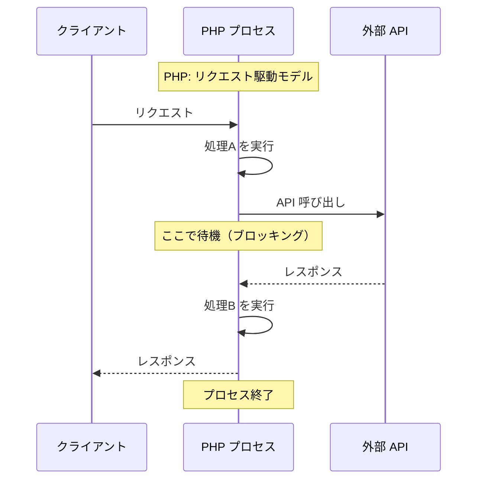
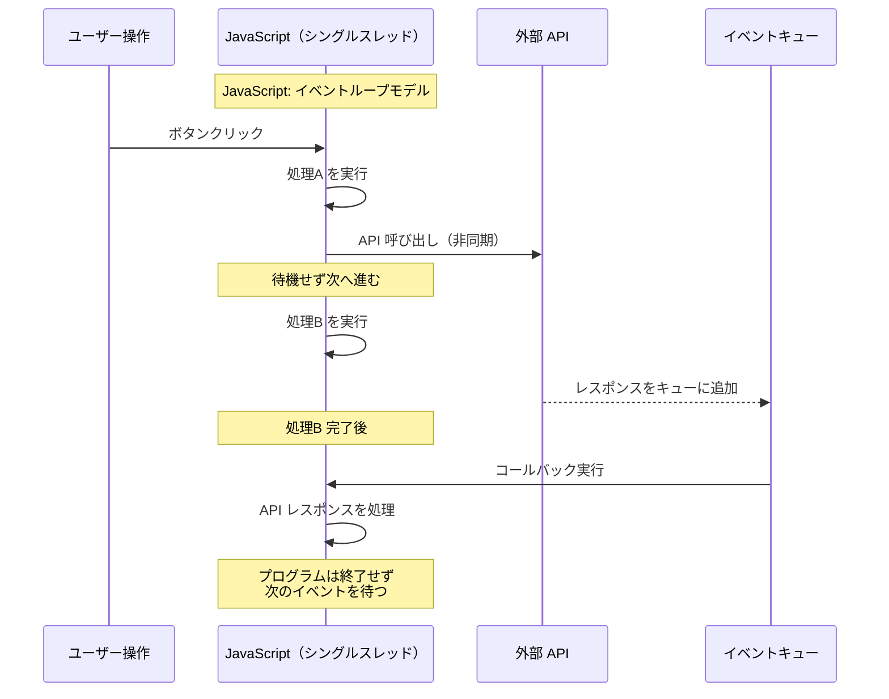

# 2-1-2 JavaScript と PHP の根本的な違い

## 🎯 このセクションで学ぶこと

- JavaScript と PHP の実行環境の違い（サーバーのみ vs ブラウザ + Node.js）を理解する
- JavaScript のシングルスレッド・イベントループモデルと PHP のリクエスト単位の実行モデルの違いを理解する
- 両言語の型システムの違いと、JavaScript 特有の型変換の罠を理解する
- JavaScript のバージョンの歴史（ES5 から ES2015 へ）と「モダン JavaScript」の意味を知る

PHP の知識をベースに、JavaScript が「なぜそう動くのか」を実行環境・実行モデル・型システムの3つの観点から対比していきます。

---

## 導入: 同じ「プログラミング言語」でも動き方が違う

PHP と JavaScript はどちらも Web 開発で広く使われる言語ですが、その設計思想と動作の仕組みは根本的に異なります。PHP で身につけた感覚をそのまま JavaScript に持ち込むと、「なぜこう動くのか」「なぜこう書かなければいけないのか」が理解できず、混乱してしまいます。

たとえば、PHP では「コードは上から順に実行される」のが当たり前です。しかし JavaScript では、あるコードが「後回し」にされて、先に書いたコードより後に書いたコードが先に実行されることがあります。PHP ではリクエストが来るたびにプログラムが起動して終了しますが、JavaScript はブラウザの中で常に動き続けています。

このセクションでは、こうした違いの根本にある仕組みを理解します。ここを押さえることで、後続のセクションで学ぶ JavaScript の構文や非同期処理の「なぜ」が腑に落ちるようになります。

### 🧠 先輩エンジニアはこう考える

> LMS の開発を始めたとき、PHP の感覚で JavaScript を読もうとして何度もつまずきました。特に混乱したのは「非同期処理」です。PHP では `file_get_contents()` で外部 API を呼べば結果が返ってくるまで待ってくれますが、JavaScript では待ってくれない。`fetch()` の結果を変数に入れたつもりが `Promise` という謎のオブジェクトが入っていて、「なぜ値が取れないんだ？」と困惑しました。
>
> 振り返ると、最初にこの2つの言語の「動き方の違い」を理解しておけば、もっとスムーズだったはずです。構文の違いは些細なもので、本当に大事なのは「実行環境」「実行モデル」「型の扱い」という根本の違いです。


---

## 実行環境の違い: サーバーのみ vs ブラウザ + Node.js

### PHP の実行環境

PHP は**サーバーサイド専用** の言語です。Web サーバー（Apache や Nginx）が PHP のリクエストを受け取ると、PHP インタプリタがサーバー上でコードを実行し、結果（HTML や JSON）をブラウザに返します。PHP のコードがブラウザ上で直接動くことはありません。

```php
// サーバー上で実行される
$users = User::all();         // データベースにアクセス
return view('users', compact('users')); // HTML を生成して返す
```

LMS の Laravel バックエンドも同じです。すべての PHP コードはサーバー（Docker コンテナ内の `app` サービス）で実行されます。

### JavaScript の実行環境

JavaScript は**2つの実行環境** を持つ、珍しい言語です。

| 実行環境 | 動作場所 | 主な用途 | 実行エンジン |
|---|---|---|---|
| **ブラウザ** | ユーザーの端末 | UI の操作、DOM 操作、ユーザーイベント処理 | V8（Chrome）、SpiderMonkey（Firefox）等 |
| **Node.js** | サーバー | API サーバー、ビルドツール、スクリプト実行 | V8 |

```javascript
// ブラウザで実行される JavaScript
document.getElementById('button').addEventListener('click', () => {
  alert('ボタンがクリックされました');
});
```

```javascript
// Node.js（サーバー）で実行される JavaScript
const fs = require('fs');
const data = fs.readFileSync('config.json', 'utf-8');
console.log(data);
```

同じ JavaScript でも、ブラウザでは `document` や `window` といったブラウザ固有の API が使え、Node.js では `fs`（ファイル操作）や `process`（プロセス情報）といったサーバー固有の API が使えます。逆に、ブラウザで `fs` は使えませんし、Node.js で `document` は使えません。

🔑 **キーポイント**: LMS のフロントエンド（Next.js 14）はこの両方の環境を活用しています。React コンポーネントはブラウザで動作し、Next.js のサーバーサイドレンダリングは Node.js で動作します。1つのフロントエンドアプリケーションの中で、コードが実行される場所が異なるのです。この点は Part 2 の後半で詳しく学びます。

### なぜ JavaScript は2つの環境で動くのか

JavaScript はもともと 1995 年にブラウザ専用の言語として誕生しました。その後 2009 年に **Node.js** が登場し、ブラウザの外（サーバーサイド）でも JavaScript を実行できるようになりました。Node.js は Chrome の JavaScript エンジン（V8）を取り出してサーバー上で動作させたものです。

これにより、フロントエンドもバックエンドも同じ JavaScript で書けるようになりました。LMS では、フロントエンドは Next.js（JavaScript/TypeScript）、バックエンドは Laravel（PHP）という構成ですが、世の中にはフロントエンドもバックエンドも JavaScript で統一しているプロジェクトも多くあります。

---

## 実行モデルの違い: リクエスト単位 vs イベントループ

PHP と JavaScript の最も重要な違いは、**プログラムの実行モデル** です。

### PHP のリクエスト駆動モデル

PHP は**リクエスト単位** で動作します。HTTP リクエストが来るたびにプロセスが起動し、処理が終わるとプロセスも終了します。各リクエストは独立しており、前のリクエストの状態を引き継ぎません。

```php
// リクエストごとに実行される
$count = 0;        // 毎回 0 からスタート
$count++;          // 1 になる
echo $count;       // 1 を出力
// リクエスト終了 → $count は消える
// 次のリクエストでも $count は 0 からスタート
```

処理は**上から下へ同期的** に実行されます。データベースへの問い合わせ中は、その結果が返ってくるまでプログラムは待機します。

```php
$user = User::find(1);           // DB 問い合わせ（完了まで待つ）
$posts = $user->posts()->get();  // さらに DB 問い合わせ（完了まで待つ）
echo $user->name;                // 上の2行が終わってから実行される
```

### JavaScript のイベントループモデル

JavaScript は**シングルスレッド** で動作し、**イベントループ** という仕組みで処理を管理します。プログラムは起動したら終了せず、イベント（クリック、タイマー、データ受信など）を待ち続けます。

🔑 **シングルスレッド** とは、一度に1つの処理しか実行できないということです。PHP がリクエストごとに新しいプロセス（ワーカー）を立ち上げて並列に処理するのに対し、JavaScript は1本の処理の流れ（スレッド）ですべてを処理します。

では、シングルスレッドなのにどうやって「ボタンのクリックを待ちながら」「API のレスポンスも待つ」のでしょうか。その答えがイベントループです。

```javascript
console.log('1: 最初');

setTimeout(() => {
  console.log('2: タイマー完了');
}, 0);  // 0ミリ秒後に実行を「予約」

console.log('3: 最後');
```

このコードの出力は次のようになります。

```
1: 最初
3: 最後
2: タイマー完了
```

`setTimeout` を 0 ミリ秒に設定しても、「2」は「3」の後に出力されます。これは `setTimeout` のコールバック関数がイベントループのキュー（待ち行列）に入れられ、現在の処理がすべて完了した後に実行されるためです。

### Mermaid 図で見る実行モデルの対比

以下の図は、外部 API を呼び出す処理を PHP と JavaScript でそれぞれどう実行するかを示しています。





PHP では API の応答を待っている間、プロセスは何もできません（**ブロッキング**）。一方 JavaScript では、API の応答を待っている間も別の処理（処理B）を実行できます（**ノンブロッキング**）。API のレスポンスが届いたら、イベントキューを通じてコールバック関数が実行されます。

💡 **補足**: 非同期処理の具体的な書き方（Promise、async/await）はセクション 2-1-4 で詳しく学びます。今は「JavaScript は処理を待たずに先に進む」という動作の仕組みだけ把握すれば十分です。

---

## 型システムの違い

PHP も JavaScript も動的型付け言語ですが、型の扱い方にはいくつかの重要な違いがあります。

### PHP の型システム（PHP 8+）

PHP 7 以降、特に PHP 8 以降では**型宣言** が大幅に強化されました。LMS のバックエンド（PHP 8.1）では、引数や戻り値に型を明示するのが標準的な書き方です。

```php
// PHP: 型宣言あり（PHP 8.1）
function calculateTotal(int $price, int $quantity): int
{
    return $price * $quantity;
}

calculateTotal(100, 3);     // 300
calculateTotal('100', 3);   // strict_types=1 の場合は TypeError
```

`declare(strict_types=1)` を宣言すると、型が一致しない引数はエラーになります。型宣言は任意ですが、宣言することでバグの早期発見につながります。

### JavaScript の型システム

JavaScript は**動的型付け** の言語で、変数に型を宣言する構文がありません。同じ変数に異なる型の値を代入でき、エラーにはなりません。

```javascript
// JavaScript: 型宣言なし
let value = 42;          // number 型
value = 'hello';         // string 型に変更（エラーにならない）
value = true;            // boolean 型に変更（エラーにならない）
```

型を確認するには `typeof` 演算子を使います。

```javascript
typeof 42;          // 'number'
typeof 'hello';     // 'string'
typeof true;        // 'boolean'
typeof undefined;   // 'undefined'
typeof null;        // 'object'  ← 注意！歴史的な理由によるバグ
typeof [1, 2, 3];   // 'object'  ← 配列も 'object'
```

⚠️ **注意**: `typeof null` が `'object'` を返すのは JavaScript の有名なバグです。1995 年の初期実装のミスがそのまま残っています。また、配列も `typeof` では `'object'` と表示されるため、配列かどうかを判定するには `Array.isArray()` を使います。

### 暗黙の型変換の罠

JavaScript で最も注意が必要なのは**暗黙の型変換**（type coercion）です。異なる型の値を演算すると、JavaScript は自動的に型を変換します。この挙動は PHP よりもはるかに予測が難しいものです。

```javascript
// JavaScript の暗黙の型変換
'5' + 3;      // '53'（string）  ← + は文字列結合が優先
'5' - 3;      // 2（number）     ← - は数値演算のみ
'5' * 3;      // 15（number）
true + 1;     // 2               ← true は 1 に変換
null + 1;     // 1               ← null は 0 に変換
undefined + 1; // NaN            ← undefined は NaN に変換
```

PHP でも暗黙の型変換はありますが、JavaScript ほど予想外の結果にはなりにくいです。

```php
// PHP の型変換（比較的予測しやすい）
'5' + 3;      // 8（int）  ← PHP の + は常に数値演算
'5' . 3;      // '53'      ← 文字列結合は . 演算子
```

PHP では `+` は数値演算、`.` は文字列結合と、演算子が分かれています。JavaScript では `+` が数値演算と文字列結合の両方を担うため、混乱が生じやすいのです。

### 等値比較の違い

JavaScript には等値比較の演算子が2種類あります。

```javascript
// == （等価演算子）: 型変換してから比較
'5' == 5;      // true
0 == false;    // true
null == undefined;  // true

// === （厳密等価演算子）: 型変換せずに比較
'5' === 5;     // false
0 === false;   // false
null === undefined;  // false
```

PHP にも `==` と `===` がありますが、JavaScript の `==` は PHP 以上に予想外の結果を返すことがあります。

🔑 **キーポイント**: JavaScript では常に `===`（厳密等価演算子）を使うのがベストプラクティスです。LMS のフロントエンドコードでも、ESLint のルールで `==` の使用は警告されるように設定されています。

---

## JavaScript のバージョンと進化

### ECMAScript とは

JavaScript の仕様は **ECMAScript**（エクマスクリプト）という標準規格で定義されています。JavaScript はこの ECMAScript の実装の1つです。バージョンを指す場合は「ES○○」と略されます。

| バージョン | リリース年 | 通称 | 主な追加機能 |
|---|---|---|---|
| ES5 | 2009 | 旧 JavaScript | `forEach`, `JSON.parse`, strict mode |
| ES2015 | 2015 | ES6 | `let`/`const`, アロー関数, クラス, Promise, テンプレートリテラル, 分割代入, モジュール |
| ES2016 以降 | 毎年 | ES7, ES8... | `async`/`await`（ES2017）, Optional chaining（ES2020）等 |

### ES2015（ES6）が転換点

ES2015 は JavaScript の歴史における最大の転換点です。このバージョンで追加された機能が非常に多く、それ以前の JavaScript とは別の言語と言えるほど書き方が変わりました。

```javascript
// ES5（2009年以前のスタイル）
var self = this;
var numbers = [1, 2, 3];
var doubled = numbers.map(function(n) {
  return n * 2;
});

// ES2015+（モダン JavaScript）
const numbers = [1, 2, 3];
const doubled = numbers.map((n) => n * 2);
```

「**モダン JavaScript**」という言葉は、一般的に ES2015 以降の構文・機能を使った JavaScript のことを指します。`let`/`const` による変数宣言、アロー関数、クラス構文、Promise による非同期処理など、現在の JavaScript 開発で当たり前に使われる機能はすべて ES2015 以降に導入されたものです。

### なぜバージョンを知る必要があるのか

ブラウザの JavaScript エンジンは、そのブラウザがリリースされた時点の ECMAScript 仕様までしかサポートしていません。古いブラウザでは新しい構文が動かない可能性があります。

この問題を解決するのが **Babel** や **SWC** といったトランスパイラ（変換ツール）です。新しい構文で書いたコードを、古いブラウザでも動く構文に変換してくれます。LMS のフロントエンド（Next.js 14）では SWC が組み込まれており、開発者はモダンな構文で書きつつ、ビルド時に自動的に変換されます。

💡 **補足**: PHP にも同様のバージョンの歴史があります（PHP 5 → PHP 7 → PHP 8 で大きく進化しました）。ただし PHP はサーバーで動作するため、自分でバージョンを管理できます。JavaScript はユーザーのブラウザで動作するため、すべてのユーザーの環境に対応する必要があり、トランスパイラが不可欠なのです。

---

## ✨ まとめ

- **実行環境**: PHP はサーバーのみで動作するが、JavaScript はブラウザと Node.js の2つの環境で動作する。LMS では React がブラウザで、Next.js のサーバー処理が Node.js で動く
- **実行モデル**: PHP はリクエスト単位でプロセスが起動・終了し、処理を同期的に（上から順に）実行する。JavaScript はシングルスレッドで常駐し、イベントループによってノンブロッキングに処理する
- **型システム**: PHP（8+）は型宣言で安全性を高められるが、JavaScript には型宣言の構文がない。暗黙の型変換は JavaScript の方が予測しにくく、`===` を常用するのがベストプラクティス
- **バージョン**: ES2015（ES6）が JavaScript の転換点。以降の構文が「モダン JavaScript」と呼ばれ、LMS のフロントエンドコードもこのスタイルで書かれている

---

次のセクションでは、モダン JavaScript の基本構文として、let/const/var の違い、アロー関数、クロージャ、スコープチェーンについて学びます。
