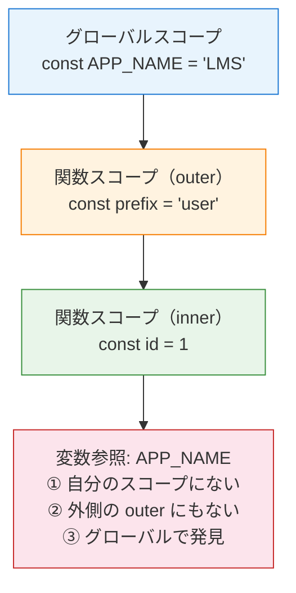

# 2-1-3 変数・関数・スコープ

## 🎯 このセクションで学ぶこと

- `let` / `const` / `var` の違いを PHP の変数宣言と対比して理解する
- アロー関数の構文と、PHP の無名関数との違いを把握する
- スコープとスコープチェーンによる変数解決の仕組みを理解する
- クロージャが JavaScript で自然に発生する理由を、PHP の `use` キーワードとの対比で理解する
- オブジェクトリテラルと配列リテラルの記法を、PHP の連想配列と対比して理解する

PHP では `$` を付ければどこでも変数を使えましたが、JavaScript には変数宣言のキーワードが 3 種類あり、それぞれスコープの扱いが異なります。このセクションでは、変数宣言から関数、スコープ、クロージャ、そしてオブジェクト・配列リテラルまでを PHP との対比で体系的に整理します。

---

## 導入: `$` がない世界で変数はどう管理されるか

PHP では変数に `$` プレフィックスを付けるだけで宣言でき、同じ `$` で再代入も自由にできます。関数の中で宣言すればローカル変数、関数の外で宣言すればグローバル変数という、シンプルなルールです。

```php
// PHP
$name = "太郎";
$name = "花子"; // 再代入も自由
```

一方、JavaScript では変数を宣言するキーワードが `let`、`const`、`var` の 3 種類あります。「どれを使えばいいのか」「何が違うのか」がわからないと、LMS のフロントエンドコードを読んだときに最初の行から躓いてしまいます。

さらに、JavaScript では関数の書き方も複数あり、スコープのルールも PHP と大きく異なります。このセクションでは、PHP の知識をベースにしながら JavaScript の変数・関数・スコープの仕組みを整理していきます。

### 🧠 先輩エンジニアはこう考える

> LMS のフロントエンドコードを開くと、ほぼすべての変数が `const` で宣言されています。PHP から来ると「定数ばかりで変数がない？」と驚きますが、これは JavaScript（特に React 開発）の標準的なスタイルです。`const` が推奨される理由を理解しておくと、LMS のコードが一気に読みやすくなります。また、アロー関数 `() => {}` は LMS のいたるところに登場するので、この構文に慣れることが最優先です。

---

## 変数宣言: let / const / var

### PHP との対比で理解する 3 つのキーワード

PHP では `$` を付けるだけで変数を宣言できますが、JavaScript では **宣言キーワード** が必要です。

```php
// PHP
$count = 0;
$count = 1; // 再代入OK
define('TAX_RATE', 0.1); // 定数は define() か const
```

```javascript
// JavaScript
let count = 0;
count = 1; // 再代入OK

const TAX_RATE = 0.1;
// TAX_RATE = 0.2; // エラー: 再代入不可

var oldStyle = "古い書き方"; // 現在は非推奨
```

3 つのキーワードの違いを表にまとめます。

| キーワード | 再代入 | 再宣言 | スコープ | 用途 |
|---|---|---|---|---|
| `const` | 不可 | 不可 | ブロックスコープ | 再代入しない値（推奨） |
| `let` | 可能 | 不可 | ブロックスコープ | ループカウンタ等、再代入が必要な場合 |
| `var` | 可能 | 可能 | 関数スコープ | レガシーコード（新規では使わない） |

### なぜ `const` が推奨されるか

LMS のフロントエンドコードでは、変数宣言のほとんどが `const` です。これは「定数しか使わない」という意味ではなく、「一度バインドしたら別の値を代入しない」というコーディングスタイルです。

```javascript
// const でオブジェクトを宣言しても、中身は変更できる
const user = { name: "太郎", age: 20 };
user.age = 21; // OK: プロパティの変更は許可される
// user = { name: "花子" }; // エラー: 変数自体への再代入は不可
```

🔑 `const` は **変数のバインディング（結びつき）** を固定するのであって、値そのものを不変にするわけではありません。オブジェクトや配列の中身は `const` でも変更できます。

PHP でも Laravel のコードでは `$result = ...` のように一度代入したら再代入しないスタイルが多いですが、言語レベルでは制約がありません。JavaScript の `const` は、この「再代入しない」意図を言語レベルで強制できる点が利点です。

💡 **実務での使い分け**: まず `const` で宣言し、再代入が必要になったときだけ `let` に変更する。`var` は使わない。これが現在の JavaScript 開発における標準的な方針です。

### `var` のスコープ問題

`var` が非推奨とされる理由は、スコープの挙動が直感に反するためです。

```javascript
// var は関数スコープなので、ブロックの外からもアクセスできてしまう
if (true) {
  var message = "Hello";
}
console.log(message); // "Hello"（ブロックの外なのにアクセスできる）

// let はブロックスコープなので、ブロックの外からはアクセスできない
if (true) {
  let greeting = "Hi";
}
// console.log(greeting); // エラー: greeting is not defined
```

PHP では `if` ブロック内で宣言した変数もブロック外からアクセスできるため、`var` の挙動は PHP に近いとも言えます。しかし JavaScript では `let` / `const` のブロックスコープが標準となっており、`var` の関数スコープは予期しないバグの原因になります。スコープの詳細は後述の「スコープとスコープチェーン」で改めて解説します。

---

## 関数の 3 つの書き方

JavaScript には関数を定義する方法が主に 3 つあります。PHP の関数定義と対比しながら見ていきましょう。

### ① function 宣言（関数宣言）

PHP の `function` キーワードによる関数定義と同じ形式です。

```php
// PHP
function greet($name) {
    return "Hello, " . $name;
}
```

```javascript
// JavaScript
function greet(name) {
  return "Hello, " + name;
}
```

PHP と異なるのは、引数に型宣言がない点です（型を付けたい場合は TypeScript を使います。これはセクション 2-2-1 で学びます）。

### ② 関数式（Function Expression）

関数を変数に代入する書き方です。PHP の無名関数（クロージャ）に近い形式です。

```php
// PHP
$greet = function ($name) {
    return "Hello, " . $name;
};
```

```javascript
// JavaScript
const greet = function (name) {
  return "Hello, " + name;
};
```

PHP の無名関数とほぼ同じ構文ですが、JavaScript では `function` の前にアクセス修飾子（`public` 等）は不要です。

### ③ アロー関数（Arrow Function）

PHP 7.4 で導入されたアロー関数 `fn()` に似ていますが、JavaScript のアロー関数はより柔軟で、React 開発では最も頻繁に使われる形式です。

```php
// PHP（アロー関数）
$double = fn($n) => $n * 2;
```

```javascript
// JavaScript（アロー関数）
const double = (n) => n * 2;
```

アロー関数にはいくつかの省略記法があります。

```javascript
// 基本形
const add = (a, b) => {
  return a + b;
};

// 本体が1行の場合、{} と return を省略できる
const add = (a, b) => a + b;

// 引数が1つの場合、() も省略できる
const double = n => n * 2;

// オブジェクトを返す場合は () で囲む
const createUser = (name) => ({ name: name, active: true });
```

⚠️ **注意**: オブジェクトリテラルを返すアロー関数は `() => ({})` のように丸括弧で囲む必要があります。`() => {}` と書くと、`{}` が関数のブロックと解釈されてしまうためです。LMS のコードでもこのパターンは頻出します。例えば、配列の各要素をオブジェクトに変換する場面で `items.map((item) => ({ key: item.id, label: item.name }))` のような書き方をします。

### アロー関数が React で多用される理由

アロー関数が React（および LMS のフロントエンド）で好まれる理由は主に 2 つあります。

**1. 簡潔さ**: コールバック関数を多用する React では、短く書けるアロー関数が可読性を高めます。

```javascript
// function 式で書いた場合
const items = data.map(function (item) {
  return item.name;
});

// アロー関数で書いた場合
const items = data.map((item) => item.name);
```

**2. `this` の挙動**: アロー関数は自身の `this` を持たず、外側のスコープの `this` をそのまま使います。これは React のクラスコンポーネント時代に重要でした。現在の React 18 では関数コンポーネントが主流のため `this` を意識する場面は少ないですが、アロー関数が標準的な書き方として定着しています。

📝 `this` は JavaScript 特有のキーワードで、PHP の `$this` とは挙動が大きく異なります。PHP の `$this` は常にそのクラスのインスタンスを指しますが、JavaScript の `this` は **呼び出し方** によって指す対象が変わります。React の関数コンポーネント開発では `this` を使う場面がほとんどないため、今は「アロー関数を使えば `this` の問題を回避できる」と覚えておけば十分です。

---

## スコープとスコープチェーン

### ブロックスコープと関数スコープ

**スコープ** とは、変数がアクセスできる範囲のことです。PHP では関数の内側と外側の 2 つのスコープが主な境界ですが、JavaScript には **ブロックスコープ** と **関数スコープ** の 2 種類があります。

```javascript
// ブロックスコープ（let / const）
function example() {
  const x = 1; // 関数スコープ内

  if (true) {
    const y = 2; // if ブロックのスコープ内
    console.log(x); // 1（外側のスコープにアクセスできる）
  }

  // console.log(y); // エラー: y はブロック外からアクセスできない
}
```

PHP との大きな違いを整理します。

```php
// PHP: 関数外の変数には関数内からアクセスできない
$count = 10;

function showCount() {
    // echo $count; // Notice: Undefined variable
    // global $count; が必要
}
```

```javascript
// JavaScript: 外側のスコープの変数には内側から自由にアクセスできる
const count = 10;

function showCount() {
  console.log(count); // 10（外側のスコープに自動的にアクセスできる）
}
```

🔑 PHP では関数内からグローバル変数にアクセスするには `global` キーワードが必要ですが、JavaScript では **外側のスコープの変数には自動的にアクセスできます**。この仕組みが「スコープチェーン」です。

### スコープチェーンによる変数解決

JavaScript エンジンが変数を参照するとき、以下の順序でスコープを辿って変数を探します。これを **スコープチェーン** と呼びます。



```javascript
const APP_NAME = "LMS"; // グローバルスコープ

function outer() {
  const prefix = "user"; // outer のスコープ

  function inner() {
    const id = 1; // inner のスコープ
    console.log(`${APP_NAME}-${prefix}-${id}`); // "LMS-user-1"
    // inner → outer → グローバル の順に変数を探す
  }

  inner();
}
```

スコープチェーンのルールはシンプルです。

1. まず自分のスコープ内を探す
2. 見つからなければ、1 つ外側のスコープを探す
3. グローバルスコープまで辿っても見つからなければエラーになる

PHP では関数内から外部の変数にアクセスするために `global` や `use` を明示的に書く必要がありますが、JavaScript ではこのスコープチェーンにより自動的に外側の変数にアクセスできます。

---

## クロージャ

### PHP の `use` キーワードとの対比

**クロージャ** とは、関数が自分の外側のスコープにある変数を「覚えている」仕組みのことです。PHP でも無名関数でクロージャを使いますが、`use` キーワードで明示的に変数を渡す必要があります。

```php
// PHP: use で明示的に外部変数を渡す
function createCounter() {
    $count = 0;
    return function () use (&$count) {
        $count++;
        return $count;
    };
}

$counter = createCounter();
echo $counter(); // 1
echo $counter(); // 2
```

JavaScript では `use` のような仕組みは不要です。スコープチェーンにより、関数は外側のスコープの変数に自動的にアクセスできるため、**クロージャは特別な構文なしで自然に発生します**。

```javascript
// JavaScript: use 不要。外側の変数を自然に参照できる
function createCounter() {
  let count = 0;
  return () => {
    count++;
    return count;
  };
}

const counter = createCounter();
console.log(counter()); // 1
console.log(counter()); // 2
```

### なぜ JavaScript ではクロージャが自然に発生するか

PHP と JavaScript のクロージャの違いを整理します。

| 観点 | PHP | JavaScript |
|---|---|---|
| 外部変数のアクセス | `use` で明示的に渡す | スコープチェーンで自動的にアクセス |
| 参照渡し | `use (&$var)` で明示 | 常に参照（プリミティブ以外） |
| 発生の仕方 | 意図的に `use` を書く | 関数をネストするだけで発生 |

JavaScript では関数がネストされるだけでクロージャが生まれるため、PHP と比べて圧倒的に多くの場面でクロージャが使われます。特に React では、コンポーネント内で定義するイベントハンドラやコールバック関数がクロージャとして動作するのが日常的です。

### React での活用例（概念レベル）

React のコンポーネントでは、ステート（状態）を保持する変数とそれを操作する関数が同じスコープに存在します。内部で定義するイベントハンドラは、クロージャとしてそのステートにアクセスします。

```javascript
// React コンポーネントの概念例（詳細は Part 2 の React セクションで学びます）
function Counter() {
  const [count, setCount] = useState(0);

  // handleClick はクロージャ: 外側の count と setCount を参照している
  const handleClick = () => {
    setCount(count + 1);
  };

  return <button onClick={handleClick}>{count}</button>;
}
```

この例では `handleClick` 関数が外側のスコープにある `count` と `setCount` を参照しています。PHP であれば `use ($count, $setCount)` と書くところですが、JavaScript ではスコープチェーンにより自動的にアクセスできます。React のコンポーネント設計はこのクロージャの仕組みに大きく依存しています。今は「React ではクロージャが当たり前に使われている」と概要だけ把握すれば十分です。

---

## オブジェクトと配列のリテラル

### PHP の連想配列との対比

PHP では連想配列がデータ構造の中心ですが、JavaScript では **オブジェクト** と **配列** が明確に分かれています。

```php
// PHP: 連想配列
$user = [
    'name' => '太郎',
    'age' => 20,
    'active' => true,
];

// PHP: 通常の配列
$colors = ['red', 'green', 'blue'];
```

```javascript
// JavaScript: オブジェクト（{} で定義、キーと値のペア）
const user = {
  name: "太郎",
  age: 20,
  active: true,
};

// JavaScript: 配列（[] で定義、順序付きリスト）
const colors = ["red", "green", "blue"];
```

主な違いを表にまとめます。

| 観点 | PHP | JavaScript |
|---|---|---|
| 連想データ | `['key' => 'value']` | `{ key: "value" }` |
| 区切り文字 | `=>` | `:` |
| キーの引用符 | 必須（`'key'`） | 省略可（`key`） |
| 配列と連想配列 | 同じ `array` 型 | 配列（`Array`）とオブジェクト（`Object`）は別の型 |

### JavaScript のオブジェクト記法

JavaScript のオブジェクトには、PHP の連想配列にはない便利な記法がいくつかあります。

**プロパティの短縮記法**: 変数名とキー名が同じ場合、値の記述を省略できます。

```javascript
const name = "太郎";
const age = 20;

// 通常の書き方
const user = { name: name, age: age };

// 短縮記法（変数名 = キー名の場合）
const user = { name, age };
// どちらも { name: "太郎", age: 20 } になる
```

PHP ではこのような省略はできないため、初めて見ると戸惑うかもしれません。LMS のコードでも短縮記法は頻繁に使われています。

**メソッドの短縮記法**: オブジェクト内に関数を定義する場合も省略できます。

```javascript
// 通常の書き方
const calculator = {
  add: function (a, b) {
    return a + b;
  },
};

// 短縮記法
const calculator = {
  add(a, b) {
    return a + b;
  },
};
```

**プロパティへのアクセス**: PHP の連想配列は `$user['name']` のようにブラケット記法でアクセスしますが、JavaScript のオブジェクトは **ドット記法** も使えます。

```php
// PHP
echo $user['name']; // ブラケット記法のみ
```

```javascript
// JavaScript
console.log(user.name); // ドット記法（推奨）
console.log(user["name"]); // ブラケット記法（動的なキーの場合に使用）
```

### 分割代入（Destructuring）

分割代入については、セクション 2-1-5 で詳しく学びます。ここでは基本的な構文だけ押さえてください。

JavaScript には **分割代入** という、オブジェクトや配列から値を取り出す構文があります。PHP にはない構文のため、初めて見ると違和感があるかもしれませんが、LMS のコードでは非常に多く使われています。

```javascript
// オブジェクトの分割代入
const user = { name: "太郎", age: 20, active: true };
const { name, age } = user;
// name === "太郎", age === 20

// 配列の分割代入
const colors = ["red", "green", "blue"];
const [first, second] = colors;
// first === "red", second === "green"
```

PHP でも `list()` 関数や `[]` 構文で配列の分割代入に近いことができますが、JavaScript の分割代入はオブジェクトにも使え、より柔軟です。

```php
// PHP: list() による配列の分割代入
[$first, $second] = ['red', 'green', 'blue'];
// 連想配列に対する分割代入はPHP 7.1以降で対応
['name' => $name, 'age' => $age] = ['name' => '太郎', 'age' => 20];
```

LMS のフロントエンドでは、React のフック（Hooks）を使う際に配列の分割代入が定番のパターンとして登場します。例えば `const [isOpen, setIsOpen] = useState(defaultOpen)` のように、配列の 1 番目と 2 番目の要素にそれぞれ名前を付けて取り出します。

💡 **スプレッド構文** (`...`) という、オブジェクトや配列を展開する構文もあります。これはセクション 2-1-5 で配列操作とあわせて詳しく学びます。

---

## ✨ まとめ

- JavaScript の変数宣言は `const`（再代入不可）、`let`（再代入可）、`var`（レガシー）の 3 種類。LMS のコードでは `const` がほぼ全てを占め、`let` はループや再代入が必要な場面のみで使われる
- 関数は function 宣言、関数式、アロー関数の 3 つの書き方がある。React 開発ではアロー関数 `() => {}` が最も多用される
- JavaScript のスコープは `let` / `const` のブロックスコープが標準。PHP と異なり、外側のスコープの変数にはスコープチェーンにより自動的にアクセスできる
- クロージャは PHP では `use` キーワードで明示的に変数を渡すが、JavaScript ではスコープチェーンにより自然に発生する。React のコンポーネント設計はクロージャに大きく依存している
- JavaScript のオブジェクトリテラル `{}` は PHP の連想配列 `[]` に相当するが、ドット記法でのアクセス、プロパティの短縮記法、分割代入など JavaScript 独自の機能が多くある

---

次のセクションでは、JavaScript の非同期処理を扱います。コールバックから Promise、そして async/await への進化の流れを追いながら、イベントループの仕組みを理解し、PHP の同期実行モデルとの対比で非同期処理がなぜ必要なのかを学びます。
