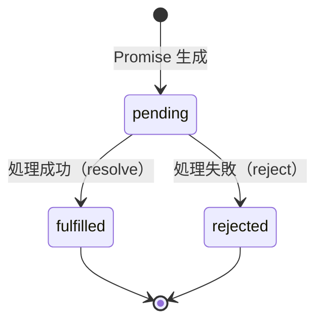
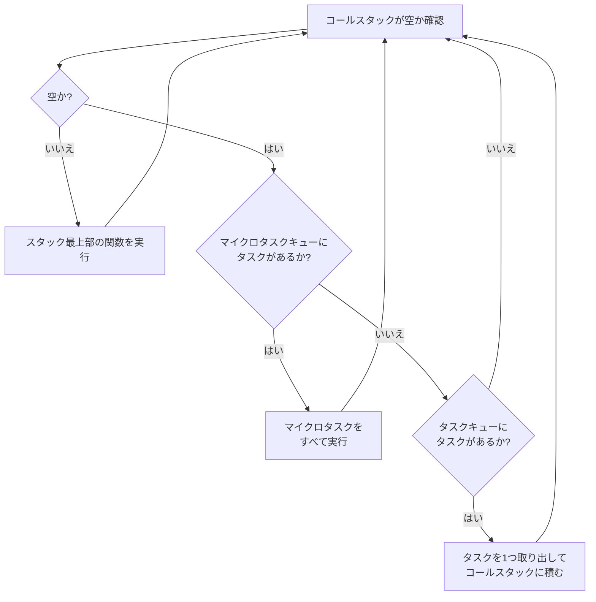

# 2-1-4 非同期処理

## 🎯 このセクションで学ぶこと

- PHP の同期実行モデルと JavaScript の非同期実行モデルの根本的な違いを理解する
- コールバック、Promise、async/await という3つの非同期パターンの進化を理解する
- イベントループの仕組み（コールスタック、タスクキュー、マイクロタスクキュー）を理解する
- 非同期処理のエラーハンドリングを PHP の try/catch と対比して理解する

このセクションでは、まず PHP との対比で「なぜ非同期が必要なのか」を理解し、その後コールバックから async/await までの進化を段階的に追い、最後にイベントループの内部動作を可視化します。

---

## 導入: PHP にはない「待つ」という概念

PHP で API からデータを取得するコードを思い出してください。

```php
// PHP: 上から順に実行される
$response = Http::get('https://api.example.com/users');  // ここで完了まで待つ
$users = $response->json();                               // 完了後に次の行へ
echo count($users) . '件のユーザーを取得しました';
```

このコードは上から順に1行ずつ実行され、`Http::get()` が完了するまで次の行には進みません。PHP ではこれが当たり前の動作です。API レスポンスが返るまで3秒かかるなら、3秒間プログラムは何もせずに待ちます。

JavaScript で同じことをしようとすると、事情が大きく変わります。

```javascript
// JavaScript: これは期待どおりに動かない
const response = fetch('https://api.example.com/users')  // 待たずに次の行へ進む
const users = response.json()  // response はまだ届いていない！
console.log(users.length + '件のユーザーを取得しました')  // エラー
```

JavaScript の `fetch()` は、リクエストを送ったらすぐに次の行へ進みます。レスポンスが届くのを待ちません。そのため、`response` にはデータではなく Promise という「まだ結果が届いていない」ことを示すオブジェクトが入ります。

この「待たずに先へ進む」動作こそが **非同期処理** です。PHP 経験者にとって最も違和感がある概念の1つですが、JavaScript がこのモデルを採用しているのには明確な理由があります。

### 🧠 先輩エンジニアはこう考える

> LMS の開発を始めたとき、最初に戸惑ったのがこの非同期処理でした。PHP なら `Http::get()` と書けばデータが返ってくるのに、JavaScript では `await` を付け忘れるとデータの代わりに Promise オブジェクトが返ってきて、画面に `[object Promise]` と表示される。最初はバグかと思いましたが、これは JavaScript の根本的な設計思想なんです。一度理解してしまえば、LMS のフロントエンドコードで頻出する `async/await` パターンがすんなり読めるようになります。

---

## なぜ非同期が必要か

### ブラウザの UI ブロッキング問題

JavaScript がブラウザで非同期モデルを採用している最大の理由は、**UI をブロックしないため** です。

ブラウザの JavaScript はシングルスレッド（前のセクションで学んだとおり、1つの処理しか同時に実行できない）で動作します。もし PHP のように「API レスポンスが届くまで何もせず待つ」同期モデルだったらどうなるでしょうか。

- ボタンをクリックしても反応しない
- スクロールしても画面が動かない
- 入力フォームにキーを打っても文字が表示されない

API レスポンスを待っている3秒間、ブラウザ全体が固まってしまいます。ユーザーからすると「アプリが壊れた」ように見えます。

これを防ぐために、JavaScript は「時間のかかる処理はバックグラウンドに任せて、メインの処理は先に進む」という非同期モデルを採用しています。

### サーバーサイドでの I/O 待ち

非同期が活きるのはブラウザだけではありません。Node.js（サーバーサイド JavaScript）でも同じです。

PHP の場合、データベースへの問い合わせ中はそのリクエストの処理が止まりますが、Apache/Nginx が複数のプロセスやスレッドを立ち上げることで、同時に複数のリクエストを処理できます。つまり、PHP は「1リクエスト1プロセス」で並行処理を実現しています。

Node.js は1つのプロセスで多くのリクエストを処理します。データベースへの問い合わせを待っている間に、別のリクエストの処理を進められるのです。このアプローチの違いが、JavaScript に非同期モデルが組み込まれている背景です。

### PHP（同期モデル）と JavaScript（非同期モデル）の対比

| 観点 | PHP | JavaScript |
|---|---|---|
| 実行モデル | 同期（上から順に実行） | 非同期（待たずに先へ進む） |
| I/O 待ちの間 | プログラムは停止する | 他の処理を実行できる |
| 並行処理の実現方法 | 複数プロセス/スレッド | イベントループ（後述） |
| コードの見た目 | 上から下に素直に読める | コールバックや Promise で構造が変わる |
| エラーの発生タイミング | その場で例外が発生 | 後から（非同期に）エラーが発生 |

---

## コールバック関数

JavaScript で最初に登場した非同期パターンが **コールバック関数** です。「処理が完了したら、この関数を呼んでください」という仕組みです。

```javascript
// コールバックパターン: 「完了したら教えて」
setTimeout(function() {
  console.log('3秒経ちました')
}, 3000)

console.log('この行はすぐに実行されます')
```

実行結果:

```
この行はすぐに実行されます
3秒経ちました          ← 3秒後に表示
```

`setTimeout` は3秒待つ処理をバックグラウンドに任せ、すぐに次の `console.log` を実行します。3秒後にコールバック関数が呼ばれます。

PHP で近い概念を挙げるなら、Laravel のキュー（Job）に似ています。`dispatch(new SendEmail($user))` と書くと、メール送信をバックグラウンドに任せて、コントローラーはすぐにレスポンスを返します。ただし PHP のキューはプロセスが分離されているのに対し、JavaScript のコールバックは同じスレッド内で処理される点が異なります。

### コールバック地獄

コールバックには大きな問題があります。非同期処理を順番に実行したい場合、コールバックの中にコールバックを入れ子にする必要があり、コードがどんどん右に深くなっていきます。

```javascript
// コールバック地獄: 3つの API を順番に呼ぶ
getUser(userId, function(user) {
  getOrders(user.id, function(orders) {
    getOrderDetails(orders[0].id, function(details) {
      getShippingInfo(details.shippingId, function(shipping) {
        console.log('配送先:', shipping.address)
        // さらにネストが続く...
      }, function(error) {
        console.error('配送情報の取得に失敗:', error)
      })
    }, function(error) {
      console.error('注文詳細の取得に失敗:', error)
    })
  }, function(error) {
    console.error('注文一覧の取得に失敗:', error)
  })
}, function(error) {
  console.error('ユーザー情報の取得に失敗:', error)
})
```

このコードには3つの問題があります。

1. **可読性が低い**: ネストが深くなり、処理の流れを追いにくい
2. **エラーハンドリングが分散する**: 各階層で個別にエラー処理が必要
3. **保守が困難**: 途中に処理を挟んだり、順序を変更したりするのが大変

この問題を解決するために生まれたのが Promise です。

---

## Promise

**Promise**（プロミス）は、「将来完了する処理の結果」を表すオブジェクトです。ES2015（ES6）で導入されました。名前のとおり「約束」であり、「いずれ結果を届けますよ」という約束を返してくれます。

### Promise の3つの状態

Promise は常に以下のいずれかの状態にあります。



| 状態 | 意味 | PHP で例えるなら |
|---|---|---|
| **pending** | 処理が進行中 | `Http::get()` のレスポンス待ち |
| **fulfilled** | 処理が成功し、結果が得られた | レスポンスが正常に返ってきた |
| **rejected** | 処理が失敗した | 例外（Exception）が発生した |

一度 fulfilled または rejected になった Promise は、それ以降状態が変わりません。

### then/catch チェーン

Promise を使うと、コールバック地獄の問題が解決されます。

```javascript
// Promise チェーン: ネストではなく直列に書ける
getUser(userId)
  .then(function(user) {
    return getOrders(user.id)
  })
  .then(function(orders) {
    return getOrderDetails(orders[0].id)
  })
  .then(function(details) {
    return getShippingInfo(details.shippingId)
  })
  .then(function(shipping) {
    console.log('配送先:', shipping.address)
  })
  .catch(function(error) {
    // どの段階のエラーもここで一括処理
    console.error('エラーが発生しました:', error)
  })
```

コールバック版と比較して、以下の点が改善されています。

- **ネストが浅い**: `.then()` をチェーン（連鎖）でつなぐので、コードが横に広がらない
- **エラーハンドリングが集約できる**: `.catch()` 1つでチェーン全体のエラーを処理できる
- **処理の流れが読みやすい**: 上から下に順番に処理が流れる

💡 **補足**: `.then()` の中で `return` した値は、次の `.then()` に渡されます。Promise を return すると、その Promise が解決（fulfilled）されるまで次の `.then()` は待ちます。

### Promise.all と Promise.race

複数の非同期処理を扱うためのユーティリティメソッドも用意されています。

```javascript
// Promise.all: すべてが完了するまで待つ
const [users, orders, products] = await Promise.all([
  fetchUsers(),     // ユーザー一覧
  fetchOrders(),    // 注文一覧
  fetchProducts()   // 商品一覧
])
// 3つとも完了してから、ここに到達する
// 1つでも失敗すると、全体が rejected になる
```

```javascript
// Promise.race: 最初に完了した1つの結果を返す
const result = await Promise.race([
  fetchFromMainServer(),     // メインサーバー
  fetchFromBackupServer()    // バックアップサーバー
])
// 先に完了した方の結果が使われる
```

PHP には `Promise.all` に相当する機能は標準で存在しません。Laravel の `Http::pool()` が概念的には近いですが、PHP の場合は cURL のマルチハンドルを使ったやや特殊な仕組みです。JavaScript では Promise が言語の基盤に組み込まれているため、このような並行処理が自然に書けます。

---

## async/await

Promise チェーンは確かにコールバック地獄を解決しましたが、`.then()` を連ねる書き方はまだ PHP 経験者にとって馴染みにくいものです。ES2017 で導入された **async/await** は、Promise をより直感的に扱うための構文です。

🔑 **重要**: async/await は Promise の **糖衣構文**（シンタックスシュガー）です。内部的には Promise と全く同じ仕組みで動作しますが、同期的なコードのように書けるため、可読性が大幅に向上します。

### Promise チェーンと async/await の比較

```javascript
// Promise チェーン版
function loadUserShipping(userId) {
  return getUser(userId)
    .then(function(user) {
      return getOrders(user.id)
    })
    .then(function(orders) {
      return getOrderDetails(orders[0].id)
    })
    .then(function(details) {
      return getShippingInfo(details.shippingId)
    })
    .then(function(shipping) {
      console.log('配送先:', shipping.address)
    })
}
```

```javascript
// async/await 版: PHP のように上から下に読める
async function loadUserShipping(userId) {
  const user = await getUser(userId)
  const orders = await getOrders(user.id)
  const details = await getOrderDetails(orders[0].id)
  const shipping = await getShippingInfo(details.shippingId)
  console.log('配送先:', shipping.address)
}
```

async/await 版は、冒頭で見た PHP のコードとほぼ同じ見た目になっています。

```php
// PHP 版: 見た目がそっくり
function loadUserShipping($userId) {
    $user = User::find($userId);
    $orders = Order::where('user_id', $user->id)->get();
    $details = OrderDetail::find($orders[0]->id);
    $shipping = Shipping::find($details->shipping_id);
    echo '配送先: ' . $shipping->address;
}
```

違いは2つだけです。

1. 関数に `async` キーワードを付ける（「この関数は非同期処理を含みます」という宣言）
2. 結果を待ちたい処理の前に `await` を付ける（「この処理の完了を待ちます」という指示）

### LMS での実例

LMS のフロントエンドコードでは、async/await パターンが頻出します。たとえばログイン処理は次のようになっています。

以下は LMS のパターンに基づく簡略例です。

```typescript
// LMS のログイン処理（async/await パターン）
const onSubmit = async ({ email, password }) => {
  start()
  await login(
    { requestBody: { type, email: email.trim(), password } },
    { callbacks: { onSuccess: () => { showSuccess('ログインに成功しました') } } },
  )
  end()
}
```

`async` でこの関数が非同期であることを宣言し、`await login(...)` でログイン API の完了を待ってから `end()` を実行しています。PHP の感覚で上から下に読めるため、処理の流れが明快です。

データ取得処理にも同じパターンが使われています。

以下は LMS のパターンに基づく簡略例です。

```typescript
// LMS のデータ取得処理（try/catch と組み合わせた async/await）
const loadData = async () => {
  setLoading(true)
  try {
    const { data } = await fetchExamTypes({ pathParams: { workspaceId } })
    setExamTypes(data.flatMap(item => [{ id: item.id, name: item.name }]))
  } catch (error) {
    console.error('Failed to fetch:', error)
  } finally {
    setLoading(false)
  }
}
```

この例では、`try/catch/finally` と組み合わせてエラーハンドリングとローディング状態の管理を行っています。`finally` ブロックは成功・失敗に関わらず実行される点は PHP と同じです。

⚠️ **注意**: `await` は `async` 関数の中でしか使えません。`async` を付け忘れると構文エラーになります。LMS のコードを読むときは、関数定義に `async` が付いているかどうかを確認してください。

---

## イベントループの仕組み

ここまでコールバック、Promise、async/await という非同期の「書き方」を学びましたが、そもそもシングルスレッドの JavaScript がどうやって非同期処理を実現しているのでしょうか。その仕組みが **イベントループ** です。

### 3つの登場人物

イベントループを理解するには、3つの要素を押さえる必要があります。

| 要素 | 役割 | 例え |
|---|---|---|
| **コールスタック** | 現在実行中の関数を積み上げる場所 | 料理人の作業台（1つずつ調理） |
| **タスクキュー**（マクロタスクキュー） | `setTimeout` 等のコールバックが待機する行列 | 通常の注文待ち行列 |
| **マイクロタスクキュー** | Promise の `.then()` コールバックが待機する行列 | 優先注文の行列（通常より先に処理） |

### イベントループの処理フロー



🔑 **キーポイント**: マイクロタスクキュー（Promise）はタスクキュー（setTimeout 等）より **常に先に** 処理されます。これは実際の動作に影響する重要なルールです。

### 具体例で追ってみる

次のコードがどの順番で実行されるかを追ってみましょう。

```javascript
console.log('1: 開始')                        // (A)

setTimeout(function() {
  console.log('2: setTimeout のコールバック')  // (B)
}, 0)

Promise.resolve().then(function() {
  console.log('3: Promise の then')            // (C)
})

console.log('4: 終了')                        // (D)
```

実行結果:

```
1: 開始
4: 終了
3: Promise の then
2: setTimeout のコールバック
```

直感的には `setTimeout(fn, 0)` は「0秒後に実行」なのですぐに実行されそうですが、そうはなりません。処理の流れを追ってみましょう。

1. **(A)** `console.log('1: 開始')` がコールスタックに積まれ、実行される
2. **(B)** `setTimeout` がコールスタックに積まれ、コールバックを **タスクキュー** に登録して完了する
3. **(C)** `Promise.resolve().then(...)` がコールスタックに積まれ、コールバックを **マイクロタスクキュー** に登録して完了する
4. **(D)** `console.log('4: 終了')` がコールスタックに積まれ、実行される
5. コールスタックが空になったので、イベントループがマイクロタスクキューを確認する
6. **(C)** マイクロタスクキューから Promise のコールバックを取り出し、実行する
7. マイクロタスクキューが空になったので、タスクキューを確認する
8. **(B)** タスクキューから setTimeout のコールバックを取り出し、実行する

📝 **ノート**: `setTimeout(fn, 0)` は「0ミリ秒後に実行」ではなく「現在のコールスタックが空になり、マイクロタスクも処理された後に実行」という意味になります。この挙動は実務で混乱しやすいポイントです。

### PHP との対比

PHP にはイベントループの概念がありません。PHP は1リクエストごとにプロセスを起動し、上から下へ同期的に実行して終了します。JavaScript のイベントループは、PHP に例えるなら「1つの PHP プロセスが終了せずに動き続け、キューに入った仕事を延々と処理し続ける」ようなイメージです。Laravel のキューワーカー（`php artisan queue:work`）が近い概念ですが、あちらはメインのリクエスト処理とは別プロセスで動いている点が異なります。

---

## エラーハンドリング

非同期処理ではエラーの扱いが同期処理と異なります。PHP 経験者が最も注意すべきポイントの1つです。

### PHP のエラーハンドリング（おさらい）

```php
// PHP: try/catch で同期的にエラーを捕捉
try {
    $user = User::findOrFail($id);
    $orders = $user->orders()->get();
} catch (\Exception $e) {
    Log::error('エラー: ' . $e->getMessage());
    return response()->json(['error' => 'ユーザーが見つかりません'], 404);
}
```

PHP では、`try` ブロック内で例外が発生すると、即座に `catch` ブロックに制御が移ります。同期的なので、例外が発生する場所と捕捉する場所の関係が明確です。

### async/await での try/catch

async/await を使えば、JavaScript でも PHP と同じ感覚で `try/catch` が使えます。

```javascript
// async/await + try/catch: PHP と同じ感覚で書ける
async function loadUser(userId) {
  try {
    const response = await fetch(`/api/users/${userId}`)
    if (!response.ok) {
      throw new Error(`HTTP Error: ${response.status}`)
    }
    const user = await response.json()
    return user
  } catch (error) {
    console.error('ユーザー取得に失敗しました:', error.message)
    return null
  }
}
```

これは PHP の `try/catch` とほぼ同じ構造です。`await` が付いた処理でエラーが発生すると、`catch` ブロックに制御が移ります。

### Promise チェーンでの .catch()

Promise チェーンを使う場合は、`.catch()` メソッドでエラーを捕捉します。

```javascript
// Promise チェーン + .catch(): チェーンの末尾でエラーを捕捉
fetch(`/api/users/${userId}`)
  .then(function(response) {
    if (!response.ok) {
      throw new Error(`HTTP Error: ${response.status}`)
    }
    return response.json()
  })
  .then(function(user) {
    console.log('ユーザー名:', user.name)
  })
  .catch(function(error) {
    console.error('エラー:', error.message)
  })
```

### 使い分けの指針

| パターン | 使う場面 |
|---|---|
| `try/catch` + `async/await` | 関数全体で非同期処理を扱う場合。LMS ではこちらが主流 |
| `.catch()` | Promise チェーンを使う場合や、`await` を使わずに Promise を返す場合 |

⚠️ **注意**: `await` なしで非同期関数を呼ぶと、`try/catch` ではエラーを捕捉できません。

```javascript
// NG: await がないので try/catch でエラーを捕捉できない
try {
  fetchUser(userId)  // await を忘れている！
} catch (error) {
  // このブロックには到達しない
  console.error(error)
}
```

```javascript
// OK: await を付ければ try/catch で捕捉できる
try {
  await fetchUser(userId)
} catch (error) {
  console.error(error)  // エラーが正しく捕捉される
}
```

PHP では `try` ブロック内の関数呼び出しは自動的にエラーが伝播しますが、JavaScript の非同期関数は `await` を付けない限りエラーが伝播しません。これは PHP 経験者が最もつまずきやすいポイントです。

---

## ✨ まとめ

- PHP は **同期実行モデル**（上から順に実行し、完了を待つ）、JavaScript は **非同期実行モデル**（時間のかかる処理をバックグラウンドに任せて先に進む）を採用している
- 非同期パターンは **コールバック → Promise → async/await** と進化してきた。コールバック地獄の問題を Promise が解決し、async/await が Promise をさらに読みやすくした
- **async/await** は Promise の糖衣構文であり、PHP のように上から下に読める同期的な見た目で非同期処理を書ける。LMS のフロントエンドコードではこのパターンが主流
- **イベントループ** がシングルスレッドでの非同期処理を実現している。コールスタックが空になると、マイクロタスクキュー（Promise）、タスクキュー（setTimeout 等）の順にタスクを処理する
- エラーハンドリングは `async/await` + `try/catch` の組み合わせが PHP の感覚に最も近い。ただし `await` を付け忘れるとエラーが捕捉されない点に注意

---

次のセクションでは、ES Modules（import/export）によるモジュールシステムと npm/yarn によるパッケージ管理を Composer との対比で学び、さらに配列の高階関数（map/filter/reduce）、分割代入、スプレッド構文といった JavaScript の頻出構文を理解します。
