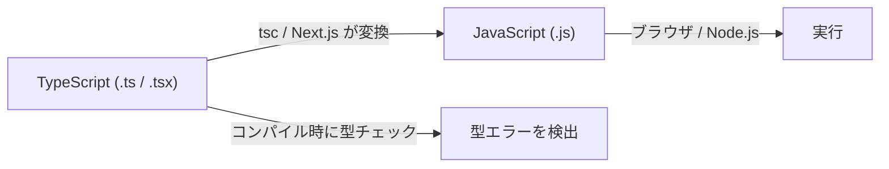

# 2-2-1 TypeScript の設計思想と基本の型

この Chapter「TypeScript」は以下の 3 セクションで構成されます。

| セクション | テーマ | 種類 |
|---|---|---|
| 2-2-1 | TypeScript の設計思想と基本の型 | 概念 |
| 2-2-2 | 高度な型とジェネリクス | 概念 |
| 2-2-3 | インターフェースと型エイリアス | 概念 |

**Chapter ゴール**: JavaScript に型安全性を加える TypeScript の設計思想と型システムを理解する

📖 **この Chapter の進め方**: まず本セクションで TypeScript がなぜ必要かを理解し基本の型を学びます。次に高度な型やジェネリクスで表現力を広げ、最後にインターフェースと型エイリアスで LMS の実際の型設計パターンを読み解きます。

📝 **前提知識**: このセクションはセクション 2-1-2（JavaScript と PHP の根本的な違い）とセクション 2-1-3（変数・関数・スコープ）の内容を前提としています。

## 🎯 このセクションで学ぶこと

- なぜ JavaScript に型システムが必要なのかを理解する
- TypeScript の基本型（`string` / `number` / `boolean` / `null` / `undefined`）と型注釈の書き方を学ぶ
- 配列・オブジェクトの型付けパターンを把握する
- 型推論の仕組みと、どこまで型注釈を書くべきかの指針を理解する
- 関数の引数・戻り値への型付けを PHP の型宣言と対比して学ぶ
- `any` / `unknown` / `never` / `void` といった特殊な型の使い分けを知る

まず「なぜ TypeScript が必要なのか」を JavaScript の課題から理解し、基本型から関数の型付け、特殊な型、そして LMS の tsconfig.json 設定まで順に学んでいきます。

---

## 導入: JavaScript の自由さが生むバグ

セクション 2-1-2 で学んだとおり、JavaScript は **動的型付け** の言語です。変数にどんな型の値でも代入でき、関数の引数にも型の制約がありません。この自由さは手軽さの裏返しですが、プロジェクトが大きくなると深刻な問題を引き起こします。

次のコードを見てください。

```javascript
// JavaScript: 型の制約がない
function calculateTotal(price, quantity) {
  return price + quantity;
}

// 意図: calculateTotal(100, 3) → 103
// 実際の呼び出し:
calculateTotal("100", 3); // → "1003"（文字列結合が発生）
calculateTotal(100, null); // → 100（null が 0 に変換される）
```

PHP であれば型宣言を書くことでこの問題を防げます。

```php
// PHP: 型宣言でコンパイル前にエラーを検出できる
declare(strict_types=1);

function calculateTotal(int $price, int $quantity): int
{
    return $price + $quantity;
}

calculateTotal("100", 3); // TypeError が発生（strict_types により文字列から int への暗黙変換を拒否）
```

JavaScript にはこの型宣言の仕組みがありません。エラーが発生するのは実行時、しかもエラーにならず間違った結果を返すケースすらあります。数十ファイル、数百の関数があるプロジェクトで、すべての呼び出し箇所を目視で確認するのは現実的ではありません。

この「実行してみないとバグに気づけない」という問題を解決するのが **TypeScript** です。

### 🧠 先輩エンジニアはこう考える

> LMS の開発で TypeScript を導入する前は、API から返ってくるデータの形が分からなくて、`console.log` で確認しながら開発するのが日常でした。「このオブジェクトに `name` プロパティはあるのか？」「この配列の中身は文字列なのか数値なのか？」と、いちいち実行して確かめる必要があったんです。TypeScript を入れてからは、エディタが「このプロパティは存在しません」「この関数には number を渡してください」と教えてくれるようになりました。型があるだけで開発速度が体感で 1.5 倍くらい上がります。PHP で型宣言を書くのと同じ感覚で、JavaScript にも型の恩恵を持ち込めるのが TypeScript の価値です。

---

## TypeScript とは何か

**TypeScript** は、Microsoft が開発した JavaScript の **スーパーセット**（上位互換）言語です。JavaScript の構文をすべて含み、そこに **型システム** を追加したものです。

🔑 **スーパーセットとは**: すべての JavaScript コードは、そのまま有効な TypeScript コードです。既存の JavaScript に少しずつ型を追加していくことができます。

### TypeScript の動作モデル

TypeScript は直接ブラウザや Node.js で実行されるわけではありません。**コンパイル（トランスパイル）** という工程で JavaScript に変換されてから実行されます。



重要なのは、**型の情報はコンパイル時にのみ存在し、実行時の JavaScript には残らない** という点です。これを **型の消去（Type Erasure）** と呼びます。型チェックは開発中にバグを見つけるための仕組みであり、実行時のパフォーマンスには一切影響しません。

### PHP の型宣言との対比

PHP 8+ の型宣言と TypeScript の型注釈は目的が似ていますが、動作タイミングが異なります。

| 特性 | PHP 8+ の型宣言 | TypeScript の型注釈 |
|---|---|---|
| チェックタイミング | **実行時**（TypeError を投げる） | **コンパイル時**（実行前にエラー検出） |
| 実行時の影響 | 型チェックが実行される | 型情報は消去される（影響なし） |
| 導入方法 | 言語に組み込み | JavaScript に追加する別言語 |
| 省略 | 可能（型なしでも動く） | 可能（型推論が補完する） |

💡 **TIP**: PHP の型宣言は「実行時に間違いを検出する安全装置」、TypeScript の型注釈は「実行前に間違いを検出する静的解析ツール」と捉えると分かりやすいです。

---

## 基本型と型注釈

TypeScript で型を指定するには、変数名の後ろに `: 型名` を書きます。これを **型注釈（Type Annotation）** と呼びます。

### プリミティブ型

```typescript
// TypeScript の型注釈
let userName: string = "田中太郎";
let age: number = 25;
let isActive: boolean = true;
```

PHP の型宣言と並べて比較してみましょう。

| 型の意味 | PHP | TypeScript | 備考 |
|---|---|---|---|
| 文字列 | `string` | `string` | 同じ名前 |
| 整数 | `int` | `number` | TypeScript は整数と小数の区別なし |
| 浮動小数点 | `float` | `number` | `number` で統一 |
| 真偽値 | `bool` | `boolean` | 名前が異なる |
| null | `?type` / `null` | `null` | TypeScript は独立した型 |
| 未定義 | なし | `undefined` | PHP には存在しない概念 |

💡 **TIP**: PHP では整数（`int`）と浮動小数点（`float`）を区別しますが、TypeScript の `number` は両方を含みます。`42` も `3.14` もすべて `number` 型です。

### null と undefined

PHP の `null` に慣れている方は、TypeScript の `null` と `undefined` の違いに注意してください。

```typescript
let a: null = null;         // 明示的に「値がない」
let b: undefined = undefined; // 「まだ値が設定されていない」

// PHP の null に相当するのは TypeScript の null
// undefined は「変数は宣言されたが値が代入されていない」状態
let c: string;
console.log(c); // undefined（初期化していないため）
```

💡 **TIP**: LMS で使用している `strict: true` 設定では、初期化されていない変数の使用はコンパイルエラーになります。ここでは `strict` なしの挙動を示しています。

実務では `null` と `undefined` を厳密に使い分けるよりも、「値がないかもしれない」ことを型で表現することが重要です。これはセクション 2-2-2 で学ぶユニオン型で扱います。

---

## 配列とオブジェクトの型

### 配列の型

配列の型付けには 2 つの書き方があります。

```typescript
// 書き方 1: 型名[]（推奨、シンプル）
let scores: number[] = [80, 90, 75];
let names: string[] = ["Alice", "Bob"];

// 書き方 2: Array<型名>（ジェネリクス構文）
let scores2: Array<number> = [80, 90, 75];
let names2: Array<string> = ["Alice", "Bob"];
```

どちらも同じ意味ですが、LMS のコードベースでは `型名[]` の書き方が主に使われています。`Array<型名>` の構文はセクション 2-2-2 で学ぶジェネリクスの一例です。

PHP との対比を見てみましょう。

```php
// PHP: 配列の中身の型を指定できない（PHP 8.1 時点）
function getScores(): array
{
    return [80, 90, 75]; // 中身が int か string か分からない
}
```

```typescript
// TypeScript: 配列の中身の型まで指定できる
function getScores(): number[] {
    return [80, 90, 75]; // 中身は必ず number
}
```

PHP の `array` 型は「配列である」ことだけを保証しますが、TypeScript は「何の配列か」まで型で表現できます。これにより、配列の要素にアクセスする際にもエディタの補完が効くようになります。

### オブジェクトの型

JavaScript のオブジェクトに型を付けるには、プロパティごとに型を記述します。

```typescript
// オブジェクトの型をインラインで指定
let user: { name: string; age: number; isActive: boolean } = {
    name: "田中太郎",
    age: 25,
    isActive: true,
};
```

PHP の連想配列と対比してみましょう。

```php
// PHP: 連想配列のキーや値の型を細かく指定できない
$user = [
    'name' => '田中太郎',
    'age' => 25,
    'is_active' => true,
];
// $user['nmae'] のようなタイポに気づけない
```

```typescript
// TypeScript: 存在しないプロパティにアクセスするとコンパイルエラー
user.nmae; // ❌ Property 'nmae' does not exist on type '{ name: string; age: number; isActive: boolean }'
user.name; // ✅ OK
```

オブジェクト型をインラインで書くと長くなりがちです。実務では **型エイリアス** や **インターフェース** を使って名前を付けます。これはセクション 2-2-3 で詳しく学びます。

⚠️ **注意**: オブジェクトの型指定でプロパティを区切る記号は、セミコロン（`;`）またはカンマ（`,`）のどちらも使えます。LMS のコードベースではプロパティの区切りに改行を使うスタイルが採用されています。

---

## 型推論

TypeScript では、すべての変数に型注釈を書く必要はありません。**型推論（Type Inference）** の仕組みにより、TypeScript が文脈から型を自動的に推測してくれます。

```typescript
// 型注釈を書かなくても、TypeScript が型を推論する
let message = "Hello"; // string と推論される
let count = 42;        // number と推論される
let isValid = true;    // boolean と推論される

// 推論された型は型注釈と同じように扱われる
message = 123; // ❌ Type 'number' is not assignable to type 'string'
```

### どこまで型注釈を書くべきか

型推論は便利ですが、「どこに書いて、どこを省略するか」には実務的な指針があります。

🔑 **型注釈の指針**:

| 場面 | 型注釈 | 理由 |
|---|---|---|
| 変数の初期化（リテラル代入） | **省略してよい** | 初期値から推論できる |
| 関数の引数 | **書く** | 推論できないため必須 |
| 関数の戻り値 | **書くのが推奨** | 関数の契約を明示するため |
| 型が複雑な場合 | **書く** | 可読性のため |

```typescript
// ✅ 変数: 型推論に任せる
const userName = "田中太郎"; // string と推論される
const maxRetry = 3;          // number と推論される

// ✅ 関数の引数: 型注釈を書く（推論できない）
// ✅ 関数の戻り値: 型注釈を書く（契約を明示）
function greet(name: string): string {
    return `こんにちは、${name}さん`;
}

// ❌ 冗長: 初期値から推論できるのに型注釈を書いている
const age: number = 25;
```

PHP でも型宣言を省略できますが、TypeScript の型推論はそれよりもはるかに強力です。変数の初期値、関数の `return` 文、条件分岐の結果など、あらゆる文脈から型を推測します。

---

## 関数の型付け

セクション 2-1-3 で学んだ JavaScript の関数に、型注釈を加えてみましょう。

### 基本の型付け

```typescript
// TypeScript: 引数と戻り値に型注釈
function add(a: number, b: number): number {
    return a + b;
}

// アロー関数でも同様
const multiply = (a: number, b: number): number => {
    return a * b;
};
```

PHP の型宣言との対比です。

```php
// PHP
function add(int $a, int $b): int
{
    return $a + $b;
}
```

```typescript
// TypeScript
function add(a: number, b: number): number {
    return a + b;
}
```

構文は異なりますが、「引数に型、戻り値に型」という構造は同じです。

### オプション引数とデフォルト引数

```typescript
// オプション引数: ? を付けると省略可能（undefined になる）
function greet(name: string, greeting?: string): string {
    return `${greeting ?? "こんにちは"}、${name}さん`;
}

greet("田中");              // "こんにちは、田中さん"
greet("田中", "おはよう");   // "おはよう、田中さん"

// デフォルト引数: = でデフォルト値を指定
function greet2(name: string, greeting: string = "こんにちは"): string {
    return `${greeting}、${name}さん`;
}
```

PHP との対比です。

| 機能 | PHP | TypeScript |
|---|---|---|
| オプション引数 | `?int $age = null` | `age?: number` |
| デフォルト引数 | `string $name = "Guest"` | `name: string = "Guest"` |
| 位置 | 必須引数の後ろ | 必須引数の後ろ |

💡 **TIP**: TypeScript のオプション引数（`?`）は、その引数の型が「指定した型 または `undefined`」になります。つまり `greeting?: string` は `greeting: string | undefined` とほぼ同じ意味です。この `|` 記号はセクション 2-2-2 で学ぶユニオン型の構文です。

---

## 特殊な型

TypeScript には、通常のプリミティブ型やオブジェクト型のほかに、特別な用途を持つ型があります。

### any: 型チェックを無効にする

```typescript
let value: any = "hello";
value = 42;      // OK
value = true;    // OK
value.foo.bar;   // コンパイルエラーにならない（実行時にクラッシュする可能性）
```

`any` はすべての型チェックを無効化します。JavaScript と同じ状態に戻ることを意味するため、TypeScript を使う意義がなくなります。

⚠️ **注意**: `any` の使用は原則避けてください。LMS でも ESLint の `@typescript-eslint/recommended` プリセット（LMS で使用）により `@typescript-eslint/no-explicit-any` が有効になっており、`any` を書くと警告が出ます。やむを得ず使う場合は、その理由をコメントで残すのがチームの慣習です。

### unknown: 安全な「型が不明」

```typescript
let value: unknown = "hello";

// unknown は直接操作できない
value.toUpperCase(); // ❌ 'value' is of type 'unknown'

// 型を確認してから操作する（型ガード）
if (typeof value === "string") {
    value.toUpperCase(); // ✅ OK（string と確認済み）
}
```

`unknown` は「型が分からない値」を表しますが、`any` と違って **使う前に型チェックを強制** します。外部 API からのレスポンスや `JSON.parse` の結果など、型が保証できないデータには `unknown` を使うのが安全です。

### void: 戻り値がない関数

```typescript
// 何も返さない関数
function logMessage(message: string): void {
    console.log(message);
}
```

PHP の `void` と同じ概念です。関数が値を返さないことを明示します。

### never: 絶対に値を返さない

```typescript
// 例外を投げる関数（正常に終了しない）
function throwError(message: string): never {
    throw new Error(message);
}

// 無限ループ（正常に終了しない）
function infiniteLoop(): never {
    while (true) {
        // 処理
    }
}
```

`void` は「値を返さない」、`never` は「関数が正常に終了しない」という違いがあります。`never` は日常的に書くことは少ないですが、TypeScript の型システムの中で重要な役割を果たします。

### 特殊な型の使い分けまとめ

| 型 | 意味 | ユースケース | PHP の対応 |
|---|---|---|---|
| `any` | すべて許可（型チェック無効） | 原則使わない | 型宣言なし |
| `unknown` | 型不明（使用前にチェック必要） | 外部データの受け取り | なし |
| `void` | 戻り値なし | ログ出力、イベント発火 | `void` |
| `never` | 到達不可能 | 例外スロー、網羅性チェック | なし |

---

## strict モードと LMS の tsconfig.json

TypeScript の型チェックの厳しさは **tsconfig.json** という設定ファイルで制御します。LMS では以下のように設定されています。

以下は主要部分の抜粋です（`plugins` や `include`/`exclude` などの設定は省略しています）。

```json
// frontend/tsconfig.json
{
  "compilerOptions": {
    "lib": ["dom", "dom.iterable", "esnext"],
    "allowJs": true,
    "skipLibCheck": true,
    "strict": true,
    "noEmit": true,
    "esModuleInterop": true,
    "module": "esnext",
    "moduleResolution": "bundler",
    "resolveJsonModule": true,
    "isolatedModules": true,
    "jsx": "preserve",
    "incremental": true,
    "baseUrl": "./",
    "paths": { "@/*": ["./src/*"] }
  }
}
```

### strict: true が有効にする設定群

`strict: true` は、以下の個別設定をまとめて有効にするショートカットです。

| 設定 | 効果 |
|---|---|
| `strictNullChecks` | `null` / `undefined` を他の型に代入できなくする |
| `strictFunctionTypes` | 関数の引数の型チェックを厳密にする |
| `strictBindCallApply` | `bind` / `call` / `apply` の引数を型チェックする |
| `strictPropertyInitialization` | クラスプロパティの初期化を必須にする |
| `noImplicitAny` | 型推論できない場合に暗黙の `any` を禁止する |
| `noImplicitThis` | `this` の型が不明な場合にエラーにする |
| `alwaysStrict` | 出力する JavaScript に `"use strict"` を付与する |
| `useUnknownInCatchVariables` | `catch` の変数を `unknown` 型にする |

🔑 **最も重要な設定は `strictNullChecks`** です。これが有効だと、`string` 型の変数に `null` を代入できなくなります。

```typescript
// strictNullChecks: true の場合
let name: string = "田中";
name = null; // ❌ Type 'null' is not assignable to type 'string'

// null を許可したい場合はユニオン型で明示する
let name2: string | null = "田中";
name2 = null; // ✅ OK
```

PHP の `?string`（nullable 型）に相当する書き方です。TypeScript では `string | null` とユニオン型で表現します。

### その他の主要設定

| 設定 | 値 | 意味 |
|---|---|---|
| `noEmit` | `true` | TypeScript コンパイラは型チェックのみ行い、JavaScript ファイルを出力しない。Next.js 14 が変換を担当するため |
| `module` | `"esnext"` | ES Modules 形式でモジュールを扱う。セクション 2-1-5 で学んだ `import` / `export` 構文に対応 |
| `moduleResolution` | `"bundler"` | Next.js のバンドラーに合わせたモジュール解決方式。`module` と組み合わせて使う |
| `jsx` | `"preserve"` | JSX の変換を TypeScript ではなく Next.js に任せる |
| `allowJs` | `true` | JavaScript ファイル（`.js`）も TypeScript プロジェクトに含めることを許可する |
| `incremental` | `true` | 前回のコンパイル結果をキャッシュし、再コンパイルを高速化する |
| `baseUrl` / `paths` | `"./"` / `"@/*"` | `@/components/Button` のようなパスエイリアスを有効にする。`./src/components/Button` と同じ意味 |

💡 **TIP**: `paths` の設定により、LMS のフロントエンドコードでは `import { Button } from "@/components/Button"` のように `@/` で始まるインポートが使われています。これは `src/` ディレクトリをルートとした絶対パスの省略記法です。

---

## ✨ まとめ

- **TypeScript** は JavaScript のスーパーセットであり、コンパイル時に型チェックを行うことで実行前にバグを検出する
- 型の情報は実行時には消去されるため、パフォーマンスへの影響はない
- **基本型** は `string` / `number` / `boolean` / `null` / `undefined` で、PHP の型宣言と似た構文で記述できる
- **型推論** により、初期値から型を自動的に推測してくれる。変数の初期化時は省略してよいが、関数の引数には型注釈が必須
- **配列** は `number[]` のように「中身の型」まで指定でき、PHP の `array` より表現力が高い
- **特殊な型** のうち `any` は型チェックを無効化するため原則使わない。型が不明な場合は `unknown` を使う
- LMS では `strict: true` により厳格な型チェックが有効になっており、`null` の扱いにはユニオン型が必要になる

---

次のセクションでは、ユニオン型、交差型、リテラル型といった型の組み合わせ方と、型を柔軟に再利用するためのジェネリクス、実行時に型を判定する型ガード、そして Partial / Pick / Omit 等のユーティリティ型を学びます。
