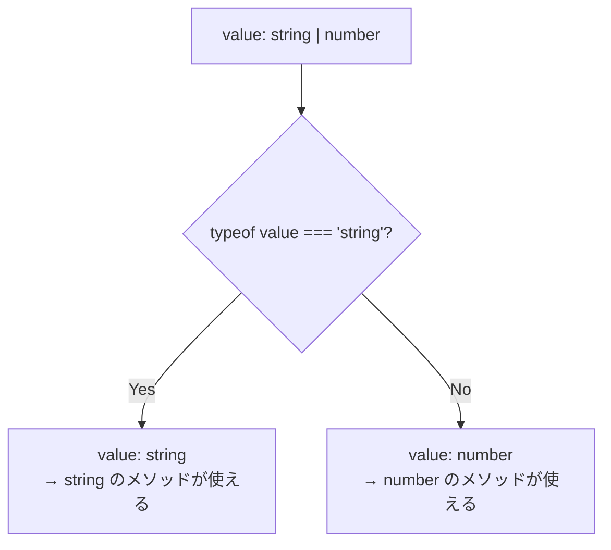

# 2-2-2 高度な型とジェネリクス

📝 **前提知識**: このセクションはセクション 2-2-1（TypeScript の設計思想と基本の型）の内容を前提としています。

## 🎯 このセクションで学ぶこと

- ユニオン型とリテラル型で「取りうる値の範囲」を正確に表現する方法を理解する
- 交差型で複数の型を合成するパターンを理解する
- ジェネリクスによる「型の引数」の仕組みを理解する
- 型ガードによるランタイムでの型の絞り込みを理解する
- ユーティリティ型（Partial / Pick / Omit 等）で既存の型を変換する方法を理解する

基本型だけでは表現しきれない現実のデータ構造に対して、TypeScript がどのような型の仕組みを提供しているかを、LMS の実コードを交えながら段階的に見ていきます。

---

## 導入: 基本型だけでは表現しきれない現実のデータ

2-2-1 では `string`、`number`、`boolean` といった基本型を学びました。しかし、実際のアプリケーションでは、これらの基本型だけでは表現しきれないデータが数多く存在します。

たとえば、LMS のボタンコンポーネントには「アイコンのサイズ」を指定するプロパティがあります。このサイズは任意の文字列ではなく、`'md'` か `'lg'` のどちらかしか受け付けません。型を `string` にしてしまうと、`'xl'` や `'small'` といった存在しないサイズも渡せてしまいます。

また、配列をシャッフルする関数を考えてみてください。数値の配列でも文字列の配列でも、どんな型の配列でも同じロジックでシャッフルできます。しかし、引数を `any[]` にしてしまうと、戻り値の型情報が失われてしまいます。

TypeScript の高度な型システムは、こうした「基本型では表現しきれない制約やパターン」を型レベルで正確に記述するための仕組みです。

### 🧠 先輩エンジニアはこう考える

> LMS の開発では、API のレスポンス型が 20 個以上のプロパティを持つことも珍しくありません。そのうち特定の画面で使うのは 3 つだけ、ということもよくあります。基本型だけで対応しようとすると、同じようなプロパティを持つ型を何度も定義することになり、元の型を変更したときに修正漏れが起きます。ユーティリティ型の `Pick` や `Omit` を使えば、元の型から必要な部分だけを取り出せるので、変更にも強い設計になります。高度な型は「便利機能」ではなく「保守性のための必須ツール」だと考えています。

---

## ユニオン型とリテラル型

### リテラル型とは

**リテラル型** は、特定の値そのものを型として扱う仕組みです。`string` 型は「すべての文字列」を表しますが、リテラル型の `'md'` は「文字列 `'md'` だけ」を表します。

```typescript
// string 型: あらゆる文字列を許容する
let size: string = 'md'
size = 'anything' // OK

// リテラル型: 'md' という値だけを許容する
let exactSize: 'md' = 'md'
exactSize = 'lg' // エラー: Type '"lg"' is not assignable to type '"md"'
```

リテラル型は `string` だけでなく、`number` や `boolean` にも使えます。`42` という数値リテラル型や、`true` というブールリテラル型も定義可能です。

### ユニオン型とは

**ユニオン型** は、複数の型のうち「いずれか」であることを表します。`|`（パイプ）演算子で型を結合します。

```typescript
// string または number のどちらかを受け取る
function formatId(id: string | number): string {
  return `ID: ${id}`
}

formatId(123)     // OK
formatId('abc')   // OK
formatId(true)    // エラー: boolean は受け付けない
```

リテラル型とユニオン型を組み合わせると、「特定の値のいずれか」という制約を型で表現できます。

### LMS での実例: コンポーネントの Props

LMS の `BackButton` コンポーネントでは、アイコンサイズとバリアントをリテラル型のユニオンで定義しています。

```tsx
// frontend/src/components/v2/elements/BackButton.tsx
type Props = {
  onClick: () => void
  className?: string
  iconSize?: 'md' | 'lg'
  variant?: 'default' | 'header'
}
```

`iconSize` に `'md' | 'lg'` という型を付けることで、存在しないサイズ（たとえば `'sm'`）を渡そうとするとコンパイル時にエラーになります。PHP では定数を定義してバリデーションで弾くしかありませんが、TypeScript ではコードを書いている時点で誤りを検出できます。

### LMS での実例: `as const` + `typeof` パターン

LMS では、定数オブジェクトとその型を同時に定義するパターンが頻繁に使われています。

```typescript
// frontend/src/constants/v2/accountType.ts
export const ACCOUNT_TYPE = {
  USER: 'user',
  EMPLOYEE: 'employee',
} as const

export type ACCOUNT_TYPE = (typeof ACCOUNT_TYPE)[keyof typeof ACCOUNT_TYPE]
```

このパターンを段階的に分解して理解しましょう。

**Step 1: `as const`**

`as const` を付けると、オブジェクトのプロパティがすべて **readonly**（読み取り専用）になり、値がリテラル型として推論されます。

```typescript
// as const なし: 値は string 型に広がる
const obj = { USER: 'user' }
// 型: { USER: string }

// as const あり: 値がリテラル型のまま保持される
const objConst = { USER: 'user' } as const
// 型: { readonly USER: 'user' }
```

**Step 2: `typeof ACCOUNT_TYPE`**

`typeof` 演算子を型の文脈で使うと、値からその型を取得できます。

```typescript
typeof ACCOUNT_TYPE
// → { readonly USER: 'user'; readonly EMPLOYEE: 'employee' }
```

**Step 3: `keyof typeof ACCOUNT_TYPE`**

`keyof` はオブジェクト型のキーをユニオン型として取り出します。

```typescript
keyof typeof ACCOUNT_TYPE
// → 'USER' | 'EMPLOYEE'
```

**Step 4: `(typeof ACCOUNT_TYPE)[keyof typeof ACCOUNT_TYPE]`**

インデックスアクセス型で、各キーに対応する値の型をユニオンとして取り出します。

```typescript
(typeof ACCOUNT_TYPE)[keyof typeof ACCOUNT_TYPE]
// → 'user' | 'employee'
```

最終的に `ACCOUNT_TYPE` 型は `'user' | 'employee'` というユニオン型になります。このパターンを使うと、定数の値を追加するだけで型も自動的に拡張されるため、定数と型が常に同期した状態を保てます。

LMS では同じパターンが AI チャットボット機能でも使われています。

```typescript
// frontend/src/features/v2/aiChatbot/constants/aiChatbot.ts
export const STREAM_STATE = {
  IDLE: 'idle',
  STREAMING: 'streaming',
  DONE: 'done',
  ERROR: 'error',
} as const

export type StreamState = (typeof STREAM_STATE)[keyof typeof STREAM_STATE]
// → 'idle' | 'streaming' | 'done' | 'error'
```

💡 **TIP**: PHP の enum に近い概念ですが、TypeScript の `as const` パターンは JavaScript のオブジェクトをそのまま活用するため、ランタイムのオーバーヘッドがありません。TypeScript にも `enum` 構文がありますが、LMS では `as const` パターンが採用されています。`as const` の方がツリーシェイキング（未使用コードの除去）に有利で、JavaScript の慣習に沿っているためです。

---

## 交差型

**交差型** は、複数の型を「すべて満たす」型を作ります。`&`（アンパサンド）演算子で型を結合します。

```typescript
type HasName = { name: string }
type HasAge = { age: number }

// HasName と HasAge の両方のプロパティを持つ
type Person = HasName & HasAge
// → { name: string; age: number }

const person: Person = {
  name: '田中',
  age: 25,
}
```

### ユニオン型との使い分け

ユニオン型と交差型は対称的な関係にあります。

| | ユニオン型 (`A &#124; B`) | 交差型 (`A & B`) |
|---|---|---|
| 意味 | A **または** B | A **かつ** B |
| プロパティ | A と B に共通するプロパティのみ安全にアクセス可能 | A と B の**すべての**プロパティにアクセス可能 |
| 用途 | 複数の候補から1つを選ぶ | 複数の型を合成する |

```typescript
type Dog = { bark: () => void; name: string }
type Cat = { meow: () => void; name: string }

// ユニオン型: Dog か Cat のどちらか
type Pet = Dog | Cat
// → name にはアクセスできるが、bark や meow には型ガードなしではアクセスできない

// 交差型: Dog と Cat の両方の特徴を持つ
type SuperPet = Dog & Cat
// → name, bark, meow のすべてにアクセスできる
```

交差型は、既存の型にプロパティを追加したいときに特に便利です。LMS では、ベースとなる Props 型に追加のプロパティを合成するパターンで使われています。この具体例は次のセクション（2-2-3）で詳しく扱います。

---

## ジェネリクス

### 「型の引数」という考え方

**ジェネリクス** は、型を「引数」として受け取る仕組みです。関数が値の引数を受け取るように、ジェネリクスは型の引数を受け取ります。

PHP にはジェネリクスの構文がないため、初めて見ると戸惑うかもしれません。しかし、考え方自体は Laravel の `Collection` に近いものがあります。`Collection` は数値のコレクションにも文字列のコレクションにもなれますが、中身の型を意識して操作しています。ジェネリクスは、この「中身の型を意識する」仕組みを言語レベルでサポートするものです。

```typescript
// ジェネリクスなし: 戻り値の型情報が失われる
function firstElement(arr: any[]): any {
  return arr[0]
}
const result = firstElement([1, 2, 3]) // result の型は any

// ジェネリクスあり: 入力と出力の型が連動する
function firstElement<T>(arr: T[]): T {
  return arr[0]
}
const result = firstElement([1, 2, 3]) // result の型は number
```

`<T>` の `T` は **型パラメータ** と呼ばれ、関数が呼び出される際に具体的な型に置き換わります。`firstElement([1, 2, 3])` と呼び出すと、TypeScript は引数から `T` が `number` であると推論し、戻り値も `number` 型になります。

🔑 **キーポイント**: ジェネリクスの本質は「型の安全性を保ちながら、汎用的なコードを書く」ことです。`any` を使えば汎用的にはなりますが、型の安全性が失われます。ジェネリクスなら、両方を両立できます。

### LMS での実例: `shuffle` 関数

LMS の演習機能では、選択肢の順番をランダムにシャッフルする関数があります。

```typescript
// frontend/src/features/v2/exercise/components/management/shuffle.ts
/**
 * Fisher-Yatesアルゴリズムを使用して配列をシャッフルする
 * 元の配列は変更せず、新しい配列を返す
 */
export function shuffle<T>(array: T[]): T[] {
  const shuffled = [...array]
  for (let i = shuffled.length - 1; i > 0; i--) {
    const j = Math.floor(Math.random() * (i + 1))
    ;[shuffled[i], shuffled[j]] = [shuffled[j], shuffled[i]]
  }
  return shuffled
}
```

この関数は `<T>` というジェネリクスを使っているため、どんな型の配列でもシャッフルできます。

```typescript
// 数値の配列をシャッフル → 戻り値は number[]
const numbers = shuffle([1, 2, 3, 4, 5])

// 文字列の配列をシャッフル → 戻り値は string[]
const words = shuffle(['apple', 'banana', 'cherry'])

// オブジェクトの配列をシャッフル → 戻り値は { id: number; text: string }[]
const options = shuffle([
  { id: 1, text: '選択肢A' },
  { id: 2, text: '選択肢B' },
])
```

もし `<T>` の代わりに `any` を使っていたら、戻り値の型が `any[]` になり、シャッフル後の配列でプロパティにアクセスしても補完が効きません。ジェネリクスのおかげで、型情報が入力から出力まで一貫して保持されます。

---

## ジェネリクスの制約

ジェネリクスの `<T>` はデフォルトではどんな型でも受け付けます。しかし、関数の中で `T` の特定のプロパティやメソッドにアクセスしたい場合、`T` がそのプロパティを持っていることを保証する必要があります。ここで使うのが **`extends` による制約** です。

```typescript
// T に制約なし: length プロパティにアクセスできない
function logLength<T>(value: T): void {
  console.log(value.length) // エラー: Property 'length' does not exist on type 'T'
}

// T を { length: number } に制約: length を持つ型だけを受け付ける
function logLength<T extends { length: number }>(value: T): void {
  console.log(value.length) // OK
}

logLength('hello')     // OK: string は length を持つ
logLength([1, 2, 3])   // OK: 配列は length を持つ
logLength(42)          // エラー: number は length を持たない
```

`<T extends SomeType>` は「`T` は `SomeType` を満たす型でなければならない」という制約を意味します。

### LMS での実例: `replacePathParams` 関数

LMS の HTTP クライアントには、API パスのプレースホルダを実際の値に置換する関数があります。

```typescript
// frontend/src/lib/v2/fetch.ts
const replacePathParams = <PathParams extends Record<string, string>>(
  path: string,
  pathParams: PathParams,
) => {
  return path.replace(/:([a-zA-Z0-9_]+)/g, (_, key) => {
    const value = pathParams[key]
    if (value === undefined) {
      throw new Error(`Missing required path parameter: ${key}`)
    }

    return encodeURIComponent(value)
  })
}
```

ここでの `<PathParams extends Record<string, string>>` は、「`PathParams` は文字列キーと文字列値を持つオブジェクト型でなければならない」という制約です。

`Record<string, string>` は TypeScript のユーティリティ型で、「すべてのキーが `string`、すべての値が `string` であるオブジェクト」を表します（ユーティリティ型については後ほど詳しく解説します）。

この制約により、たとえば `pathParams` に数値を値として渡そうとするとコンパイルエラーになります。URL パラメータは文字列でなければならないため、この制約は実行時エラーを防ぐ役割を果たしています。

⚠️ **注意**: `extends` は TypeScript の型制約において「継承」ではなく「制約（上限境界）」を意味します。`class` の `extends`（クラス継承）とは異なる概念なので混同しないようにしましょう。

---

## 型ガード

ユニオン型の値を扱うとき、具体的にどの型なのかを判定してから処理したい場面があります。TypeScript では、特定の条件分岐を通過した後に型が自動的に絞り込まれる仕組みがあり、これを **型の絞り込み（narrowing）** と呼びます。型の絞り込みを行う条件式を **型ガード** と呼びます。

### `typeof` による型ガード

JavaScript の `typeof` 演算子を使うと、プリミティブ型（`string`、`number`、`boolean` 等）を判定できます。

```typescript
function formatValue(value: string | number): string {
  if (typeof value === 'string') {
    // このブロック内では value は string 型に絞り込まれる
    return value.toUpperCase()
  }
  // このブロック内では value は number 型に絞り込まれる
  return value.toFixed(2)
}
```

`typeof value === 'string'` という条件を通過すると、TypeScript はその `if` ブロック内で `value` が `string` 型であることを認識します。`else` ブロックでは自動的に残りの型（`number`）に絞り込まれます。

### `instanceof` による型ガード

クラスのインスタンスかどうかを判定するには `instanceof` を使います。

```typescript
function formatDate(value: string | Date): string {
  if (value instanceof Date) {
    // Date 型に絞り込まれる
    return value.toISOString()
  }
  // string 型に絞り込まれる
  return value
}
```

### `in` 演算子による型ガード

オブジェクトが特定のプロパティを持っているかどうかを判定するには `in` 演算子を使います。

```typescript
type TextInput = { type: 'text'; value: string }
type NumberInput = { type: 'number'; value: number; min: number; max: number }
type FormInput = TextInput | NumberInput

function getRange(input: FormInput): string {
  if ('min' in input) {
    // NumberInput 型に絞り込まれる（min プロパティを持つのは NumberInput だけ）
    return `${input.min} - ${input.max}`
  }
  // TextInput 型に絞り込まれる
  return 'テキスト入力'
}
```

### 型ガードが必要な理由

型ガードは、TypeScript の型チェックとランタイムの値チェックを橋渡しする仕組みです。PHP では `is_string()` や `instanceof` でチェックしても、その後のコードに対して特別な型の保証はありません。TypeScript では、型ガードを通過した後のコードブロックで型が自動的に絞り込まれるため、安全にプロパティやメソッドにアクセスできます。



---

## ユーティリティ型

TypeScript には、既存の型を変換して新しい型を作る **ユーティリティ型** が組み込みで用意されています。ゼロから型を定義し直す代わりに、既存の型をベースにして必要な形に変換できます。

### 主要なユーティリティ型の一覧

| ユーティリティ型 | 変換内容 | 用途 |
|---|---|---|
| `Partial<T>` | すべてのプロパティを省略可能にする | 更新用の入力型（一部だけ更新したい場合） |
| `Required<T>` | すべてのプロパティを必須にする | `Partial` の逆 |
| `Pick<T, K>` | 指定したプロパティだけを取り出す | 大きな型から必要な部分だけ抽出 |
| `Omit<T, K>` | 指定したプロパティを除外する | 特定のプロパティを除いた型が欲しい場合 |
| `Record<K, V>` | キーの型と値の型からオブジェクト型を生成する | マッピングオブジェクトの型定義 |
| `Readonly<T>` | すべてのプロパティを読み取り専用にする | 変更してはいけないデータの保護 |

### `Partial<T>` と `Required<T>`

```typescript
type User = {
  id: number
  name: string
  email: string
}

// Partial: すべてのプロパティが省略可能になる
type PartialUser = Partial<User>
// → { id?: number; name?: string; email?: string }

// Required: すべてのプロパティが必須になる（Partial の逆）
type RequiredUser = Required<PartialUser>
// → { id: number; name: string; email: string }
```

`Partial` は、ユーザー情報の部分更新（名前だけ変更する、メールだけ変更する等）の入力型として便利です。

### `Pick<T, K>` と `Omit<T, K>`

`Pick` は型から特定のプロパティだけを取り出し、`Omit` は特定のプロパティを除外します。

```typescript
type User = {
  id: number
  name: string
  email: string
  avatar: string
  createdAt: Date
}

// Pick: 指定したプロパティだけを取り出す
type UserSummary = Pick<User, 'id' | 'name' | 'avatar'>
// → { id: number; name: string; avatar: string }

// Omit: 指定したプロパティを除外する
type UserWithoutDates = Omit<User, 'createdAt'>
// → { id: number; name: string; email: string; avatar: string }
```

### LMS での実例: `Pick` の活用

LMS では、API レスポンスの型から必要なプロパティだけを取り出すために `Pick` が使われています。

```typescript
// frontend/src/features/v2/userExamQuestionAnswer/components/UserExamQuestionAnswerForm.tsx（抜粋）
type Props = {
  workspaceId: string
  userExamQuestionId: string
  loginUser: Pick<FetchMeAsUserHttpDocument['response']['data'], 'id' | 'avatar' | 'name'>
  actorType?: ActorType
  isResolved?: boolean
  canAnswer?: boolean
}
```

`FetchMeAsUserHttpDocument['response']['data']` はログインユーザーの全情報を含む型ですが、この回答フォームコンポーネントでは `id`、`avatar`、`name` の 3 つしか必要ありません。`Pick` で必要なプロパティだけを取り出すことで、コンポーネントが実際に使うデータを型レベルで明示しています。

### LMS での実例: `Omit` の活用

LMS のバックログ機能では、ベースとなるタグコンポーネントの Props から特定のプロパティを除外するために `Omit` が使われています。

```tsx
// frontend/src/features/v1/backlog/components/TaskTypeTag.tsx
type BaseTaskTypeTagProps = {
  className?: string
  name: string
  icon: React.ReactNode
  onClick?: () => void
}

export const TaskTypeTagStory: FC<Omit<BaseTaskTypeTagProps, 'name' | 'icon'>> = ({ onClick }) => {
  return (
    <BaseTaskTypeTag
      onClick={onClick}
      icon={<MdTask className='size-5' />}
      name='ストーリー'
      className='bg-bg-blue-primary text-main-color'
    />
  )
}
```

`TaskTypeTagStory` は「ストーリー」タイプ専用のタグなので、`name` と `icon` は内部で固定されています。外部から渡す必要がないため、`Omit<BaseTaskTypeTagProps, 'name' | 'icon'>` で除外しています。これにより、呼び出し側が誤って `name` や `icon` を渡そうとするとコンパイルエラーになります。

### LMS での実例: `Record` の活用

`Record<K, V>` は、キーの型 `K` と値の型 `V` からオブジェクト型を生成します。

```typescript
// frontend/src/features/v2/aiChatbot/hooks/useFloatingPanel.ts（抜粋）
type ResizeDirection = 'n' | 's' | 'e' | 'w' | 'ne' | 'nw' | 'se' | 'sw'

const resizeCursors: Record<ResizeDirection, string> = {
  n: 'cursor-ns-resize',
  s: 'cursor-ns-resize',
  e: 'cursor-ew-resize',
  w: 'cursor-ew-resize',
  ne: 'cursor-nesw-resize',
  sw: 'cursor-nesw-resize',
  nw: 'cursor-nwse-resize',
  se: 'cursor-nwse-resize',
}
```

`Record<ResizeDirection, string>` は「`ResizeDirection` のすべての値をキーとして持ち、値が `string` であるオブジェクト」を意味します。もし 8 方向のうち 1 つでもマッピングを書き忘れると、コンパイルエラーになります。`Record` は「漏れなくマッピングを定義する」ことを型で保証してくれるのです。

💡 **TIP**: `Record<string, string>` のようにキーを `string` にすると「任意の文字列キーを持つオブジェクト」になりますが、`Record<ResizeDirection, string>` のようにリテラル型のユニオンをキーにすると「指定したキーをすべて持つオブジェクト」になります。後者の方がより厳密な型チェックが効きます。

---

## ✨ まとめ

- **ユニオン型** (`A | B`) は「いずれかの型」を表し、**リテラル型** と組み合わせることで取りうる値を限定できる
- **`as const` + `typeof` パターン** は、LMS で定数とその型を同時に管理するための定番パターン
- **交差型** (`A & B`) は「すべての型を満たす」型を作り、型の合成に使う
- **ジェネリクス** (`<T>`) は「型の引数」であり、`any` を使わずに汎用的かつ型安全なコードを書ける
- **`extends` による制約** で、ジェネリクスが受け付ける型の範囲を限定できる
- **型ガード** (`typeof` / `instanceof` / `in`) によって、ユニオン型の値をランタイムで判定し、型を自動的に絞り込める
- **ユーティリティ型** (`Partial` / `Pick` / `Omit` / `Record` 等) は、既存の型を変換して新しい型を作る組み込みツール

---

次のセクションでは、interface と type の使い分け、型の拡張と合成の方法、そして LMS での型定義パターン（Props 型、HttpDocument 型）について学びます。
