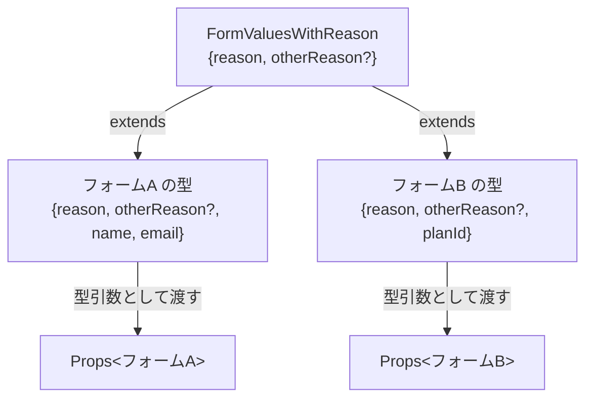
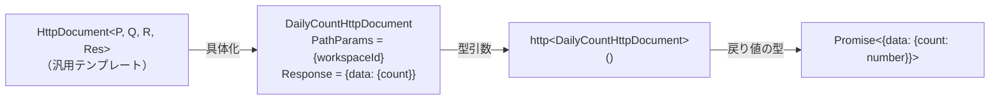

# 2-2-3 インターフェースと型エイリアス

📝 **前提知識**: このセクションはセクション 2-2-2 高度な型とジェネリクスの内容を前提としています。

## 🎯 このセクションで学ぶこと

- `type`（型エイリアス）と `interface` の基本構文と PHP との対比を理解する
- 両者の違いと使い分けの判断基準を把握する
- 型の拡張と合成のパターン（`extends`、交差型 `&`）を理解する
- LMS で使われている型定義パターン（Props 型、HttpDocument 型）を読み解く
- 型定義ファイルの組織化の考え方を理解する

このセクションでは、TypeScript でオブジェクトの構造を定義する2つの方法を学び、LMS のコードベースで実際にどう使われているかを確認します。

---

## 導入: 型を「設計図」として再利用する

セクション 2-2-1 と 2-2-2 で、TypeScript の基本型やユニオン型、ジェネリクスを学びました。これらを使えば、個々の変数や関数に型を付けることができます。しかし、実際の開発では同じ構造のオブジェクトが何度も登場します。

たとえば、ユーザー情報を表すオブジェクトを考えてみましょう。

```typescript
function displayUser(user: { id: string; name: string; email: string }) {
  console.log(user.name)
}

function updateUser(user: { id: string; name: string; email: string }) {
  // 更新処理
}
```

`{ id: string; name: string; email: string }` という構造が2箇所に登場しています。もしプロパティが追加になったら、すべての箇所を修正しなければなりません。PHP で同じ課題に直面したとき、あなたはクラスや型宣言を使って構造を1箇所にまとめたはずです。TypeScript でも同じ考え方が必要です。

TypeScript には、オブジェクトの構造を「設計図」として定義し、再利用するための仕組みが2つあります。**`type`（型エイリアス）** と **`interface`** です。

### 🧠 先輩エンジニアはこう考える

> LMS の開発では、API のレスポンス型やコンポーネントの Props 型を大量に定義します。最初は「`type` と `interface`、どっちを使えばいいんだ？」と悩みますが、実務では「チームの規約に従う」のが正解です。LMS では `type` を中心に使う方針になっています。大事なのはどちらが優れているかではなく、コードベース全体で一貫性を保つことです。

---

## type（型エイリアス）と interface の基本

まず、両者の基本構文を見てみましょう。

### type（型エイリアス）

`type` は、任意の型に名前を付ける機能です。オブジェクトだけでなく、ユニオン型やプリミティブ型にも名前を付けられます。

```typescript
// オブジェクト型
type User = {
  id: string
  name: string
  email: string
}

// ユニオン型に名前を付ける
type Status = 'active' | 'inactive' | 'suspended'

// プリミティブ型に名前を付ける（ドメイン上の意味を表現）
type UserId = string
```

### interface

`interface` は、オブジェクトの構造を定義する専用の構文です。

```typescript
interface User {
  id: string
  name: string
  email: string
}
```

### PHP との対比

PHP の `interface` はクラスが実装すべきメソッドの契約を定義しますが、TypeScript の `interface` はオブジェクトの「形」を定義するものです。

```php
// PHP: メソッドの契約（実装を持たない）
interface UserRepositoryInterface {
    public function find(string $id): User;
    public function save(User $user): void;
}
```

```typescript
// TypeScript: オブジェクトの形（プロパティとメソッドの両方を含む）
interface UserRepository {
  find(id: string): User
  save(user: User): void
}
```

PHP の `interface` は「このメソッドを必ず実装してね」という契約でしたが、TypeScript の `interface` は「このプロパティを持つオブジェクトならOK」という構造の定義です。TypeScript は **構造的型付け**（structural typing）を採用しています。これは「型の名前」ではなく「型の構造（どんなプロパティやメソッドを持つか）」で互換性を判断する仕組みです。そのため、`implements` キーワードで明示的に実装しなくても、同じ構造を持っていれば型として互換性があります。TypeScript でも `class MyClass implements MyInterface` のように `implements` を使うことはできますが、構造的型付けにより必須ではありません。

💡 **TIP**: PHP の `class` でプロパティの型を宣言する感覚に近いのが TypeScript の `type` や `interface` です。ただし TypeScript の型はコンパイル時にのみ存在し、実行時には消えるという大きな違いがあります。

---

## type と interface の違いと使い分け

基本構文はよく似ていますが、いくつかの重要な違いがあります。

### 1. 定義できる型の範囲

`interface` はオブジェクト型の定義にのみ使えます。`type` はあらゆる型に名前を付けられます。

```typescript
// type: ユニオン型やタプル型にも使える
type Status = 'active' | 'inactive'
type Pair = [string, number]

// interface: オブジェクト型のみ
// interface Status = 'active' | 'inactive'  ← これはエラー
```

### 2. 宣言マージ（Declaration Merging）

`interface` は同じ名前で複数回宣言すると、自動的にマージされます。`type` で同じ名前を再宣言するとエラーになります。

```typescript
// interface: 宣言マージが起きる
interface Config {
  apiUrl: string
}

interface Config {
  timeout: number
}

// 結果: Config は { apiUrl: string; timeout: number } になる

// type: 同じ名前は再宣言できない
type Config = { apiUrl: string }
// type Config = { timeout: number }  ← エラー: Duplicate identifier 'Config'
```

宣言マージはライブラリの型定義を拡張するときに便利ですが、意図せずプロパティが追加される危険もあります。アプリケーションコードでは `type` を使う方が安全です。

### 3. 拡張の構文

`interface` は `extends` キーワード、`type` は交差型（`&`）で拡張します。これについては次の見出しで詳しく解説します。

### LMS ではどちらが使われているか

LMS のフロントエンドでは、**`type` を中心に使う方針** が採用されています。コンポーネントの Props 型、API レスポンス型、共通の型定義のいずれも `type` で定義されています。

```typescript
// LMS の典型的なパターン
type Props = {
  workspaceId: string
  onSubmit: (question: { title: string; content: string }) => void
}
```

🔑 **使い分けの判断基準**: LMS のように `type` に統一するプロジェクトは多くあります。迷ったときは以下を基準にしてください。

| 状況 | 推奨 |
|---|---|
| プロジェクトに既存の規約がある | 規約に従う |
| オブジェクト型の定義 | `type` でも `interface` でもよい |
| ユニオン型やタプル型 | `type`（`interface` では不可） |
| ライブラリの型を拡張したい | `interface`（宣言マージ） |

---

## 型の拡張と合成

既存の型を元に新しい型を作る方法を見ていきましょう。PHP の `extends` や `implements` に相当する機能です。

### interface の extends

`interface` は `extends` で既存の `interface` を拡張できます。

```typescript
interface BaseUser {
  id: string
  name: string
}

interface AdminUser extends BaseUser {
  role: 'admin'
  permissions: string[]
}

// AdminUser は { id: string; name: string; role: 'admin'; permissions: string[] }
```

PHP のクラス継承と似た感覚です。

```php
// PHP での類似パターン
class BaseUser {
    public string $id;
    public string $name;
}

class AdminUser extends BaseUser {
    public string $role = 'admin';
    public array $permissions;
}
```

### 型エイリアスの交差型（&）

`type` では交差型 `&` を使って複数の型を合成します。

```typescript
type BaseUser = {
  id: string
  name: string
}

type WithRole = {
  role: 'admin' | 'user'
  permissions: string[]
}

type AdminUser = BaseUser & WithRole
// AdminUser は { id: string; name: string; role: 'admin' | 'user'; permissions: string[] }
```

### extends と & の違い

動作結果はほぼ同じですが、微妙な違いがあります。

```typescript
// extends: プロパティの型が矛盾するとエラー
interface A {
  value: string
}
// interface B extends A {
//   value: number  ← エラー: string と number は互換性がない
// }

// &: プロパティの型が矛盾すると never 型になる（エラーにはならない）
type A = { value: string }
type B = { value: number }
type C = A & B
// C の value は string & number = never（実質使えない）
```

⚠️ **注意**: 交差型 `&` で型が矛盾した場合、TypeScript はエラーを出さず `never` 型になります。`extends` の方が型の矛盾を早期に検出できるため、継承関係が明確な場合は `extends` の方が安全です。

### PHP の extends/implements との対比

| PHP | TypeScript |
|---|---|
| `class B extends A` | `interface B extends A` / `type B = A & { ... }` |
| `class C implements I` | 構造的型付けにより暗黙的に満たされる |
| 単一継承（クラス） | 多重拡張可能（`extends A, B`） |
| `trait`（コード再利用） | 交差型 `&`（型の合成） |

TypeScript の `interface` は多重拡張が可能です。PHP のクラスが単一継承に制限されているのとは対照的です。

```typescript
interface Timestamped {
  createdAt: string
  updatedAt: string
}

interface SoftDeletable {
  deletedAt: string | null
}

// 複数の interface を同時に拡張
interface UserRecord extends Timestamped, SoftDeletable {
  id: string
  name: string
}
```

---

## LMS の型定義パターン 1: Props 型

LMS のフロントエンドで最も頻繁に登場する型定義パターンが **Props 型** です。Props 型は、React コンポーネントが外部から受け取るデータの仕様を定義します。

💡 **TIP**: Props は React のコンポーネントに渡すパラメータのことです。PHP の関数引数に相当しますが、名前付き引数のようにオブジェクトとして渡します。React のコンポーネントについてはセクション 2-3-1 で詳しく学びます。今はオブジェクトの型定義パターンとして把握すれば十分です。

### シンプルな Props 型: BackButton

最もシンプルなパターンを見てみましょう。

```tsx
// frontend/src/components/v2/elements/BackButton.tsx
type Props = {
  onClick: () => void
  className?: string
  iconSize?: 'md' | 'lg'
  variant?: 'default' | 'header'
}

export function BackButton({
  onClick,
  className = '',
  iconSize = 'md',
  variant = 'default',
}: Props) {
  // ...
}
```

ここでの注目ポイントは以下の通りです。

- **`type Props`** という命名規則: LMS ではファイルごとに `Props` という名前で定義します。ファイルの外にエクスポートしないため名前の衝突は起きません
- **`?` によるオプショナルプロパティ**: `className?` は渡さなくてもよいプロパティです。関数の引数側でデフォルト値（`className = ''`）を設定しています
- **リテラル型のユニオン**: `iconSize` は `'md'` か `'lg'` しか受け付けません。セクション 2-2-2 で学んだユニオン型の実践的な活用です
- **関数型のプロパティ**: `onClick: () => void` は「引数なし・戻り値なしの関数」を意味します

### コールバック関数を含む Props 型: AiChatbotInputForm

より実践的なパターンを見てみましょう。

```tsx
// frontend/src/features/v2/aiChatbot/components/AiChatbotInputForm.tsx
type Props = {
  workspaceId: string
  onSubmit: (question: { title: string; content: string }) => void
}

export function AiChatbotInputForm({ workspaceId, onSubmit }: Props) {
  // ...
}
```

`onSubmit` は「`title` と `content` を持つオブジェクトを引数に取り、戻り値のない関数」です。このように Props 型はデータ（`workspaceId`）とコールバック関数（`onSubmit`）の両方を含むことができます。PHP のコントローラーでフォームリクエストのバリデーションルールを定義するのと似た考え方で、コンポーネントが受け取れる値の仕様を型で表現しています。

### ジェネリックな Props 型: ReasonRadioGroup

セクション 2-2-2 で学んだジェネリクスを Props 型に適用した高度なパターンです。

```tsx
// frontend/src/features/v2/applications/components/ReasonRadioGroup.tsx
type FormValuesWithReason = {
  reason: string
  otherReason?: string
}

type Props<T extends FormValuesWithReason> = {
  control: Control<T>
  ariaLabel?: string
}

export function ReasonRadioGroup<T extends FormValuesWithReason>({
  control,
  ariaLabel = 'reason',
}: Props<T>) {
  // ...
}
```

このパターンでは、`Props<T>` がジェネリクスを使って型パラメータ `T` を受け取っています。`T extends FormValuesWithReason` という制約により、`T` は少なくとも `reason` と `otherReason` を持つ型でなければなりません。これにより、異なるフォームの型を持つ画面でも、`reason` フィールドを含むフォームであればこのコンポーネントを再利用できます。



---

## LMS の型定義パターン 2: HttpDocument 型

LMS のもう1つの重要な型定義パターンが **HttpDocument 型** です。これは API 通信における型安全性をジェネリクスで実現する設計です。

### HttpDocument 型の定義

```typescript
// frontend/src/lib/v2/fetch.ts
export type HttpDocument<
  PathParams = Record<string, string>,
  QueryParams = Record<string, unknown>,
  RequestBody = Record<string, unknown>,
  Response = any,
> = {
  params: {
    pathParams?: PathParams
    queryParams?: QueryParams
    requestBody?: RequestBody
  }
  response: Response
  options?: {
    callbacks?: {
      onSuccess?: (data: Response) => void
      onError?: (error: Error) => void
      onAuthError?: () => void
    }
    tags?: string[]
  }
}
```

この型定義には4つのジェネリックパラメータがあります。それぞれの役割を整理します。

| パラメータ | デフォルト値 | 役割 |
|---|---|---|
| `PathParams` | `Record<string, string>` | URL のパスパラメータ（例: `/users/:userId` の `userId`） |
| `QueryParams` | `Record<string, unknown>` | クエリパラメータ（例: `?page=1&limit=10`） |
| `RequestBody` | `Record<string, unknown>` | リクエストボディ（POST/PUT で送るデータ） |
| `Response` | `any` | API レスポンスの型 |

デフォルト値が設定されているため、使わないパラメータは `undefined` を渡すだけで済みます。

### API 関数での使用例

この `HttpDocument` を使って、個別の API 関数を型安全に定義します。

```typescript
// frontend/src/features/v2/aiChatbot/api/dailyCount.ts
import type { HttpDocument } from '@/lib/v2/fetch'
import { http } from '@/lib/v2/fetch'

export type DailyCountHttpDocument = HttpDocument<
  { workspaceId: string },
  undefined,
  undefined,
  { data: { count: number } }
>

export function dailyCount(
  params: DailyCountHttpDocument['params'],
  options?: DailyCountHttpDocument['options'],
) {
  return http<DailyCountHttpDocument>(
    `/api/workspaces/:workspaceId/ai-chatbot/daily-count`,
    'GET',
    params,
    options,
  )
}
```

この例を読み解いてみましょう。

1. `DailyCountHttpDocument` は `HttpDocument` に具体的な型を渡して定義しています
   - `PathParams` = `{ workspaceId: string }`: URL に `:workspaceId` というパスパラメータがある
   - `QueryParams` = `undefined`: クエリパラメータは使わない
   - `RequestBody` = `undefined`: リクエストボディは使わない（GET リクエスト）
   - `Response` = `{ data: { count: number } }`: レスポンスは `count` プロパティを持つ
2. `DailyCountHttpDocument['params']` はインデックスアクセス型で、`HttpDocument` の `params` プロパティの型を取り出しています
3. `http<DailyCountHttpDocument>(...)` で汎用の `http` 関数に型情報を渡し、戻り値の型が自動的に `{ data: { count: number } }` になります

### http 関数のジェネリック制約

汎用の `http` 関数は以下のようなシグネチャを持っています。

```typescript
// frontend/src/lib/v2/fetch.ts
export async function http<T extends HttpDocument>(
  path: string,
  method: string = 'GET',
  params?: T['params'],
  options?: T['options'],
): Promise<T['response']> {
  // ...
}
```

`T extends HttpDocument` という制約により、`T` は `HttpDocument` の構造を満たす型でなければなりません。そして `T['params']` や `T['response']` といったインデックスアクセス型で、渡された具体的な型から引数や戻り値の型を取り出しています。



この設計のメリットは、API 関数を呼び出す側がレスポンスの型を意識せずに使えることです。`dailyCount(...)` の戻り値は自動的に `{ data: { count: number } }` と推論されるため、存在しないプロパティへのアクセスをコンパイル時に検出できます。

PHP の Laravel で `FormRequest` のバリデーションルールを定義するように、TypeScript では型定義でリクエストとレスポンスの仕様を宣言的に表現しています。

---

## 型定義ファイルの組織化

LMS では、複数の箇所で使われる共通の型を `frontend/src/type/v2/` ディレクトリにまとめています。

### ディレクトリ構造

```
frontend/src/type/v2/
├── index.ts      # グローバルな型（Actor, ActorType）
├── enum.ts       # 列挙型の共通構造
└── paginate.ts   # ページネーション型
```

### 各ファイルの中身

**index.ts**: アプリケーション全体で使われるグローバルな型を定義しています。

```typescript
// frontend/src/type/v2/index.ts
import type { ACCOUNT_TYPE } from '@/constants/v2/accountType'
import type { FetchCurrentEmployeeAsEmployeeHttpDocument } from '@/features/v2/employee/api/fetchEmployeeMe'
import type { FetchMeAsUserHttpDocument } from '@/features/v2/user/api/fetchMeAsUser'

export type Actor =
  | FetchMeAsUserHttpDocument['response']['data']
  | FetchCurrentEmployeeAsEmployeeHttpDocument['response']['data']

export type ActorType = ACCOUNT_TYPE
```

`Actor` 型は、ユーザーまたは従業員のレスポンスデータのユニオン型です。`HttpDocument` のインデックスアクセス型を連鎖させて `['response']['data']` と書くことで、API レスポンスの `data` プロパティの型を再利用しています。同じ構造を別の場所でもう一度定義するのではなく、API の型定義を単一の情報源（Single Source of Truth）として活用する設計です。

**enum.ts**: Laravel のバックエンドから返される列挙値の共通構造を定義しています。

```typescript
// frontend/src/type/v2/enum.ts
export type Enum = {
  label: string
  value: number
}
```

Laravel のバックエンドで定義された Enum がフロントエンドに返されるとき、`label`（表示名）と `value`（値）のペアになります。この共通構造を型として定義しておくことで、どの Enum レスポンスでも同じ型を使えます。

**paginate.ts**: ページネーション情報の型を定義しています。

```typescript
// frontend/src/type/v2/paginate.ts
export type Pagination = {
  total: number
  perPage: number
  currentPage: number
  lastPage: number
  path: string
  from: string
  to: string
}
```

Laravel の Paginator が返すメタ情報に対応した型です。一覧系の API レスポンスで共通して使われます。

### 型の配置の考え方

LMS では、型の影響範囲に応じて配置場所を使い分けています。

| 配置場所 | 用途 | 例 |
|---|---|---|
| `src/type/v2/` | アプリ全体で共通の型 | `Actor`, `Enum`, `Pagination` |
| 各 feature の `api/` | 特定 API の型 | `DailyCountHttpDocument` |
| コンポーネントファイル内 | そのコンポーネント専用の Props 型 | `type Props = { ... }` |

この階層構造により、型の影響範囲が明確になり、変更時の影響を限定できます。PHP で Model をグローバルに使い、FormRequest を各コントローラーに配置するのと同じ考え方です。

---

## ✨ まとめ

- **`type` と `interface`** はどちらもオブジェクトの構造を定義できるが、`type` はユニオン型やタプル型にも使える。`interface` は宣言マージが可能
- **LMS では `type` を中心に使う方針** が採用されている。プロジェクトの規約に従うことが最も重要
- **型の拡張** は `interface` なら `extends`、`type` なら交差型 `&` で行う。`extends` の方が型の矛盾を早期に検出できる
- **Props 型** はコンポーネントの入力仕様を定義するパターン。シンプルなものからジェネリクスを使った高度なものまである
- **HttpDocument 型** は API 通信の型安全性をジェネリクスで実現する設計。パスパラメータ、クエリパラメータ、リクエストボディ、レスポンスの4つを型パラメータとして受け取る
- **型定義ファイル** は影響範囲に応じて配置場所を使い分ける（グローバル → feature → コンポーネント内）

---

この Chapter では、TypeScript の設計思想から始まり、基本の型、高度な型システム（ユニオン型・ジェネリクス）、そして型を構造化する `type` と `interface` の使い方までを体系的に学びました。TypeScript の型システムの本質は「コードの意図を型で表現し、間違いをコンパイル時に検出する」ことにあります。

次の Chapter では、いよいよ React に入ります。この Chapter で学んだ TypeScript の知識は、React のコンポーネント設計に直結します。Props 型でコンポーネントの入出力を定義し、ジェネリクスで再利用可能な型を設計し、ユニオン型でステートの状態を表現する。TypeScript と React は切り離せない関係にあり、ここまでに構築した型システムのメンタルモデルが、コンポーネント指向の理解を大きく加速させるはずです。
