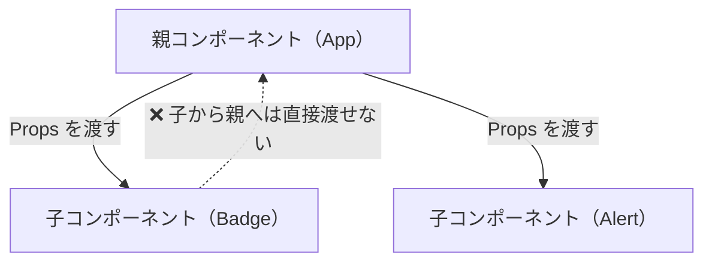
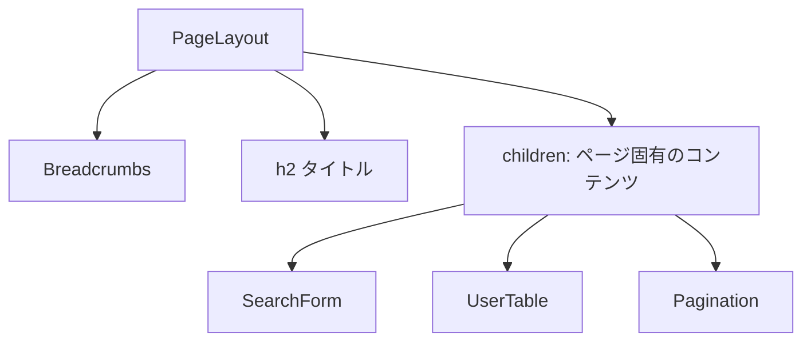

# 2-3-1 コンポーネントと JSX

この Chapter「React」は以下の 4 セクションで構成されます。

| セクション | テーマ | 種類 |
|---|---|---|
| 2-3-1 | コンポーネントと JSX | 概念 |
| 2-3-2 | State と Hooks | 概念 |
| 2-3-3 | レンダリングの仕組みと最適化 | 概念 |
| 2-3-4 | コンポーネント設計パターン | 概念 |

**Chapter ゴール**: React 18 のコンポーネントモデルとレンダリングの仕組みを体系的に理解する

📖 まず本セクションでコンポーネントと JSX の基本を学び、次に State と Hooks で「動く UI」の仕組みを理解します。その上でレンダリングの内部動作を学び、最後にコンポーネント設計パターンで LMS の実際の設計を読み解きます。

📝 **前提知識**: このセクションは 2-2-1 TypeScript の基本型の内容を前提としています。

## 🎯 このセクションで学ぶこと

- React のコンポーネント指向とは何か、なぜ「ページ単位」ではなく「コンポーネント単位」で UI を考えるのかを理解する
- JSX の仕組みと、Blade テンプレートとの違いを理解する
- Props による単方向データフローの考え方と、TypeScript による型安全な Props 定義を理解する

まず「ページからコンポーネントへ」という発想の転換を学び、JSX の構文を理解した上で、Props によるデータの流れとコンポーネントの合成パターンを身につけます。

---

## 導入: 「ページ」から「コンポーネント」へ

Laravel + Blade でアプリケーションを作る場合、あなたは「ページ」を単位に考えていたはずです。`resources/views/users/index.blade.php` のように、1つの URL に対して 1つのテンプレートファイルを用意し、その中にヘッダー、サイドバー、テーブル、フッターをすべて記述していました。

共通パーツは `@include('partials.header')` や `@component('components.alert')` で切り出すことはできますが、それはあくまで「ページの一部を別ファイルに分ける」という整理であり、ページが主役であることに変わりありません。

この「ページ中心」のアプローチには、アプリケーションが大きくなるにつれて問題が出てきます。

- ヘッダーの通知バッジを変更したいだけなのに、影響範囲が複数のページに及ぶ
- 同じ見た目のボタンが各ページで微妙に異なる実装になっている
- テーブルの行をクリックしたときの動作を変えたいが、JavaScript がページ全体のファイルに散らばっている

React はこの問題を「コンポーネント」という概念で解決します。ページを最小の UI 部品に分解し、それぞれのコンポーネントが自分の見た目（HTML）と振る舞い（JavaScript）を1つのファイルにまとめて持ちます。

### 🧠 先輩エンジニアはこう考える

> LMS の開発で React を使い始めたとき、最初は Blade の感覚で「このページには何を表示するか」から考えてしまっていました。でも React の世界では「この UI はどんな部品で構成されているか」から考えるんです。たとえば LMS の受講生一覧画面は、PageLayout、Breadcrumbs、SearchForm、UserTable、Pagination といったコンポーネントの組み合わせで、ページ全体を作っています。Blade で `@include` を多用していたときと似ているようで、決定的に違うのは「各コンポーネントが自分の状態やロジックを持てる」こと。ヘッダーのコンポーネントを修正すれば、それを使っているすべてのページに反映されるし、そのコンポーネントの中で完結するテストも書ける。この感覚がつかめると、React がなぜこんなに広く使われているかが腑に落ちると思います。


---

## コンポーネントとは何か

React のコンポーネントを一言でいうと、**UI を返す関数** です。TypeScript の関数が値を返すのと同じように、React のコンポーネントは「画面に表示する要素」を返します。

### Blade の `@component` との対比

Blade でコンポーネントを作る場合を思い出してみましょう。

```php
<!-- resources/views/components/alert.blade.php -->
<div class="alert alert-{{ $type }}">
    {{ $slot }}
</div>
```

```php
<!-- 呼び出し側 -->
@component('components.alert', ['type' => 'success'])
    保存が完了しました。
@endcomponent
```

React では、これが1つの関数になります。

```tsx
// Alert.tsx
function Alert({ type, children }: { type: string; children: React.ReactNode }) {
  return (
    <div className={`alert alert-${type}`}>
      {children}
    </div>
  );
}

// 呼び出し側
<Alert type="success">
  保存が完了しました。
</Alert>
```

構造は似ていますが、決定的な違いがあります。Blade のコンポーネントはサーバー側でレンダリングされる「テンプレートの断片」ですが、React のコンポーネントはブラウザ上で動作する **JavaScript の関数** です。そのため、ユーザーの操作に応じて表示を切り替えたり、状態を保持したりできます（状態の管理については次のセクション 2-3-2 で詳しく扱います）。

### 関数コンポーネントの書き方

React 18 では **関数コンポーネント** が標準です。LMS のコードもすべて関数コンポーネントで書かれています。

基本的な形は次のとおりです。

```tsx
// 最もシンプルなコンポーネント
function Greeting() {
  return <h1>こんにちは</h1>;
}
```

LMS では `export function` の形式で定義し、ファイルから公開しています。実際の Badge コンポーネントを見てみましょう。

```tsx
// frontend/src/components/v2/elements/Badge.tsx
'use client'

import cn from '@/lib/v2/cn'

type Props = {
  count: number
  variant?: 'default' | 'inverse'
  maxDisplay?: number
  className?: string
}

export function Badge({ count, variant = 'default', maxDisplay = 99, className = '' }: Props) {
  const displayText = count > maxDisplay ? `${maxDisplay}+` : String(count)
  const isInverse = variant === 'inverse'

  return (
    <span
      className={cn(
        'flex h-5 min-w-5 shrink-0 items-center justify-center rounded-full px-1 text-xs font-bold',
        isInverse
          ? 'bg-background-subtle text-brand-primary'
          : 'bg-brand-primary text-text-inverse',
        className,
      )}
      aria-label={`未読${count}件`}
    >
      {displayText}
    </span>
  )
}
```

🔑 ここで注目すべきポイントがいくつかあります。

- **`'use client'`**: Next.js 14 固有のディレクティブで、このコンポーネントがブラウザ側で動作することを示します。詳細は Chapter 2-4 の Next.js のセクションで扱います。今は「おまじない」として把握すれば十分です
- **`type Props`**: TypeScript の型定義で、このコンポーネントが受け取るデータの構造を定義しています（Props の詳細は後述します）
- **`export function Badge(...)`**: 関数コンポーネント本体。引数で Props を受け取り、JSX を返します
- **返り値が JSX**: `return (...)` の中身が、このコンポーネントが描画する UI です

💡 LMS ではコンポーネントファイル名は PascalCase（`Badge.tsx`、`PageLayout.tsx`）で統一されています。これは React の慣習で、コンポーネント名と一致させることで可読性を高めています。

---

## JSX の仕組み

Badge コンポーネントの `return` 文の中身を見ると、HTML のように見えて、ところどころ JavaScript が混ざっていることに気づきます。これが **JSX** （JavaScript XML）です。

### HTML のように見えて JavaScript

JSX は HTML のように見えますが、実際には JavaScript（TypeScript）のコードです。ブラウザが実行する前に、ビルドツールによって通常の JavaScript の関数呼び出しに変換されます。

```tsx
// あなたが書く JSX
<h1 className="title">こんにちは</h1>

// ビルド後の JavaScript（実際にブラウザが実行するコード）
React.createElement('h1', { className: 'title' }, 'こんにちは')
```

この変換を意識する必要は普段ありませんが、「JSX は HTML ではなく JavaScript の構文拡張である」と知っておくと、次に説明するいくつかの違いが腑に落ちます。

### Blade テンプレートとの対比

Blade は PHP のコードを HTML に埋め込む仕組みでしたが、JSX は逆に **JavaScript の中に HTML ライクな記法を埋め込む** 仕組みです。

```php
<!-- Blade: HTML の中に PHP を埋め込む -->
<div class="user-name">
    {{ $user->name }}
</div>

@if($user->isAdmin())
    <span class="badge">管理者</span>
@endif
```

```tsx
// JSX: JavaScript の中に HTML ライクな記法を埋め込む
<div className="user-name">
  {user.name}
</div>

{user.isAdmin && (
  <span className="badge">管理者</span>
)}
```

Blade では `{{ }}` で PHP の式を埋め込み、`@if` で制御構文を使いました。JSX では `{}` で JavaScript の式を埋め込みます（制御構文の詳細は後述します）。

### HTML との主な違い

JSX は JavaScript であるため、HTML とはいくつかの属性名が異なります。

| HTML | JSX | 理由 |
|---|---|---|
| `class` | `className` | `class` は JavaScript の予約語 |
| `for` | `htmlFor` | `for` は JavaScript の予約語 |
| `tabindex` | `tabIndex` | JSX の属性名はキャメルケース |
| `onclick` | `onClick` | イベントハンドラもキャメルケース |
| `style="color: red"` | `style={{ color: 'red' }}` | 文字列ではなくオブジェクトで指定 |

⚠️ **注意**: `class` と書いてしまうのは React 初心者が最も頻繁に遭遇するミスです。エディターの警告で気づけることが多いですが、表示が崩れたときはまず `className` になっているか確認しましょう。

### `{}` による式の埋め込み

JSX の `{}` の中には、JavaScript の **式** （値を返すもの）を自由に書けます。

```tsx
function UserProfile({ name, age }: { name: string; age: number }) {
  const greeting = `${name}さん、ようこそ！`

  return (
    <div>
      {/* 変数の埋め込み */}
      <h1>{greeting}</h1>

      {/* 計算式 */}
      <p>来年は{age + 1}歳です</p>

      {/* 関数呼び出し */}
      <p>{name.toUpperCase()}</p>

      {/* テンプレートリテラル */}
      <p>{`登録者: ${name}`}</p>
    </div>
  )
}
```

Blade の `{{ }}` と似ていますが、JSX の `{}` の中では任意の JavaScript 式が使えるため、より柔軟です。

💡 `{/* コメント */}` は JSX 内でのコメントの書き方です。HTML の `<!-- -->` は使えません。

---

## Props: 親から子へのデータの流れ

### 単方向データフロー

React の最も重要な設計原則の一つが **単方向データフロー** です。データは常に親コンポーネントから子コンポーネントへ、一方向に流れます。この流れを実現するのが **Props** （プロパティの略）です。



Blade では、コントローラーからビューへデータを渡しました。

```php
// コントローラー
return view('users.show', ['user' => $user]);

// Blade テンプレート
<h1>{{ $user->name }}</h1>
```

React の Props も「上から下へデータを渡す」という点で同じ発想です。違いは、PHP のコントローラーとテンプレートの関係ではなく、コンポーネント同士の親子関係であることです。

```tsx
// 親コンポーネント
function App() {
  return (
    <div>
      <Badge count={5} variant="default" />
      <Badge count={120} variant="inverse" maxDisplay={99} />
    </div>
  )
}
```

`count={5}` のように、HTML の属性と同じ書き方で Props を渡します。文字列以外の値（数値、boolean、オブジェクト等）は `{}` で囲みます。

### Props の型定義

LMS では TypeScript の `type` を使って Props の型を定義しています（`type` と `interface` の使い分けについてはセクション 2-2-3 で学びました）。先ほどの Badge コンポーネントの Props 型を改めて見てみましょう。

```typescript
type Props = {
  count: number           // 必須: 表示するカウント数
  variant?: 'default' | 'inverse'  // オプショナル: 見た目のバリエーション
  maxDisplay?: number     // オプショナル: 最大表示数
  className?: string      // オプショナル: 追加の CSS クラス
}
```

PHP の関数引数と比較してみます。

```php
// PHP: 型を指定した関数引数
function createBadge(int $count, string $variant = 'default', int $maxDisplay = 99): string
{
    // ...
}
```

考え方は同じです。必須の引数とオプション引数があり、TypeScript では `?` でオプショナルを表現します。PHP のデフォルト引数に相当する機能は、分割代入時にデフォルト値を設定することで実現します。

### Props の分割代入とデフォルト値

LMS のコンポーネントでは、Props を関数の引数として **分割代入** で受け取るのが標準パターンです。

```tsx
// Props をまとめて受け取る（あまり使わない）
function Badge(props: Props) {
  const count = props.count
  const variant = props.variant ?? 'default'
  // ...
}

// 分割代入で受け取る（LMS の標準パターン）
function Badge({ count, variant = 'default', maxDisplay = 99, className = '' }: Props) {
  // count, variant, maxDisplay, className がそのまま使える
}
```

分割代入を使うことで、関数の中で `props.count` ではなく直接 `count` と書けます。同時にデフォルト値も設定できるため、PHP のデフォルト引数と同じ感覚で扱えます。

🔑 **Props は読み取り専用** です。コンポーネントの中で Props の値を変更することはできません。PHP でいう関数の引数に `readonly` がついているイメージです。値を変更したい場合は、ステート（State）という別の仕組みを使います（セクション 2-3-2 で扱います）。

---

## 条件分岐とリスト表示

### Blade との発想の違い

Blade では `@if` や `@foreach` といった専用ディレクティブで条件分岐やループを書きました。JSX にはそのような専用構文はなく、JavaScript の式をそのまま使います。

### 条件分岐

**三項演算子**: Blade の `@if ... @else` に対応します。

```php
<!-- Blade -->
@if($user->isAdmin())
    <span class="badge">管理者</span>
@else
    <span class="badge">一般</span>
@endif
```

```tsx
// JSX: 三項演算子
{user.isAdmin ? (
  <span className="badge">管理者</span>
) : (
  <span className="badge">一般</span>
)}
```

**`&&` 演算子**: 条件が true のときだけ表示する場合に使います。Blade の `@if` で `@else` がないパターンです。

```php
<!-- Blade -->
@if($unreadCount > 0)
    <span class="badge">{{ $unreadCount }}</span>
@endif
```

```tsx
// JSX: && 演算子
{unreadCount > 0 && (
  <span className="badge">{unreadCount}</span>
)}
```

LMS の AiChatbotChat コンポーネントでは、ストリーミング状態やエラー状態に応じた条件分岐が多用されています。以下は主要部分の抜粋です。

```tsx
// frontend/src/features/v2/aiChatbot/components/AiChatbotChat.tsx
{streamedContent ? (
  <>
    <MarkDownToHTML>{streamedContent}</MarkDownToHTML>
    {streamState === STREAM_STATE.STREAMING && (
      <span className='inline-block animate-pulse text-text-primary'>▌</span>
    )}
  </>
) : (
  streamState === STREAM_STATE.STREAMING && (
    <span className='animate-pulse text-text-primary'>▌</span>
  )
)}

{/* エラー表示 */}
{streamState === STREAM_STATE.ERROR && errorMessage && (
  <p className='mt-2 text-sm text-semantic-error-text'>{errorMessage}</p>
)}
```

ここでは三項演算子と `&&` 演算子が組み合わせて使われています。`streamedContent` があるかどうかでまず表示を分岐し、さらにストリーミング中かどうかでカーソルアニメーションの表示を制御しています。

💡 `<>...</>` は **フラグメント** と呼ばれ、複数の要素をグループ化するための空のタグです。JSX では `return` で返せるのは1つの要素だけなので、複数要素をまとめたいときにフラグメントを使います。不要な `<div>` を増やさずに済みます。

### リスト表示

Blade の `@foreach` に対応するのが、JavaScript の `map` メソッドです。

```php
<!-- Blade -->
@foreach($items as $item)
    <li>{{ $item->name }}</li>
@endforeach
```

```tsx
// JSX: map メソッド
{items.map((item) => (
  <li key={item.id}>{item.name}</li>
))}
```

LMS の Breadcrumbs コンポーネントは、`map` によるリスト表示の典型的な例です。

```tsx
// frontend/src/components/v2/elements/Breadcrumbs.tsx
export function Breadcrumbs({ items, ...props }: Props) {
  return (
    <HeroBreadcrumbs {...props} classNames={{ list: '[&_a]:text-link-default' }}>
      {items.map((item, index) => {
        const { href, className, ...restItem } = item
        return (
          <HeroBreadcrumbItem key={index} {...restItem} className={className}>
            {href != null ? <Link href={href}>{item.children}</Link> : item.children}
          </HeroBreadcrumbItem>
        )
      })}
    </HeroBreadcrumbs>
  )
}
```

### `key` の重要性

リスト表示の `map` で各要素に `key` を指定していることに気づいたでしょうか。`key` は React がリスト内の各要素を識別するための特別な Props です。

```tsx
// key がないと React は要素の追加・削除・並べ替えを正しく認識できない
{items.map((item) => (
  <li key={item.id}>{item.name}</li>  // key にはユニークな値を使う
))}
```

🔑 `key` の役割は、React が「どの要素が変わったか、追加されたか、削除されたか」を効率的に判定するための手がかりを提供することです。内部的なレンダリングの仕組みについてはセクション 2-3-3 で詳しく扱います。

⚠️ **注意**: `key` にはリスト内でユニークな値を使います。配列のインデックスを `key` に使うこともできますが（上記の Breadcrumbs の例がそうです）、要素の並べ替えや削除が発生する場合にバグの原因になることがあります。データベースの ID のようなユニークな識別子がある場合は、それを使うのがベストプラクティスです。

---

## コンポーネントの分割と children

### 合成（Composition）の基本

React のコンポーネントは、レゴブロックのように組み合わせて使うことを前提に設計されています。小さなコンポーネントを組み合わせて大きなコンポーネントを作り、さらにそれらを組み合わせてページ全体を構成する。この考え方を **合成（Composition）** と呼びます。



### `children` prop の仕組み

合成を実現する中心的な仕組みが **`children`** です。`children` は特別な Props で、コンポーネントの開始タグと閉じタグの間に書かれた内容が自動的に渡されます。

Blade の `{{ $slot }}` と同じ概念です。

```php
<!-- Blade: $slot -->
<div class="card">
    {{ $slot }}
</div>

<!-- 呼び出し側 -->
@component('components.card')
    <p>カードの中身</p>
@endcomponent
```

```tsx
// React: children
function Card({ children }: { children: React.ReactNode }) {
  return (
    <div className="card">
      {children}
    </div>
  )
}

// 呼び出し側
<Card>
  <p>カードの中身</p>
</Card>
```

### LMS の PageLayout の例

LMS の PageLayout コンポーネントは、`children` を使った合成の代表的な例です。

```tsx
// frontend/src/components/v2/templates/PageLayout.tsx
type Props = {
  title: string
  breadcrumbs: BreadcrumbItem[]
  children: React.ReactNode
  className?: string
}

export function PageLayout({ title, breadcrumbs, children, className = '' }: Props) {
  return (
    <div className={`mx-9 my-6 ${className}`}>
      <div className='hidden xl:block'>
        <Breadcrumbs items={breadcrumbs} />
        <h2 className='my-2 text-2xl font-bold'>{title}</h2>
      </div>
      <div className='mx-auto max-w-[1380px]'>{children}</div>
    </div>
  )
}
```

PageLayout は、パンくずリスト（Breadcrumbs コンポーネント）とページタイトルを共通部分として持ち、`children` の位置に各ページ固有のコンテンツが差し込まれます。呼び出し側は次のようになります。

```tsx
// ページコンポーネント（イメージ）
function UsersPage() {
  return (
    <PageLayout title="受講生一覧" breadcrumbs={[{ children: 'ホーム', href: '/' }, { children: '受講生一覧' }]}>
      {/* ここが children として PageLayout に渡される */}
      <SearchForm />
      <UserTable users={users} />
      <Pagination total={total} />
    </PageLayout>
  )
}
```

Blade のレイアウトファイル（`@extends('layouts.app')` と `@section('content')`）に近い役割ですが、React ではこれが型安全な関数の呼び出しとして実現されています。

### Button コンポーネントとスプレッド構文

LMS の Button コンポーネントは、`children` とスプレッド構文を組み合わせた簡潔な例です。

```tsx
// frontend/src/components/v2/elements/Button.tsx
type Props = {
  children: React.ReactNode
} & HeroButtonProps

export function Button({ children, ...props }: Props) {
  return <HeroButton {...props}>{children}</HeroButton>
}
```

ここでの `...props` は **スプレッド構文** で、`children` 以外のすべての Props をまとめて受け取っています。そして `{...props}` でそれらをそのまま HeroButton（HeroUI ライブラリのボタンコンポーネント）に渡しています。

これは PHP の可変長引数（`...$args`）に近い発想です。自分のコンポーネントでは共通の処理（スタイリングやイベントハンドリング）を加えつつ、残りの Props はそのまま下のコンポーネントに透過させる、というパターンは LMS で頻繁に使われています。

```php
// PHP の可変長引数（参考）
function createButton(string $label, ...$attributes): string
{
    // $attributes に残りの引数がすべて入る
}
```

---

## ✨ まとめ

- React の **コンポーネント** は「UI を返す関数」であり、見た目とロジックを1つのファイルにまとめて再利用可能にする仕組みです
- **JSX** は HTML ライクな構文ですが実態は JavaScript であり、`className` や `htmlFor` など HTML とは異なる属性名を使います。`{}` で JavaScript の式を埋め込めます
- **Props** は親コンポーネントから子コンポーネントへデータを渡す仕組みで、データは常に上から下への **単方向データフロー** です。TypeScript の型定義により、どんなデータが必要かが明確になります
- 条件分岐は三項演算子や `&&` 演算子、リスト表示は `map` メソッドを使います。リストには **`key`** を指定して React が要素を正しく識別できるようにします
- **`children`** を使った合成（Composition）により、レイアウトやラッパーコンポーネントを柔軟に作成できます

---

次のセクションでは、コンポーネントに「動き」を加える State とフック（Hooks）について学びます。useState によるステート管理、useEffect による副作用の処理、useContext によるコンポーネントツリー全体へのデータ共有、useCallback や useMemo によるパフォーマンス最適化の役割と使い分け、そしてカスタムフックのパターンを理解します。
