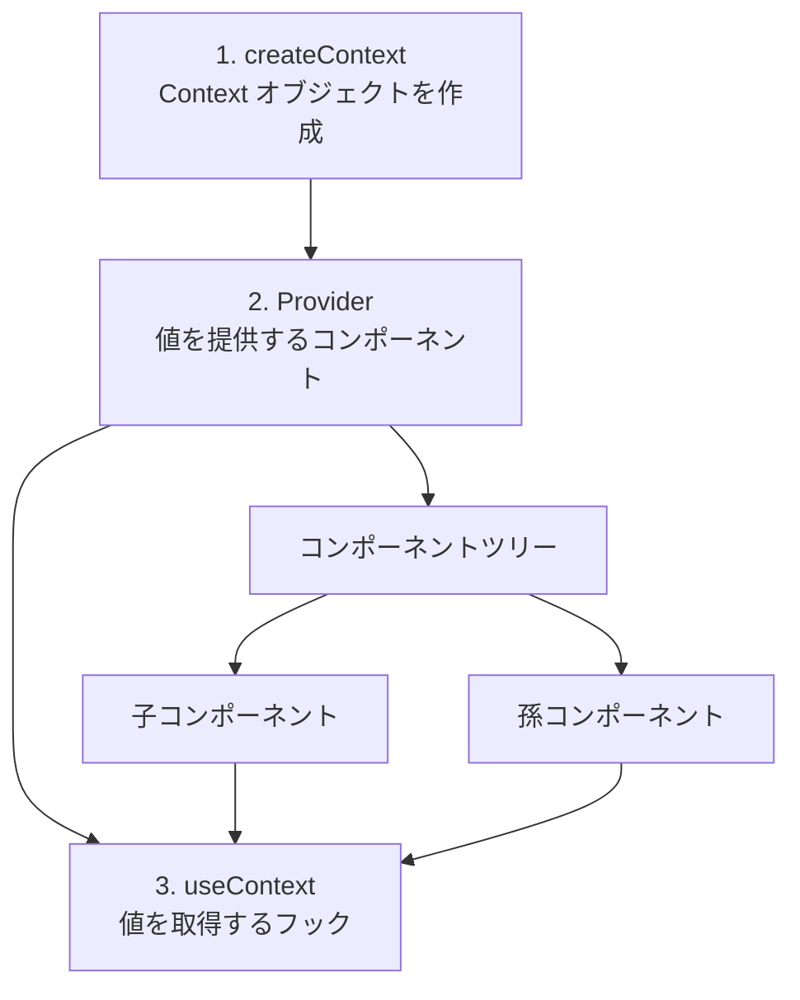
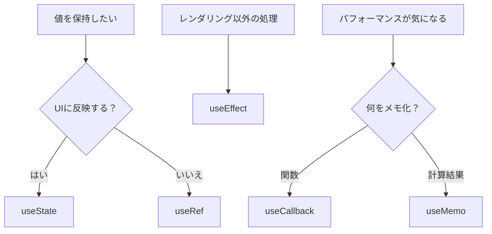

# 2-3-2 State と Hooks

📝 **前提知識**: このセクションは 2-3-1 コンポーネントと JSX の内容を前提としています。

## 🎯 このセクションで学ぶこと

- **State** の概念と `useState` による状態管理の仕組みを理解する
- **useEffect** で副作用を扱うパターンを理解する
- **useContext** でコンポーネントツリーを横断するデータ共有の仕組みを理解する
- **useCallback / useMemo / useRef** の役割と使い分けの判断基準を理解する
- **カスタムフック** によるロジック再利用のパターンを理解する
- **Hooks のルール** を把握し、よくあるエラーを避ける

このセクションでは、React 18 のフック（Hooks）を体系的に学びます。まず State の概念を理解し、次に副作用・Context・パフォーマンス最適化・カスタムフックへと段階的に進みます。

---

## 導入: 静的な HTML から「動く UI」へ

2-3-1 で学んだコンポーネントは、Props を受け取って JSX を返す「静的な描画関数」でした。しかし実際のアプリケーションでは、ボタンをクリックしたらカウンターが増える、フォームに入力した値が画面に反映される、タイマーが動く、といった「動的な振る舞い」が必要です。

PHP の Web アプリケーションでは、ユーザーの操作はフォーム送信としてサーバーに送られ、サーバーが新しい HTML を生成して返します。つまり「状態の変化 → 画面の更新」は常にサーバーを経由していました。

React では、ブラウザ上で直接状態を管理し、状態が変わると React が自動的に画面を更新します。この「状態管理」と「状態変化に応じた自動更新」の仕組みが **State** であり、State をはじめとする様々な機能をコンポーネントに追加するための API が **フック（Hooks）** です。

### 🧠 先輩エンジニアはこう考える

> LMS の開発で一番よく使う Hooks は `useState` と `useEffect` の2つです。この2つだけで機能の8割はカバーできます。残りの `useCallback` や `useMemo` はパフォーマンス最適化のためのもので、「まず動くものを作ってから必要に応じて追加する」という順番で考えれば十分です。最初から全部覚えようとせず、まず `useState` と `useEffect` の動きをしっかり理解することをお勧めします。

---

## State とは何か

### なぜ通常の変数ではダメなのか

React コンポーネントは関数です。関数内で宣言した通常の変数は、関数が呼ばれるたびに初期値にリセットされます。そして、通常の変数を変更しても React は画面を再描画しません。

```tsx
// これでは動かない
function Counter() {
  let count = 0 // 関数が呼ばれるたびに 0 にリセット

  return (
    <button onClick={() => { count += 1 }}>
      {count} {/* 画面は更新されない */}
    </button>
  )
}
```

State は、この2つの問題を解決します。

1. **レンダリング間で値を保持する** （関数が再度呼ばれても前回の値を覚えている）
2. **値が変わったことを React に通知する** （React が画面を再描画する）

### `useState` の仕組み

`useState` は、State 変数とその更新関数をペアで返すフックです。

```tsx
import { useState } from 'react'

function Counter() {
  const [count, setCount] = useState(0) // [現在の値, 更新関数] = useState(初期値)

  return (
    <button onClick={() => setCount(count + 1)}>
      クリック回数: {count}
    </button>
  )
}
```

`useState(0)` は `[0, setCount]` という配列を返します。これは JavaScript の **分割代入** で、`count` に現在の値、`setCount` に更新関数が入ります。`setCount(1)` を呼ぶと、React は `count` を `1` に更新し、コンポーネントを再描画します。

### State の更新とイミュータビリティ

🔑 State の更新で最も重要なルールは、**State を直接変更してはいけない** ということです。必ず更新関数を通じて新しい値をセットします。

```tsx
// NG: 直接変更しても React は再描画しない
count = count + 1

// OK: 更新関数を使う
setCount(count + 1)
```

オブジェクトや配列の State では、元のデータを変更（ミューテート）するのではなく、新しいオブジェクトや配列を作って渡します。これが **イミュータビリティ** （不変性）の原則です。

```tsx
const [user, setUser] = useState({ name: '太郎', age: 25 })

// NG: 元のオブジェクトを直接変更
user.name = '花子'
setUser(user) // React は変更を検知できない（同じ参照なので）

// OK: スプレッド構文で新しいオブジェクトを作成
setUser({ ...user, name: '花子' })
```

💡 PHP では `$user['name'] = '花子'` のように連想配列を直接変更するのが普通ですが、React の State ではこのパターンは使えません。必ず新しいオブジェクトを作成して更新関数に渡す必要があります。

### PHP のセッション変数との対比

PHP のセッション変数（`$_SESSION`）と React の State は、どちらも「状態を保持する」仕組みですが、スコープが大きく異なります。

| | PHP セッション変数 | React State |
|---|---|---|
| **保持される場所** | サーバー側（ファイル/DB） | ブラウザ側（メモリ） |
| **有効範囲** | リクエストをまたぐ（ブラウザを閉じるまで等） | コンポーネント内に閉じる |
| **共有範囲** | 同一セッションの全リクエスト | 宣言したコンポーネントのみ |
| **更新の影響** | 次のリクエストで反映 | 即座に画面が再描画される |

### LMS での `useState` の実例

LMS の `DaysCalculatorTool` コンポーネントでは、日付範囲の選択状態を `useState` で管理しています。

```tsx
// frontend/src/components/v2/elements/DaysCalculatorTool.tsx
export function DaysCalculatorTool({
  label,
  value,
  onChange,
  showDaysCount = true,
  isInvalid = false,
  errorMessage,
}: Props) {
  const [internalDateRange, setInternalDateRange] = useState<DateRange>(null)

  const dateRange = value !== undefined ? value : internalDateRange
  const handleChange = onChange || setInternalDateRange

  // ...
}
```

ここでは、外部から `value` と `onChange` が渡された場合はそちらを使い、渡されなかった場合は内部の State（`internalDateRange`）を使うパターンになっています。これは「制御コンポーネント」と「非制御コンポーネント」の両方に対応するための設計です。

---

## 副作用と useEffect

### 「レンダリング以外の処理」とは

React コンポーネントの本来の仕事は「Props と State に基づいて JSX を返すこと」です。しかし実際のアプリケーションでは、それ以外の処理も必要になります。

- API からデータを取得する
- `document.title` を変更する
- タイマーを開始する
- イベントリスナーを登録する

これらは画面の描画（レンダリング）そのものではなく、レンダリングに付随して発生する処理です。React ではこれを **副作用（Side Effect）** と呼び、`useEffect` フックで管理します。

### `useEffect` の基本構文

```tsx
import { useEffect } from 'react'

useEffect(() => {
  // 副作用の処理
  document.title = `${count} 回クリックされました`
}, [count]) // 依存配列: count が変わったときだけ実行
```

`useEffect` は2つの引数を取ります。

1. **実行する関数** （副作用の処理）
2. **依存配列** （この配列内の値が変わったときだけ関数を再実行する）

### マウント・アンマウントと依存配列

依存配列の指定によって、副作用の実行タイミングが変わります。

| 依存配列 | 実行タイミング | 用途の例 |
|---|---|---|
| `[count]` | `count` が変化するたびに | 特定の値に応じた処理 |
| `[]`（空配列） | マウント時に1回だけ | 初期データの取得、イベント登録 |
| 指定なし | 毎回のレンダリング後 | ほぼ使わない（パフォーマンスに注意） |

📝 **マウント** とは、コンポーネントが画面に初めて表示されることです。**アンマウント** とは、コンポーネントが画面から取り除かれることです。

### クリーンアップ関数

`useEffect` 内の関数から別の関数を return すると、それが **クリーンアップ関数** になります。コンポーネントがアンマウントされるとき、または次の副作用が実行される前に呼ばれます。

```tsx
useEffect(() => {
  // 副作用: イベントリスナーを登録
  window.addEventListener('resize', handleResize)

  // クリーンアップ: イベントリスナーを解除
  return () => {
    window.removeEventListener('resize', handleResize)
  }
}, [])
```

クリーンアップ関数がないと、コンポーネントが画面から消えた後もイベントリスナーが残り続け、メモリリークの原因になります。

### Laravel の Observer/Event との対比

Laravel では、モデルの変更に応じて自動的に処理を実行する仕組みとして Observer や Event/Listener があります。

```php
// Laravel: モデルが更新されたら自動実行
class UserObserver
{
    public function updated(User $user)
    {
        // ユーザー情報が変更されたら通知を送る
    }
}
```

React の `useEffect` も「何かが変わったら自動的に実行」という点で同じ発想です。

```tsx
// React: count が変わったら自動実行
useEffect(() => {
  document.title = `${count} 回クリックされました`
}, [count])
```

どちらも「値の変化をトリガーにして処理を実行する」という宣言的なパターンです。ただし、Laravel の Observer はサーバー側でモデルのライフサイクルに紐づくのに対し、`useEffect` はブラウザ側でコンポーネントのライフサイクルに紐づきます。

### LMS での `useEffect` の実例

LMS の `Providers` コンポーネントでは、ブラウザのリサイズイベントを `useEffect` で監視しています。

```tsx
// frontend/src/providers/v2/providers.tsx
export const Providers: FC<{ children: ReactNode }> = ({ children }) => {
  const router = useRouter()
  const [placement, setPlacement] = useState<'top-center' | 'bottom-right'>('bottom-right')

  useEffect(() => {
    const handleResize = () => {
      setPlacement(isMobileDevice() ? 'top-center' : 'bottom-right')
    }

    handleResize() // 初回実行
    window.addEventListener('resize', handleResize)
    return () => window.removeEventListener('resize', handleResize)
  }, [])

  // ...
}
```

このコードは3つのポイントを含んでいます。

1. **空の依存配列** `[]` で、マウント時に1回だけ実行される
2. **`handleResize()` の即時実行** で、初回表示時にも画面サイズに応じた値をセットする
3. **クリーンアップ関数** で、アンマウント時にイベントリスナーを解除する

また、`GuideList` コンポーネントでは、Props の変化に応じてローカル State を更新するパターンが見られます。

```tsx
// frontend/src/features/v2/guide/components/GuideList.tsx
export function GuideList({ guides, workspaceId, onUpdate }: Props) {
  const [items, setItems] = useState(guides)
  const [isDragProcess, setIsDragProcess] = useState(false)
  const prevGuidesRef = useRef(guides)

  useEffect(() => {
    // guidesが実際に変更された場合のみ、ローカル状態を更新
    if (!isDragProcess && prevGuidesRef.current !== guides) {
      setItems(guides)
      prevGuidesRef.current = guides
    }
  }, [guides, isDragProcess])

  // ...
}
```

ここでは `useRef`（後述）を使って前回の `guides` の値を記録し、実際にデータが変わった場合のみ State を更新しています。ドラッグ操作中（`isDragProcess` が `true`）は外部からのデータ更新を無視することで、操作中の並び順が上書きされることを防いでいます。

---

## useContext: コンポーネントツリーを横断するデータ共有

### Props バケツリレー問題

2-3-1 で学んだように、コンポーネント間のデータ受け渡しは Props で行います。しかし、深くネストしたコンポーネントにデータを渡すとき、途中のコンポーネントが使わないデータをただ受け渡すだけの「バケツリレー」が発生します。

```
App → Layout → Sidebar → Menu → MenuItem
       ↑ ユーザー情報を使わないのに Props で受け取って渡すだけ
```

この問題を解決するのが **Context** です。Context を使うと、コンポーネントツリーのどの深さからでも、中間のコンポーネントを経由せずに直接データにアクセスできます。

### createContext + Provider + useContext

Context の仕組みは3つの要素で成り立っています。



1. `createContext` で Context オブジェクトを作成する
2. `Provider` コンポーネントで値を提供する（ツリーの上位に配置）
3. `useContext` で値を取得する（ツリーのどの深さからでも可能）

### LMS の LoadingProvider の実例

LMS では、ローディング状態の管理に Context パターンが使われています。この1つのファイルに `createContext`、`Provider`、`useContext` の3要素がすべて含まれているため、Context の全体像を把握するのに最適な例です。

```tsx
// frontend/src/hooks/v2/useLoading.tsx
'use client'

import { createContext, useContext, useMemo, useState } from 'react'

// 1. Context の型を定義し、createContext でデフォルト値とともに作成
export type LoadingContextType = {
  isLoading: boolean
  start: () => void
  end: () => void
  setIsLoading: (isLoading: boolean) => void
}

export const LoadingContext = createContext<LoadingContextType>({
  isLoading: false,
  start: () => {},
  end: () => {},
  setIsLoading: () => {},
})

type Props = {
  children: React.ReactNode
}

// 2. Provider コンポーネントを作成（State と操作関数をまとめて提供）
export function LoadingProvider(props: Props) {
  const [isLoading, setIsLoading] = useState(false)

  const start = () => {
    setIsLoading(true)
  }

  const end = () => {
    setIsLoading(false)
  }

  const value = useMemo(
    () => ({
      isLoading,
      start,
      end,
      setIsLoading,
    }),
    [isLoading],
  )

  return (
    <LoadingContext.Provider value={value}>
      <>{props.children}</>
    </LoadingContext.Provider>
  )
}

// 3. useContext をラップしたカスタムフック
export function useLoading() {
  return useContext(LoadingContext)
}
```

このパターンを整理すると、以下の流れになります。

1. `LoadingContext` を作成し、型と初期値を定義する
2. `LoadingProvider` で `useState` を使って State を管理し、`<LoadingContext.Provider value={value}>` で子コンポーネントに公開する
3. `useLoading()` カスタムフックで、どのコンポーネントからでも `isLoading`、`start`、`end` にアクセスできるようにする

使う側は非常にシンプルです。

```tsx
function SomeComponent() {
  const { isLoading, start, end } = useLoading()

  // データ取得時にローディングを開始・終了
  useEffect(() => {
    start()
    fetchData().then(() => end())
  }, [start, end])

  // ローディング中の表示
  if (isLoading) return <Spinner />

  return <div>コンテンツ</div>
}
```

この `LoadingProvider` は `providers.tsx` でアプリ全体をラップしています。

```tsx
// frontend/src/providers/v2/providers.tsx
export const Providers: FC<{ children: ReactNode }> = ({ children }) => {
  // ...
  return (
    <HeroUIProvider locale='ja' navigate={router.push}>
      <ToastProvider placement={placement} toastProps={{ timeout: 1000 }} />
      <LoadingProvider>{children}</LoadingProvider>
    </HeroUIProvider>
  )
}
```

`HeroUIProvider` の中に `LoadingProvider` があり、その中に `{children}`（アプリ全体）が入ります。この階層構造により、アプリ内のすべてのコンポーネントから `useLoading()` を使えるようになっています。

💡 Laravel の「サービスコンテナ」に近い発想です。サービスコンテナが依存関係をアプリ全体で解決するように、Context はデータをコンポーネントツリー全体で共有します。

---

## パフォーマンス系 Hooks

React コンポーネントが再描画されるたびに、関数内のすべてのコードが再実行されます。通常これは問題になりませんが、重い計算や、子コンポーネントへの関数の受け渡しでパフォーマンスに影響が出る場合があります。パフォーマンス系の Hooks は、こうした問題を解決するための **メモ化** （結果をキャッシュして再利用する）の仕組みです。

### useCallback: 関数のメモ化

`useCallback` は、関数の定義をメモ化します。依存配列の値が変わらない限り、同じ関数インスタンスを返します。

```tsx
// 毎回新しい関数が作られる
const handleClick = () => {
  console.log(count)
}

// count が変わったときだけ新しい関数が作られる
const handleClick = useCallback(() => {
  console.log(count)
}, [count])
```

なぜ関数のメモ化が必要なのでしょうか。JavaScript では、見た目が同じ関数でも、作成するたびに異なるオブジェクトになります。子コンポーネントに関数を Props として渡す場合、毎回新しい関数が渡されると、子コンポーネントが「Props が変わった」と判断して不要な再描画が発生します。`useCallback` を使えば、依存する値が変わらない限り同じ関数インスタンスが渡されるため、不要な再描画を防げます。

### useMemo: 計算結果のメモ化

`useMemo` は、計算結果をメモ化します。依存配列の値が変わらない限り、前回の計算結果を再利用します。

```tsx
// 毎回計算が実行される
const total = items.reduce((sum, item) => sum + item.price, 0)

// items が変わったときだけ再計算される
const total = useMemo(() => {
  return items.reduce((sum, item) => sum + item.price, 0)
}, [items])
```

⚠️ **注意**: `useMemo` と `useCallback` は最適化のためのフックです。まず最適化なしで正しく動くコードを書き、パフォーマンスに問題がある場合にのみ追加してください。不要な場面で使うと、メモ化のオーバーヘッドでかえって遅くなることがあります。

### useRef: レンダリングをまたぐ値の保持

`useRef` は State と似ていますが、**値を変更しても再描画が発生しない** 点が異なります。レンダリング間で値を保持したいが、画面の更新は必要ないという場合に使います。

| | useState | useRef |
|---|---|---|
| **値の保持** | レンダリング間で保持 | レンダリング間で保持 |
| **変更時の再描画** | 発生する | 発生しない |
| **値のアクセス** | 直接参照 | `.current` プロパティ |
| **主な用途** | UI に反映するデータ | DOM 要素の参照、前回の値の記録、タイマー ID の保持 |

```tsx
const countRef = useRef(0)
countRef.current = countRef.current + 1 // 値は変わるが再描画されない
```

### LMS での実例: useCountDownTimer

LMS のカウントダウンタイマーは、これらのパフォーマンス系 Hooks を組み合わせた実践的な例です。以下は主要部分の抜粋です。

```tsx
// frontend/src/features/v2/timer/hooks/useCountDownTimer.tsx
export function useCountDownTimer(): CountDownTimer {
  // useState: UIに表示する値を管理
  const [originalSeconds, setOriginalSeconds] = useState(0)
  const [currentSeconds, setCurrentSeconds] = useState(0)
  const [status, setStatus] = useState<TimerStatus>(TIMER_STATUS.END)

  // useRef: 再描画を起こさずに値を保持（Worker の参照、最新のコールバック）
  const workerRef = useRef<Worker>()
  const endRef = useRef(end)
  const currentSecondsRef = useRef(currentSeconds)

  // useCallback: 関数をメモ化（依存する値が変わったときだけ再生成）
  const setTimer = useCallback((seconds: number) => {
    currentSecondsRef.current = seconds
    setOriginalSeconds(seconds)
    setCurrentSeconds(seconds)
  }, [])

  const start = useCallback(() => {
    setStatus(TIMER_STATUS.IN_PROGRESS)
    onStartCallback?.()
  }, [onStartCallback])

  // useMemo: 計算結果をメモ化（表示用のフォーマット済み時間）
  const formattedTime = useMemo(() => {
    const minutes = Math.floor(currentSeconds / 60)
    const sec = Math.floor(currentSeconds % 60)
    return `${minutes}:${sec.toString().padStart(2, '0')}`
  }, [currentSeconds])

  // useEffect: Refに最新の値を同期（クリーンアップ不要）
  useEffect(() => {
    endRef.current = end
    finishRef.current = finish
    currentSecondsRef.current = currentSeconds
  }, [end, finish, currentSeconds])

  // useEffect: タイマーのWorkerを管理（クリーンアップで破棄）
  useEffect(() => {
    if (status !== TIMER_STATUS.IN_PROGRESS) return

    const worker = new Worker(new URL('@/lib/v2/count-down.ts', import.meta.url))
    workerRef.current = worker

    worker.onmessage = (e) => {
      setCurrentSeconds(e.data.remainSecond)
      if (e.data.remainSecond <= 0) {
        finishRef.current?.play()
        endRef.current()
      }
    }
    worker.postMessage({ type: 'START', time: currentSecondsRef.current })

    // クリーンアップ処理
    return () => {
      worker.postMessage({ type: 'STOP' })
      worker.terminate()
      workerRef.current = undefined
    }
  }, [status])

  // ...
}
```

各 Hooks の使い分けを整理すると以下のようになります。

- **useState**: `currentSeconds`、`status` など、UI の表示に直結する値
- **useRef**: `workerRef`、`endRef` など、再描画を起こさずに最新の値を保持したいもの
- **useCallback**: `setTimer`、`start` など、子コンポーネントや他のフックに渡す関数
- **useMemo**: `formattedTime` など、State から導出される計算結果
- **useEffect**: Worker の生成・破棄、Ref の同期など、レンダリング以外の処理

### いつ使うべきかの判断基準



🔑 基本方針は「まず `useState` と `useEffect` だけで書く。パフォーマンスの問題が出たら `useCallback` や `useMemo` を検討する」です。

---

## カスタムフック

### ロジックの再利用

複数のコンポーネントで同じロジック（State の管理 + 副作用の処理）を使い回したい場合、**カスタムフック** としてロジックを関数に切り出します。

カスタムフックは、`use` で始まる名前を持つ通常の JavaScript 関数です。内部で他のフック（`useState`、`useEffect` 等）を自由に使えます。

```tsx
// カスタムフックの基本形
function useWindowWidth() {
  const [width, setWidth] = useState(window.innerWidth)

  useEffect(() => {
    const handleResize = () => setWidth(window.innerWidth)
    window.addEventListener('resize', handleResize)
    return () => window.removeEventListener('resize', handleResize)
  }, [])

  return width
}

// 使う側
function Header() {
  const width = useWindowWidth() // 画面幅を取得
  return <header>{width > 768 ? 'PC表示' : 'モバイル表示'}</header>
}
```

💡 Laravel でいえば、複数のコントローラーで共通するロジックを Service クラスに切り出すのと同じ発想です。カスタムフックは React 版の「Service クラス」と考えることができます。

### `use` で始まる命名規則

カスタムフックの名前は必ず `use` で始める必要があります。これは単なる慣習ではなく、React がフックのルール（後述）を適用するための目印です。`use` で始まらない関数の中でフックを使うと、React がルール違反を検出できなくなります。

### LMS のカスタムフックの実例

**useTimerActions**: タイマー操作のロジックをまとめたカスタムフック

```tsx
// frontend/src/features/v2/timer/hooks/useTimerActions.ts
import type { CountDownTimer } from '@/features/v2/timer/hooks/useCountDownTimer'
import { useCallback } from 'react'

export function useTimerActions(timer: CountDownTimer, onComplete: () => void) {
  const start = useCallback(
    (minutes: number) => {
      timer.setTimer(minutes * 60)
      timer.start()
    },
    [timer],
  )

  const pause = useCallback(() => {
    timer.pause()
  }, [timer])

  const restart = useCallback(() => {
    timer.restart()
  }, [timer])

  const stop = useCallback(() => {
    timer.end()
    onComplete()
  }, [timer, onComplete])

  return {
    start,
    pause,
    restart,
    stop,
  }
}
```

このカスタムフックは、タイマーオブジェクト（`useCountDownTimer` の戻り値）を受け取り、「開始」「一時停止」「再開」「停止」の4つの操作関数を返します。各関数は `useCallback` でメモ化されています。

**useLoading**: 先ほどの Context の例で見た `useLoading` も、`useContext(LoadingContext)` をラップしたカスタムフックです。

```tsx
// frontend/src/hooks/v2/useLoading.tsx
export function useLoading() {
  return useContext(LoadingContext)
}
```

たった1行ですが、これをカスタムフックとして提供することで以下の利点があります。

- 使う側が `LoadingContext` の存在を知らなくてよい
- Context の実装を変更しても、使う側のコードに影響しない
- `useLoading()` という名前から、何ができるかが明確に伝わる

---

## Hooks のルール

React の Hooks には、守らなければならない2つのルールがあります。これらのルールを破ると、React が内部で Hooks の呼び出し順序を追跡できなくなり、バグの原因になります。

### ルール 1: トップレベルでのみ呼ぶ

フックは関数コンポーネントの **トップレベル** でのみ呼び出す必要があります。条件分岐、ループ、ネストされた関数の中では使えません。

```tsx
function MyComponent({ isLoggedIn }) {
  // OK: トップレベルで呼ぶ
  const [name, setName] = useState('')

  // NG: 条件分岐の中で呼ぶ
  if (isLoggedIn) {
    const [user, setUser] = useState(null) // エラー！
  }

  // NG: ループの中で呼ぶ
  for (let i = 0; i < 3; i++) {
    useEffect(() => { /* ... */ }) // エラー！
  }

  // OK: 条件分岐は useEffect の中で行う
  useEffect(() => {
    if (isLoggedIn) {
      // ログイン時の処理
    }
  }, [isLoggedIn])

  return <div>{name}</div>
}
```

> ⚠️ **よくあるエラー**: Hooks の条件付き呼び出し
>
> ```
> React Hook "useState" is called conditionally.
> React Hooks must be called in the exact same order in every component render.
> ```
>
> **原因**: `if` 文や `return` 文の後ろでフックを呼んでいる
>
> **対処法**: フックの呼び出しをコンポーネントの先頭に移動し、条件分岐はフック内（`useEffect` の中など）で行う

### ルール 2: React 関数コンポーネントまたはカスタムフック内でのみ使う

フックは通常の JavaScript 関数の中では使えません。React の関数コンポーネントか、`use` で始まるカスタムフックの中でのみ呼び出せます。

```tsx
// OK: 関数コンポーネント内
function MyComponent() {
  const [count, setCount] = useState(0) // OK
  return <div>{count}</div>
}

// OK: カスタムフック内
function useCounter() {
  const [count, setCount] = useState(0) // OK
  return count
}

// NG: 通常の関数内
function calculateTotal() {
  const [total, setTotal] = useState(0) // エラー！
  return total
}
```

💡 LMS のフロントエンドでは ESLint の `react-hooks/rules-of-hooks` プラグインが有効になっています。これらのルールに違反するとリンターがエラーを報告するため、コードを書いた時点で気づくことができます。

---

## ✨ まとめ

- **State** （`useState`）は、コンポーネント内に閉じた状態管理の仕組みです。PHP のセッション変数がリクエストをまたいでサーバー側に保持されるのに対し、State はブラウザ側のコンポーネント内に閉じ、値の変更が即座に画面の再描画を引き起こします
- **useEffect** は「レンダリング以外の処理」を管理します。依存配列で実行タイミングを制御し、クリーンアップ関数でリソースの後片付けを行います
- **useContext** は Props のバケツリレーを解消し、コンポーネントツリーを横断してデータを共有します。LMS では `LoadingProvider` のように、アプリ全体で共有する状態の管理に使われています
- **useCallback / useMemo** は関数や計算結果をメモ化するパフォーマンス最適化のフックです。必要になるまで使わないのが基本方針です
- **useRef** はレンダリングをまたいで値を保持しますが、変更しても再描画は発生しません。DOM 要素の参照や前回の値の記録に使います
- **カスタムフック** は `use` で始まる関数で、複数のコンポーネントで共通するロジックを再利用可能にします
- **Hooks のルール** として、トップレベルでのみ呼ぶこと、React 関数コンポーネントまたはカスタムフック内でのみ使うことを守る必要があります

---

次のセクションでは、React がどのように効率的に画面を更新するかを学びます。仮想 DOM の仕組み、再レンダリングが発生する条件、そして React.memo / useMemo / useCallback による最適化の考え方を理解し、State や Hooks の知識をパフォーマンスの観点から深めます。
