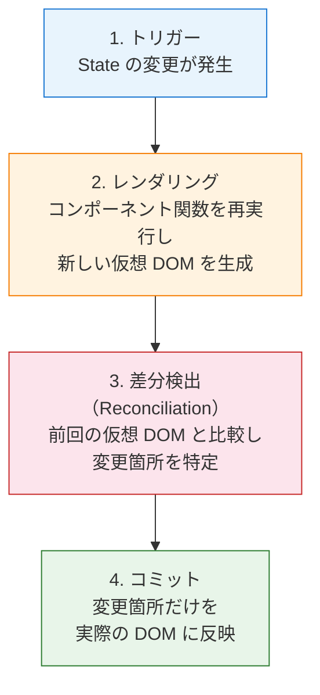
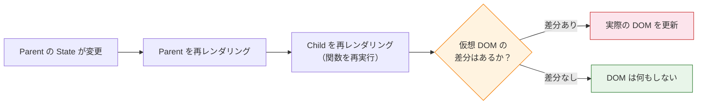
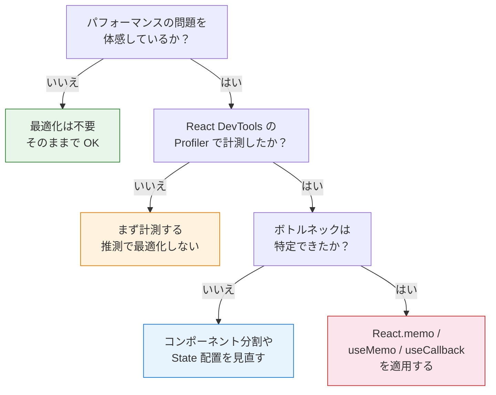

# 2-3-3 レンダリングの仕組みと最適化

📝 **前提知識**: このセクションは 2-3-2（State と Hooks）の内容を前提としています。

## 🎯 このセクションで学ぶこと

- 仮想 DOM の仕組みと、React が効率的に画面を更新するメカニズムを理解する
- 再レンダリングが発生する 3 つの条件と、「再レンダリング = DOM 更新」ではない点を理解する
- React.memo によるコンポーネントのメモ化の仕組みと使いどころを理解する
- useMemo / useCallback が「参照の安定性」のために存在する意味を理解する
- 最適化が本当に必要なタイミングの判断基準を理解する

React がなぜ「速い」と言われるのか、その裏側にある仮想 DOM と差分検出のメカニズムから始め、再レンダリングの条件、そして最適化の手段と判断基準までを順に見ていきます。

---

## 導入: なぜ React は「速い」と言われるのか

ブラウザの DOM（Document Object Model）は、HTML を JavaScript から操作するための API です。Laravel の Blade テンプレートでは、ページ遷移のたびにサーバーが新しい HTML を生成し、ブラウザが画面全体を再描画していました。一方、SPA では JavaScript がページ内の一部分だけを動的に書き換えます。

しかし、DOM の操作はコストが高い処理です。DOM を変更するとブラウザは「レイアウト計算（どこに何を配置するか）」と「ペイント（実際にピクセルを描画する）」を行います。たとえば、1,000 行のテーブルで 1 セルだけを更新したいのに、テーブル全体を `innerHTML` で書き換えてしまうと、999 行分の無駄なレイアウト計算とペイントが走ります。

React はこの問題を **仮想 DOM** （Virtual DOM）という仕組みで解決しました。変更が必要な部分だけを特定し、最小限の DOM 操作で画面を更新します。PHP の世界で例えると、テンプレートエンジンが変更のあった部分だけを差し替えるようなイメージです。

### 🧠 先輩エンジニアはこう考える

> LMS の開発をしていると、コーチ一覧やユーザー一覧など、大量のデータを表示するページがあります。でも実は、React のレンダリングの仕組みを意識してパフォーマンス改善をする機会はそこまで多くありません。React 18 のデフォルトの最適化がかなり優秀で、普通に書いていれば十分速いんです。ただ、仕組みを理解していないと「なぜか画面がカクつく」ときに原因を推測できないし、Claude Code に的確な改善指示も出せません。最適化の手段を暗記するよりも、React がどうやって画面を更新しているかのメンタルモデルを持つことが大事です。

---

## 仮想 DOM の仕組み

### 仮想 DOM とは何か

**仮想 DOM** とは、実際の DOM のコピーを JavaScript のオブジェクトとしてメモリ上に保持する仕組みです。React コンポーネントが返す JSX は、最終的にこの JavaScript オブジェクト（React 要素）に変換されます。

たとえば、次の JSX を考えてみましょう。

```tsx
<div className="card">
  <h2>タイトル</h2>
  <p>本文</p>
</div>
```

これは内部的に、以下のような JavaScript オブジェクトとして表現されます。

```javascript
{
  type: 'div',
  props: {
    className: 'card',
    children: [
      { type: 'h2', props: { children: 'タイトル' } },
      { type: 'p', props: { children: '本文' } }
    ]
  }
}
```

このオブジェクトが「仮想 DOM のノード」です。実際の DOM 要素（HTMLElement）とは異なり、純粋な JavaScript オブジェクトなので、生成や比較のコストが非常に低いという特徴があります。

### 差分検出（Reconciliation）の流れ

React が画面を更新する流れは、4 つのステップで構成されます。



1. **トリガー**: `useState` の setter 関数が呼ばれるなど、State が変更される
2. **レンダリング**: React はコンポーネント関数を再実行し、新しい仮想 DOM ツリーを生成する
3. **差分検出（Reconciliation）**: 前回の仮想 DOM ツリーと新しいツリーを比較し、差分を検出する。この比較アルゴリズムを **Diffing** と呼ぶ
4. **コミット**: 差分がある箇所だけを実際の DOM に反映する

🔑 ここで重要なのは、**ステップ 2 のレンダリング（コンポーネント関数の再実行）は毎回行われるが、ステップ 4 のコミット（実際の DOM 更新）は差分がある場合だけ行われる** という点です。この区別は、このセクション全体を通じて最も重要な概念です。

### Diffing アルゴリズムの戦略

React の Diffing アルゴリズムは、2 つの前提に基づいて効率化されています。

1. **異なる型の要素は、異なるツリーを生成する**: `<div>` が `<span>` に変わったら、その下のサブツリーは丸ごと作り直す
2. **`key` 属性で要素の同一性を判断する**: リスト内の要素を識別するために `key` を使い、要素の追加・削除・並べ替えを効率的に処理する

2-3-1 で `map` を使ってリストをレンダリングするときに `key` を指定した理由は、まさにこの Diffing アルゴリズムのためです。`key` がないと、React はリスト全体を再構築してしまう可能性があります。

```tsx
// key があると、React は各項目を個別に追跡できる
{items.map(item => (
  <li key={item.id}>{item.name}</li>
))}
```

⚠️ **注意**: `key` にインデックス（`index`）を使うと、要素の並び順が変わったときに React が要素を正しく追跡できなくなります。一意な ID を使うようにしましょう。

---

## 再レンダリングの条件

### 3 つのトリガー

React コンポーネントが再レンダリングされるのは、以下の 3 つの場合です。

1. **State の変更**: `useState` の setter 関数で State を更新した場合
2. **Props の変更**: 親コンポーネントから渡される Props が変わった場合（Props が変わるには、親コンポーネントが再レンダリングされて新しい Props を渡す必要があります）
3. **親コンポーネントの再レンダリング**: 親が再レンダリングされると、子コンポーネントも再レンダリングされる

3 番目が特に重要です。**親が再レンダリングされると、Props が変わっていなくても子コンポーネントは再レンダリングされます。**

```tsx
function Parent() {
  const [count, setCount] = useState(0)

  return (
    <div>
      <p>カウント: {count}</p>
      <button onClick={() => setCount(count + 1)}>+1</button>
      {/* Child は count を使っていないのに、Parent が再レンダリングされるたびに再レンダリングされる */}
      <Child name="固定の値" />
    </div>
  )
}

function Child({ name }: { name: string }) {
  console.log('Child がレンダリングされました')
  return <p>こんにちは、{name}さん</p>
}
```

このコードでボタンをクリックすると、`count` が変わるたびに `Parent` が再レンダリングされ、それに伴って `Child` も再レンダリングされます。`Child` に渡している `name` は `"固定の値"` で変わっていないにもかかわらずです。

### 「再レンダリング = DOM 更新」ではない

ここで、先ほどの仮想 DOM の仕組みを思い出してください。

**再レンダリング** とは、コンポーネント関数が再実行されることです。これは仮想 DOM の新しいツリーを生成するステップであり、実際の DOM を更新するステップ（コミット）ではありません。

つまり、`Child` が再レンダリングされても、仮想 DOM の比較の結果「差分なし」と判定されれば、実際の DOM は一切更新されません。React の Diffing アルゴリズムが「何も変わっていない」と判断してくれるからです。



💡 したがって、不要な再レンダリングが発生しても、**パフォーマンスに影響があるとは限りません。** コンポーネント関数の再実行自体は非常に軽量な処理であり、DOM が更新されなければ画面のカクつきにはつながりません。

### 不要な再レンダリングが問題になるケース

では、どのような場合に再レンダリングが実際のパフォーマンス問題になるのでしょうか。

- **コンポーネント内で重い計算をしている場合**: 再レンダリングのたびにその計算が走る
- **大量のコンポーネントが連鎖的に再レンダリングされる場合**: 数百、数千のコンポーネントが一斉に再実行される
- **レンダリングの結果として副作用が発生する場合**: `useEffect` 内の処理が意図せず再実行される

これらのケースに該当しない限り、再レンダリングの最適化は不要です。この判断基準は、セクションの最後で改めて整理します。

---

## React.memo によるコンポーネントのメモ化

### React.memo とは

`React.memo` は、コンポーネントをメモ化する高階コンポーネント（Higher-Order Component）です。Props が前回と変わっていなければ、再レンダリングをスキップします。

先ほどの例で `Child` を `React.memo` で包むと、`name` が変わらない限り再レンダリングされなくなります。

```tsx
import { memo } from 'react'

const Child = memo(function Child({ name }: { name: string }) {
  console.log('Child がレンダリングされました')
  return <p>こんにちは、{name}さん</p>
})
```

これで、`Parent` の `count` が変わっても `Child` は再レンダリングされません。

### 浅い比較（Shallow Comparison）

`React.memo` は Props の比較に **浅い比較** を使います。浅い比較とは、オブジェクトの「参照」が同じかどうかをチェックする方法です。

```tsx
// プリミティブ値（文字列、数値、真偽値）: 値そのものを比較
'hello' === 'hello'  // true（再レンダリングをスキップ）
42 === 42            // true（再レンダリングをスキップ）

// オブジェクト・配列: 参照（メモリ上の場所）を比較
{ name: 'Alice' } === { name: 'Alice' }  // false（中身は同じでも別オブジェクト）
[1, 2, 3] === [1, 2, 3]                  // false（中身は同じでも別配列）
```

PHP でいうと、オブジェクトの `===` 比較と似た概念です。PHP では `===` でオブジェクトを比較すると「同じインスタンスか」をチェックしますが、JavaScript でも同様に「同じ参照（同じメモリ上のオブジェクト）か」をチェックします。

この浅い比較の挙動が、次に説明する `useMemo` と `useCallback` が必要になる理由に直結します。

### LMS では React.memo を使っていない

LMS のフロントエンドコードを検索すると、`React.memo` は一箇所も使われていません。これは設計上の意図的な判断です。

理由は主に 2 つあります。

1. **React 18 のデフォルトの最適化が十分に優秀**: React 18 では Automatic Batching（複数の State 更新を 1 回のレンダリングにまとめる機能）など、フレームワークレベルの最適化が強化されています
2. **コンポーネントの粒度が適切に設計されている**: コンポーネントが適切に分割されていれば、再レンダリングの影響範囲は限定的であり、`React.memo` で防ぐ必要がない

💡 `React.memo` を使うべき典型的なケースは、「親が頻繁に再レンダリングされるが、子は Props が変わらない限り再計算が不要な重いコンポーネント」です。LMS ではそのようなボトルネックが発生していないため、使われていません。

---

## useMemo と useCallback の役割

### 2-3-2 の復習と最適化の観点

2-3-2 で `useMemo` と `useCallback` を学びました。ここでは、これらのフックを「最適化」の観点から改めて整理します。

- **`useMemo`**: 計算結果をメモ化し、依存配列の値が変わるまで再計算しない
- **`useCallback`**: 関数をメモ化し、依存配列の値が変わるまで新しい関数を生成しない

どちらも「不要な再計算や再生成を防ぐ」という点は共通していますが、最も重要な役割は **参照の安定性を保つ** ことです。

### 「参照の安定性」とは

React コンポーネントは関数です。関数が再実行されるたびに、関数内で定義されたオブジェクトや関数は新しい参照で再生成されます。

```tsx
function Parent() {
  const [count, setCount] = useState(0)

  // 再レンダリングのたびに新しいオブジェクトが作られる
  const style = { color: 'red', fontSize: 16 }

  // 再レンダリングのたびに新しい関数が作られる
  const handleClick = () => {
    console.log('クリック')
  }

  return <Child style={style} onClick={handleClick} />
}
```

この例では、`Parent` が再レンダリングされるたびに `style` オブジェクトと `handleClick` 関数は新しい参照で生成されます。見た目（中身）は同じでも、JavaScript の `===` 比較では `false` になるため、`React.memo` で `Child` を包んでいても Props が「変わった」と判定されてしまいます。

この問題を解決するのが `useMemo` と `useCallback` です。

```tsx
function Parent() {
  const [count, setCount] = useState(0)

  // count が変わらない限り、同じ参照を保つ
  const style = useMemo(() => ({ color: 'red', fontSize: 16 }), [])

  // 同じ参照の関数を保つ
  const handleClick = useCallback(() => {
    console.log('クリック')
  }, [])

  return <Child style={style} onClick={handleClick} />
}
```

依存配列が空配列 `[]` の場合、初回レンダリング時に生成された値（または関数）の参照がずっと保持されます。依存配列に値を指定した場合は、その値が変わったときだけ新しい参照が生成されます。

### 依存配列の重要性

`useMemo` と `useCallback` の依存配列は、「いつメモ化した値を再計算するか」を決定します。

```tsx
// NG: 依存配列が空なので、items が変わっても filteredItems は更新されない
const filteredItems = useMemo(() => {
  return items.filter(item => item.active)
}, [])

// OK: items が変わったら再計算される
const filteredItems = useMemo(() => {
  return items.filter(item => item.active)
}, [items])
```

⚠️ **注意**: 依存配列に必要な値を入れ忘れると、古いデータを表示し続けるバグの原因になります。ESLint の `react-hooks/exhaustive-deps` ルールがこの漏れを検出してくれるため、LMS でもこのルールが有効になっています。

### LMS での useMemo / useCallback の使われ方

LMS では `useMemo` と `useCallback` は使われていますが、その用途は限定的です。主な使用パターンは以下の通りです。

- **サイドバーのメニュー項目生成**: `useMemo` でメニュー配列の再生成を防ぐ
- **非同期処理のハンドラー**: `useCallback` でイベントハンドラーの参照を安定させる
- **カスタムフック内のロジック**: `useMemo` / `useCallback` で戻り値の参照を安定させる

注目すべきは、LMS ではこれらのフックを「すべてのオブジェクトや関数に適用する」のではなく、「参照の安定性が本当に必要な箇所にだけ使う」というスタンスをとっている点です。

---

## 最適化の判断基準

### 「最適化すべきか？」の判断フロー

パフォーマンス最適化は、必要な場面で適用すれば効果的ですが、不必要な場面で適用するとコードの複雑さだけが増します。以下のフローチャートで判断してみましょう。



🔑 最も重要な原則は **「推測で最適化しない」** ことです。パフォーマンス問題を体感していないなら、最適化のための `React.memo` や `useMemo` は書かないでください。

### 過剰な最適化（Premature Optimization）の落とし穴

「とりあえず `useMemo` で包んでおこう」「念のため `React.memo` を使おう」というアプローチには、以下のデメリットがあります。

- **コードが読みにくくなる**: メモ化のための依存配列が増え、コードの意図が分かりにくくなる
- **メモ化自体にもコストがある**: 依存配列の比較処理は毎回のレンダリングで実行される。軽量な処理をメモ化すると、比較コストのほうが高くつく場合がある
- **バグの温床になる**: 依存配列の指定ミスにより、値が更新されないバグが発生しやすくなる

LMS が `React.memo` を使わず、`useMemo` / `useCallback` も限定的に使っているのは、この判断に基づいています。

### React DevTools によるプロファイリング

React には **React DevTools** というブラウザ拡張が提供されています。この中の **Profiler** タブを使うと、どのコンポーネントが何回再レンダリングされているか、各レンダリングにどれくらい時間がかかっているかを視覚的に確認できます。

<!-- TODO: 画像追加 - React DevTools Profiler タブの画面 -->

プロファイリングの詳細な使い方は本教材の範囲外ですが、「パフォーマンスの問題は計測してから対処する」という原則を覚えておいてください。Claude Code にパフォーマンス改善を依頼する際にも、「Profiler で〇〇コンポーネントのレンダリングが遅い」と具体的に伝えることで、的確な改善提案を得られます。

📝 React DevTools は Chrome と Firefox の拡張機能として提供されています。出典: [React Developer Tools](https://react.dev/learn/react-developer-tools)

---

## ✨ まとめ

- **仮想 DOM** は UI を JavaScript オブジェクトとして表現し、差分検出（Reconciliation）によって実際の DOM 更新を最小限に抑える仕組みである
- 再レンダリングの 3 つの条件は「State の変更」「Props の変更」「親コンポーネントの再レンダリング」であり、再レンダリングされても差分がなければ実際の DOM は更新されない
- **React.memo** は Props が変わらない限りコンポーネントの再レンダリングをスキップするが、LMS では使われていない。React 18 のデフォルト最適化と適切なコンポーネント分割で十分なため
- **useMemo** と **useCallback** の最も重要な役割は「参照の安定性」を保つことであり、依存配列の正確な指定が不可欠である
- 最適化は「体感できるパフォーマンス問題があり、計測でボトルネックを特定した場合」にのみ行う。推測による過剰な最適化はコードの複雑さとバグのリスクを増やす

---

次のセクションでは、Container/Presentational パターンや合成パターン、children の活用といったコンポーネント設計パターンと、LMS のコンポーネント分類（elements/layouts/templates/features）について学びます。
